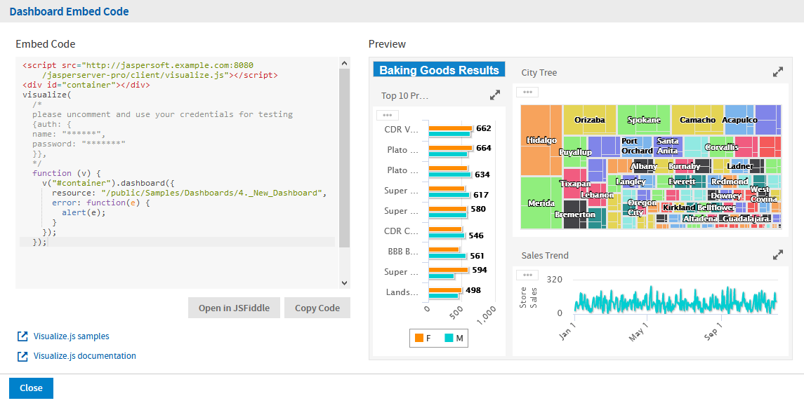

# API Reference - dashboard

The `dashboard` function runs dashboards on JasperReports Server and displays the result in a container that you provide. Dashboards are a collection of reports and widgets that you design on the server. Dashboards were entirely redesigned in JasperReports Server 6.0 to provide stunning data displays and seamless integration through Visualize.js.

This chapter contains the following sections:

-   [Dashboard Properties](#dashboard-properties)
-   [Dashboard Functions](#dashboard-functions)
-   [Dashboard Structure](#dashboard-structure)
-   [Rendering a Dashboard](#rendering-a-dashboard)
-   [Getting the Embed Code of a Dashboard](#getting-the-embed-code-of-a-dashboard)
-   [Refreshing a Dashboard](#refreshing-a-dashboard)
-   [Tracking Completion Status](#tracking-completion-status)
-   [Using Dashboard Input Controls](#using-dashboard-input-controls)
-   [Using the Dashboard Undo Stack](#using-the-dashboard-undo-stack)
-   [Setting Dashboard Hyperlink Options](#setting-dashboard-hyperlink-options)
-   [Exporting From a Dashboard](#exporting-from-a-dashboard)
-   [Closing a Dashboard](#closing-a-dashboard)

## Dashboard Properties

The properties structure passed to the `dashboard` function is defined as follows:

``` json
{
    "title": "Dashboard Properties",
    "type": "object",
    "description": "JSON Schema describing Dashboard Properties",
    "$schema": "http://json-schema.org/draft-04/schema#",
    "properties": {
        "server": {
            "type": "string",
            "description": "URL of JRS instance"
        },
        "resource": {
            "type": "string",
            "description": "Dashboard resource URI",
            "pattern": "^/[^/~!#\\$%^|\\s`@&*()\\+=\\[\\]:;\"'<>,?/\\|\\\\]+(/[^/~!#\\$%^|\\s`@&*()\\+=\\[\\]:;\"'<>,?/\\|\\\\]+)*$"
        },
        "container": {
            "oneOf": [
                {
                    "type": "object",
                    "additionalProperties" : true,
                    "description": "DOM element to render report to"
                },
                {
                    "type": "string",
                    "description": "CSS selector for container to render report to"
                }
            ]
        },
        "linkOptions": {
            "type": "object",
            "description": "Dashboard's parameters values",
            "properties": {
                "beforeRender": {
                    "type": "function",
                    "description": "A function to process link - link element pairs."
                },
                "events": {
                    "type": "object",
                    "description": "Backbone-like events object to be applied to JR links",
                    "additionalProperties" : true
                }
            }
        },
        "params": {
            "type": "object",
            "description": "Dashboard parameter values",
            "additionalProperties": {
                "type": "array"
            }
        },
        "report": {
            "type": "object",
            "description": "Properties for reports inside dashboard",
            "additionalProperties": false,
            "required": ["chart"],
            "properties": {
                "chart": {
                    "type": "object",
                    "additionalProperties": false,
                    "description": "Properties of charts inside report",
                    "properties": {
                        "animation": {
                            "type": "boolean",
                            "description": "Enable/disable animation when report is rendered or resized. Disabling animation may increase performance in some cases. For now works only for Highcharts-based charts."
                        },
                        "zoom": {
                            "enum": [false, "x", "y", "xy"],
                            "description": "Control zoom feature of chart reports. For now works only for Highcharts-based charts."
                        }
                    }
                },
                "loadingOverlay": {
                    "type": "boolean",
                    "description": "Enable/disable report loading overlay",
                    "default": true
                }
            }        }
    },
    "required": ["server", "resource"]
}
```

## Dashboard Functions

The `dashboard` module exposes the following functions:

``` javascript
define(function () {

    /**
     * @param {Object} properties - Dashboard properties
     * @constructor
     */
    function Dashboard(properties)

    //Special  getters

    /**
     * Get any result after invoking run action
     * @returns any data which supported by this bi component
    */
    Dashboard.prototype.data = function();

    //Actions

    /**
     * Perform main action for bi component. Callbacks will be attached to  deferred object.
     * @param {Function} callback - optional, invoked in case of successful run
     * @param {Function} errorback - optional, invoked in case of failed run
     * @param {Function} always - optional, invoked always
     * @return {Deferred} dfd
     */
    Dashboard.prototype.run = function(callback, errorback, always);

    /**
     * Render Dashboard to container, previously specified in property.
     * Clean up all content of container before adding Dashboard's content.
     * @param {Function} callback - optional, invoked in case successful export
     * @param {Function} errorback - optional, invoked in case of failed export
     * @param {Function} always - optional, optional, invoked always
     * @return {Deferred} dfd
     */
    Dashboard.prototype.render = function(callback, errorback, always);
    /**
     * Refresh Dashboard.
     * @param {Function} callback - optional, invoked in case of successful refresh
     * @param {Function} errorback - optional, invoked in case of failed refresh
     * @param {Function} always - optional, invoked optional, invoked always
     * @return {Deferred} dfd
     */
    Dashboard.prototype.refresh = function(callback, errorback, always);

    /**
     * Refresh particular dashboard component.
     * @param {String} id - dashboard component id
     * @param {Function} callback - optional, invoked in case of successful refresh
     * @param {Function} errorback - optional, invoked in case of failed refresh
     * @param {Function} always - optional, invoked optional, invoked always
     * @return {Deferred} dfd
     */
    Dashboard.prototype.refresh = function(id, callback, errorback, always);

    /**
     * Cancel Dashboard execution.
     * @param {Function} callback - optional, invoked in case of successful cancel
     * @param {Function} errorback - optional, invoked in case of failed cancel
     * @param {Function} always - optional, invoked optional, invoked always
     * @return {Deferred} dfd
     */
    Dashboard.prototype.cancel = function(callback, errorback, always);

    /**
     * Cancel refresh process of particular dashboard component
     * @param {String} id - dashboard component id
     * @param {Function} callback - optional, invoked in case of successful cancel
     * @param {Function} errorback - optional, invoked in case of failed cancel
     * @param {Function} always - optional, invoked optional, invoked always
     * @return {Deferred} dfd
     */
    Dashboard.prototype.cancel = function(id, callback, errorback, always);

    /**
     * Update dashboard component
     * @param {Object} component - dashboard component to update, should have id field
     * @param {Function} callback - optional, invoked in case of successful update
     * @param {Function} errorback - optional, invoked in case of failed update
     * @param {Function} always - optional, invoked optional, invoked always
     * @return {Deferred} dfd
     */
    Dashboard.prototype.updateComponent = function(component, callback, errorback, always);

    /**
     * Update dashboard component
     * @param {String} id - dashboard component id
     * @param {Object} properties - dashboard component's properties to update
     * @param {Function} callback - optional, invoked in case of successful update
     * @param {Function} errorback - optional, invoked in case of failed update
     * @param {Function} always - optional, invoked optional, invoked always
     * @return{Deferred} dfd
     */
    Dashboard.prototype.updateComponent = function(id, properties, callback, errorback, always);
    /**
     * Batch update of dashboard components
     * @param {Array} components - array of dashboard component objects. Each object should have
     *                             a component id.
     * @param {Function} callback - optional, invoked in case of successful update
     * @param {Function} errorback - optional, invoked in case of failed update
     * @param {Function} always - optional, invoked optional, invoked always
     * @return{Deferred} dfd
     */
    Dashboard.prototype.updateComponent = function(components, callback, errorback, always);

    /**
     * Cancel all executions, destroy Dashboard representation if any, leave only
     * properties
     * @param {Function} callback - optional, invoked in case of successful cleanup
     * @param {Function} errorback - optional, invoked in case of failed cleanup
     * @param {Function} always - optional, invoked optional, invoked always
     * @return {Deferred} dfd
     */
    Dashboard.prototype.destroy = function(callback, errorback, always);

    return Dashboard;
});
```

## Dashboard Structure

The Dashboard Data structure represents the rendered dashboard object manipulated by the dashboard function. Even though it's named "data," it does not contain any data in the dashboard or reports, but rather data about the dashboard. For example, the Dashboard Data structure contains information about the items in the dashboard, called dashlets.

``` json
{
    "title": "Dashboard Data",
    "description": "A JSON Schema describing a Dashboard Data",
    "$schema": "http://json-schema.org/draft-04/schema#",
    "type": "object",
    "properties": {
        "parameters": {
            "type": "array",
            "description": "Dashboard parameters",
            "items": {
                "type": "object",
                "description": "Dashboard parameter properties"
            }
        },
        "components": {
            "type": "array",
            "description": "Dashboard components",
            "items": {
                "type": "object",
                "description": "Dashboard component properties",
                "properties": {
                    "id": {
                        "type": "string",
                        "description": "Unique ID of dashboard component",
                        "readOnly": true
                    },
                    "name": {
                        "type": "string",
                        "description": "Unique name of dashboard component",
                        "readOnly": true
                    },
                    "type": {
                        "oneOf": ["reportUnit", "adhocDataView", "inputControl", "filterGroup",
                                  "webPageView", "text", "crosstab", "chart", "table", "value"],
                        "description": "Type of dashboard component",
                        "readOnly": true
                    },
                    "resource": {
                        "type": ["string", "null"],
                        "description": "Resource URI. Null if component has no resource.",
                        "readOnly": true
                    },
                    "position": {
                        "type": ["object", "null"],
                        "description": "Dashlet position on canvas in abstract units.",
                        "readOnly": true,
                        "properties": {
                            "x": {
                                "type": "integer",
                                "minimum": 0,
                                "description": "Dashlet X coordinate from top left corner of canvas"
                            },
                            "y": {
                                "type": "integer",
                                "minimum": 0,
                                "description": "Dashlet Y coordinate from top left corner of canvas"
                            },
                            "width": {
                                "type": "integer",
                                "minimum": 0,
                                "description": "Dashlet width"
                            },
                            "height": {
                                "type": "integer",
                                "minimum": 0,
                                "description": "Dashlet height"
                            }
                        }
                    },
                    "toolbar": {
                        "type": ["boolean", "object", "null"],
                        "description": "Whether dashlet toolbar should be shown. Works only if
                                        component is a dashlet and can have toolbar",
                        "properties": {
                            "maximize": {
                                "type": "boolean",
                                "description": "Whether maximize button should be shown in
                                                dashlet toolbar."
                            },
                            "refresh": {
                                "type": "boolean",
                                "description": "Whether refresh button should be shown in
                                                dashlet toolbar."
                            }
                        }
                    },
                    "interactive": {
                        "type": "boolean",
                        "description": "Enabled/disabled interactivity on particular component",
                        "default": true
                    },
                    "maximized": {
                        "type": ["boolean", "null"],
                        "description": "Maximized/minimized state of a component. Works only if
                                        component is a dashlet"
                    },
                    "pagination": {
                        "type": ["boolean", "null"],
                        "description": "Show/hide pagination control for visualizations. Control will
                                        be hidden in any case if visualization has only one page"
                    }
                }
            }
        }
    }
}
```

## Rendering a Dashboard

To run a dashboard on the server and render it in Visualize.js, create a dashboard object and set its properties. Like rendering a report, the resource property determines which dashboard to run, and the container property determines where it appears on your page.

``` javascript
var dashboard = v.dashboard({
    resource: "/public/test_dashboard",
    container: "#container",
    success: function() { console.log("dashboard rendered"); },
    error: function(e) { alert(e); }
});
```

The following code example shows how to define a dashboard ahead of time, then render it at a later time.

``` javascript
var dashboard = v.dashboard({
    resource: "/public/test_dashboard",
    runImmediately: false
});

dashboard
    .run()
    .done(function() {
        this
            .container("#container")
            .render()
            .done(function() { console.log("dashboard rendered"); })
            .fail(function(e) { alert(e); });
    })
    .fail(function(e) { alert(e); });
```

By listening for the *dashboardCompleted* event, you can give information or take action when a dashboard finishes rendering. For more information, see [Tracking Completion Status](#tracking-completion-status).

## Getting the Embed Code of a Dashboard

As of JasperReports Server 7.9, the server can provide the code to embed any dashboard displayed in the Dashboard Designer. This lets you browse the repository, preview the dashboard, and get its basic embed code. You can paste this code directly in your application, and then edit it for your needs. You can also open the dashboard's embed code in JSFiddle to see the effect of your edits in real time, then copy the final code from JSFiddle.

To copy the embed code of a dashboard:

1.  Log into JasperReports Server and browse the repository to find the dashboard you want to embed.

2.  View the dashboard so that it is displayed in the server's Dashboard Designer.

3.  Click the  icon in the menu bar to view the embed code.

4.  The **Dashboard Embed Code** dialog shows you the Visualize.js code and a preview of the dashboard as it is currently saved. Select **Copy Code** to copy the entire code block to your clipboard. You can also highlight selected parts of the code and use Ctrl-C (Command-C on Mac OS), for example if you want only the main function.

    |  |
    |----|
    |  |
    | *Figure 1 The Embed Code of a Dashboard* |

    The code sample includes comments where you can enter credentials for authentication. You should also change the name of the container to match the one in your application.

5.  Alternatively, select **Open in JSFiddle** to load the same code into a new Fiddle, an online JavaScript viewer and interactive editor. This lets you modify the JavaScript or HTML, and add CSS if desired, then see the results in real time.

If you have write permission to the dashboard, you can switch to editing mode and still get the embed code at any time. Regardless of when you get the embed code, Visualize.js always displays the latest saved version of a dashboard, as determined by the repository URL in the embed code.

When displayed through Visualize.js, the elements of a dashboard, called dashlets, include the  icon that allows users to switch between table, crosstab, and chart type, though not all chart types work with the data in a given dashlet. This selector changes the appearance of the dashlet in the user's current session, but the changes cannot be saved. For every new session, Visualize.js displays the default appearance of the entire dashboard.

## Refreshing a Dashboard

You can order the refresh or re-render of the dashboard, as well as cancel the refresh if necessary, for example if it takes too long.

``` javascript
var dashboard = v.dashboard({
    resource: "/public/test_dashboard",
    container: "#container",
    runImmediately: false
});

dashboard.run().done(function() {
    setTimeout(function() {
        var dfd = dashboard.refresh();

        // cancel refresh if it's still running after 2 seconds
        setTimeout(function() {
            if (dfd.state() === "pending") {
                dashboard.cancel();
            }
        }, 2000);
    }, 10000);
});
```

## Tracking Completion Status

By listening for the `dashboardCompleted` event, you can give information or act when a dashboard finishes rendering.

``` javascript
visualize({
    auth: { ...
    }
}, function (v) {
    var report = v.dashboard({
        resource: "/public/test_dashboard",
        container: "#container",
        events: {
            dashboardCompleted: function() {
                alert("Dashboard is ready!");
            }
        },
        error: function(error) {
            alert(error);
        },
    });
});
```

## Using Dashboard Input Controls

Like reports, the dashboard can have input controls, also called filters, to change the values of what is displayed.

Visualize.js dashboard input controls are rendered directly by the server. If a dashboard includes input controls, the dashboard is rendered with a small panel of corresponding UI widgets. When you embed the dashboard, it contains the interface that allows users to set input controls.

You can also set input controls programmatically; for example you might update a dashboard based on other events in your web application. Input controls are called parameters within Visualize.js dashboards. To set input controls programmatically, you must first discover the list of available parameters:

``` javascript
var dashboard = v.dashboard({
    resource: "/public/test_dashboard",
    container: "#container",
    success: function() { console.log("dashboard parameters - " + this.data().parameters); },
    error: function(e) { alert(e); }
});
```

Then you read their values, modify them, and set new values. The dashboard then renders with the new input parameter values:

``` javascript
var dashboard = v.dashboard({
    resource: "/public/test_dashboard",
    container: "#container",
    params: {
        Country: ["USA", "Mexico", "Canada"]
    },
    error: function(e) { alert(e); }
});

dashboard.params(); // returns { Country: ["USA", "Mexico", "Canada"] }
...
dashboard.params({ month: ["2"] }).run();
dashboard.params(); // returns { month: ["2"] }
```

Parameters are always sent as arrays of quoted string values, even if there is only one value, such as `["USA"]`. This is also the case even for single value input such as numerical, boolean, or date/time inputs. You must also use the array syntax for single-select values as well as multi-select parameters with only one selection. No matter what the type of input, always set its value to an array of quoted strings.

The following values have special meanings:

-   `""`: An empty string, a valid value for a text input and some selectors.

-   `"~NULL~"`: Indicates a NULL value (absence of any value), and matches a field that has a NULL value, for example if it has never been initialized.

-   `"~NOTHING~"`: Indicates the lack of a selection. The meaning depends on the type of parameter:

    -   In multi-select parameters, this is equivalent to indicating that nothing is deselected, thus all are selected.
    -   In a single-select non-mandatory parameter, this corresponds to no selection (displayed as `---`).
    -   In a single-select mandatory parameter, the lack of selection makes it revert to its default value.

In the following example, a button resets the parameters to their default values by sending an empty parameter set (`params()`). First the HTML to define the container and the button:

``` html
<script src="http://localhost:8080/jasperserver-pro/client/visualize.js"></script>

<button>Reset params</button>
<br/><br/>

<div id="container"></div>
```

And then the JavaScript to perform the action:

``` javascript
function handleError(e) {
    alert(e);
}

visualize({
    auth: {
        name: "superuser",
        password: "superuser"
    }
}, function (v) {
    var dashboard = v.dashboard({
        resource: "/public/Samples/Dashboards/1._Supermart_Dashboard",
        error: handleError,
        container: "#container",
        params: {
            Store_Country: ["Mexico"],
        }
    });

    $("button").click(function() {
        dashboard.params().run();
    });
});
```

In another example, the script initializes the parameters and the HTML displays a button when they are ready to be applied:

``` html
<script src="http://localhost:8080/jasperserver-pro/client/visualize.js"></script>

<br/>
<button disabled>Apply params</button>
<br/><br/>

<div id="container"></div>
```

And then the JavaScript to initialize the parameters and enable the button for the user:

``` javascript
function handleError(e) {
    alert(e);
}

visualize({
    auth: {
        name: "superuser",
        password: "superuser"
    }
}, function (v) {
    var initialParams = {
        Country: ["USA", "Canada"]
    };

    var dashboard = v.dashboard({
        resource: "/public/Samples/Dashboards/3.2_Inventory_Metrics",
        container: "#container",
        error: handleError,
        params: initialParams,
        success: function() {
            $("button").prop("disabled", false);
            buildParamsInput();
        }
    });

    function buildParamsInput() {
        var params = dashboard.data().parameters;

        for (var i = params.length-1; i >= 0; i--) {
            var $el = $("<div>" + params[i].id + ": <input type='text' data-paramId='" + params[i].id + "'/></div>");

            $("body").prepend($el);

            $el.find("input").val(dashboard.params()[params[i].id]);
        }
    }

    $("button").on("click", function() {
        var params =;

        $("[data-paramId]").each(function() {
            params[$(this).attr("data-paramId")] = $(this).val().indexOf("[") > -1 ? JSON.parse($(this).val()) : [$(this).val()];
        });

        $("button").prop("disabled", true);

        dashboard.params(params).run()
            .fail(handleError)
            .always(function() { $("button").prop("disabled", false); });
    });
});
```

You can create any number of user interfaces, database lookups, or your own calculations to provide the values of parameters. Your parameters could be based on third-party API calls that get triggered from other parts of the page or other pages in your app. When your dashboards can respond to dynamic events, they become truly embedded and much more relevant to the user.

## Using the Dashboard Undo Stack

Visualize.js dashboards provide undo and redo functionality. After users interact with input controls and modify the data on the dashboard, they may want to return to their initial dashboard state. With the undo and redo events and actions, you can allow your users to navigate their data more easily in dashboards.

Visualize.js dashboards support the following actions:

-   Undo: Reverts the input controls to the next older set of values and updates the dashboard contents accordingly; available after at least one change to input controls.
-   Redo: Reverts the input controls to the next newer set of values and updates the dashboard contents accordingly; available after at least one undo action.
-   Undo All: Reverts the input controls to their initial set of values and updates the dashboard contents accordingly; available when there is an older set of values that has not been undone.

To implement undo and redo actions, you must also use event listeners to know when undo and redo events become available. For example, before the user has changed input controls, no actions are possible. Redo is only possible after the user performs an undo or undo-all action.

In the following example, the HTML has a table to display the input control values and buttons to perform the undo and redo actions:

``` html
<script src="http://localhost:8080/jasperserver-pro/client/visualize.js"></script>

<table id="params">
  <tr>
    <td>Parameter ID</td>
    <td>Set value</td>
  </tr>
</table>

<br/>
<button id="apply" disabled>Apply params</button>
<button id="undo" disabled>Undo</button>
<button id="undoAll" disabled>Undo All</button>
<button id="redo" disabled>Redo</button>
<br/>
<br/>

<div id="container"></div>
```

The CSS sets the size of the container to be large enough for a dashboard, and sets the table heading color for visibility:

``` bash
#container {
  width: 1000px;
  height: 700px;
}

th {
  background-color: blue;
}
```

The JavaScript has listeners for the `canUndo` and `canRedo` events to set the visibility of the undo and redo buttons. When the buttons are enabled and the user clicks one, the code takes the corresponding action then displays the ids and values of the input controls in the table. By combining the event listeners and actions, the page allows the user to step backward and forward through various sets of input controls in the dashboard.

``` javascript
visualize({
    auth: {...
    }
}, function(v) {
    var dashboard = v.dashboard({
        resource: "/public/Samples/Dashboards/2._Performance_Summary_Dashboard",
        container: "#container",
        error: handleError,
        success: function() {
            $("#apply").prop("disabled", false);
            buildParamsInput();
        },
        events: {
            canUndo: function(val) {
                $("#undo").prop("disabled", !val);
                $("#undoAll").prop("disabled", !val);
            },
            canRedo: function(val) {
                $("#redo").prop("disabled", !val);
            }
        }
    })

    $("#undo").on("click", function() {
        dashboard.undoParams().fail(handleError);
    });

    $("#undoAll").on("click", function() {
        dashboard.undoAllParams().fail(handleError);
    });

    $("#redo").on("click", function() {
        dashboard.redoParams().fail(handleError);
    });

    $("#apply").on("click", function() {
        var params =;

        $("[data-paramId]").each(function() {
            params[$(this).attr("data-paramId")] = $(this).val().indexOf("[") > -1 ? JSON.parse($(this).val()) : [$(this).val()];
        });

        $("#apply").prop("disabled", true);

        dashboard.params(params).run()
            .fail(handleError)
            .always(function() {
                $("#apply").prop("disabled", false);
                fillWithValues();
            });
    });

    function buildParamsInput() {
        var params = dashboard.data().parameters;

        for (var i = params.length - 1; i >= 0; i--) {
            var $el = $("<tr><td>" + params[i].id + "</td><td><input type='text' data-paramId='" + params[i].id + "'/></td></tr>");
            $("#params").append($el);
            $el.find("input").val(params[i].value);
        }
    }

    function handleError(e) {
        alert(e);
    }
});
```

## Setting Dashboard Hyperlink Options

Visualize.js provides several types of hyperlinks to handle most use cases:

-   Reference: The reference link indicates an external source that is identified by a normal URL. The only expression required is the hyperlink reference expression. It is possible to specify additional parameters for this hyperlink type.
-   LocalAnchor: To point to a local anchor means to create a link between two locations into the same document. It can be used, for example, to link the titles of a summary to the chapters to which they refer. To define the local anchor, it is necessary to specify a hyperlink anchor expression, which will have to produce a valid anchor name. It is possible to specify additional parameters for this hyperlink type.
-   LocalPage: If instead of pointing to an anchor you want to point to a specific current report page, you need to create a LocalPage link. In this case, it is necessary to specify the page number you are pointing to by means of a hyperlink page expression (the expression has to return an Integer object). It is possible to specify additional parameters for this hyperlink type.
-   RemoteAnchor: If you want to point to a particular anchor that resides in an external document, you use the RemoteAnchor link. In this case, the URL of the external file pointed to should be specified in the Hyperlink Reference Expression field, and the name of the anchor must be specified in the Hyperlink Anchor Expression field. It is possible to specify additional parameters for this hyperlink type.
-   RemotePage: This link allows you to point to a particular page of an external document. Similarly, in this case the URL of the external file pointed to, must be specified in the Hyperlink Reference Expression field, and the page number must be specified by means of the hyperlink page expression. Some export formats have no support for hypertext links. It is possible to specify additional parameters for this hyperlink type.
-   ReportExecution: This type of hyperlink is used to implement drill-down. Page and anchor can be specified for the hyperlink type as well as additional special parameters such as `_report`, `_anchor`, `_page`, `_output`.
-   AdHocExecution: This type of hyperlink represents the information about clicked point on chart reports generated from Ad Hoc Charts. It exposes names of measures and values of dimensions as parameters.
-   Custom Hyperlink Type: A type of hyperlink that you can define entirely.

And there are several types of link targets:

-   Self: This is the default setting. It opens the link in the current window.
-   Blank: Opens the target in a new window. Used for output formats such as HTML and PDF
-   Top: Opens the target in the current window but outside any frames. Used for output formats, such as HTML and PDF.
-   Parent: Opens the target in the parent window (if available). Used for output formats, such as HTML and PDF.
-   Frame name: Always opens the target in the specified frame.

The following table shows the new default action for each combination of link and target:

<table>
<colgroup>
<col style="width: 20%" />
<col style="width: 20%" />
<col style="width: 20%" />
<col style="width: 20%" />
<col style="width: 20%" />
</colgroup>
<thead>
<tr>
<th>Type / Targets</th>
<th>Self</th>
<th>Blank</th>
<th>Top</th>
<th>Parent</th>
</tr>
</thead>
<tbody>
<tr>
<td><p>Reference</p>
<p>(points to an external resource)</p></td>
<td>Referenced URL is opened in an iframe on top of the report.</td>
<td>Referenced url is opened in a new tab.</td>
<td>Referenced url is opened in the same window.</td>
<td>Referenced url is opened in the parent frame for reports generated from Ad Hoc Charts.</td>
</tr>
<tr>
<td><p>ReportExecution</p>
<p>(points to JasperReports report)</p></td>
<td>Referenced report is opened in the same place through Viz.js (if a hyperlink points to the same report, it just gets updated with params/page/anchor).</td>
<td>Referenced report is opened in a new tab.</td>
<td>Referenced report is opened in the top frame (same window).</td>
<td>Referenced report is opened in the parent frame.</td>
</tr>
<tr>
<td><p>LocalAnchor</p>
<p>(points to an anchor in the current report)</p></td>
<td>Anchor is opened in the same place through Viz.js.</td>
<td>Referenced report anchor is opened in a new browser tab.</td>
<td>Referenced report anchor is opened in top frame (same window).</td>
<td>Referenced report anchor is opened in the parent frame.</td>
</tr>
<tr>
<td><p>LocalPage</p>
<p>(points to a page in the current report)</p></td>
<td>Page is opened in the same place through Viz.js.</td>
<td>Referenced report page is opened in a new browser tab.</td>
<td>Referenced report page is opened in the top frame (same window).</td>
<td>Referenced report page is opened in the parent frame.</td>
</tr>
<tr>
<td><p>RemoteAnchor</p>
<p>(points to an anchor in remote document)</p></td>
<td>Since a remote anchor could be a link to resources like PDF or HTML, we have to open it in an iframe on top of the report.</td>
<td>Referenced report anchor is opened in a new browser tab.</td>
<td>Referenced report anchor is opened in top frame (same window).</td>
<td>Referenced report anchor is opened in the parent frame.</td>
</tr>
<tr>
<td><p>RemotePage</p>
<p>(points to a page in remote document)</p></td>
<td>Since the remote page could be a link to resources like PDF or HTML we have to open it in an iframe on top of the report.</td>
<td>Referenced report page is opened in a new browser tab.</td>
<td>Referenced report page is opened in the top frame (same window).</td>
<td>Referenced report page is opened in the parent frame.</td>
</tr>
<tr>
<td><p>AdHocExecution</p></td>
<td colspan="4">The hyperlink provides parameters, which are exposed to Filter Manager for additional wiring (beyond the scope of this document).</td>
</tr>
</tbody>
</table>

The following code samples demonstrate the default handling of hyperlinks and the effect of defining overrides that remove the default handling. First the HTML for some buttons:

``` html
<script src="http://localhost:8080/jasperserver-pro/client/visualize.js"></script>

<button id="btn1">Extend default hyperlink behavior</button>
<button id="btn2">Disable hyperlink click events</button>
<div id="container"></div>
```

And now some hyperlink overrides:

``` javascript
visualize({
    auth: {
        name: "jasperadmin",
        password: "jasperadmin",
        organization: "organization_1"
    }
}, function (v) {
    var dashboard = v.dashboard({
        resource: "/public/Dashboard_with_different_hyperlinks_with_self_target",
        container: "#container",
        error: function(e) {
            alert(e);
        }
    });

     document.querySelector("#btn1").addEventListener("click", function() {
        dashboard.linkOptions({
            events: {
                click: function(ev, link, defaultHandler) {
                    alert("before default handler");
                    defaultHandler();
                    alert("after default handler");
            }}
        }).run();
    });
    document.querySelector("#btn2").addEventListener("click", function() {
        dashboard.linkOptions({
            events: {
                click: function(ev, link, defaultHandler) {
                    alert("default handler will not be called");
            }}
        }).run();
    });
});
```

However, if your dashboards are designed for custom drill-down, you can still define custom link handling so your users can access more reports and more data. Be sure to modify your code to handle all three function parameters for `function(ev, link, default)`, as shown in this updated code sample:

``` javascript
var dashboard = v.dashboard({
    resource: "/public/test_dashboard",
    container: "#container",
    linkOptions: {
        beforeRender: function (linkToElemPairs) {
            linkToElemPairs.forEach(showCursor);
        },
        events: {
            "click": function(ev, link, default){
                if (link.type == "ReportExecution") {
                    if ("monthNumber" in link.parameters) {
                        v("#drill-down").report({
                            resource: link.parameters._report,
                            params: {
                                monthNumber: [link.parameters.monthNumber]
                            }
                        });
                    }
                }
        }}
    }
});

function showCursor(pair){
    var el = pair.element;
    el.style.cursor = "pointer";
}
```

## Exporting From a Dashboard

Like a report, you can export a dashboard by invoking its `export` function and specifying the `outputFormat` and `detailed` property. You must wait until the dashboard's `run` action has completed and returns success before starting the export. The following export types and formats are supported:

-   Screenshot: `"pdf", "png", "docx", "pptx", "odt"`
-   Detailed: `"pdf", "xlsx" "csv", "docx", "rtf" "odt" "ods" " Excel" "pptx"`

In the following examples, the HTML page has a container for the dashboard and a button for the export, and the CSS configures a simple loading animation:

``` html
<script src="http://bi.example.com:8080/jasperserver-pro/client/visualize.js"></script>

<button id="button">Export</button>
<div id="container">
    <div id="dashboard">
      <div><p class="loader">Loading...</p></div>
    </div>
</div>
```

CSS:

``` bash
#container {
    width: 1110px;
    height: 630px;
}

/* You can replace the following with your own custom loading indicator */
@import "compass/css3";

@keyframes fadeIn {
  from { opacity: 0; }
}

.loader{
  position: relative;
  top: 50px;
  right: 250px;

  font: italic bold 1.2em/1 Bodoni, serif;
  color: #555;
  text-align: center;

  animation: fadeIn 1s infinite alternate;
}
```

The `detailed` property determines the export type. You can define the `detailed` property as follows:

-   For the detailed export type: `detailed: true`
-   For the screenshot export type: `detailed: false`

The default value is `false`. If you do not provide any value for the `detailed` property, it is considered false (default) and the dashboard gets exported as a screenshot.

In the first JavaScript example below, the button exports the PDF of the dashboard in the detailed export type, however the button is disabled until the dashboard has finished running and returned success. When the button is enabled and clicked, the export function is called with the `"pdf"` format in the detailed export type. When the export is ready, the PDF file is made available to download in the browser.

``` javascript
visualize({
  auth: { ...
  }
}, function(v) {
  var dashboard = v.dashboard({
      resource: "/public/Samples/Dashboards/3.2_Inventory_Metrics",
      container: "#container",

      success: function() {
        button.removeAttribute("disabled");
      },

      error: function(error) {
        console.log(error);
      }
    });

  // Export button handler.
  $("button").click(function() {
    dashboard.export({
      outputFormat: "pdf", detailed: true
    },

    // Export success callback.
    function(link) {
      console.log('link add', link);
      var url = link.href ? link.href : link;
      window.location.href = url;
    },

    // Export error callback.
    function(error) {
      console.log(error);
    });
  });
});
```

Visualize.js also exposes the list of available export formats. The following example uses this list to build a dropdown selector of export formats, and the chosen format is passed to the export function when the Export button is clicked.

To get the list of all supported export formats, use the following functions:

-   For the detailed export type: `v.dashboard.detailedExportFormats`
-   For the screenshot export type: `v.dashboard.exportFormats`

This example uses the function for the screenshot export type. This example uses the same HTML and CSS code shown above.

``` javascript
visualize({
  auth: { ...
  }
}, function(v) {
  var $select = buildControl("Export to: ", v.dashboard.exportFormats),
    $button = $("#button"),
    dashboard = v.dashboard({
      resource: "/public/Samples/Dashboards/3.2_Inventory_Metrics",
      container: "#container",

      success: function() {
        button.removeAttribute("disabled");
      },

      error: function(error) {
        console.log(error);
      }
    });

  // Export button handler.
  $button.click(function() {
    var selectedFormat = $select.val();

    dashboard.export({
      outputFormat: selectedFormat
    },

    // Export success callback.
    function(link) {
      console.log('link add', link);
      var url = link.href ? link.href : link;
      window.location.href = url;
    },

    // Export error callback.
    function(error) {
      console.log(error);
    });
  });

  // Builds drop-down selector with the list of supported export formats.
  function buildControl(name, options) {
    function buildOptions(options) {
      var template = "<option>{value}</option>";
      return options.reduce(function(memo, option) {
        return memo + template.replace("{value}", option);
      }, "")
    }

    var template = "<label>{label}</label><select>{options}</select><br>",
      content = template.replace("{label}", name).replace("{options}", buildOptions(options));

    var $control = $(content);
    $control.insertBefore($("#button"));

    return $($control[1]);
  }
});
```

## Closing a Dashboard

When you want to reuse a container for other contents and free the dashboard resources, use the `destroy` function to close it.

``` javascript
var dashboard = v.dashboard({
    resource: "/public/test_dashboard",
    container: "#container"
});

dashboard.destroy();
```
