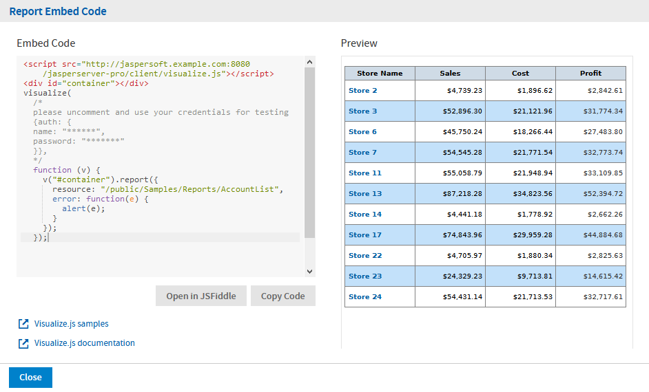

# API Reference - report

The `report` function runs reports on JasperReports Server and displays the result in a container that you provide. This chapter describes how to render a report in Visualize.js.

The report function also supports more advanced customizations of hyperlinks and interactivity that are described in subsequent chapters:

-   [JavaScript API Usage - Hyperlinks](../../jasperreports-io/professional-user-guide/jasperreports-server-visualize.js-guide/hyperlinks.md)
-   [JavaScript API Usage - Interactive Reports](../../jasperreports-io/professional-user-guide/jasperreports-server-visualize.js-guide/interactive_reports.md)

This chapter contains the following sections:

-   [Report Properties](#report-properties)
-   [Report Functions](#report-functions)
-   [Report Structure](#report-structure)
-   [Rendering a Report](#rendering-a-report)
-   [Getting the Embed Code of a Report](#getting-the-embed-code-of-a-report)
-   [Setting Report Parameters](#setting-report-parameters)
-   [Saving a Report](#saving-a-report)
-   [Rendering Multiple Reports](#rendering-multiple-reports)
-   [Resizing a Report](#resizing-a-report)
-   [Setting Report Pagination](#setting-report-pagination)
-   [Creating Pagination Controls (Next/Previous)](#creating-pagination-controls-nextprevious)
-   [Creating Pagination Controls (Range)](#creating-pagination-controls-range)
-   [Exporting From a Report](#exporting-from-a-report)
-   [Exporting Data From a Report](#exporting-data-from-a-report)
-   [Refreshing a Report](#refreshing-a-report)
-   [Canceling Report Execution](#canceling-report-execution)
-   [Discovering Available Charts and Formats](#discovering-available-charts-and-formats)

## Report Properties

The properties structure passed to the `report` function is defined as follows:

``` json
{
    "title": "Report Properties",
    "type": "object",
    "description": "A JSON Schema describing a Report Properties",
    "$schema": "http://json-schema.org/draft-04/schema#",
    "properties": {
        "server": {
            "type": "string",
            "description": "URL of JRS instance."
        },
        "resource": {
            "type": "string",
            "description": "Report resource URI.",
            "pattern": "^/[^/~!#\\$%^|\\s`@&*()\\-+=\\[\\]:;\"'<>,?/\\|\\\\]+(/[^/~!#\\$%^|\\s`@&*()\\-+=\\[\\]:;\"'<>,?/\\|\\\\]+)*$"
        },
        "container": {
            "oneOf": [
                {
                    "type": "object",
                    "additionalProperties" : true,
                    "description": "DOM element to render report to"
                },
                {
                      "type": "string",
                      "description": "CSS selector for container to render report to."
                }
            ]
        },
        "params": {
            "type": "object",
            "description": "Report's parameters values",
            "additionalProperties": {
                "type": "array"
            }
        },
        "pages": {
            "type": ["string", "integer", "object"],
            "description": "Range of report's pages or single report page",
            "pattern": "^[1-9]\\d*(\\-\\d+)?$",
            "properties": {
                "pages": {
                    "type": ["string", "integer"],
                    "description": "Range of report's pages or single report page",
                    "pattern": "^[1-9]\\d*(\\-\\d+)?$",
                    "default": 1,
                    "minimum": 1
                },
                "anchor": {
                    "type": ["string"],
                    "description": "Report anchor"
                }
            },
            "default": 1,
            "minimum": 1
        },
        "scale" : {
            "default": "container",
            "oneOf" : [
                {
                    "type": "number",
                    "minimum" : 0,
                    "exclusiveMinimum": true,
                    "description" : "Scale factor"
                },
                {
                    "enum": ["container", "width", "height"],
                    "default": "container",
                    "description" : "Scale strategy"
                }
            ]
        },
        "defaultJiveUi": {
            "type": "object",
            "description": "Default JIVE UI options.",
            "properties": {
                "enabled": {
                    "type": "boolean",
                    "description": "Enable default JIVE UI.",
                    "default": "true"
                }
            }
        },
        "isolateDom": {
            "type": "boolean",
            "description": "Isolate report in iframe.",
            "default": "false"
        },
        "linkOptions": {
            "type": "object",
            "description": "Report's parameters values",
            "properties": {
                "beforeRender": {
                    "type": "function",
                    "description": "A function to process link - link element pairs."
                },
                "events": {
                    "type": "object",
                    "description": "Backbone-like events object to be applied to JR links",
                    "additionalProperties" : true
                }
            }
        },
        "ignorePagination": {
            "type": "boolean",
            "description": "Control if report will be split into separate pages",
            "default": false
        },
        "autoresize": {
            "type": "boolean",
            "description": "Automatically resize report on browser window resize",
            "default": true
        },
        "chart": {
            "type": "object",
            "additionalProperties": false,
            "description": "Properties of charts inside report",
            "properties": {
                "animation": {
                    "type": "boolean",
                    "description": "Enable/disable animation when report is rendered or resized. Disabling animation may increase performance in some cases. For now works only for Highcharts-based charts."
                },
                "zoom": {
                    "enum": [false, "x", "y", "xy"],
                    "description": "Control zoom feature of chart reports. For now works only for Highcharts-based charts."
                }
            }
        },
        "loadingOverlay": {
            "type": "boolean",
            "description": "Enable/disable report loading overlay",
            "default": true
        },
        "scrollToTop": {
            "type": "boolean",
            "description": "Enable/disable scrolling to top after report rendering",
            "default": true
        },
        "showAdhocChartTitle": {
            "type": "boolean",
            "description": "Enable/disable showing Ad Hoc chart reports title",
            "default": true
        }
    },
    "required": ["server", "resource"]
}
```

!!! note

    When setting a container for Visualize.js, the container element must not be a script element, or an element must not contain script tags for security reasons.

## Report Functions

The `report` function exposes the following functions:

``` javascript
define(function () {

    /**
     * @param {Object} properties - report properties
     * @constructor
     */
    function Report(properties)

    /**
     * Setters and Getters are functions around
     * schema for bi component at ./schema/ReportSchema.json
     * Each setter returns pointer to 'this' to provide chainable API
     */

    /**
     * Get any result after invoking run action, 'null' by default
     * @returns any data which supported by this bi component
     */
    Report.prototype.data = function();

    /**
     * Attaches event handlers to some specific events.
     * New events overwrite old ones.
     * @param {Object} events - object containing event names as keys and event handlers as values
     * @return {Report} report - current Report instance (allows chaining)
     */
    Report.prototype.events = function(events);

    //Actions

    /**
     * Perform main action for bi component
     * Callbacks will be attached to deferred object.
     * @param {Function} callback - optional, invoked in case of successful run
     * @param {Function} errorback - optional, invoked in case of failed run
     * @param {Function} always - optional, invoked always
     * @return {Deferred} dfd
     */
    Report.prototype.run = function(callback, errorback, always);

    /**
     * Render report to container, previously specified in property.
     * Clean up all content of container before adding Report's content
     * @param {Function} callback - optional, invoked in case successful export
     * @param {Function} errorback - optional, invoked in case of failed export
     * @param {Function} always - optional, optional, invoked always
     * @return {Deferred} dfd
     */
    Report.prototype.render = function(callback, errorback, always);

    /**
     * Refresh report execution
     * @param {Function} callback - optional, invoked in case of successful refresh
     * @param {Function} errorback - optional, invoked in case of failed refresh
     * @param {Function} always - optional, invoked optional, invoked always
     * @return {Deferred} dfd
     */
    Report.prototype.refresh = function(callback, errorback, always);

    /**
     * Cancel report execution
     * @param {Function} callback - optional, invoked in case of successful cancel
     * @param {Function} errorback - optional, invoked in case of failed cancel
     * @param {Function} always - optional, invoked optional, invoked always
     * @return {Deferred} dfd
     */
    Report.prototype.cancel = function(callback, errorback, always);

    /**
     * Update report's component
     * @param {Object} component - jive component to update, should have id field
     * @param {Function} callback - optional, invoked in case of successful update
     * @param {Function} errorback - optional, invoked in case of failed update
     * @param {Function} always - optional, invoked optional, invoked always
     * @return {Deferred} dfd
     */
    Report.prototype.updateComponent = function(component, callback, errorback, always);

    /**
     * Update report's component
     * @param {String} id - jive component id
     * @param {Object} properties - jive component's properties to update
     * @param {Function} callback - optional, invoked in case of successful update
     * @param {Function} errorback - optional, invoked in case of failed update
     * @param {Function} always - optional, invoked optional, invoked always
     * @return{Deferred} dfd
     */
    Report.prototype.updateComponent = function(id, properties, callback, errorback, always);

    /**
     * Save JIVE components state
     * @param {Function} callback - optional, invoked in case of successful update
     * @param {Function} errorback - optional, invoked in case of failed update
     * @param {Function} always - optional, invoked optional, invoked always
     * @return{Deferred} dfd
     */
    Report.prototype.save = function(callback, errorback, always);

    /**
     * Save JIVE components state as new report
     * @param {Object} options - resource information (i.e. folderUri, label, description, overwrite flag)
     * @param {Function} callback - optional, invoked in case of successful update
     * @param {Function} errorback - optional, invoked in case of failed update
     * @param {Function} always - optional, invoked optional, invoked always
     * @return{Deferred} dfd
     */
    Report.prototype.save = function(options, callback, errorback, always);

    /**
     * Undo previous JIVE component update
     * @param {Function} callback - optional, invoked in case of successful update
     * @param {Function} errorback - optional, invoked in case of failed update
     * @param {Function} always - optional, invoked optional, invoked always
     * @return{Deferred} dfd
     */
    Report.prototype.undo = function(callback, errorback, always);

    /**
     * Reset report to initial state
     * @param {Function} callback - optional, invoked in case of successful update
     * @param {Function} errorback - optional, invoked in case of failed update
     * @param {Function} always - optional, invoked optional, invoked always
     * @return{Deferred} dfd
     */
    Report.prototype.undoAll = function(callback, errorback, always);

    /**
     * Redo next JIVE component update
     * @param {Function} callback - optional, invoked in case of successful update
     * @param {Function} errorback - optional, invoked in case of failed update
     * @param {Function} always - optional, invoked optional, invoked always
     * @return{Deferred} dfd
     */
    Report.prototype.redo = function(callback, errorback, always);

    /**
     * Export report to specific format, execute only after report run action is finished
     * @param {ExportOptions} exportOptions - export options
     * @param {Function} callback - optional, invoked with link object
     * @param {Function} errorback - optional, invoked in case of failed export
     * @param {Function} always - optional, invoked optional, invoked always
     * @return{Deferred} dfd
     */
    Report.prototype.export = function(exportOptions, callback, errorback, always);

    /**
     * Cancel all execution, destroy report representation if any, leave only
     * properties
     * @param {Function} callback - optional, invoked in case of successful cleanup
     * @param {Function} errorback - optional, invoked in case of failed cleanup
     * @param {Function} always - optional, invoked optional, invoked always
     * @return {Deferred} dfd
     */
    Report.prototype.destroy = function(callback, errorback, always);

    /**
     * Resize report to container size. For Ad Hoc Chart based report will fill all container.
     * For other reports if scale is set to "container", "width" or "height" will fit container maintaining scale factor.
     * For other scale factors nothing will happen.
     * @param {Function} callback - optional, invoked in case of successful resize
     * @param {Function} errorback - optional, invoked in case of failed resize
     * @param {Function} always - optional, invoked optional, invoked always
     * @return{Deferred} dfd
     */
    Report.prototype.resize = function(callback, errorback, always);

    /**
     * Search for text content through all pages in report
     * @param {String} query - text content to search through all report's pages
     * @param {Function} callback - optional, invoked in case of successful resize
     * @param {Function} errorback - optional, invoked in case of failed resize
     * @param {Function} always - optional, invoked optional, invoked always
     * @return{Deferred} dfd
     */
    Report.prototype.search = function(query, callback, errorback, always);

    return Report;
});
```

## Report Structure

The Report Data structure represents the rendered report object manipulated by the report function. Even though it is named "data", it does not contain report data, but rather the data about the report. For example, it contains information about the pages and bookmarks in the report.

The report structure also contains other components described elsewhere:

-   The definitions of hyperlinks and how to work with them is explained in [Customizing Links.](../../jasperreports-io/professional-user-guide/jasperreports-server-visualize.js-guide/hyperlinks.md)
-   Details of the Jaspersoft Interactive Viewer and Editor (JIVE UI) are explained in [Interacting With JIVE UI Components](../../jasperreports-io/professional-user-guide/jasperreports-server-visualize.js-guide/interactive_reports.md).

``` json
{
    "title": "Report Data",
    "description": "A JSON Schema describing a Report Data",
    "$schema": "http://json-schema.org/draft-04/schema#",
    "type": "object",
    "properties": {
        "totalPages": {
            "type": "number",
            "description": "Report's page total count"
        },
        "links": {
            "type": "array",
            "description": "Links extracted from markup, so their quantity depends on pages you have requested",
            "items": {
                "$ref": "#/definitions/jrLink"
            }
        },
        "bookmarks": {
            "type": "array",
            "description": "Report's bookmarks. Quantity depends on current page",
            "items": {
                "$ref": "#/definitions/bookmark"
            }
        },
        "reportParts": {
            "type": "array",
            "description": "Report's parts. Quantity depends on current page",
            "items": {
                "$ref": "#/definitions/reportPart"
            }
        },
        "components": {
            "type": "array",
            "description": "Components in report, their quantity depends on pages you have requested",
            "items": {
                "type": "object",
                "description": "JIVE components data"
            }
        }
    },
    "definitions": {
        "bookmark":{
            "type": "object",
            "properties":{
                "page": "number",
                "anchor": "string",
                "bookmarks": {
                    "type": "array",
                    "items": {
                        "$ref": "#/definitions/bookmark"
                    }
                }
            }
        },
        "reportPart":{
            "type": "object",
            "properties":{
                "page": "number",
                "name": "string"
            }
        },
        "jrLink": { // see chapter on hyperlinks
        }
    }
}
```

## Rendering a Report

To run a report on the server and render it in Visualize.js, create a report object and set its properties. The server and resource properties determine which report to run, and the container property determines where it appears on your page.

``` javascript
var report = v.report({
    server: "http://bi.example.com:8080/jasperserver-pro",
    resource: "/public/Sample/MyReport",
    container: "#container"
});
```

The following code example shows how to display a report that the user selects from a list.

``` javascript
visualize({
    auth: { ...
    }
}, function (v) {

    //render report from provided resource
    v("#container").report({
        resource: $("#selected_resource").val(),
        error: handleError
    });

    $("#selected_resource").change(function () {
        //clean container
        $("#container").html("");
        //render report from another resource
        v("#container").report({
            resource: $("#selected_resource").val(),
            error:handleError
        });
    });

     //enable report chooser
    $(':disabled').prop('disabled', false);

    //show error
    function handleError(err){
        alert(err.message);
    }

});
```

The HTML page that displays the report uses a static list of reports in a drop-down selector, but otherwise needs only a container element.

``` html
<!--Provide the URL to visualize.js-->
<script src="http://bi.example.com:8080/jasperserver-pro/client/visualize.js"></script>
<select id="selected_resource" disabled="true" name="report">
    <option value="/public/Samples/Reports/1._Geographic_Results_by_Segment_Report">Geographic Results by Segment</option>
    <option value="/public/Samples/Reports/2_Sales_Mix_by_Demographic_Report">Sales Mix by Demographic</option>
    <option value="/public/Samples/Reports/3_Store_Segment_Performance_Report">Store Segment Performance</option>
    <option value="/public/Samples/Reports/04._Product_Results_by_Store_Type_Report">Product Results by Store Type</option>
</select>
<!--Provide a container to render your visualization-->
<div id="container"></div>
```

## Getting the Embed Code of a Report

As of JasperReports Server 7.9, the server can provide the code to embed any report displayed in the report viewer. This lets you browse the repository, preview a report, and get its basic embed code. You can paste this code directly in your application, and then edit it for your needs. You can also open the report's embed code in JSFiddle to see the effect of your edits in real time, then copy the final code from JSFiddle.

To copy the embed code of a report:

1.  Log into JasperReports Server and browse the repository to find the report you want to embed.

2.  Run the report to view its output in the server's report viewer.

3.  Click the  icon in the menu bar to view the embed code.

4.  The **Report Embed Code** dialog shows you the Visualize.js code and a preview of the report as it is saved. Select **Copy Code** to copy the entire code block to your clipboard. You can also highlight selected parts of the code and use Ctrl-C (Command-C on macOS), for example if you want only the main function.

    |                                                                     |
    |---------------------------------------------------------------------|
    |  |
    | *Figure 1 The Embed Code of a Report*                               |

    The code sample includes comments where you can enter credentials for authentication. You should also change the name of the container to match the one in your application.

5.  Alternatively, select **Open in JSFiddle** to load the same code into a new Fiddle, an online JavaScript viewer and interactive editor. This lets you modify the JavaScript or HTML, and add CSS if desired, then see the results in real time.

Before or after copying the embed code, you can fine-tune the report within the viewer, for example sorting a table column or changing the chart type. Save your changes to make them available to others. Visualize.js always displays the latest saved version of a report, as determined by the repository URL in the embed code.

When displayed through Visualize.js, a report with a chart includes the  icon in the upper-left corner that allows users to switch between chart types, though not all chart types work with the data in a given report. This selector changes the chart in the user's current session, but the changes cannot be saved. For every new session, Visualize.js displays the default appearance of the chart in the report.

## Setting Report Parameters

To set or change the parameter values, update the `params` object of the report properties and invoke the `run` function again.

``` text
    // update report with new parameters
    report
        .params({ "Country": ["USA"] })
        .run();
    ...
    // later in code
    console.log(report.params()); // console log output: {"Country": ["USA"] }
```

The example above is trivial, but the power of Visualize.js comes from this simple code. You can create any number of user interfaces, database lookups, or your own calculations to provide the values of parameters. Your parameters could be based on third-party API calls that get triggered from other parts of the page or other pages in your app. When your reports can respond to dynamic events, they are seamlessly embedded and much more relevant to the user.

Here are further guidelines for setting parameters:

-   If a report has required parameters, you must set them in the report object of the initial call, otherwise you will get an error. For more information, see [Catching Report Errors](../../jasperreports-io/professional-user-guide/jasperreports-server-visualize.js-guide/handling_errors.md).

-   Parameters are always sent as arrays of quoted string values, even if there is only one value, such as `["USA"]` in the example above. This is also the case even for single value input such as numerical, boolean, or date/time inputs. You must also use the array syntax for single-select values as well as multi-select parameters with only one selection. No matter what the type of input, always set its value to an array of quoted strings.

-   The following values have special meanings:

    -   `""`: An empty string, a valid value for a text input and some selectors.
    -   `"~NULL~"`: Indicates a NULL value (absence of any value), and matches a field that has a NULL value, for example if it has never been initialized.
    -   `"~NOTHING~"`: Indicates the lack of a selection. In multi-select parameters, this is equivalent to indicating that nothing is deselected, thus all are selected. In a single-select non-mandatory parameter, this corresponds to no selection (displayed as `---`). In a single-select mandatory parameter, the lack of selection makes it revert to its default value.

## Saving a Report

Once you change the report parameters, you can save the new report in the repository. You can invoke the `report.save` function without parameters to overwrite the current report. You can also specify a new name or a new folder to save as a different report. The authenticated user must have write permission to the report or to the folder.

``` text
report.save();

report.save({folderUri:"/public",
            label:"Some report label",
            description:"Some report description",
            overwrite:true});
```

The following schema describes the parameters to the `report.save` function:

``` json
{
    "title": "Report save options",
    "type": "object",
    "properties": {
        "folderUri": {
            "type": "string",
            "description": "The URI of a folder to save a report",
            "pattern": "^/.+"
        },
        "label": {
            "type": "string",
            "description": "Report resource label"
        },
        "description": {
            "type": "string",
            "description": "Report resource description"
        },
        "overwrite": {
            "type": "boolean",
            "description": "If true and there is a resource with the same name, then the resource will be overwritten",
            "default": "false"
        }
    },
    "required": ["folderUri"]
}
```

## Rendering Multiple Reports

JavaScript example:

<table>
<colgroup>
<col style="width: 100%" />
</colgroup>
<tbody>
<tr>
<td><div class="sourceCode" id="cb1"><pre class="sourceCode javascript"><code class="sourceCode javascript"><span id="cb1-1"><a href="#cb1-1" aria-hidden="true" tabindex="-1"></a><span class="fu">visualize</span>({</span>
<span id="cb1-2"><a href="#cb1-2" aria-hidden="true" tabindex="-1"></a>    <span class="dt">auth</span><span class="op">:</span> { <span class="op">...</span></span>
<span id="cb1-3"><a href="#cb1-3" aria-hidden="true" tabindex="-1"></a>    }</span>
<span id="cb1-4"><a href="#cb1-4" aria-hidden="true" tabindex="-1"></a>}<span class="op">,</span> <span class="kw">function</span> (v) {</span>
<span id="cb1-5"><a href="#cb1-5" aria-hidden="true" tabindex="-1"></a></span>
<span id="cb1-6"><a href="#cb1-6" aria-hidden="true" tabindex="-1"></a>    <span class="kw">var</span> reportsToLoad <span class="op">=</span> [</span>
<span id="cb1-7"><a href="#cb1-7" aria-hidden="true" tabindex="-1"></a>        <span class="st">&quot;/public/Samples/Reports/AllAccounts&quot;</span><span class="op">,</span></span>
<span id="cb1-8"><a href="#cb1-8" aria-hidden="true" tabindex="-1"></a>        <span class="st">&quot;/public/Samples/Reports/01._Geographic_Results_by_Segment_Report&quot;</span><span class="op">,</span></span>
<span id="cb1-9"><a href="#cb1-9" aria-hidden="true" tabindex="-1"></a>        <span class="st">&quot;/public/Samples/Reports/Cascading_Report_2_Updated&quot;</span><span class="op">,</span></span>
<span id="cb1-10"><a href="#cb1-10" aria-hidden="true" tabindex="-1"></a>        <span class="st">&quot;/public/Samples/Reports/07g.RevenueDetailReport&quot;</span></span>
<span id="cb1-11"><a href="#cb1-11" aria-hidden="true" tabindex="-1"></a>    ]<span class="op">;</span></span>
<span id="cb1-12"><a href="#cb1-12" aria-hidden="true" tabindex="-1"></a></span>
<span id="cb1-13"><a href="#cb1-13" aria-hidden="true" tabindex="-1"></a>    $<span class="op">.</span><span class="fu">each</span>(reportsToLoad<span class="op">,</span> <span class="kw">function</span> (index<span class="op">,</span> uri) {</span>
<span id="cb1-14"><a href="#cb1-14" aria-hidden="true" tabindex="-1"></a>        <span class="kw">var</span> container <span class="op">=</span> <span class="st">&quot;#container&quot;</span> <span class="op">+</span> (index <span class="op">+</span> <span class="dv">1</span>)<span class="op">;</span></span>
<span id="cb1-15"><a href="#cb1-15" aria-hidden="true" tabindex="-1"></a>        <span class="fu">v</span>(container)<span class="op">.</span><span class="fu">report</span>({</span>
<span id="cb1-16"><a href="#cb1-16" aria-hidden="true" tabindex="-1"></a>            <span class="dt">resource</span><span class="op">:</span> uri<span class="op">,</span></span>
<span id="cb1-17"><a href="#cb1-17" aria-hidden="true" tabindex="-1"></a>            <span class="dt">success</span><span class="op">:</span> <span class="kw">function</span> () {</span>
<span id="cb1-18"><a href="#cb1-18" aria-hidden="true" tabindex="-1"></a>                <span class="bu">console</span><span class="op">.</span><span class="fu">log</span>(<span class="st">&quot;loaded: &quot;</span> <span class="op">+</span> (index <span class="op">+</span> <span class="dv">1</span>))<span class="op">;</span></span>
<span id="cb1-19"><a href="#cb1-19" aria-hidden="true" tabindex="-1"></a>            }<span class="op">,</span></span>
<span id="cb1-20"><a href="#cb1-20" aria-hidden="true" tabindex="-1"></a>            <span class="dt">error</span><span class="op">:</span> <span class="kw">function</span> (err) {</span>
<span id="cb1-21"><a href="#cb1-21" aria-hidden="true" tabindex="-1"></a>                <span class="fu">alert</span>(err<span class="op">.</span><span class="at">message</span>)<span class="op">;</span></span>
<span id="cb1-22"><a href="#cb1-22" aria-hidden="true" tabindex="-1"></a>            }</span>
<span id="cb1-23"><a href="#cb1-23" aria-hidden="true" tabindex="-1"></a>        })<span class="op">;</span></span>
<span id="cb1-24"><a href="#cb1-24" aria-hidden="true" tabindex="-1"></a>    })<span class="op">;</span></span>
<span id="cb1-25"><a href="#cb1-25" aria-hidden="true" tabindex="-1"></a>})<span class="op">;</span></span></code></pre></div></td>
</tr>
</tbody>
</table>

Associated HTML:

``` html
<script src="http://ajax.googleapis.com/ajax/libs/jquery/1.8.0/jquery.min.js"></script>
<script src="http://ajax.googleapis.com/ajax/libs/jqueryui/1.10.0/jquery-ui.min.js"></script>
<script src="http://bi.example.com:8080/jasperserver-pro/client/visualize.js"></script>
<table class="sample">
    <tr>
        <td id="container1"></td>
        <td id="container2"></td>
    </tr>
    <tr>
        <td id="container3"></td>
        <td id="container4"></td>
    </tr>
</table>
```

Associated CSS:

``` text
html, body
table.sample {
    width: 100%;
}
td#c1, td#c2, td#c3, td#c4 {
    width: 50%;
}
```

## Resizing a Report

When rendering a report, by default it is scaled to fit in the container you specify. When users resize their window, reports change so that they fit to the new size of the container. This section explains several ways to change the size of a rendered report.

To set a different scaling factor when rendering a report, specify its `scale` property:

-   `container`: The report is scaled to fully fit within the container, both in width and height. If the container has a different aspect ratio, there will be white space in the dimension where the container is larger. This is the default scaling behavior when the `scale` property is not specified.
-   `width`: The report is scaled to fit within the width of the container. If the report is taller than the container, users will need to scroll vertically to see the entire report.
-   `height`: The report is scaled to fit within the height of the container. If the report is wider than the container, users will need to scroll horizontally to see the entire report.
-   Scale factor: A decimal value greater than 0, with 1 being equivalent to 100%. A value between 0 and 1 reduces the report from its normal size, and a value greater than 1 enlarges it. If either or both dimensions of the scaled report are larger than the container, users will need to scroll to see the entire report.

In every case, the entire report is scaled in both directions by the same amount, you cannot change the aspect ratio of tables and crosstab elements.

For example, to initialize the report to half-size (50%), specify the following scale:

``` javascript
var report = v.report({
    resource: "/public/Sample",
    container: "#reportContainer",
    scale: 0.5
});
```

You can also change the scale after rendering, in this case to more than double size (250%):

``` text
report
    .scale(2.5)
    .run();
```

Alternatively, you can turn off the container resizing and modify the size of the container explicitly:

``` javascript
var report = v.report({
    resource: "/public/Sample",
    container: "#reportContainer",
    scale: "container",
    autoresize: false
});

$("#reportContainer").width(500).height(500);
report.resize();
```

To make the Report Viewer responsive, an additional property is introduced in Visualize.js that is `reportContainerWidth`. You need to set the value of this property to the width of the report container. Then this value is passed to the report execution process as `REPORT_CONTAINER_WIDTH` built-in parameter value.

``` javascript
visualize({
    auth: {...
    }
}, function(v) {
     let reportConfig = {
         resource: "/public/ResponsiveReport",
         container: "#container",
         reportContainerWidth: getContainerWidth(),
         events: {
               responsiveBreakpointChanged: function(error) {
                    if (error) {
                        console.log(error);
                     } else {
                         report.destroy();
                      // rerun report
                         reportConfig.reportContainerWidth = getContainerWidth();
                         report = v.report(reportConfig);
                            }
                       }
                    },
                    error: (e) => console.error(e.message || e)
            };
            let report = v.report(reportConfig);

            function getContainerWidth() {
                  return document.getElementById("container").clientWidth;
           }
 });
```

## Setting Report Pagination

To set or change the pages displayed in the report, update the `pages` object of the report properties and invoke the `run` function again.

``` text
    report
        .pages(5)
        .run(); // re-render report with page 5 into the same container

    report
        .pages("2") // string is also allowed
        .run();

    report
        .pages("4-6") // a range of numbers as a string is also possible
        .run();

    report
        .pages({     // alternative object notation
            pages: "4-6"
        })
        .run();
```

The `pages` object of the report properties also supports bookmarks by specifying the `anchor` property. You can also specify both pages and bookmarks as shown in the example below. For more information about bookmarks, see [Providing Bookmarks in Reports](../../jasperreports-io/professional-user-guide/jasperreports-server-visualize.js-guide/interactive_reports.md).

``` text
    report
        .pages({    // bookmark inside report to navigate to
            anchor: "summary"
        })
        .run();

    report
        .pages({    // set bookmark to scroll report to in scope of provided pages
            pages: "2-5",
            anchor: "summary"
        })
        .run();
```

## Creating Pagination Controls (Next/Previous)

Again, the power of Visualize.js comes from these simple controls that you can access programmatically. You can create any sort of mechanism or user interface to select the page. In this example, the HTML has buttons that allow the user to choose the next or previous pages.

``` javascript
visualize({
    auth: { ...
    }
}, function (v) {

    var report = v.report({
        resource: "/public/Samples/Reports/AllAccounts",
        container: "#container"
    });

    $("#previousPage").click(function() {
        var currentPage = report.pages() || 1;

        report
            .pages(--currentPage)
            .run()
                .fail(function(err) { alert(err); });
    });

    $("#nextPage").click(function() {
        var currentPage = report.pages() || 1;

        report
            .pages(++currentPage)
            .run()
                .fail(function(err) { alert(err); });
    });
});
```

Associated HTML:

``` html
<script src="https://code.jquery.com/jquery-3.3.1.min.js"></script>
<script src="http://bi.example.com:8080/jasperserver-pro/client/visualize.js"></script>

<button id="previousPage">Previous Page</button><button id="nextPage">Next Page</button>

<div id="container"></div>
```

## Creating Pagination Controls (Range)

JavaScript example:

``` javascript
visualize({
    auth: { ...
    }
}, function (v) {
    var report = v.report({
        resource: "/public/Samples/Reports/AllAccounts",
        container: "#container"
    });

    $("#pageRange").change(function() {
        report
            .pages($(this).val())
            .run()
                .fail(function(err) { alert(err); });
    });
});
```

Associated HTML:

``` html
<script src="https://code.jquery.com/jquery-3.3.1.min.js"></script>
<script src="http://bi.example.com:8080/jasperserver-pro/client/visualize.js"></script>

Page range: <input type="text" id="pageRange"></input>

<div id="container"></div>
```

## Exporting From a Report

To export a report, invoke its `export` function and specify the `outputFormat` property. You MUST wait until the `run` action has completed before starting the export. The following export formats are supported:

`"pdf", "xlsx", "rtf", "csv", "xml", "odt", "ods", "docx", "json", "pptx"`

For CSV and JSON output, see [Exporting Data From a Report](#exporting-data-from-a-report). Note that the HTML output of a report is not available through Visualize.js.

``` javascript
report.run(exportToPdf);

function exportToPdf() {
    report
        .export({
            outputFormat: "pdf"
        })
        .done(function (link) {
            window.open(link.href); // open new window to download report
        })
        .fail(function (err) {
            alert(err.message);
        });
}
```

The following sample exports 10 pages of the report to a paginated Excel spreadsheet:

``` javascript
report.run(exportToPaginatedExcel);

function exportToPaginatedExcel() {
    report
        .export({
            outputFormat: "xlsx",
            pages: "1-10",
            ignorePagination: false
        })
        .done(function(link){
            window.open(link.href); // open new window to download report
        })
        .fail(function(err){
            alert(err.message);
        });
}
```

The following sample exports the part of report associated with a named anchor:

``` javascript
report.run(exportPartialPDF);

function exportPartialPDF() {
    report
        .export({
            outputFormat: "pdf",
            pages: {
                anchor: "summary"
            }
        })
        .done(function(link){
            window.open(link.href); //open new window to download report
        })
        .fail(function(err){
            alert(err.message);
        });
}
```

The following example creates a user interface for exporting a report:

``` javascript
visualize({
    auth: { ...
    }
}, function (v) {

    var $select = buildControl("Export to: ", v.report.exportFormats),
        $button = $("#button"),
        report = v.report({
            resource: "/public/Samples/Reports/5g.AccountsReport",
            container: "#container",

            success: function () {
                button.removeAttribute("disabled");
            },

            error: function (error) {
                console.log(error);
            }
        });

    $button.click(function () {

        console.log($select.val());

        report.export({
            //export options here
            outputFormat: $select.val(),
            //exports all pages if not specified
            //pages: "1-2"
        }, function (link) {
           var url = link.href ? link.href : link;
           window.location.href = url;
        }, function (error) {
            console.log(error);
        });
    });

    function buildControl(name, options) {

        function buildOptions(options) {
            var template = "<option>{value}</option>";
            return options.reduce(function (memo, option) {
                return memo + template.replace("{value}", option);
            }, "")
        }

        var template = "<label>{label}</label><select>{options}</select><br>",
            content = template.replace("{label}", name)
                .replace("{options}", buildOptions(options));

        var $control = $(content);
        $control.insertBefore($("#button"));
        //return select
        return $($control[1]);
    }

});
```

Associated HTML:

``` html
<script src="https://code.jquery.com/jquery-3.3.1.min.js"></script>
<!-- Provide the URL to visualize.js -->
<script src="http://bi.example.com:8080/jasperserver-pro/client/visualize.js"></script>

<button id="button" disabled>Export</button>
<!-- Provide a container for the report -->
<div id="container"></div>
```

## Exporting Data From a Report

You can also request the raw data of the report in CSV or JSON format.

The following example shows how to export data in CSV format. CSV output is plain text that you must parse to extract the values that you need:

``` javascript
report.run(exportToCsv);

function exportToCsv() {
    report
        .export({
            outputFormat: "csv"
        })
        .done(function(link, request){
            request()
                .done(function(data) {
                    // use data here, data is CSV format in plain text
                });
                .fail(function(err){
                    //handle errors here
                });
        })
        .fail(function(err){
            alert(err.message);
        });
}
```

The following example shows how to export data in JSON format. By its nature, JSON format can be used directly as data within your JavaScript.

``` javascript
report.run(exportToJson);

function exportToJson() {
    report
        .export({
            outputFormat: "json"
        })
        .done(function(link, request){
            request({
                dataType: "json"
            })
            .done(function(data) {
                // use JSON data as objects here
            })
            .fail(function(err){
                    //handle errors here
            });

        })
        .fail(function(err){
            alert(err.message);
        });
}
```

## Refreshing a Report

JavaScript example:

``` javascript
visualize({
    auth: { ...
    }
}, function (v) {

    var alwasyRefresh = false;

    var report = v.report({
        //skip report running during initialization
        runImmediately: !alwasyRefresh,
        resource: "/public/viz/usersReport",
        container: "#container1",
     });

    if (alwasyRefresh){
        report.refresh();
    }

    $("button").click(function(){
        report
            .refresh()
            .done(function(){console.log("Report Refreshed!");})
            .fail(function(){alert("Report Refresh Failed!");});
    });

});
```

Associated HTML:

``` html
<script src="https://code.jquery.com/jquery-3.3.1.min.js"></script>
<script src="http://bi.example.com:8080/jasperserver-pro/client/visualize.js"></script>
<button>Refresh</button>
<div id="container1"></div>
```

## Canceling Report Execution

To stop a running report, call its `cancel` function:

``` javascript
    ...
    report
    .cancel()
    .done(function(){
        alert("Report Canceled");
    })
    .fail(function(){
        alert("Report Failed");
    });
```

The following example is more complete and creates a UI for a spinner and cancel button for a long-running report.

``` javascript
var spinner = createSpinner();

visualize({
    auth: { ...
    }
}, function (v) {

    var button = $("button");

    var report = v.report({
        resource: "/public/Reports/Slow_Report",
        container: "#container",
        events: {
            changeTotalPages : function(){
               spinner.remove();
            }
        }
    });

    button.click(function () {
        report
            .cancel()
            .then(function () {
                spinner.remove();
                alert("Report Canceled!");
            })
            .fail(function () {
                alert("Can't Cancel Report");
            });
    });
});

function createSpinner() {
    var opts = {
        lines: 17, length: 3, width: 2, radius: 3, corners: 0.6, rotate: 0, direction: 1,
        color: '#000', speed: 1, trail: 60, shadow: false, hwaccel: false, zIndex: 2e9,
        top: 'auto', left: 'auto', className: 'spinner'
    };
    var container = $("#spinner");
    var spinner = new Spinner(opts).spin(container[0]);
    return container;
}
```

Associated HTML:

``` html
<script src="https://code.jquery.com/jquery-3.3.1.min.js"></script>
<script src="http://fgnass.github.io/spin.js/spin.js"></script>
<script src="http://bi.example.com:8080/jasperserver-pro/client/visualize.js"></script>
<div id="spinner"></div>
<button>Cancel</button>
<div id="container"></div>
```

## Discovering Available Charts and Formats

You can write code to discover and display the types of charts and export formats that can be specified. The following example reads the `exportFormats`, `chart.types`, and `table.column.types` of the given report and dynamically creates a selection dialog for each:

``` javascript
visualize({
    auth: {
        name: "jasperadmin",
        password: "jasperadmin",
        organization: "organization_1"
    }
}, function (v) {

    buildControl("Report export formats", v.report.exportFormats);
    buildControl("Chart types", v.report.chart.types);
    buildControl("Report table column types", v.report.table.column.types);

});

function buildControl(name, options) {

        function buildOptions(options) {
            var template = "<option>{value}</option>";
            return options.reduce(function (memo, option) {
                return memo + template.replace("{value}", option);
            }, "")
        }

    console.log(options);

    if (!options.length){
        console.log(options);
    }

    var template = "<label>{label}</label><select>{options}</select><br>",
        content = template.replace("{label}", name)
                .replace("{options}", buildOptions(options));

    $("#container").append($(content));
}
```
