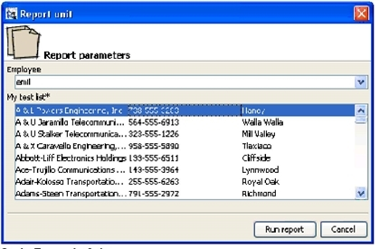

# 1.1 Get Operation

The `get` operation is used to obtain information about a resource. In the case of file resources, such as images, fonts, JRXML files, and JAR files, the resource file is attached to the response message.

This method’s behavior differs according to the type of object specified:

- Generally, a simple resource descriptor is returned.
- If you get a resource file, the file content is attached to the response; if you do not want the server to attach files to the response, set the request’s `NO_ATTACHMENT` argument to `true`.
- If you get a report unit, all the related resources are added as child resource descriptors to the report unit descriptor.
- To get an input control that is based on a query, you must set the IC_GET_QUERY_DATA argument to the valid URI of a datasource for the control, or you can handle the NONE condition as in the sample code java-webapp-sample.

If you set the datasource in the input control, that datasource is used to execute the query and populate the resource descriptor. This can be useful when the input control must be rendered (for example, on a web page) in order to capture a value to pass when executing a report.

- You can use parameters in the input control to select query values, including the datasource. See the examples starting on .

The following sample request gets a file resource:

<table>
<colgroup>
<col style="width: 100%" />
</colgroup>
<tbody>
<tr>
<td>
<pre class="sourceCode xml"><code class="sourceCode xml">&lt;request operationName=&quot;get&quot; locale=&quot;en&quot;&gt;
  &lt;resourceDescriptor name=&quot;JRLogo&quot; wsType=&quot;img&quot; uriString=&quot;/images/JRLogo&quot; isNew=&quot;false&quot;&gt;
    &lt;label&gt;JR logo&lt;/label&gt;
    &lt;description&gt;JR logo&lt;/description&gt;
  &lt;/resourceDescriptor&gt;
&lt;/request&gt;</code></pre>
</td>
</tr>
</tbody>
</table>

The service only uses the `uriString` to identify the resource to get and check for access permissions. This means that other information present in the resource description (such as resource properties, label, and description) are not actually used or required.

If a file is attached to the response, the returned resource descriptor has the `PROP_HAS_DATA` property set to `true`. By default, the attachments format is MIME. You can use DIME attachments by specifying the `USE_DIME_ATTACHMENTS` argument in the request.

A `get` call always returns a resource descriptor. If the specified resource is not found, or the specified user cannot access it, an error with code 2 is returned.

Java sample:

<table>
<colgroup>
<col style="width: 100%" />
</colgroup>
<tbody>
<tr>
<td><pre class="text"><code>String imgUri = &quot;/images/JRLogo&quot;;
ResourceDescriptor rdis = new ResourceDescriptor();
rdis.setParentFolder(&quot;/images&quot;);
rdis.setUriString(imgUri);
ResourceDescriptor result = wsclient.get(rdis, null);</code></pre></td>
</tr>
</tbody>
</table>

PHP sample:

<table>
<colgroup>
<col style="width: 100%" />
</colgroup>
<tbody>
<tr>
<td>
<pre class="sourceCode bash"><code class="sourceCode bash">$result = ws_get($someInputControlUri, array( IC_GET_QUERY_DATA =&gt; 
$someDatasourceUri ) );</code></pre>
</td>
</tr>
</tbody>
</table>

The resource descriptor of an input control that includes data obtained by setting the `IC_GET_QUERY_DATA` argument to `true` would be similar to the following XML:

<table>
<colgroup>
<col style="width: 100%" />
</colgroup>
<tbody>
<tr>
<td>
<pre class="sourceCode xml"><code class="sourceCode xml">&lt;resourceDescriptor name=&quot;TEST_LIST&quot; wsType=&quot;inputControl&quot; uriString=  &quot;/MyInputControls/TEST_LIST&quot; isNew=&quot;false&quot;&gt;
  &lt;label&gt;My test list&lt;/label&gt;
  &lt;description&gt;My test list&lt;/description&gt;
  &lt;resourceProperty name=&quot;PROP_RESOURCE_TYPE&quot;&gt;
    &lt;value&gt;com.jaspersoft.jasperserver.api.metadata.common.domain.InputControl&lt;/
      value&gt;
  &lt;/resourceProperty&gt;
  &lt;resourceProperty name=&quot;PROP_PARENT_FOLDER&quot;&gt;
    &lt;value&gt;/MyInputControls&lt;/value&gt;
  &lt;/resourceProperty&gt;
  &lt;resourceProperty name=&quot;PROP_VERSION&quot;&gt;
    &lt;value&gt;6&lt;/value&gt;
  &lt;/resourceProperty&gt;
  &lt;resourceProperty name=&quot;PROP_HAS_DATA&quot;&gt;
    &lt;value&gt;false&lt;/value&gt;
  &lt;/resourceProperty&gt;
  &lt;resourceProperty name=&quot;PROP_IS_REFERENCE&quot;&gt;
    &lt;value&gt;false&lt;/value&gt;
  &lt;/resourceProperty&gt;
  &lt;resourceProperty name=&quot;PROP_INPUTCONTROL_IS_MANDATORY&quot;&gt;
    &lt;value&gt;true&lt;/value&gt;
  &lt;/resourceProperty&gt;
  &lt;resourceProperty name=&quot;PROP_INPUTCONTROL_IS_READONLY&quot;&gt;
    &lt;value&gt;false&lt;/value&gt;
  &lt;/resourceProperty&gt;
  &lt;resourceProperty name=&quot;PROP_INPUTCONTROL_TYPE&quot;&gt;
    &lt;value&gt;7&lt;/value&gt;
  &lt;/resourceProperty&gt;</code></pre>
</td>
</tr>
<tr>
<td>
<pre class="sourceCode xml"><code class="sourceCode xml">  &lt;resourceProperty name=&quot;PROP_QUERY_VALUE_COLUMN&quot;&gt;
    &lt;value&gt;name&lt;/value&gt;
  &lt;/resourceProperty&gt;
  &lt;resourceProperty name=&quot;PROP_QUERY_VISIBLE_COLUMNS&quot;&gt;
    &lt;resourceProperty name=&quot;PROP_QUERY_VISIBLE_COLUMN_NAME&quot;&gt;
      &lt;value&gt;name&lt;/value&gt;
    &lt;/resourceProperty&gt;
    &lt;resourceProperty name=&quot;PROP_QUERY_VISIBLE_COLUMN_NAME&quot;&gt;
      &lt;value&gt;phone_office&lt;/value&gt;
    &lt;/resourceProperty&gt;
    &lt;resourceProperty name=&quot;PROP_QUERY_VISIBLE_COLUMN_NAME&quot;&gt;
      &lt;value&gt;billing_address_city&lt;/value&gt;
    &lt;/resourceProperty&gt;
  &lt;/resourceProperty&gt;
  &lt;resourceProperty name=&quot;PROP_QUERY_DATA&quot;&gt;
    &lt;resourceProperty name=&quot;PROP_QUERY_DATA_ROW&quot;&gt;
      &lt;value&gt;A &amp;amp; L Powers Engineering, Inc&lt;/value&gt;
      &lt;resourceProperty name=&quot;PROP_QUERY_DATA_ROW_COLUMN&quot;&gt;
        &lt;value&gt;A &amp;amp; L Powers Engineering, Inc&lt;/value&gt;
      &lt;/resourceProperty&gt;
      &lt;resourceProperty name=&quot;PROP_QUERY_DATA_ROW_COLUMN&quot;&gt;
        &lt;value&gt;738-555-3283&lt;/value&gt;
      &lt;/resourceProperty&gt;
      &lt;resourceProperty name=&quot;PROP_QUERY_DATA_ROW_COLUMN&quot;&gt;
        &lt;value&gt;Haney&lt;/value&gt;
      &lt;/resourceProperty&gt;
    &lt;/resourceProperty&gt;
    &lt;resourceProperty name=&quot;PROP_QUERY_DATA_ROW&quot;&gt;
      &lt;value&gt;A &amp;amp; U Jaramillo Telecommunications, Inc&lt;/value&gt;
      &lt;resourceProperty name=&quot;PROP_QUERY_DATA_ROW_COLUMN&quot;&gt;
        &lt;value&gt;A &amp;amp; U Jaramillo Telecommunications, Inc&lt;/value&gt;
      &lt;/resourceProperty&gt;
      &lt;resourceProperty name=&quot;PROP_QUERY_DATA_ROW_COLUMN&quot;&gt;
        &lt;value&gt;564-555-6913&lt;/value&gt;
      &lt;/resourceProperty&gt;
      &lt;resourceProperty name=&quot;PROP_QUERY_DATA_ROW_COLUMN&quot;&gt;
        &lt;value&gt;Walla Walla&lt;/value&gt;
      &lt;/resourceProperty&gt;
    &lt;/resourceProperty&gt;
    &lt;resourceProperty name=&quot;PROP_QUERY_DATA_ROW&quot;&gt;
      &lt;value&gt;A &amp;amp; U Stalker Telecommunications, Inc&lt;/value&gt;
      &lt;resourceProperty name=&quot;PROP_QUERY_DATA_ROW_COLUMN&quot;&gt;
        &lt;value&gt;A &amp;amp; U Stalker Telecommunications, Inc&lt;/value&gt;
      &lt;/resourceProperty&gt;
      &lt;resourceProperty name=&quot;PROP_QUERY_DATA_ROW_COLUMN&quot;&gt;
        &lt;value&gt;323-555-1226&lt;/value&gt;
      &lt;/resourceProperty&gt;
      &lt;resourceProperty name=&quot;PROP_QUERY_DATA_ROW_COLUMN&quot;&gt;
        &lt;value&gt;Mill Valley&lt;/value&gt;
      &lt;/resourceProperty&gt;
    &lt;/resourceProperty&gt;</code></pre>
</td>
</tr>
<tr>
<td>
<pre class="sourceCode xml"><code class="sourceCode xml">    &lt;resourceProperty name=&quot;PROP_QUERY_DATA_ROW&quot;&gt;
      &lt;value&gt;A &amp;amp; X Caravello Engineering, Inc&lt;/value&gt;
      &lt;resourceProperty name=&quot;PROP_QUERY_DATA_ROW_COLUMN&quot;&gt;
        &lt;value&gt;A &amp;amp; X Caravello Engineering, Inc&lt;/value&gt;
      &lt;/resourceProperty&gt;
      &lt;resourceProperty name=&quot;PROP_QUERY_DATA_ROW_COLUMN&quot;&gt;
        &lt;value&gt;958-555-5890&lt;/value&gt;
      &lt;/resourceProperty&gt;
      &lt;resourceProperty name=&quot;PROP_QUERY_DATA_ROW_COLUMN&quot;&gt;
        &lt;value&gt;Tlaxiaco&lt;/value&gt;
      &lt;/resourceProperty&gt;
    &lt;/resourceProperty&gt;
  &lt;/resourceProperty&gt;
  &lt;resourceDescriptor name=&quot;query&quot; wsType=&quot;query&quot; uriString=&quot;/MyInputControls/
    TEST_LIST_files/query&quot; isNew=&quot;false&quot;&gt;
    &lt;label&gt;query&lt;/label&gt;
  &lt;description&gt;query&lt;/description&gt;
  &lt;resourceProperty name=&quot;PROP_RESOURCE_TYPE&quot;&gt;
    &lt;value&gt;com.jaspersoft.jasperserver.api.metadata.common.domain.Query&lt;/value&gt;
  &lt;/resourceProperty&gt;
  &lt;resourceProperty name=&quot;PROP_PARENT_FOLDER&quot;&gt;
    &lt;value&gt;/MyInputControls/TEST_LIST_files&lt;/value&gt;
  &lt;/resourceProperty&gt;
  &lt;resourceProperty name=&quot;PROP_VERSION&quot;&gt;
    &lt;value&gt;1&lt;/value&gt;
  &lt;/resourceProperty&gt;
  &lt;resourceProperty name=&quot;PROP_HAS_DATA&quot;&gt;
    &lt;value&gt;false&lt;/value&gt;
  &lt;/resourceProperty&gt;
  &lt;resourceProperty name=&quot;PROP_IS_REFERENCE&quot;&gt;
    &lt;value&gt;false&lt;/value&gt;
  &lt;/resourceProperty&gt;
  &lt;resourceProperty name=&quot;PROP_QUERY&quot;&gt;
    &lt;value&gt;SELECT name, phone_office, billing_address_city FROM accounts order by 
      name&lt;/value&gt;
  &lt;/resourceProperty&gt;
  &lt;resourceProperty name=&quot;PROP_QUERY_LANGUAGE&quot;&gt;
    &lt;value&gt;sql&lt;/value&gt;
  &lt;/resourceProperty&gt;
    &lt;resourceDescriptor name=&quot;&quot; wsType=&quot;datasource&quot; uriString=&quot;&quot; isNew=&quot;false&quot;&gt;
      &lt;label&gt;null&lt;/label&gt;
      &lt;resourceProperty name=&quot;PROP_REFERENCE_URI&quot;&gt;
        &lt;value&gt;/datasources/JServerJdbcDS&lt;/value&gt;
      &lt;/resourceProperty&gt;
      &lt;resourceProperty name=&quot;PROP_IS_REFERENCE&quot;&gt;
        &lt;value&gt;true&lt;/value&gt;
      &lt;/resourceProperty&gt;
    &lt;/resourceDescriptor&gt;
  &lt;/resourceDescriptor&gt;
&lt;/resourceDescriptor&gt;</code></pre>
</td>
</tr>
</tbody>
</table>

The query result is a set of rows that represents the full set of possible values for the input control. For each row, the repository web service returns the value that `runReport` expects for that particular option in the input control. Each row also includes the column values that should be displayed in the input control when prompting users.

*Figure 1-1 Query Results*

This figure shows input controls based on queries, as they are rendered by the iReport Designer plugin for JasperReports Server. When the web services run report units, the rendering of input controls is left to the client application. The best way to proceed is:

- Get the report unit.
- Check for query-based input controls by looking at the `PROP_INPUTCONTROL_TYPE` resource property or each child resource descriptor where `wsType` is equal to `inputControl`.
- Get each query-based input control by setting the `IC_GET_QUERY_DATA` argument to true.
- Render the input controls (if used in the report unit), being mindful of the input control properties (such as read only and mandatory).
- Call the runReport service and pass the user-selected values.

The rows are stored in the `PROP_QUERY_DATA` resource property: for each row, a child resource property named `PROP_QUERY_DATA_ROW` contains the value and a set of children that contain the column values; these last resource properties are named `PROP_QUERY_DATA_ROW_COLUMN`.

The following schema may elucidate the whole data structure:

<table>
<colgroup>
<col style="width: 100%" />
</colgroup>
<tbody>
<tr>
<td><pre class="text"><code>PROP_QUERY_DATA
  (
  PROP_QUERY_DATA_ROW, value
    (
    PROP_QUERY_DATA_ROW_COLUMN, value
    PROP_QUERY_DATA_ROW_COLUMN, value
    ...
    )
  PROP_QUERY_DATA_ROW, value
    (
    PROP_QUERY_DATA_ROW_COLUMN, value
    PROP_QUERY_DATA_ROW_COLUMN, value
    ...
    )</code></pre></td>
</tr>
<tr>
<td><pre class="text"><code>  PROP_QUERY_DATA_ROW, value
    (
    PROP_QUERY_DATA_ROW_COLUMN, value
    PROP_QUERY_DATA_ROW_COLUMN, value
    ...
    )
  )</code></pre></td>
</tr>
</tbody>
</table>

In Java, to simplify response processing, the `resourceDescriptor` class provides the `getQueryData()` method that returns a list of `InputControlQueryDataRow`, which is a convenient class containing all the row information (row and column values).
