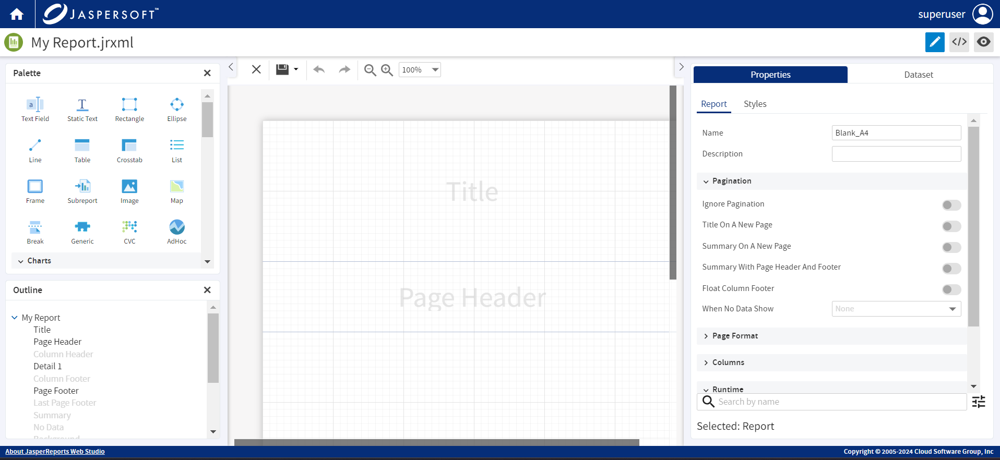

# Editors

JasperReports Web Studio is a collection of tools that helps to develop reports. It opens and edits the file types usually used in report development, report templates, data adapters, JasperReports styles templates, images, all kinds of text, XML, JSON files. If it is not working with a particular type of file available in the repository, use another tool.

