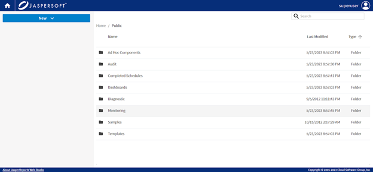
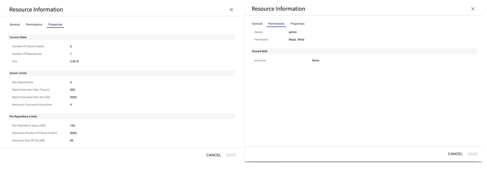
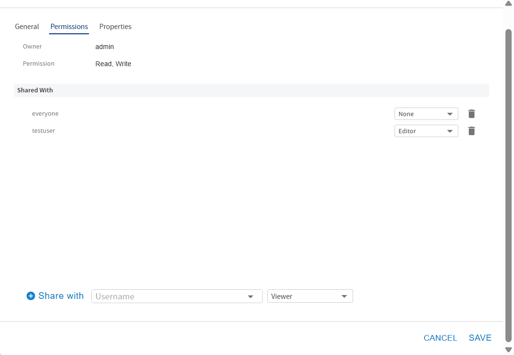

# Repository Manager

When you log into the remote storage platform, you are presented with the contents of the target repository and are able to navigate the folder structure or search for resources that need to be edited using the specialized editors that JasperReports Web Studio offers.

Folders and files can be created, edited, or removed, just like in any file system like a repository. To upload a file or folder, click the **New** button and select **Upload File** or **Upload Folder**. The menu also contains the following options:

- New Report
- New Data Adapter
- New Folder

The following actions are available from the context menu, when you right-click on the name of a file or folder:

- **Delete** deletes the resource permanently.
- **Download** downloads the resource.
- **Resource Information** shows detailed information about the resource such as name, description, mime, ID, type, path, size, Created Date, Last Modified Date, and permissions. With the required permissions and if the repository allows, you can change the name or description.

To open a file, click the file name.

## Upload and Download Files and Folders

To download a file or a folder, use the right-click context menu on the resource, and select the **Download** menu item. Folders are saved as zip files.

In the **New** menu on the upper-right, depending on permissions and possibility to create a resource, there are two menu items:

- **Upload**

- **Upload Folder**

These options allow you to upload files or folders into the repository.

## Resource Information

In the **Resource Information** dialog, you can view the resource information and permissions. In the case of some special objects, like repositories, additional information like, available space and limits can be viewed too.

The **Resource Permissions** enables users to manage access to repository resources by granting, modifying, or removing permissions. Users can share resources, assign specific permission levels, and view authorized users.

The **Permissions** dialog provides search capabilities to locate users and supports immediate updates to access settings.

#### Managing Resource Permissions

To manage permissions for a repository resource:

1.  Log in to JasperReports Web Studio.

2.  Navigate to the required repository resource.

3.  Right-click the resource and select **Permissions**.

    

4.  In the **Permissions** dialog:

    - Click the dropdown or type into the field to search for and select the user.

    - Now, select the appropriate permission level from the available dropdown options.

    - Click **Share with** to add the selected user to the active list above.

    - In the **Share with** list, you can see the users and the allocated permissions:

      You can update the existing permissions from the dropdown.

      To remove the user from the permissions list, click the icon.

5.  Click **Save** to apply the changes.

!!! note

    The Resource Permissions provides secure, controlled repository access and enables centralized administration of user privileges.
