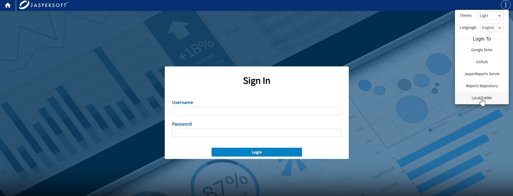

# Report Repositories

A report could be as simple as a file or could be composed of multiple files, images, styles, or resource bundles. These files should be stored somewhere and should have a location, eventually relative to the report or root. They are usually stored in a kind of repository. The most simple and popular repository is a simple file system folder. File folders are very good for classic desktop development but are not enough in the modern way to work on multiple computers with multiple users involved, in clouds.

JasperReports Web Studio can work with different repository types:

- Google Drive
- GitHub
- Local Folder
- JasperReports Server

Each repository could have its own exceptions. For example, you cannot save on GitHub, but you can commit your changes.

The login process is streamlined to enhance ease of use. Your personal repository is now created automatically behind the scenes. Once you log in, you are taken straight to your report workspace, bypassing manual configuration steps and providing a seamless start to your design session.
