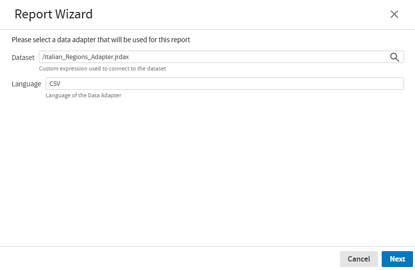
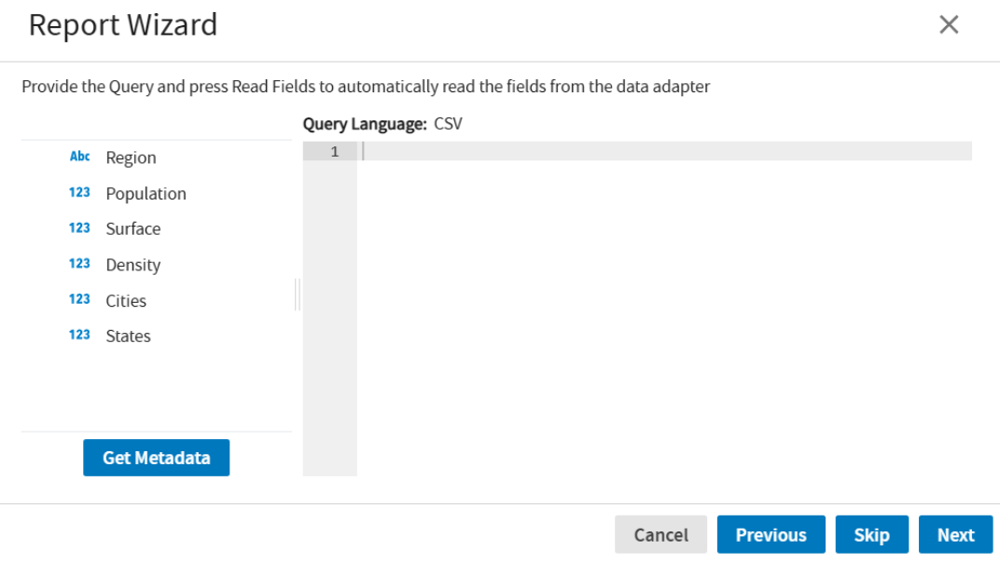
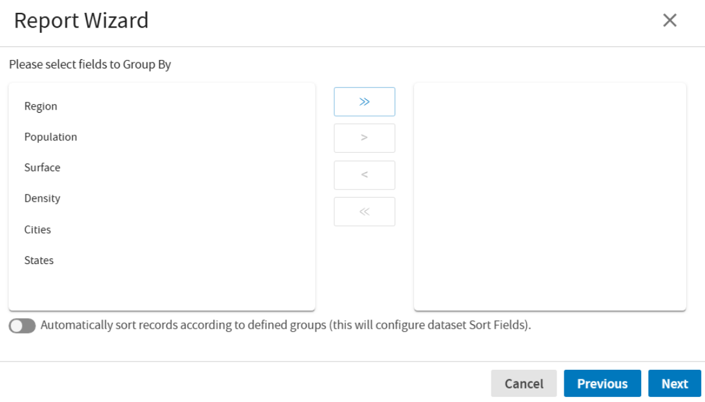
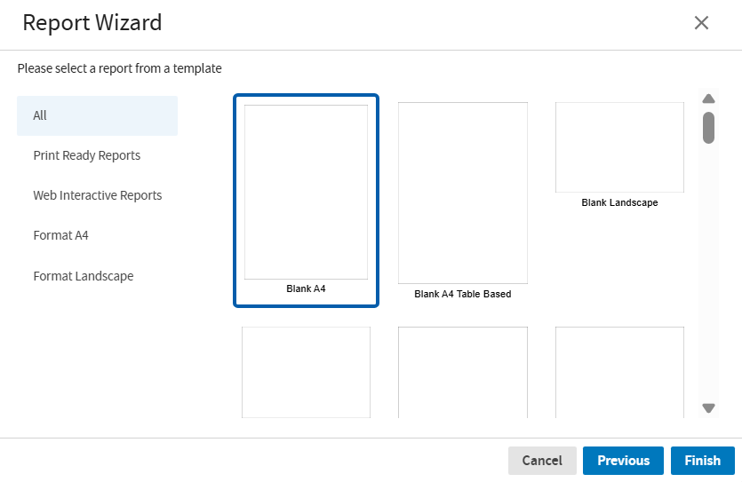

# Report creation using Report Wizard

The Report Wizard in JasperReports Web Studio is a tool that simplifies the process of creating reports.

Starting the Report Wizard, log into JasperReports Web Studio using a valid user account. Once you are logged in, click **New** in the upper-left menu and select **New Report** from the dropdown. This opens the **Report Wizard** dialog.

1.  Select a Data Adapter

    Choose a data adapter, which acts as the connection to your data.

    - To choose a dataset, click the search icon in the **Dataset** field, and then the **Select Dataset** dialog opens.

    - Select a dataset and click **Open**, the **Language** field automatically gets updated to reflect the language of the chosen data adapter.

      

    - Click **Cancel** or **X** button to close the Report wizard, and the report editor remains open and you acn create report from scratch.

    - Click **Next** after selecting a dataset.

2.  Query Language

    The query language displayed is based on the dataset that you have selected in the previous step. Here you can work with the data for your report.

    - Click **Get Metadata** to see all the data appear in the dataset.

    - Click **Previous** to return to the previous window of the Report wizard.

      

    - Click **Skip** or **Next** to moves to the next window, where the dataset fields are displayed.

3.  Selecting Fields

    The list of the fields depends on the query provided in the previous step. You can select the specific fields you want to include in your report. Use the arrows to move fields between the left and right sides of the window.

    

    - To move all fields from left to the right side, click **\>\>**.

    - To move all fields from the right side back to the left, click **\<\<** .

    - To move a selected field to the right, click **\>**.

    - To move a selected field to the left, click **\<**.

    After selecting the fields, click **Next** to navigate to the **Group By** window

4.  Grouping and Sorting

    In this window, you can organize your data of the dataset.

    

    - All the fields previously selected appears on the left side of the window. The arrow functions as described in the previous step "Selecting Fields".

    - The toggle button enables you to automatically sort records according to the defined groups.

    - Click **Next**, to proceed.

5.  Select a template

    - First select a category on the left to narrow down the template options like:

      - **All**.

      - **Print Ready Reports**, these reports feature every field as a text field.

      - **Web Interactive Reports**, these reports contain fields within a table, allowing for column sorting when viewed in a browser.

      - **Format A4** and **Format Landscpace**, the reports can be formatted in A4 or landscape.

      

    - Click one of the templates previews to select it.

    - Click **Next**, to generate the report in the selected format. Or click **Previous** to go back and change the previous settings or click **Cancel** to exit the wizard without creating the report.
