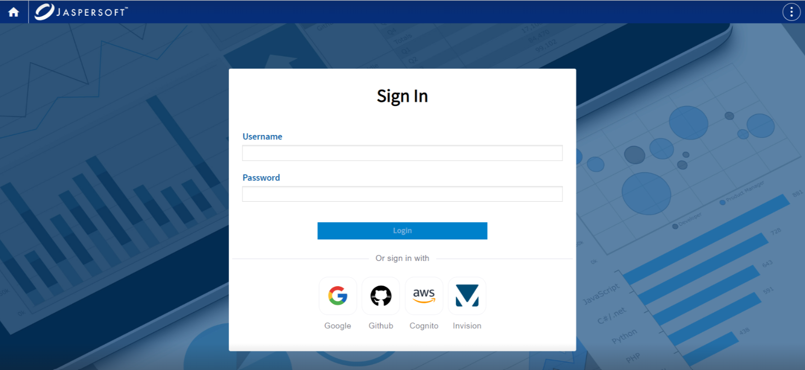

# Using Jackrabbit as a Repository

Jackrabbit repository provides multiple options to store resources, such as, files, relational database, MongoDB. There are multiple ways to configure the repository.

In case of file based repository, use:

`jrws.repository.jackrabbit.path=/path/to/repository`

The following properties from `README.md` files can be used to configure Jackrabbit repository for various authentication providers like Google, GitHub, Cognito.

All the properties must be set in the `jrws.properties` file before starting the application.

- For Google:

  - `jrws.url.rest.login.jackrabbit.google=[true|false]`
  - `jrws.google.client.id=``[YOUR_CLIENT_ID]`
  - `jrws.google.secret.key=``[YOUR_SECRET_KEY``]`

- For GitHub:

  - `jrws.url.rest.login.jackrabbit.github=[true|false]`
  - `jrws.jackrabbit.github.client.id=``[YOUR_CLIENT_ID``]`
  - `jrws.jackrabbit.github.secret.key=[YOUR_SECRET_KEY]`

- For Cognito:

  - `jrws.repository.saas.url=https://jaspersoft-saas.auth.us-east-1.amazoncognito.com/oauth2/authorize`
  - `jrws.repository.saas.logout.url=https://jaspersoft-saas.auth.us-east-1.amazoncognito.com/logout`
  - `jrws.repository.saas.clientID=``[the client ID]`
  - `jrws.repository.saas.state=``[the state]`
  - `jrws.repository.saas.key=``[key]`
  - `jrws.repository.saas.token.server.url=https://jaspersoft-saas.auth.us-east-1.amazoncognito.com/oauth2/token`
  - `jrws.repository.saas.jwk.provider.url=https://cognito-idp.us-east-1.amazonaws.com/us-east-1_9us5526RZ`

Jackrabbit repository provides the flexibility to use different authentication providers, like Google, GitHub, Cognito, and Invision. By default, there is an admin user.

The repository is shared between different owners (individuals or organizations). Each owner has a number of report repositories. There are different limitations that can be set by the owner or repository, like space and concurrent report execution.

