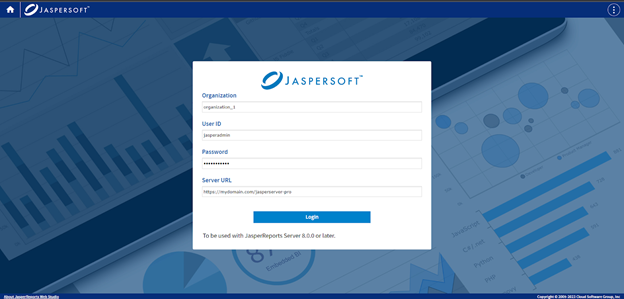
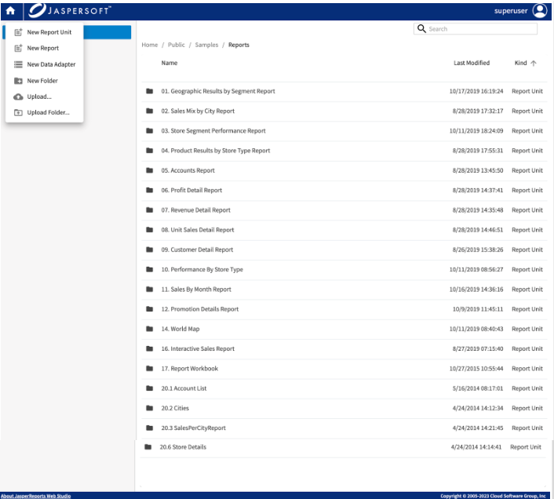

# Using JasperReports Server

One of the available buttons on the JasperReports Web Studio welcome screen allows you to connect to a JasperReports Server instance and manage the reporting resources available in its repository using specialized visual editors.

In addition to the usual JasperReports Server login credentials such as the organization/tenant ID, the user ID, and the password, you need to specify the URL of the JasperReports Server instance to connect to, as seen in the following screenshot:

!!! note

    When JasperReports Server and JasperReports Web Studio are located on different servers, due to the Web CORS and CSP rules, they should be accessed using the HTTPS protocol. In case they are on the same server and hostname, it can be either the HTTP or HTTPS protocol.

## Report Units

To create a **Report Unit**, use the **New** menu at the top left. A minimalist report unit with blank report is created. Click the report unit and use the same **New** menu to create or upload any files needed for the report unit. To edit the file, click the file. The corresponding editor opens allowing you to edit the file. If there are input controls, they appear as files next to the data source. You can change the order of input controls. To delete, use the **Delete** option from the context menu.

