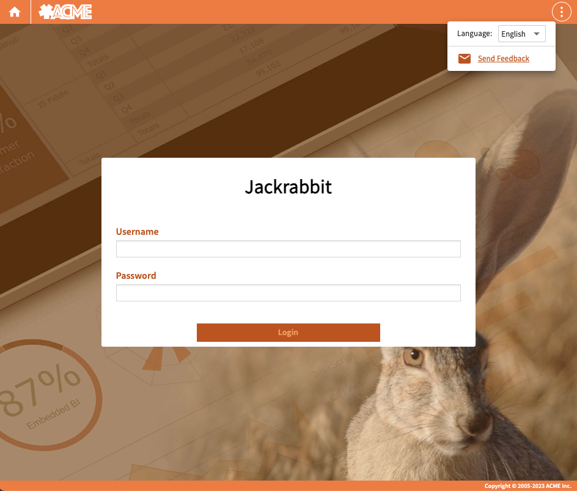

# White Labeling

This white labeling feature allows the customization of an application's front-end appearance to align with a company's brand. The feature must be supported by the license in use. A configuration file used to specify the customization options, which include:

-   the displayed name of the product.

-   the displayed company name.

-   the whole content of the About dialog.

-   the ability to provide a Cascading Stylesheet file (`css`) to override the look and feel, such as colors, fonts, backgrounds used by each page of the application.

## To create the Property file:

The configuration file used to white label JasperReports Web Studio needs to be specified in the main configuration file (`jrws.properties`) by means of the property `jrws.branding.config`. The name of the branding configuration file is arbitrary. This file does not exist by default, so you have to create it in the application's root folder.

The following table contains the list of properties that can be used for the white labeling. All the properties are optional.

<table>
<colgroup>
<col style="width: 33%" />
<col style="width: 33%" />
<col style="width: 33%" />
</colgroup>
<thead>
<tr>
<th>
Property Name
</th>
<th>
Type
</th>
<th>Description</th>
</tr>
</thead>
<tbody>
<tr>
<td>
<code>debug</code>
</td>
<td><code>boolean</code></td>
<td>If set to 1, you see all branding properties in the console, which helps verify that your branding is applied correctly.</td>
</tr>
<tr>
<td><code> product.name</code></td>
<td><code>string</code></td>
<td>The product name is used in labels like <strong>About product name</strong>.</td>
</tr>
<tr>
<td><code>company.name</code></td>
<td><code>string</code></td>
<td>The company name is used in labels such as the copyright notice in the application's lower-right corner.</td>
</tr>
<tr>
<td><code>themes. enabled</code></td>
<td><code>boolean</code></td>
<td>It enables or disables the ability to switch themes. As branding <code>css </code>typically overrides theme styles, it is recommended to disable theme switching entirely when branding is active.</td>
</tr>
<tr>
<td><code>about.enabled</code></td>
<td><code>boolean</code></td>
<td>If set to 0, this property hides the link to open the "About" dialog.</td>
</tr>
<tr>
<td><code>about.content </code></td>
<td><code>string</code></td>
<td>HTML content for the <strong>About</strong> dialog.</td>
</tr>
<tr>
<td><code>css</code></td>
<td><code>string</code></td>
<td>
The URL or the web path of a <code>css</code> file to customize the application's look.

The URLs for custom logos and other images should be specified within this CSS file. If the path is provided, it must be relative to <code>jrws/webapps/jrws-main/</code>.

example: <code>/assets/public/acme/wl_branding.css</code>.
</td>
</tr>
</tbody>
</table>

## Branding assets

There are no specific assets required for branding, if you specify a `css` file in your branding configuration, you should make it accessible. The possible way to publish these assets is to copy your assets into the `jrws/webapps/jrws-main/assets/public/` folder.

## To set a license for white labeling

1.  Go to the location where the JasperReports Web Studio zip file is extracted.

2.  Place the provided license file, `jaspersoft.jrws_wl_stats2.license`, in the local path (example, `C:\\Users\\username`) and rename it to `jaspersoft.jrws.license`.

## To Enable Branding Configuration

To enable branding, the server needs to load your specific branding configuration. This is achieved by setting the property `jrws.branding.config` to point to your configuration properties file. (i. e: `wl_branding.properties`).

Steps to Enable Branding:

1.  Open the `jrws.properties` file.

2.  Add `jrws.branding.config=${ROOT_PATH}/acme_branding.properties` to the `jrws.properties` file.

3.  Once the branding is enabled, restart the JasperReports Web Studio.

## To Verify the Branding Configuration

If you have enabled the debug property by setting `debug=1` in the branding configuration file, the properties for branding are displayed in the browser console when the home page is loaded and the front-end configuration is fetched from the server.

After verifying the branding configuration, you can see the branding results.

In this example, the **About ACME Report Editor** dialog is shown, this **About** dialog and the console displays the new brand information.

