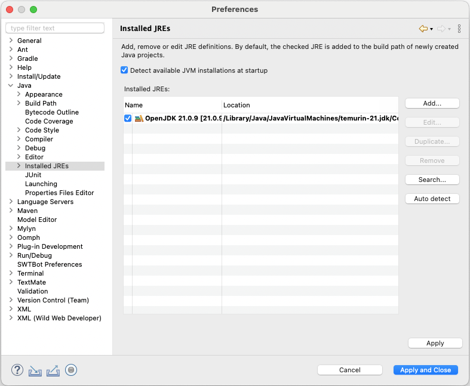
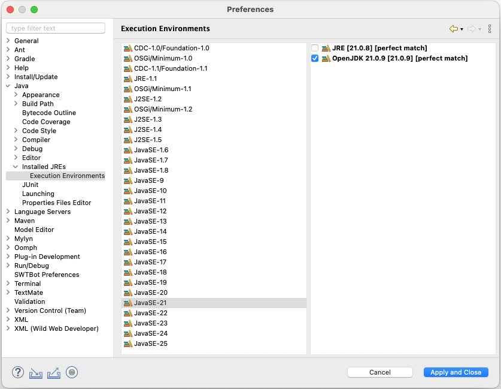
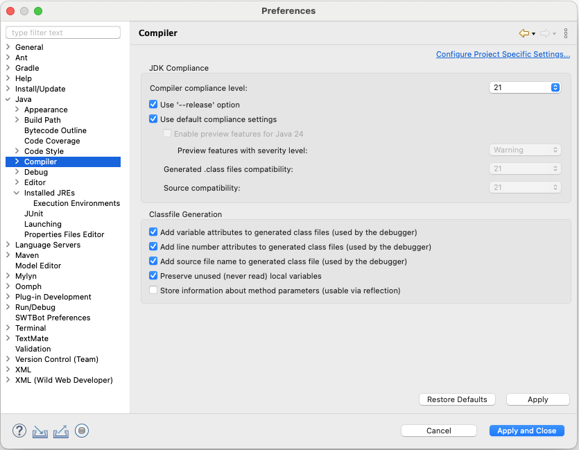
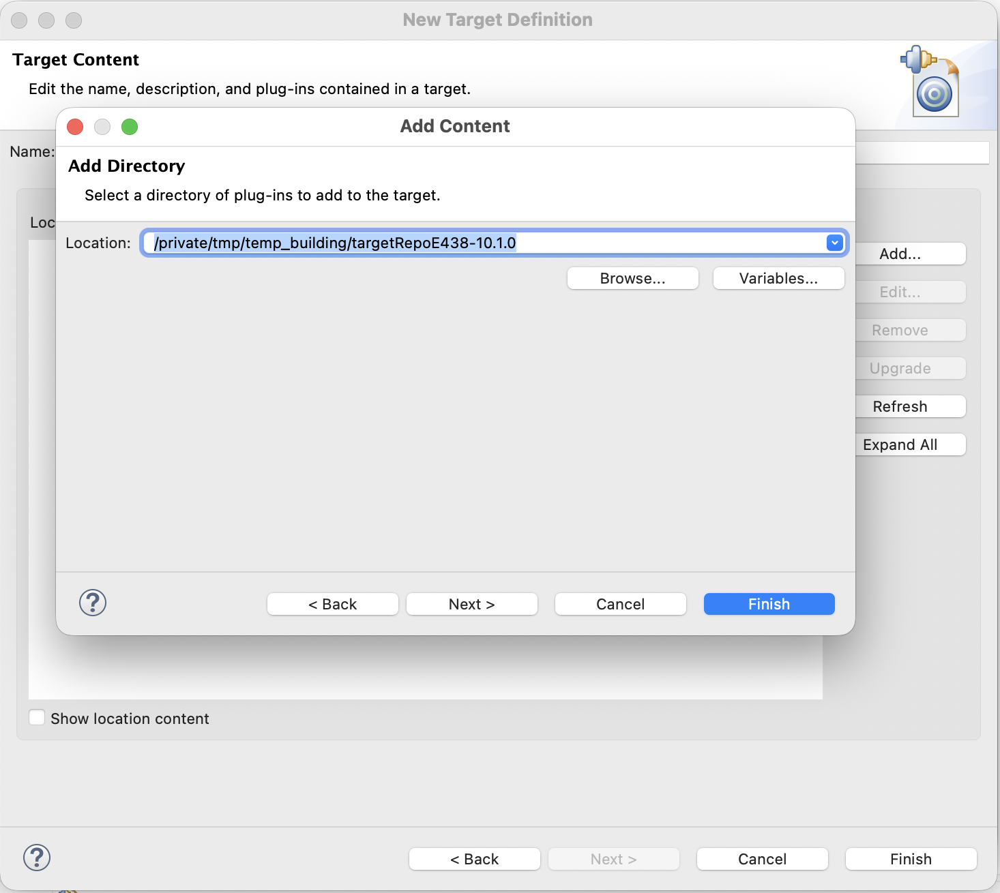
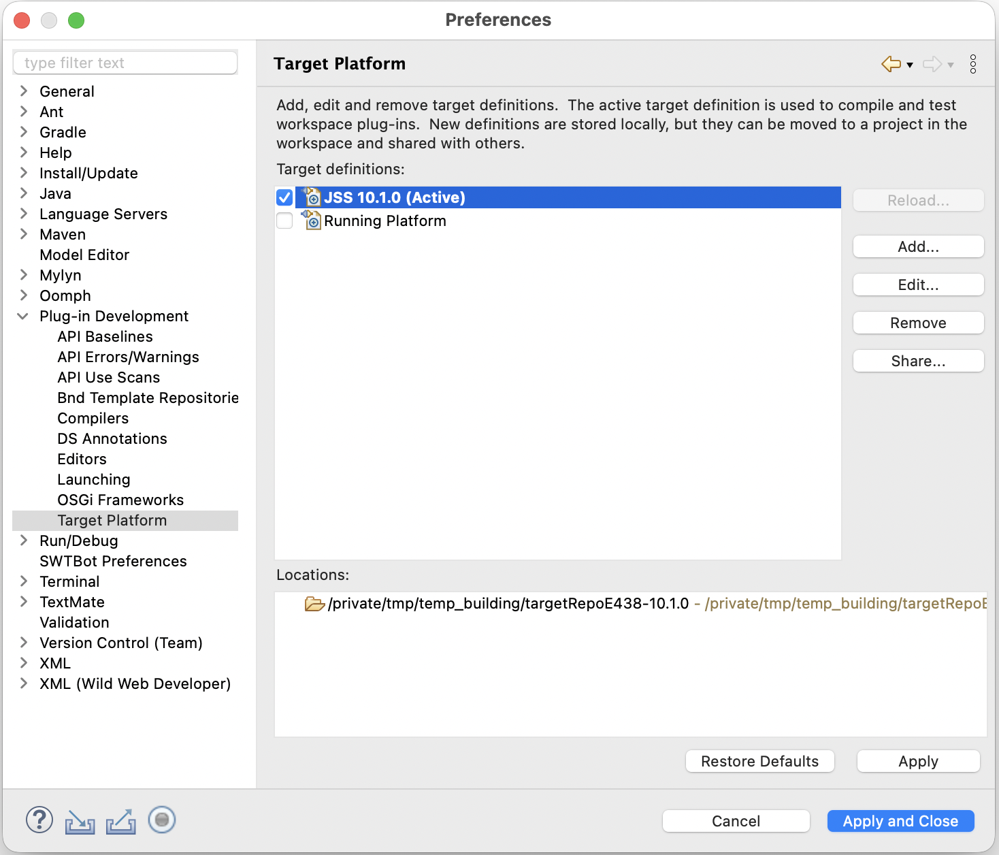
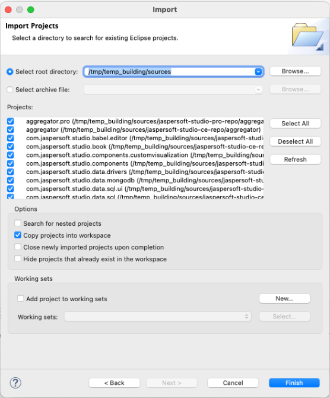
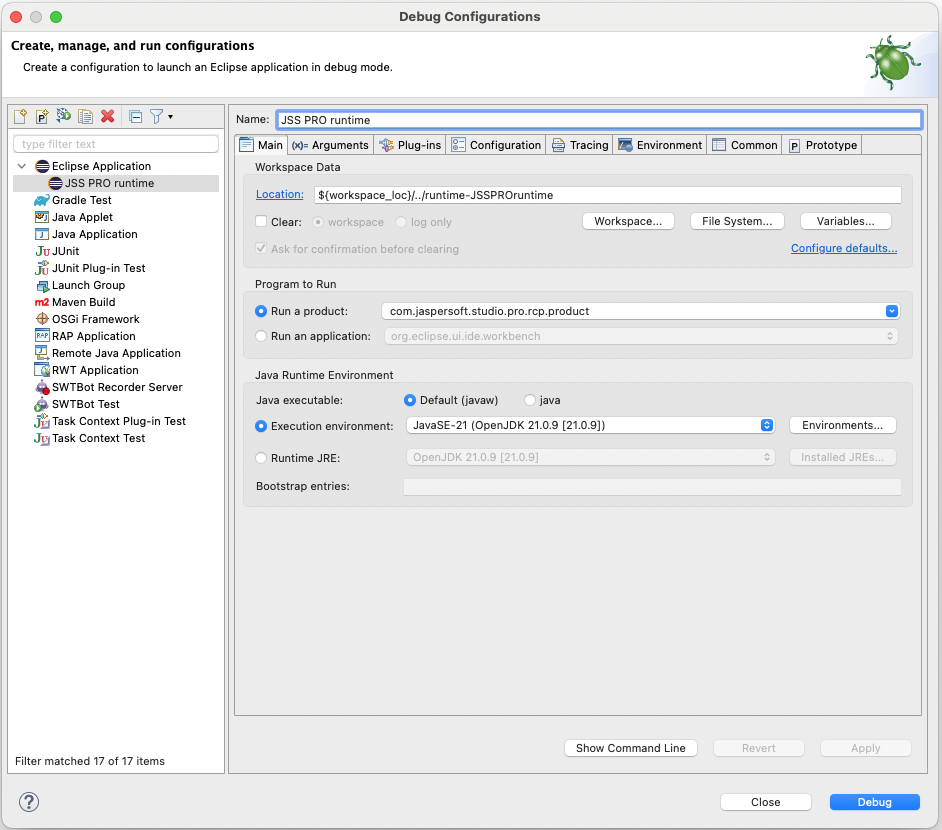
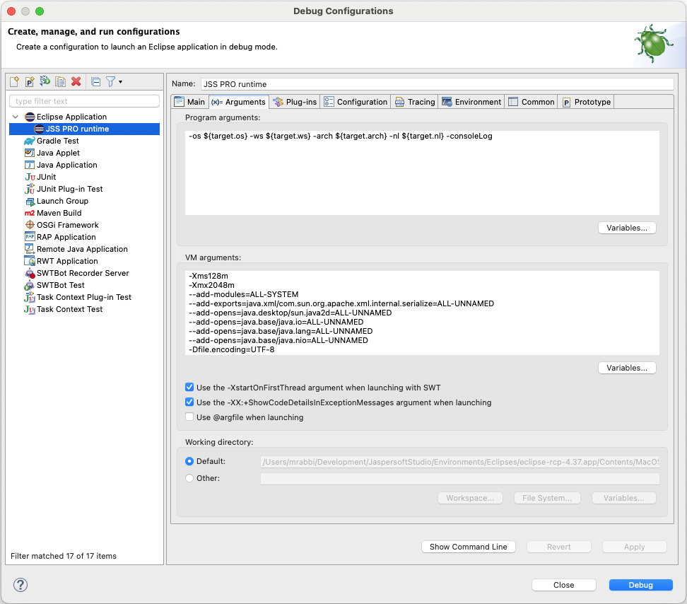

# Jaspersoft Studio Source Build

This document describes how to compile and run the Jaspersoft® Studio Professional edition from the `sources` file.

!!! note

    Version 10.1 is used as an example, but the details are also valid for newer versions.

## Zip Package Contents

The zip package named `js-jss_10.1.0_sources.zip` contains the following items:

- `jdkPackages` folder: Contains compressed files of the JDK version shipped with Jaspersoft Studio (required during the build).

- `playwrightPackages` folder: Contains compressed files of the Playwright version shipped with Jaspersoft Studio (required during the build and runtime).

- `sources` folder: Contains the source code of the Jaspersoft Studio Professional version.

- `targetRepoE438-10.1.0.zip` : Contains the target repository that can be used for both compiling in the Eclipse and building via Maven Tycho.

- `js-jss_10.1.0_license.txt` file: The current license file.

## Setting Up Eclipse and Your Workspace

To set up Eclipse and Workspace:

1.  Download the latest version of Eclipse from the website: <http://www.eclipse.org/>.<br>
    Normally, the Jaspersoft® developers use the **Eclipse IDE for a RCP and RAP developers** version.

As of the time this document's creation, Eclipse 2026-06 (version 4.40) was the most recent release.

1.  Choose a blank workspace when starting Eclipse instance.
2.  Configure the proper Java Virtual Machine (JVM) for compiling Jaspersoft Studio source code:

<!-- -->

1.  Select **Eclipse \> Preferences \> Java \> Installed JREs**. Make sure that Java 21 is in the list of items. This is because the Jaspersoft Studio source code is compatible with version 21, also the final product runs on version 21. Therefore, it is better to set it up properly (<https://adoptium.net/download/>). You could also utilize the JDK artifact that is included in the `jdkPackages` folder.



1.  Select **Eclipse \> Preferences \> Java \> Installed JREs \> Execution Environment**. Select the best compatible JVM for each execution environment (that is, Java 21).



1.  Select **Eclipse \> Preferences \> Java \> Compiler**. Change the **Compiler compliance level** to 21. The code base is compatible with Java 21.



1.  Configure the proper target platform for compiling Jaspersoft Studio source code:

<!-- -->

1.  Select **Eclipse \> Preferences \> Plug-in Development \> Target Platform**.
2.  Add a new platform starting from the **Nothing** option, then add the `targetRepoE438-10.1.0` directory containing the plug-ins and features that are the foundation for the Jaspersoft Studio platform.



1.  Select the newly created platform to compile the sources.



1.  Import the existing projects from the *sources* folder:

<!-- -->

1.  Select **File \> Import**.
2.  Select **Import (wizard) \> General \> Existing Projects into Workspace**.



1.  Configure the wizard to point to the location of the downloaded `sources` directory, then click **Finish**. It is recommended to copy the projects directly into the dedicated workspace to avoid modifying the original ones.

!!! note

    Once the import operation ends, you see the automatic build triggered.

## Setting Up Run/Debug Configuration of Jaspersoft Studio

To run/debug a version of the Jaspersoft Studio runtime from the development environment, you can create a run/debug configuration:

1.  Select **Run \> Debug Configurations \> Eclipse Application \> New** from the menu.
2.  Enter the name and select `com.jaspersoft.studio.pro.rcp.product` for **Run a product** option.
3.  Set the **Execution environment** to the Java 21 version.



1.  You can add the additional arguments and configuration parameters in the **Arguments** tab. You can also replicate the actual final product configuration using the information in the `jaspersoftstudiopro.product` file. The following example is based on the 10.1.0 configuration:

```
-Xms128m
-Xmx2048m
--add-modules=ALL-SYSTEM
--add-exports=java.xml/com.sun.org.apache.xml.internal.serialize=ALL-UNNAMED
--add-opens=java.desktop/sun.java2d=ALL-UNNAMED
--add-opens=java.base/java.io=ALL-UNNAMED
--add-opens=java.base/java.lang=ALL-UNNAMED
--add-opens=java.base/java.nio=ALL-UNNAMED
-Dfile.encoding=UTF-8
-Djava.net.preferIPv4Stack=true
-Dlog4j2.contextSelector=org.apache.logging.log4j.core.selector.BasicContextSelector
-Dplaywright.cli.dir=/tmp/temp_building/playwright-1.59.0macosx-x64/driver/mac
-Dlog4j.configurationFile=file:/tmp/temp_building/sources/jaspersoft-studio-pro-repo/aggregator.pro/ant-scripts/rootfiles/log4j2.xml
-XstartOnFirstThread
```



The `playwright.cli.dir` is added to specify the location of the Playwright installation that will be used for the HTML PRO component.

The final Jaspersoft Studio product will not require this, since the library is bundled as part of the build process.

1.  (Optional) On the Plug-ins tab, disable the option **Validate Plug-ins automatically prior to launching** to avoid the warning message associated with plug-ins/fragments/features for multiple operating systems.
2.  Click **Debug** to launch the Jaspersoft Studio runtime.

## Creating Products from Jaspersoft Studio Sources

To test the way the final product looks after export, you can leverage Maven Tycho to build Jaspersoft Studio sources.

!!! note

    - All the source projects must be in one single folder, for example, it could be the Eclipse workspace or you may copy the projects into a new dedicated folder.
    - To build the Jaspersoft Studio Professional project use the `aggregator.pro` project as main location.

1.  Make sure you have correctly installed Maven.
2.  Set up Maven properly using any of these methods.

**Method 1**

1.  Configure your Maven `settings.xml` file. You can start from the following sample `settings.xml` file:

```
<settings>
    <profiles>
        <profile>
            <id>JSSProfile</id>
        <repositories>
        <repository>
          <id>central</id>
          <name>jaspersoft-repo</name>
          <url>https://jaspersoft.jfrog.io/jaspersoft/jaspersoft-repo</url>
        </repository>
        </repositories>
            <properties>
        <!-- Local Repository with the target platform for building -->
        <targetplatform.repo>/tmp/temp_building/targetRepoE438-10.1.0</targetplatform.repo>
        <!-- JDK files location -->
        <jre.packages.location>/tmp/temp_building/jdkPackages</jre.packages.location>
        <!-- Playwright artifacts location -->
        <playwright.packages.location>/tmp/temp_building/playwrightPackages</playwright.packages.location>
        </properties>
    </profile>
    </profiles>
    <activeProfiles>
    <activeProfile>JSSProfile</activeProfile>
    </activeProfiles>
</settings>
```

1.  In the `aggregator.pro` project folder, run the following command.

```
$ mvn clean package
```

**Method 2**: In the `aggregator.pro` folder, provide all the details in one single command:

```
mvn clean package <br>
-Dmaven.repo.remote=https://jaspersoft.jfrog.io/jaspersoft/jaspersoft-repo <br>
-Dtargetplatform.repo=/tmp/temp_building/targetRepoE438-10.1.0 <br>
-Djre.packages.location=/tmp/temp_building/jdkPackages <br>
-Dplaywright.packages.location=/tmp/temp_building/playwrightPackages
```

1.  When the build is completed, you can retrieve the product artifacts from the following location:

```
<FULLWORKSPACE_PATH>/com.jaspersoft.studio.pro.rcp.product/target/products/ com.jaspersoft.studio.pro.rcp.product/
```

`FULLWORKSPACE_PATH` is the location where all the sources are located including an Eclipse workspace folder.

1.  To properly package the previously created raw artifacts, perform the following steps:

<!-- -->

1.  Select the subfolder `ant-scripts` from `aggregator.pro` project as a current location.
2.  Run the following command using ANT:

```
ant -buildfile packageRawDistributions.xml -Djre.packages.location=/tmp/temp_building/jdkPackages -Dplaywright.packages.location=/tmp/temp_building/playwrightPackages
```

1.  The zipped artifacts are found in the `product/dist` project subfolder.

## Troubleshooting Jaspersoft Studio Development Environment Setup

Depending on the environment configuration, you might experience these common issues:

- Build errors

  - Issue: Sometimes after importing sources, the two projects, `com.jaspersoft.studio.data.sql` and `com.jaspersoft.studio.editor.jrexpressions` may fail to build correctly.

  - Solution: Create a new folder named `xtend-gen` inside both the project directories. This allows the compilation of these plug-in projects and their associated UI components to complete successfully.

- Workspace errors via Javadoc API references

  - Issue: The Problems view displays numerous errors across various imported projects, mostly related to Javadoc API references.

  - Solution: Navigate to **Preferences \> Java \> Compiler \> Errors/Warnings**. Under the **Deprecated and restricted API** section, change **Forbidden reference (access rules)** to **Warning**.

- Logging configuration and plugin startup issues

  - Issue: Errors occur when expanding or modifying the logging setup configuration.

  - Solution: Manually match the plugin startup-level configurations to the final product. Update the following bundles in your dedicated runtime configuration:

    ``` text
    - org.apache.aries.spifly.dynamic.bundle 2 / true
    - org.apache.felix.scr 2 / true
    - org.apache.logging.log4j.api 2 / true
    - org.apache.logging.log4j.slf4j2.impl 2 / true
    - org.eclipse.equinox.common 2 / true
    - org.eclipse.equinox.event 2 / true
    - org.eclipse.equinox.simpleconfigurator 1 / true
    - org.eclipse.osgi 1 / true
    ```

### Additional information

For any further information, contact the Jaspersoft Studio team.
