# Adding a Multi-Lingual Static List to an Input Control

The server provides linguistic support for the list of values that these input control can present to users:

-   Single-select list of values

-   Single-select list of values (radio)

-   Multi-select list of values

-   Multi-select list of values (check box)

    The following example shows how to localize an input control that presents a single-select list of values. These tasks are explained step-by-step:

-   Add a multi-lingual static list of values to a list input control.

-   Create a new resource bundle for the French translations.

-   Upload the French resource bundle.

-   Create a new resource bundle for the English translations.

-   Replace the existing English resource bundle with the new one.

-   Remove unwanted parameters from the sample report design.

-   Run the report that uses a multi-lingual list of values in an input control.

    To add a multi-lingual static list of values to a list input control

    1.  Log into the server as administrator and add a folder named Temp to the repository.
    2.  Locate the report named 11. Sales By Month Report in the **Samples &gt; Reports ** folder of the repository. Select it and click **Copy**.
    3.  Navigate to the **Temp** folder and choose **Paste** from the menu at the top of the repository. The Sales By Month report appears in the Temp folder.
    4.  Right-click the report and select **Edit**. The JasperReport wizard appears.
    5.  Click **Controls & Resources**.
    6.  Click **Add Input Control...**.
    7.  In Locate Input Control, select **Define an Input Control in the next step** and click **Next**.
    8.  On the Create Input Control page, perform the following tasks:

    -   From the Type drop-down menu, select **Single-select List of Values**.

    -   In the Prompt Text field, enter `$R{department_multi}`.

        In “A $R Expression in the Prompt Text Field”, the `$R` expression is in the **Prompt Text** field.

        |  |
        |----|
        | 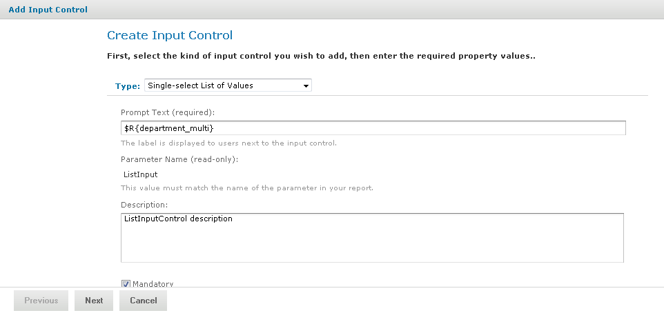 |
        | A $R Expression in the Prompt Text Field |

    -   In the Parameter Name field, enter `ListInput`.

    -   Click the **Mandatory** and **Visible** checkboxes.

        1.  Click **Next**.
        2.  On the Locate List of Values page, click **Next**. The Add List of Values page appears.
        3.  On the Add List of Values page, perform the following tasks:

    -   Enter the name List of Values label.

    -   Add these name-value pairs:

        | Name               | Value |
        |--------------------|-------|
        | `$R{department_1}` | 1     |
        | `$R{department_2}` | 2     |
        | `$R{department_3}` | 3     |

        “The Revised List of Values Containing $R Expressions” shows the edited list of values containing the `$R` expressions in the name fields.

        |  |
        |----|
        | 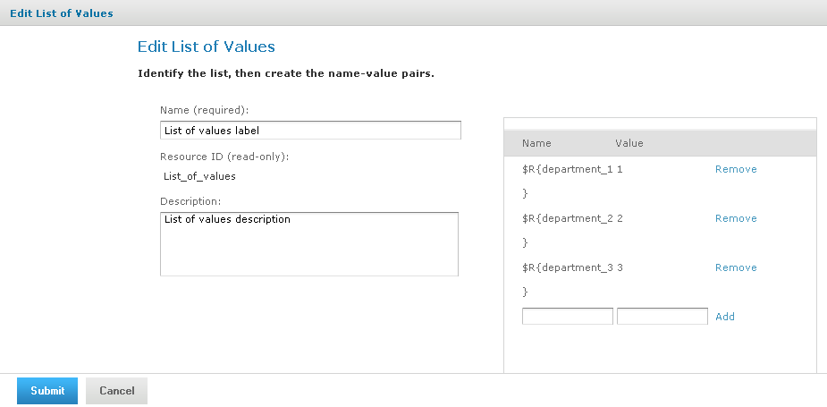 |
        | The Revised List of Values Containing $R Expressions |

        1.  Click **Submit**. The Controls & Resources page shows the new input control prompt, `$R{department_multi}`.
        2.  Click **Submit** again to save your work.

        To create a new resource bundle for the French translations

        1.  In a text editor, create a new file for French translations and enter these name-value pairs for the input control:

            <table>
            <colgroup>
            <col style="width: 100%" />
            </colgroup>
            <tbody>
            <tr>
            <td>
<pre><code>department_multi=Choisir le service
            department_1 = Travail # 1
            department_2 = Travail # 2
            department_3 = Travail # 3</code></pre>
</td>
            </tr>
            </tbody>
            </table>

        2.  At the bottom of the file, enter these field and property translations to localize the report:

            <table>
            <colgroup>
            <col style="width: 100%" />
            </colgroup>
            <tbody>
            <tr>
            <td>
<pre><code>title=Rapport de ventes mensuelles
            sales.person=Commercial
            sales.account=Compte
            sales.amount=Montant
            param.list=Liste Détaillée</code></pre>
</td>
            </tr>
            </tbody>
            </table>

        3.  Save the file as `sales_fr.properties` to your hard drive.

        To upload the French resource bundle

        1.  Assuming you are still logged into the server, select the Sales By Month report and click **Edit**.

        2.  On the Controls & Resources page, click **Add Resource**.

        3.  Select **Upload a Local File**, click **Browse**, and locate the sales_fr.properties file on your hard drive. Select the file, and click **Open**.

        4.  In Locate File Resource, click **Next**.

            On the Add a Report Resource page, sales_fr.properties appears as the Selected Resource, indicating that the server automatically detected it as a resource bundle.

        5.  On the Add a Report Resource page, enter this information:

    -   Name – `sales_fr.properties`

    -   Resource ID – `sales_fr.properties`

        1.  Click **Next**. The Controls & Resources page appears.

        To create a new resource bundle for the English translations

        1.  In a text editor, create a new file for English translations and enter these input control name-value pairs in the file:

            <table>
            <colgroup>
            <col style="width: 100%" />
            </colgroup>
            <tbody>
            <tr>
            <td>
<pre><code>department_multi=Select Department
            department_1=Work #1
            department_2=Work #2
            department_3=Work #3</code></pre>
</td>
            </tr>
            </tbody>
            </table>

        2.  At the bottom of the file, enter these field and property translations to localize the report:

            <table>
            <colgroup>
            <col style="width: 100%" />
            </colgroup>
            <tbody>
            <tr>
            <td>
<pre><code>title=Sales By Month Report
            sales.person=Sales person
            sales.account=Account
            sales.amount=Amount
            param.list=List item</code></pre>
</td>
            </tr>
            </tbody>
            </table>

        3.  Save the file as `sales.properties` to your hard drive.

        To replace the English resource bundle in the repository with the new one

        1.  Assuming you are still logged into the server and editing the Sales By Month report, remove the old sales.properties resource bundle:

            1.  On the Controls & Resources page select sales.properties.
            2.  Click **Remove**.

        2.  Click **Add Resource**.

        3.  On the Locate File Resource page, select **Upload a Local File**, click **Browse**, and locate the new sales.properties file that you created in the previous procedure. Click **Open**.

        4.  Click **Next**.

            On the Add a Report Resource page, sales.properties appears as the Selected Resource, indicating that the server automatically detected it as a resource bundle.

        5.  On the Add a Report Resource page enter this information:

    -   Name – `sales.properties`

    -   Resource ID – `sales.properties`

        1.  Click **Next**.
        2.  On Controls & Resources click **Submit**.

        At this point, the report does not run because the sales.properties file does not contain name-value pairs for all parameters that the JRXML defines. In the next procedure, you remove these parameters from the report.

        To remove unwanted parameters from the sample report design

        This procedure assumes you finished procedures in Adding Multi-lingual Prompts to Input Controls and are connected to the server from iReport using the JasperReports Server Plug-in. In this procedure, you remove elements in the title band that list parameter names and settings in the report output header.

        1.  In the Repository Navigator, expand the Temp and Sales By Month Report folders, then double-click  Sales By Month Jasper Report.

            The JRXML report appears in the Designer tab.

        2.  Ctrl-click to select all elements in the title band except `$R{title}`, `$R{param.list}`, and `$P{ListInput}`.

            In Selecting Elements to Remove from the Title Band, the selected elements are in the title band.

            |  |
            |----|
            | 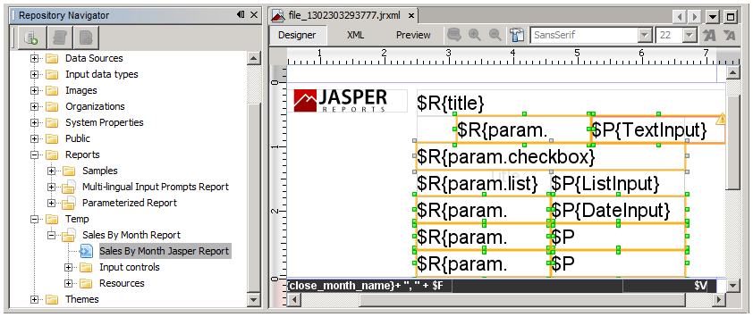 |
            | Selecting Elements to Remove from the Title Band |

        3.  Right-click an empty area in the Designer tab, and choose Delete. If you have empty elements after the last step, delete them.

            In “Elements Remaining in the Title Band”, the remaining elements are displayed.

            |  |
            |----|
            | 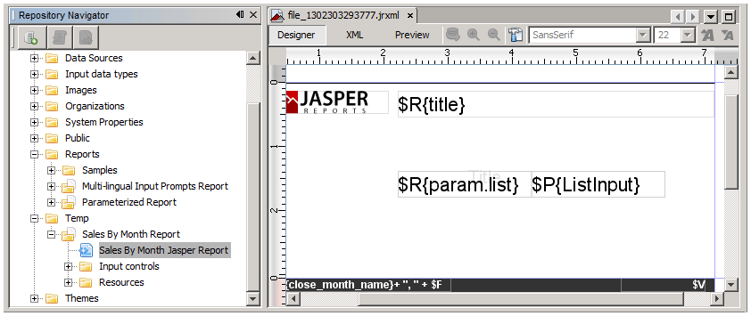 |
            | Elements Remaining in the Title Band |

            There’s too much white space in the title band.

        4.  To remove excess white space:

            1.  Drag a selection box around the `$R{param.list}` and `$P{ListInput}` elements.
            2.  Press the **Arrow** key on the keyboard to move the elements upward.
            3.  Drag the bottom margin of the title band upward to reduce its height.

        5.  Remove the actual parameters from the report:

            1.  Choose **Window &gt; Report Inspector.**
            2.  In the Report Inspector, expand Parameters, scroll to the bottom of the parameter list, and Ctrl-click to select these parameters:

        -   TextInput

        -   CheckboxInput

        -   DateInput

        -   QueryInput

        -   LoggedInUser

            1.  Right-click the selected parameters and select **Delete**.

                |  |
                |----|
                | 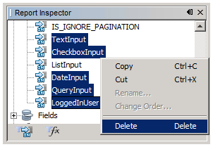 |
                | Deleting Unwanted Parameters From the JRXML |

            2.  Click **Yes** to confirm that you want to delete the items.

            3.  From iReport, remove the input control resources from the report unit in the repository.

                1.  In the Repository Navigator, expand Input Controls in the report unit Sales By Month Report.

                    |  |
                    |----|
                    | 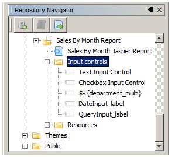 |
                    | Expanding the Input Controls Folder |

                2.  Ctrl-click to select these input control resources:

        -   Text Input Control

        -   Checkbox Input Control

        -   DateInput_label

        -   QueryInput_label

1.  Right-click the selected resources and click **Delete**

    Answer **Yes** to each prompt to confirm the deletion of the resource.

2.  Right-click the Sales By Month Jasper Report JRXML, and choose **Replace with Current Document**.

    |  |
    |----|
    | 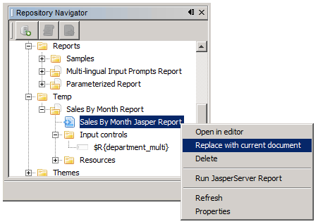 |
    | Saving the Modified JRXML to the Repository from iReport |

3.  Click **Yes** when asked if you want to save the file before sending its content to the server.

4.  Click **View &gt; Repository**, navigate to the Temp folder, and select the Sales By Month Report. Click **Edit.**

In “Controls & Resources Listing Only One Input Control”, the JasperReport wizard on the server, only one input control remains in the report.

|  |
|----|
| 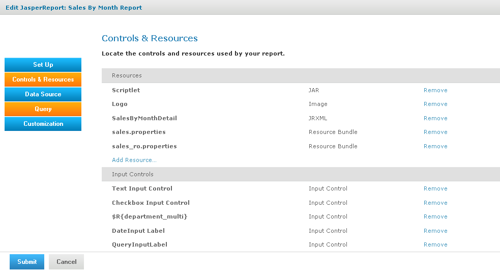 |
| Controls & Resources Listing Only One Input Control |

To run the report that uses a multi-lingual list of values

1.  Click LogOut. On the server login page, click **Show locale & time zone**, select the **en_US-English (United States)** locale, and log into the server as an administrator.

2.  Navigate to the Temp folder of the repository, and click the name of the Sales By Month Report to run the report.

    The report viewer presents the report using English field and property names in the report.

3.  Click **Options**, and select the drop-down.

    The prompt and list of values appear in English, as shown in A List of Values in English and French.

4.  Logout, on the server login page, click **Show locale & time zone**, select the **fr_French** locale, and log into the server as an administrator.

5.  Navigate to the **Temp** folder of the repository, and click the name of the Sales By Month Report to run the report.

    In “Viewing Report Output for the French Locale”, the report output displays: the French report title, field, and property names defined in the resource bundle. The server formats the currency using a comma instead of a decimal point to separate Euro cents from dollars. Translation packs and resource bundles installed with the server for the French locale are used to format currency and dates and to translate web interface components.

    |  |
    |----|
    | 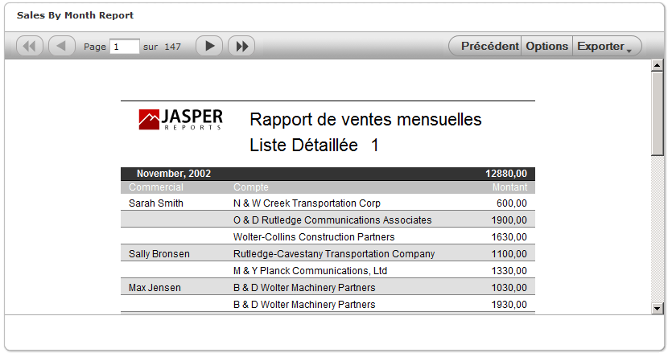 |
    | Viewing Report Output for the French Locale |

6.  Click **Options**, and select the drop-down. The input control prompt and static list of values appears in French.

In “A List of Values in English and French”, you can see the input control prompt and static list of values in English and in French.

|  |
|----|
| 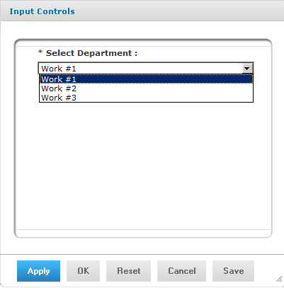     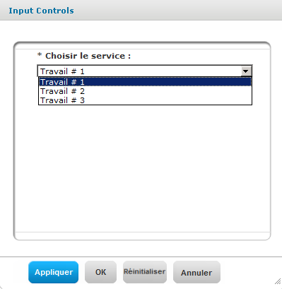 |
| A List of Values in English and French |
