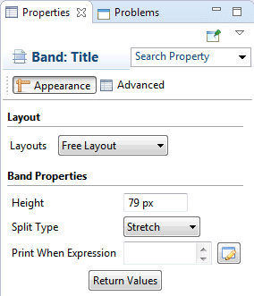
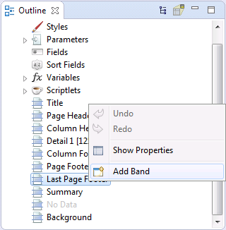
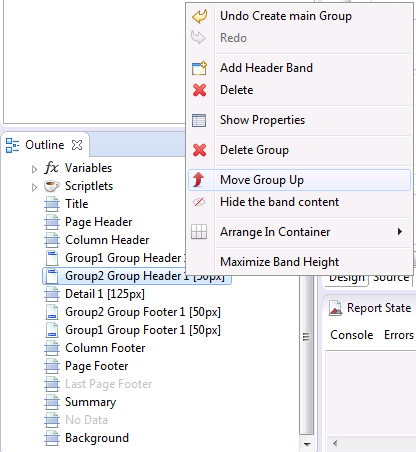

# Bands and Groups

You design a report using the Design tab, which is divided into different horizontal portions, named bands, where you can place report elements. When the report design is combined with the data to generate the print, each band is printed multiple times based on its function (and according to the rules that the report designer has set). For instance, the page header is repeated at the beginning of every page, while the detail band is repeated for each record.

Jaspersoft Studio provides a graphical interface for creating JRXML files. The layout is visual, so you can ignore the underlying structure of the JRXML. You can specify the precise page locations of different types of text and data, such as title, footers, detailed records, groups, and summary information. Some portions of a page defined in this way are reused, others stretch to fit the content, and so on. Additional tools let you add charts and subreports, set up an optional query retrieve data out of a data source, and more.

This chapter has the following sections:

- Understanding Bands
- Modifying Bands
- Working with Groups
- Other Group Options

## Understanding Bands

The Design tab is divided into nine predefined bands to which new groups are added. In addition, Jaspersoft Studio manages a heading band (group header) and a recapitulation band (group footer) for every group.

A band is as wide as the page width (right and left margins excluded). However, its height, even if it is established during the design phase, can vary during print creation according to the contained elements; it can “lengthen” toward the bottom of a page in an arbitrary way. This typically occurs when bands contain subreports or text fields that have to adapt to the content vertically. Generally, the height specified by the user should be considered “the minimal height” of the band. Not all bands can be stretched dynamically according to content; in particular the column footer, page footer, and last page footer bands are statically sized.

The sum of all band heights (except for the background) has to always be less than or equal to the page height minus the top and bottom margins.

### Band Types

The following table contains brief descriptions of the available bands:

| Band Name | Description |
|----|----|
| Title | The title band is the first visible band. It is created only once and can be printed on a separate page. It is not possible during design to exceed the report page height (top and bottom margins are included). If the title is printed on a separate page, this band height is not included in the calculation of the total sum of all band heights. |
| Page Header | The page header band allows you to define a page header. The height specified during the design phase usually does not change during the creation process, except for the insertion of vertically resizable components such as text fields. The page header appears on all printed pages in the position defined during the design phase. Title and summary bands do not include the page header when printed on a separate page. |
| Column Header | The column header band is printed at the beginning of each detail column. Usually labels containing the column names of a tabular report are inserted in this band. |
| Group Header | A report can contains zero or more group bands which permit the collection of detail records in real groups. A group header is always accompanied by a group footer (both can be independently visible or not). Different properties are associated with a group. They determine its behavior from the graphic point of view. It is possible to always force a group header on a new page or in a new column and to print this band on all pages if the bands below it overflow the single page (as a page header, but at group level). It is possible to fix a minimum height required to print a group header: if it exceeds this height, the group header band is printed on a new page (please note that a value too large for this property can create an infinite loop during printing). |
| Group Footer | The group footer band completes a group. Usually it contains fields to view subtotals or separation graphic elements, such as lines. |
| Column Footer | The column footer band appears on at the end of every column. Its dimension are not resizable at run time (not even if it contains resizable elements such as subreports or text fields with a variable number of text lines). |
| Page Footer | The page footer band appears on every page where there is a page header. Like the column footer, it is not resizable at run time. |
| Last Page Footer | If you want to make the last page footer different from the other footers, it is possible to use the special last page footer band. If the band height is 0, it is completely ignored, and the layout established for the common page is used for the last page. |
| Summary | The summary band allows you to insert fields containing total calculations, means, or any other information you want to include at the end of the report. |
| No Data | The no data band replaces the entire report if the data source does not contain any records and if, at the document level, the property `When No Data Type `is set to `No Data Section`. |
| Background | The background enables you to create watermarks and similar effects, such as a frame around the whole page. It can have a maximum height equal to the page height. |

## Modifying Bands

JasperReports divides a report into nine main bands and a background (plus the special No Data band). To this set of standard bands you can add two supplemental bands for each group: the Group Header band and the Group Footer band.

When you select a band in the report outline view, the band properties are displayed in the property sheet.

|                                                               |
|---------------------------------------------------------------|
|  |
| Band properties                                               |

The band height represents the height of the band at design time. If the content of the band expands vertically (for example, due to a subreport), the band increases in height accordingly during report execution. The band height is expressed in pixels (always using the same resolution of 72 pixels per inch). You can set the height with the property sheet or by dragging the bottom border of the band directly into the designer window.

!!! note

    Consecutive zero-height bands may become obscured while working in the design panel. You can increase the height of a selected band by pressing the Shift key while dragging the bottom margin of the band down.

The `Print When Expression` property is used to hide or display the band under the circumstances described by the expression. The expression must return a Boolean value. In particular, it must return true to display the band and false to hide it. By default, when no value is defined for the expression, the band is displayed.

JasperReports reserves enough space in a page for bands like the title, the page header and footer and the column header and footer. All the other bands cannot fit in the remaining space when repeated several times. This may result in a Detail band beginning in one page and ending on another page.

The default report template includes all the pre-defined bands, except the Last Page Footer and the No Data bands. If you are not interested in using a band, you can remove it by right-clicking the band (or the band node in the outline view) and selecting the menu item **Delete Band**. When a band is no longer present in the report, it is displayed as a grayed node. To add the band to the report, right-click the band and select **Add Band**.

|                                                 |
|-------------------------------------------------|
|  |
| Adding a pre-defined band                       |

In general, there is no valid reason to remove a band apart the generation of a less complex jrxml file (the report source code). In order to prevent the printing of a band, set its height to 0. The only exceptions are the Last Page Footer and No Data bands.

If present, the Last Page Footer band always replaces the Page Footer band in the last page, so if we don’t want or need this behavior the band must be not present. The No Data band is a very special band that replaces the entire report if the data source does not contain any records and if, at the document level, the property `When No Data Type `has been set to `No Data Section`.

## Working with Groups

Groups allow you to organize the records of a report in order to create some structures. A group is defined through an expression. JasperReports evaluates this expression thus: a new group begins when the expression value changes. An expression may be represented just by a specific field (that is, you may want to group a set of contacts by city, or country), but it can be more complex as well. For example, you may want to group a set of contact names by initial letter.

Each group can have one or more header and one or more footer bands. Group headers and footers are printed just before and after the Detail band. You can define an arbitrary number of groups (that is, you can have a first-level group that contains contacts by Country and a nested group containing the contacts in each country by City).

The order of the groups in the Report Inspector determines the groups’ nesting order. The group order can be changed by right-clicking a group node (header or footer) and selecting the **Move Group Up** or **Move Group Down** menu items.

|                                                                     |
|---------------------------------------------------------------------|
|  |
| Changing the groups order                                           |

JasperReports groups records by evaluating the group expression. Every time the expression's value changes, a new group instance is created. The engine does not perform any record sorting if not explicitly requested, so when we define groups we should always provide for the sorting. For instance, if we want to group a set of addresses by country, we have to sort the records before running the report. We can use a SQL query with an `ORDER BY` clause or, when this is not possible (that is, when obtaining the records from a data source which does not provide a way to sort the records, like an XML document or an Excel file), we can request that JasperReports sort the data for us. This can be done using the sort options available in the Jaspersoft Studio query window.

|                 |
|-----------------|
|                 |
| Sorting Options |

In order to use the Sort options, you must have some fields already registered in the report. Sorting can only be performed on fields (you cannot sort records using an expression). You can define a sort using any of the fields in the database. Each field can use a different sort type (ascending or descending). The sorting is performed in memory, so it’s use is discouraged if you are working with very large amounts of data, but it is useful with a reasonable number of records (depending on the available memory).

Let’s see how groups work in an example. Suppose you have a list of people. You want to create a report where the names of the people are grouped last-name-first as in a phone book. Run Jaspersoft Studio and open a new empty report. Next, take the data from a database by using a SQL query with a proper `ORDER BY` clause (we will use the sample database provided with JasperReports). For this example, use the following SQL query:

`SELECT * FROM ADDRESS ORDER BY LASTNAME, FIRSTNAME`

The selected records will be ordered according to the last then first name of the customers. The fields selected by the query should be `ID`, `FIRSTNAME`, `LASTNAME`, `STREET` and `CITY`.

|                                       |
|---------------------------------------|
|                                       |
| Dragging a field into the Detail band |

Before continuing with creating your group, make sure that everything works correctly by inserting in the Detail band the `FIRSTNAME`, `STREET` and `CITY` fields (move them from the outline view to the Detail band).

Then create a layout and preview the report.

|                                 |
|---------------------------------|
|                                 |
| Layout before adding the groups |

The result should be similar to that of Figure 7‑8.

|                           |
|---------------------------|
|                           |
| The addresses not grouped |

What we have is just a simple flat report showing an ordered list of addresses. Let’s proceed to group the records by the first letter of the last name. The first letter of the name can be extracted with a simple expression (both in Groovy and JavaScript). Here is:

`$F{LASTNAME}.charAt(0)`

If you use Groovy or JavaScript as suggested, remember to set it in the document properties

To add the new group to the report, select the document root node in the outline view and select the **Add Report Group** menu item (Figure 7‑10).

|                  |
|------------------|
|                  |
| Add Report Group |

This opens a simple wizard. Use it to set the group name (that is, `First_Letter`) and add the expression that extracts the first letter from a string.

|                                        |
|----------------------------------------|
|                                        |
| The first step of the new group wizard |

In the second step we have the option of creating header and footer bands for the group. Select both and click **Finish** to complete the group creation.

|                                         |
|-----------------------------------------|
|                                         |
| The second step of the new group wizard |

The new two bands (Group Header and Group Footer) will appear in the design window, and the corresponding nodes will be added to the report structure in the outline view.

|                                         |
|-----------------------------------------|
|                                         |
| The new group bands in the design panel |

When you add a group to the document, Jaspersoft Studio creates an instance of the built-in variable `<group name>_COUNT` for the new group. In our case, the variable is named `First_Letter_COUNT`. It represents the number of records processed for the group; if we display this variable in a textfield in the group footer, it will display how many records the group contains.

|                               |
|-------------------------------|
|                               |
| The group in the outline view |

Now we can add some content to the group header and footer. In particular, we can add the initial letter to which the group refers, and we can add in the footer the `First_Letter_COUNT` variable. For the letter, just add a Textfield in the group header and use the same textfield expression as you did for the group. The textfield class can be set to `String` (because we are using Groovy or JavaScript). If you use Java, the expression for the textfield should be changed a little bit. Java is a bit more severe in terms of type matching, and since the `charAt()` function returns a char, we can convert this value in a String by concatenating an empty string. (This is actually a dirty but simple way to cast any Java object in a String without checking if the object is null). So the expression in Java should be:

`“” +$F{LASTNAME}.charAt(0)`

|              |
|--------------|
|              |
| Final Layout |

The blue field (in the group footer) displays the variable `First_Letter_COUNT` that we created by dragging this variable from the outline view into Group Footer band. If we want to display the same value in the group header, we need to change the textfield evaluation time to `Group` and set the evaluation group to `First_Letter`.

|                  |
|------------------|
|                  |
| The final result |

## Other Group Options

In the previous example, we learned how to create a group using the group wizard, we set the group name, and we set the group expression. There are many other options that you can set to control how a group is displayed. By selecting a group band in the outline view (header or footer), in the property sheet you will see all these options:

|               |
|---------------|
|               |
| Group Options |

<table>
<colgroup>
<col style="width: 50%" />
<col style="width: 50%" />
</colgroup>
<thead>
<tr>
<th>
Group Options
</th>
<th>
Description
</th>
</tr>
</thead>
<tbody>
<tr>
<td>
Group Expression
</td>
<td>
This is the expression that JasperReports will evaluate against each record. When the expression changes in value, a new group is created. If this expression is empty, it is equal to null, and since a null expression will never change in value, the result is a single group header and a single group footer, respectively, after the first column header and before the last column footer.
</td>
</tr>
<tr>
<td>
Start on a New Column
</td>
<td>
If this option is selected, it forces a column break at the end of the group (that is, at the beginning of a new group); if in the report there is only one column, a column break becomes a page break.
</td>
</tr>
<tr>
<td>
Start on a New Page
</td>
<td>
If this option is selected, it forces a page break at the end of the group (that is, at the beginning of a new group).
</td>
</tr>
<tr>
<td>
Reset Page Number
</td>
<td>
This option resets the number of pages at the beginning of a new group.
</td>
</tr>
<tr>
<td>
Reprint header
</td>
<td>
If this option is selected, it prints the Group Header band on all the pages on which the group’s content is printed (if the content requires more than one page for the printed report).
</td>
</tr>
<tr>
<td>Min Height to Start New Page</td>
<td>If the value is other than 0, JasperReports will start to print this group on a new page if the space remaining on the current page is less than the minimum specified. This option is usually used to avoid splitting a report section composed of fields that we want to remain together (such as a title followed by the text of a paragraph).</td>
</tr>
<tr>
<td>Footer Position</td>
<td>
This option controls where to place the footer bands. By default they are placed just after the end of the group (without leaving any space before the previous band). This behavior can be changed, the available options are:

Stack At Bottom The group footer section is rendered at bottom of the current page, provided that an inner group having this value would force outer group footers to stack at the bottom of the current page, regardless of the outer group footer setting.

Force At Bottom The group footer section is rendered at bottom of the current page, provided that an inner group having this value would render its footer right at the bottom of the page, forcing the outer group footers to render on the next page.

Collate At Bottom The group footer section is rendered at bottom of the current page, provided that the outer footers have a similar footer display option to render at the page bottom as well, because otherwise...
</td>
</tr>
<tr>
<td>Keep Together</td>
<td>This flag is used to prevent the group from splitting across two pages or columns, but only on the first break attempt.</td>
</tr>
</tbody>
</table>
