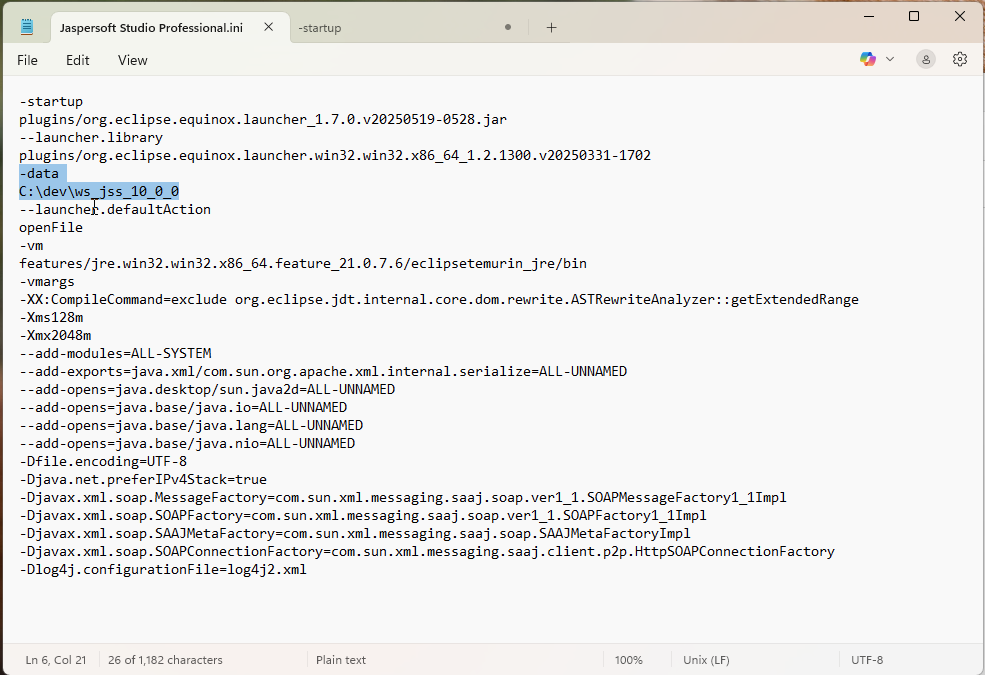
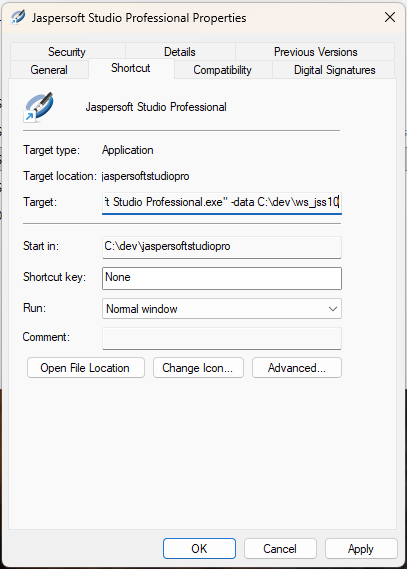
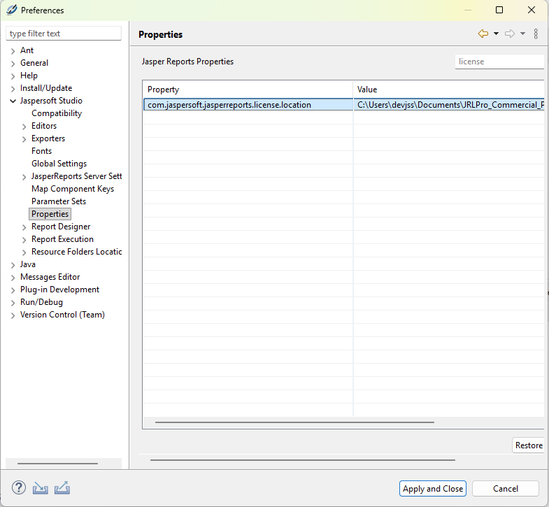

# Changes in 10.0.0 That May Affect Your Upgrade

Starting Jaspersoft Studio 10.0.0, the underlying Eclipse platform is upgraded to version 4.36, therefore, moving to Java 21 was necessary. As a result, we now include Eclipse Temurin JRE version 21.0.7.6.

With this update, Jaspersoft Studio Professional now features a new license manager and supports the latest JRXML format (version 7). The standard license file is renamed to `jaspersoft.jss.license`.

Following are the recommendations for smooth migration and stability:

1.  To ensure stability when moving between Jaspersoft Studio versions, set up unique environments for each. Reusing the default `JaspersoftWorkspace` folder in the `Home` directory can potentially cause conflicts or issues. The best practice is to always back up your "main" workspace first.

    !!! note

        To prevent accidental loss of JRXML and other resources, you can use the GIT plug-in to version projects inside your workspace. This also enables easy restoration of previous file versions.

    Then, set up each instance of Jaspersoft Studio to run with its own dedicated workspace. This change can be implemented using one of two methods:

    1.  Modify the `-data` flag within the `.ini` configuration file located in the installation folder.

        

    2.  Create a custom shortcut and append the `-data <PATH>` suffix to the target field.

        

2.  To avoid unusual errors related to licensing, properly set up your provided license (for 9.x or 10.x versions) using the **License Manager** menu item. This ensures the correct license file is linked to each specific version and workspace.

    You can easily verify the setup by checking the `com.jaspersoft.jasperreports.license.location` property in the **Preferences** dialog.

    

3.  Interaction with JasperReports Server will now trigger a warning dialog regarding the new JRXML 7 format.

    

    This dialog reminds users that when connecting to older server versions, they may need to manually specify the correct JRXML version in the connection settings for specific use cases.

    

    You can disable this message in the Jaspersoft Studio **Preferences** dialog.

    
