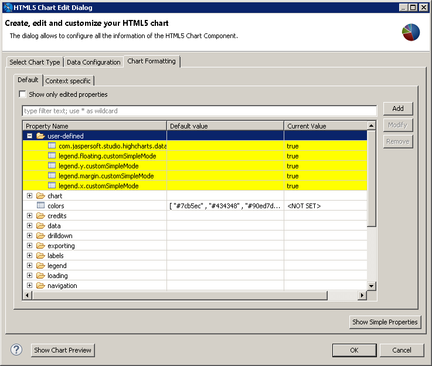
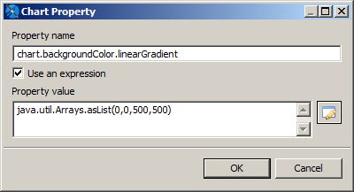
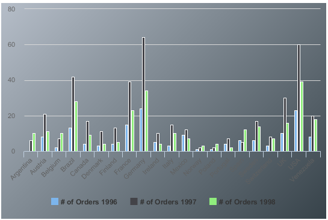

# Advanced Formatting of HTML5 Charts

You can set some basic element properties for an HTML5 chart, such as position or evaluation time, in the **Chart Formatting** tab of the **Edit HTML5 Charts Dialog**. You can also view and set all available properties, including those not exposed as simple properties, by clicking **Show Advanced Properties**. Properties that differ from the defaults are highlighted in yellow.

|  |
|----|
|  |
| *Figure 1: Advanced properties for formatting HTML5 charts* |

!!! note

    You can set a subset of properties for an Ad Hoc chart in Jaspersoft Studio, using the **Chart Properties \>AdHoc Overrides** section. However, this is not recommended. If you are working with Ad Hoc charts in JasperReports Server, set your chart properties on the server, using the Advanced Properties tab in the Chart Formatting dialog. For more information about setting properties for Ad Hoc charts in JasperReports Server, see [Advanced Chart Formatting](http://community.jaspersoft.com/wiki/advanced-chart-formatting) on the [community website](http://community.jaspersoft.com/).

To set user-defined properties

Not all properties are displayed in the **Advanced** view. To set a property that is not shown on the **Advanced Properties** tab, do the following.

!!! warning

    For a list of available properties, see the Highcharts website. Note that in some cases, user-defined properties may not be compatible with Jaspersoft Studio.

1.  Click **Add** in the advanced view of the **Chart Formatting** tab in the **HTML Chart Edit Dialog**.

|  |
|----|
|  |
| *Figure 2: Chart Property dialog* |

1.  Enter the following values:

- **Name**: The name of the property you want to set.
- **Use an expression**: Enable this flag to enter an expression for the property value.
- **Property value**: Value or expression to use for the property.

For example, to set a gradient background for a chart, you need to add two properties.

Gradient property

- **Name**: `chart.backgroundColor.linearGradient`

This setting is nested below the chart and background color settings.

- **Use an expression**: true
- **Property value**: `java.util.Arrays.asList(0,0,500,500)`

All settings must be cast to a Java data type, either explicitly or implicitly. The gradient setting takes an array as a parameter and therefore must explicitly be returned as a list, using the static `java.util.Arrays.asList` method.

Stops property

- **Name**: `chart.backgroundColor.stops`

This setting requires an array of arrays and is expressed through the nested use of `java.util.Arrays`.

- **Use an expression**: true

<!-- -->

- **Property value**:

```
java.util.Arrays.asList
 (
     java.util.Arrays.asList(0, "#b5bdc8"),
     java.util.Arrays.asList(0.36, "#828c95"),
     java.util.Arrays.asList(1, "#28343b")
 )
```

The resulting chart has a gradient background.

|  |
|----|
|  |
| *Figure 3: Chart with a gradient background, set via user-defined properties* |

!!! note

    The shadow effect is ignored in static exports (PDF, PPTX, DOCX, Excel, ODT, ODS), because the new SVG feature **feDropShadow** is not available for the related Apache Batik SVG library (v.1.17).
