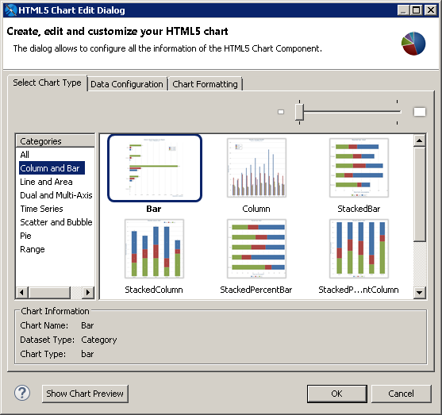
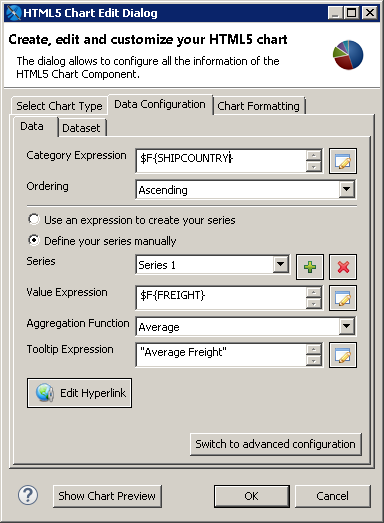
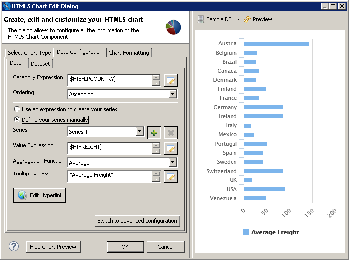
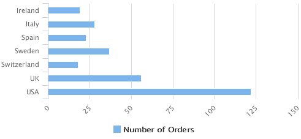
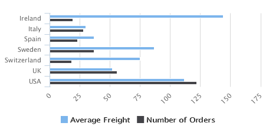
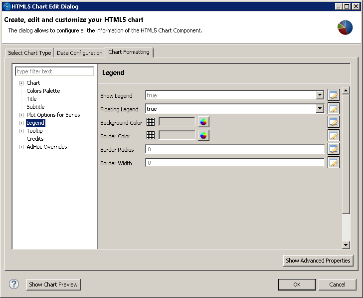
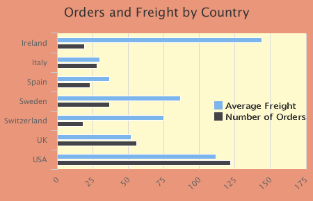
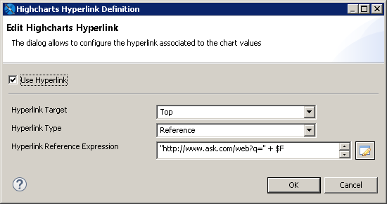

# Example of a Bar Chart Using Simple Configuration

This example shows how to configure a bar chart using a simple configuration view. A similar panel is shown for charts that use one category, one series, and one measure and for charts that use one category and multiple measures.

Before you add a chart, consider the best way to display your data. Available chart types are listed in [“HTML5 Chart Types”](html5-charts-overview.md).

This example contains the following sections:

- Creating an HTML5 Chart

- Adding a Measure to a Bar Chart

- Formatting a Chart

- Creating a Hyperlink

!!! note

    A panel similar to the one in this section is used for the following chart types: Bar, Column, Line, Area, Spline, AreaSpline, StackedBar, StackedColumn, StackedLine, StackedArea, StackedSpline, StackedAreaSpline, StackedPercentBar, StackedPercentColumn, StackedPercentLine, StackedPercentArea, StackedPercentSpline, StackedPercentAreaSpline, SpiderColumn, SpiderLine, SpiderArea.

## Creating an HTML5 Chart

To create the report for the chart

1.  Create a new, blank report using the Sample DB data adapter and the query: `select * from orders`.
2.  Click **Next**.
3.  Click  to select all fields, then click **Finish**.
4.  Delete all bands except for **Title** and **Summary**.
5.  Enlarge the **Summary** band to 500 pixels by changing the **Height** entry in the **Band Properties** view.

To create the chart

1.  Click **HTML5 Charts** in the **Components Pro** section of the **Palette**. The cursor changes to  to show that an element is selected. Click and drag in the **Summary** band to size and place the chart.

The **HTML5 Chart Edit Dialog** is displayed.

|                                                                          |
|--------------------------------------------------------------------------|
|  |
| *Figure 1: Chart Types*                                                  |

1.  Select a chart type based on the information that you want to display. See [HTML5 Chart Types](html5-charts-overview.md) for help. You can use the menu at the left to restrict the selection to a particular type of chart. For this example, choose **Bar**.
2.  Click the **Data Configuration** tab. This tab includes options for configuring chart dataset, chart properties, and hyperlinks. The options on this tab reflect the type of chart that you selected.

|                                                                      |
|----------------------------------------------------------------------|
|  |
| *Figure 2: HTML5 Charts Properties \> Chart Data \> Configuration*   |

1.  Enter the expression that you want to use for the categories. You can enter the expression directly, or click  to open the Expression Editor. For this example, enter the following:

- **Category Expression**: `$F{SHIPCOUNTRY}`.

1.  Enter the information that you want for the series:

- **Series**: This menu displays the default name of the series, for example, Series 1. If you want to change the name, use advanced configuration.
- **Value Expression**: Enter the expression that you want to use as a base for the measure calculation. For this example, use `$F{Freight}`.
- **Aggregation Function**: Select the function to apply to the value expression. For this example, use `Average`.
- **Tooltip Expression**: Enter an expression to display as a label for the measure. For this example, enter `"Average Freight"`.

1.  To preview the chart from inside the dialog, click **Show Chart Preview**.

A preview is displayed in the right of the dialog. This preview can take some time to load the first time it is run.

|  |
|----|
|  |
| *Figure 3: Preview in the HTML5 Chart Edit Dialog* |

Configure the dataset

1.  Click the **Dataset** sub-tab. This sub-tab lets you choose a dataset and dataset properties. This example uses the default **\[Report main dataset\]**.
2.  You can optionally filter the dataset by entering an expression in the **Increment expression** text box. You can enter text directly or click  to open the Expression Editor. For this example, filter your dataset using the following increment expression:

`$F{SHIPCOUNTRY}.startsWith("I") ||`

`$F{SHIPCOUNTRY}.startsWith ("S") ||`

`$F{SHIPCOUNTRY}.startsWith ("U")`

1.  Click  to refresh the preview.
2.  Click **OK** to close the **HTML5 Chart Edit** dialog.

A placeholder for the chart is inserted in the design view of your report. The design view of a report does not display live data for a chart.

1.  Save, then click the **Preview** tab to see your chart. To see an interactive preview, select HTML from the **Preview** drop-down. Hover over a bar to see the average freight.

|  |
|----|
|  |
| *Figure 4: Bar Chart Example* |

!!! warning

    The preview works best when you are using the same dataset as the main report. Parameters may not be applied and multiple levels or series may not be displayed.

## Adding a Measure to a Bar Chart

Start with the HTML5 bar chart from the previous example to complete the following tasks.

1.  On the **Design** tab, double-click your chart, or right-click it and choose **Edit Chart Properties**.
2.  In the **HTML5 Chart Edit** dialog, click the **Data Configuration** tab.
3.  In the **Measures** section, click . A new series is created with the name Series 2. Enter the following information:

- **Value Expression**: `$F{FREIGHT}`
- **Aggregation Function**: `Average`
- **Tooltip Expression**: `"Average Freight"`

1.  Click **OK**.
2.  Save and preview the chart.

|  |
|----|
|  |
| *Figure 5: Bar chart with multiple measures* |

## Formatting a Chart

You can set the HTML formatting of the chart using the Chart Formatting tab in the HTML5 Edit Charts dialog. Most of these properties can be set using an expression.

!!! note

    You can set additional options using the Show Advanced Properties button. See [Advanced Formatting of HTML5 Charts](html5-charts-advanced-formatting.md) for more information.

    You can set JasperReport element properties for an HTML5 chart, such as position or evaluation time, in the **Properties** view. See [Setting Advanced Options for HTML5 Charts in Properties View](html5-charts-disable-options.md) for more information.

To add a title to an HTML5 chart

1.  Double-click the chart or right-click and select **Edit Chart properties**.
2.  Click the **Chart Formatting** tab.
3.  Select **Title** on the left and enter your title in the **Title** text box. For this example, enter **Orders and Freight by Country**. You can also customize the alignment, position, color, and font.

To change the position or layout of the legend

1.  On the **Chart Formatting** tab of the HTML5 Chart Edit dialog, select **Legend** and set the following:

- **Floating Legend**: true.

|  |
|----|
|  |
| *Figure 6: Legend Properties* |

1.  Expand **Legend**, select **Legend \> Sizes and Position**, and set the location of the legend on the graph:

- **Horizontal Alignment**: right.
- **Vertical Alignment**: middle.
- **X offset**: -6. This moves the legend inside the plot background color.

1.  Select **Legend \> Items** and set the following:

- **Items Layout**: vertical.

1.  Click **OK**.

To set the chart's background color

1.  On the **Chart Formatting** tab of the HTML5 Chart Edit dialog, select **Chart**.
2.  Click the color wheel next to **Background Color** and select a color. For this example, enter `#E9967A`. This sets the background color of the whole chart.
3.  Next, select **Chart \> Borders and Plot Areas**.
4.  Click the color wheel next to **Plot Background Color** and select a color. For this example, enter `#FFFACD`. This sets the background color of the plot area only.
5.  Click **OK**.
6.  Save and preview your report.

|  |
|----|
|  |
| *Figure 7: Formatted report* |

## Creating a Hyperlink

1.  Double-click your bar chart or right-click and select **Edit Chart properties**.
2.  Click the **Data Configuration** tab.
3.  Click **Edit Hyperlink**.

|  |
|----|
|  |
| *Figure 8: Editing a hyperlink* |

1.  Set the following:

- **Hyperlink Target**: Top.
- **Hyperlink Type**: Reference.
- **Hyperlink Reference Expression**: `"http://www.ask.com/web?q=" + $F{SHIPCOUNTRY}`

1.  Click **OK**.
2.  Click **OK** again to return to design mode.
3.  Save and preview your report. In the HTML preview, click the bar for any country to open an Ask.com page for that country.
