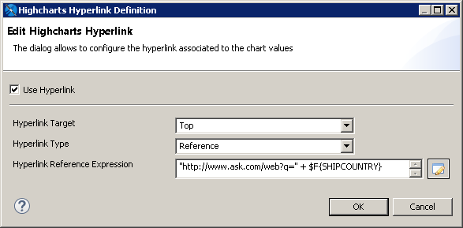
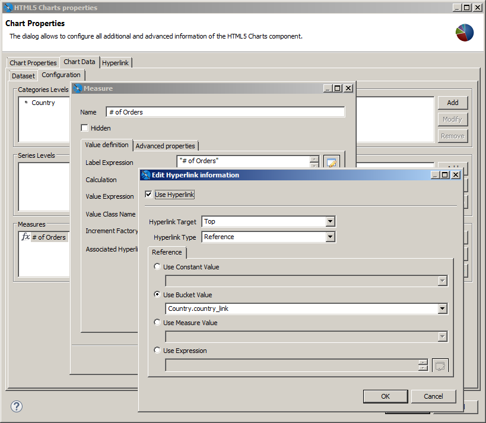
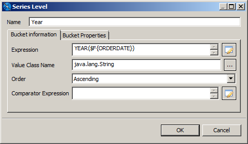
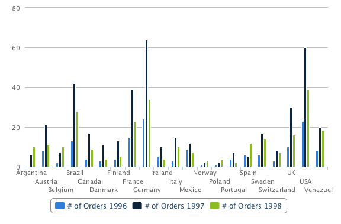
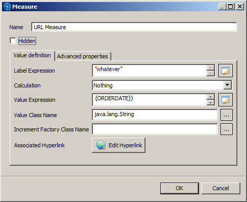
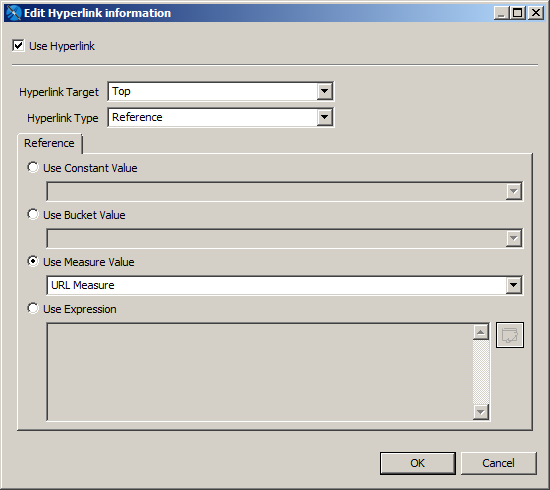

# Creating Hyperlinks in HTML5 Charts

To follow a link in an HTML 5 chart, the user clicks a chart component that represents a measure. This hyperlink is created by a specific extension to that chart component, which evaluates the properties of the measure. You can create hyperlinks in two ways:

- Use a simple configuration to create hyperlinks that are automatically bucketed by the category in a simple chart.

- Use advanced configuration to create more complex values for a hyperlink. To do this, you define a bucket property, a key/value pair associated with a category or series level, and then define the hyperlink value using an expression.

This example shows how to combine a URL with a hidden measure to create an interesting user experience.

## Creating a Simple Hyperlink

Create the report

1.  Choose a blank template and click **Next**.
2.  Set a name and location for the report and click **Next**.
3.  Select the Sample DB data adapter and click **Next**.
4.  Enter the following query:

`select * from orders`

1.  On the **Fields** page, select all fields and click **Finish**.

Add a column chart

1.  Add the HTML5 Charts element  to the title band and select **Column**.
2.  Select the **Data Configuration** tab.
3.  For the **Category Expression** section:

<!-- -->

1.  Enter `$F{SHIPCOUNTRY}` for the **Category Expression**.
2.  Verify that the **Ordering** is set to Ascending.
3.  For the Series section, use the following settings:

<!-- -->

1.  **Series**: Series 1
2.  **Value Expression**: `$F{ORDERID}`
3.  **Aggregation Function**: DistinctCount
4.  **Tooltip Expression**: "Number of Orders"

At this point, the chart is configured. You can click **Show Chart Preview** to preview it from the dialog.

Configure a simple hyperlink

1.  On the **Data Configuration** tab, click **Edit Hyperlink**.

The **Edit Highcharts Hyperlink** information dialog is displayed.

|  |
|----|
|  |
| *Figure 1: Editing the Number of Orders a Second Time* |

1.  Click **Use Hyperlink** and enter the following information:

- **Hyperlink Target**: Top
- **Hyperlink Type**: Reference
- **Hyperlink Reference Expression**: `"http://ask.com/#q=" + $F{SHIPCOUNTRY}`

1.  Click **OK** twice to return to design view.
2.  Preview your chart as HTML or using the interactive report viewer. Click any column to verify it points to the Ask.com search for that country.

## Working with Bucket Properties and Hidden Measures

To create a hyperlink with more complexity, use advanced configuration.

Open the advanced configuration for your chart

1.  From the design view, double-click the chart to open the **HTML5 Chart Edit Dialog**.
2.  Click **Switch to advanced configuration**.

Before creating a hyperlink, you can view the hyperlink you just created to see how it is configured in the advanced view.

View the existing hyperlink

1.  Select **Category Levels \> Level 1** and click Modify.

The **Category Levels** dialog for this category is displayed. This dialog shows details for the category, such as name and value type.

1.  If you want, take the opportunity to name the category. For this example, you can name it Country.
2.  Click **Bucket Properties** to see the hyperlink bucket properties for the existing hyperlink.
3.  Click OK to return to the **HTML5 Chart Edit Dialog**.

|  |
|----|
|  |
| *Figure 2: Defining Bucket Properties for HTML5 Chart Hyperlinking* |

Add a series for Year

To make this example slightly more useful, and to see how you can use hyperlink information from different dimensions, this example shows how to add an extra dimension called Year, so the chart can display the number of orders placed in a specific country in a specific year. Then you can create a hyperlink that contains both the country and the year.

1.  Double-click the chart.
2.  Click the **Chart Data** tab and select the **Configuration** subtab.
3.  Click **Add** in the Series Levels area.
4.  Add a series level configured as shown below:

- Name: Year
- Expression: YEAR( \$F{ORDERDATE} )

|                                                                          |
|--------------------------------------------------------------------------|
|  |
| *Figure 3: Adding a Series Level to Define Buckets*                      |

1.  Click **OK** twice.

Once again, you can preview the chart. Now, for each country, the chart shows the number of orders split by year.

|  |
|----|
|  |
| *Figure 4: Column Chart with Order Numbers Split by Year* |

Create a measure to hold the series hyperlink

To create a more complex hyperlink, you can use a measure. Measures are usually designed to hold numeric values, most of the time the result of some aggregation function (in our example we show the count of orders). But a measure can actually be anything.

The following example creates a URL string:

- **Name**: URL Measure
- **Hidden**:  true (It is very important to select the checkbox, because you are not going to display this measure, it would not make sense to display a non numeric value.)
- **Calculation**: Nothing
- **Value Expression**: `"http://google.com/#q=" + $F{SHIPCOUNTRY} + " " + YEAR($F{ORDERDATE})`
- **Value Class Name**: `java.lang.String`

|  |
|----|
|  |
| *Figure 5: Defining the URL to Open when the Measure is Clicked* |

For this example, the most important things to note are:

- The measure is marked as **Hidden**.
- The calculation type is set to **Nothing**.
- The class of the measure is `String`. Specifically the example creates a `String` URL with a reference to both the country and the year of the order.

Create a hyperlink that uses a hidden measure

1.  Click **OK** to return to the **HTML5 Chart Edit Dialog**.
2.  Select Measure 1, the visible measure used for the columns in the chart.
3.  Click **Modify**.
4.  If you want, change the name of Measure 1 to **Number of Orders**.
5.  Click **Edit Hyperlink**.

|  |
|----|
|  |
| *Figure 6: Creating a Hyperlink for the Measure* |

1.  Set the following values:

- **Use Hyperlink**: true
- **Hyperlink Target**: Top
- **Hyperlink Type**: Reference
- **Use Measure Value**: Select this and enter the name of the measure that contains the expression for the hyperlink, **URL Measure**.

1.  Click **OK** three times to return to design view. Then save the report and preview it as HTML.

Now, each column in the stacked column chart points to a search for the corresponding country and year.
