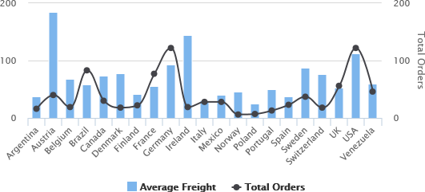
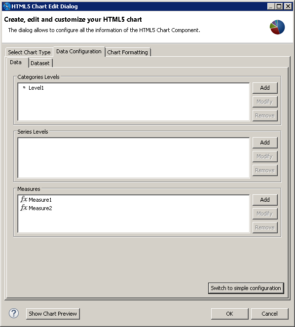
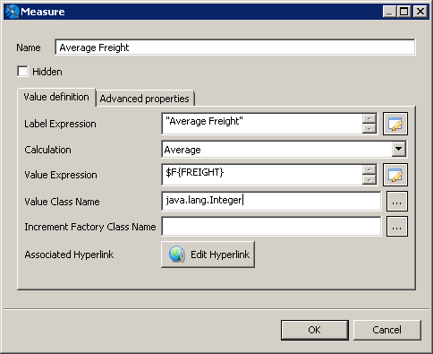
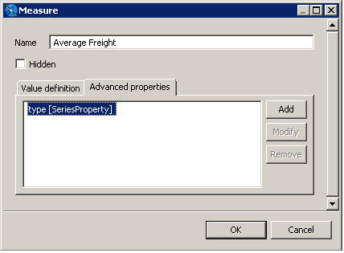
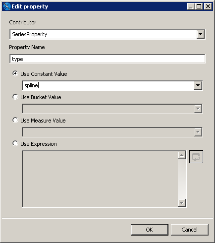
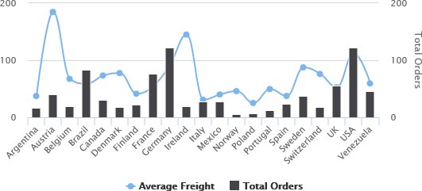
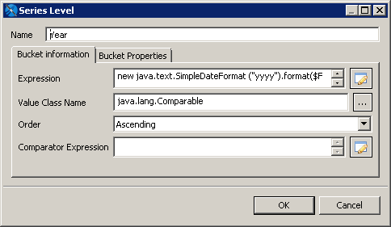
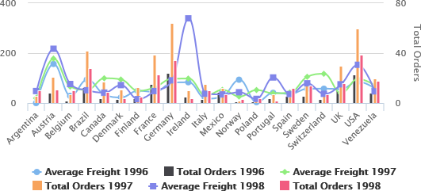

# Example of a Column-Spline Chart

This example shows how to create a column-spline chart that plots average freight and total orders per country. It then shows how to switch to advanced configuration, edit your chart, and add a series.

A similar dialog is used for the following types of charts:

-   Dual- and multi-axis charts that use different scales for each y-axis. (This enables you to compare data items easily with very different scales.)

-   Combination charts that display multiple data series in a single chart that combines the features of two different charts.

!!! note

    The following chart types use this dialog: ColumnLine, ColumnSpline, StackedColumnLine, StackedColumnSpline, MultiAxisLine, MultiAxisSpline, MultiAxisColumn.

## Creating the Chart Using Simple Configuration

To create the report for the chart

1.  Create a new, blank report using the Sample DB data adapter and the following query:

    `select * from orders where shipcountry = 'GERMANY'`

    Click **Next**.

2.  Click  to select all the fields. Click **Finish**.

3.  Delete all bands except for **Title** and **Summary**.

4.  Enlarge the **Summary** band to 500 pixels by changing the **Height** entry in the **Band Properties** view.

To create the chart using a simple configuration

1.  Click **HTML5 Charts** in the **Components Pro** section of the **Palette**. The cursor changes  to show that an element is selected. Click and drag in the Summary band to size and place the chart.

2.  In the **HTML5 Chart Edit Dialog**, select **ColumnSpline**. If you are prompted to confirm, click **Yes**.

3.  Click the **Data Configuratio**n tab.

    The **HTML5 Chart Edit Dialog** is displayed.

    |  |
    |----|
    |  |
    | *Figure 1 Simple Configuration for Column-Spline Chart* |

4.  Enter the following to create your category:

-   **Category Expression**:` $F{SHIPCOUNTRY}`

    -   **Ordering**: **Ascending**

        1.  Select Series 1 and configure the first measure for total freight. This measure is used for columns. You can change this using advanced configuration:

    -   **Value Expression**: `$F{FREIGHT}`

    -   **Aggregation Function**: `Average`

    -   **Tooltip Expression**: `"Average Freight"`

        1.  Select Series 2 from the drop-down and configure the second measure for total orders. This measure is used for spline:

    -   **Value Expression**: `$F{ORDERID}`

    -   **Aggregation Function**: `DistinctCount`

    -   **Tooltip Expression**: `"Total Orders"`

1.  Click **OK** to return to design view.
2.  Save and preview your report. It should look like the following figure.

|  |
|----|
|  |
| *Figure 2 Column Spline Chart* |

## Using Advanced Configuration

You can use advanced configuration to modify your measures and to add a series level.

To use advanced configuration to edit measures

A simple configuration lets you add a measure, but does not let you choose set whether the measure is used for columns or spline. To change this setting, use advanced configuration to set the series property type (`column`, `line`, or `spline`).

1.  From the design view, double-click the chart to open the **HTML5 Chart Edit Dialog**.

2.  Click **Switch to advanced configuration**.

    |  |
    |----|
    |  |
    | *Figure 3 Advanced Configuration for a Chart* |

3.  Select Measure1 and click **Modify**.

    The **Measure** dialog is displayed. The dialog contains the settings generated when you created the measure in a simple configuration, although some of the settings have different names. If you want, you can use this dialog to change the name to Average Freight.

    |  |
    |----|
    |  |
    | *Figure 4 Editing a Measure* |

4.  Click the **Advanced Properties** tab.

    |  |
    |----|
    |  |
    | *Figure 5 Advanced Properties for a Measure in a Column-Spline Chart* |

5.  Click **Add** to specify the series type:

-   **Contributor**: `SeriesProperty`

    -   **Property Name**: `type`

    -   **Use Constant Value**: `spline`

        Click **OK**, then click **OK** again.

        |  |
        |----|
        |  |
        | *Figure 6 Adding a Series Property* |

        !!! note

            The supported constant values for series property type are `column`, `line`, and `spline`.

        1.  Select Measure2 and click **Modify**.

            The Measure dialog is displayed. If you want, you can change the name to Total Orders.

        2.  Click the **Advanced Properties** tab.

        3.  Click **Add** to specify the series type:

    -   **Contributor**: `SeriesProperty`

    -   **Property Name**: `type`

    -   **Use Constant Value**: `column`

        Click **OK**, then click **OK** again.

        1.  Click **OK** thrice to return to the design view, then save and preview the chart. The display has changed to reflect your settings.

        |  |
        |----|
        |  |
        | *Figure 7 Chart After Changing the Measure Types* |

        To add a series level

        1.  From the design view, double-click the chart to open the **HTML5 Chart Edit Dialog**.

        2.  Make sure you are in the advanced configuration view of the **Data Configuration** tab.

        3.  Set the series type for any existing measures, as described above.

        4.  Click **Add** in the **Series Level** section to open the **Series Level** dialog.

            |  |
            |----|
            |  |
            | *Figure 8 Adding a Series Level to a Column-Spline Chart* |

        5.  Create a series with the following:

    -   **Name**: `Year`

    -   **Expression**: `new java.text.SimpleDateFormat ("yyyy").format($F{ORDERDATE}) `

    -   **Value Class Name**: `java.lang.Comparable`

    -   **Order**: `Ascending`

Click **OK** twice to return to design view.

1.  Save and preview the report.

|  |
|----|
|  |
| *Figure 9 Adding a Series Level to a Column-Spline Chart* |
