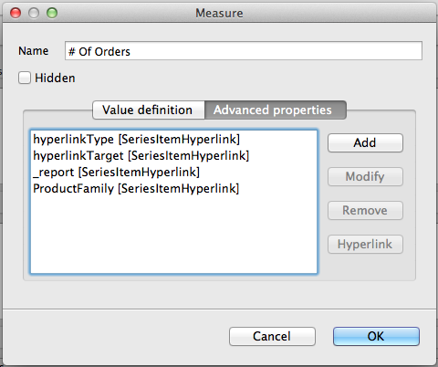

# Working with Hyperlinks to Report Units

If you are exporting your reports to JasperReports Server, you can use hyperlinks of the type `ReportExecution` to invoke another JasperReports Server report and set values for its input controls. For example, users may want to click a bar in a bar chart related to a country to run a report that shows more about this country, or show details about the number represented by the bar itself. This mechanism is a way to move from one report unit to another, realizing what is more generally called drill-down and drill-up.

The execution of report units can be done by using a hyperlink of the type `ReportExecution`. This type requires to define a hyperlink parameter called “\_report”, which holds the location of the report unit inside the JasperReports Server repository.

Other hyperlink parameters can be defined to set values for input controls exposed by the report unit.

The next tutorial shows how to create a link to the report unit 04. Product Results by Store Type Report”, located at /public/Samples/Reports/4_Product_Results_by_Store_Type_Report.

When run, this report can be filtered by country, anyway, since this report unit does not expose through input controls defined at the report unit the country parameter, we cannot pass the country value we have.

1.  Create a report, following the steps described at the beginning of [Creating Hyperlinks in HTML5 Charts.](html5-charts-creating-hyperlinks.md)

2.  Modify the \# of orders measure by adding the following properties in the advanced properties tab:

    1.  hyperlinkType (contributor: SeriesItemHyperlink, Static value: ReportExecution)
    2.  hyperlinkTarget (contributor: SeriesItemHyperlink, Static value: Blank)
    3.  3_report (contributor: SeriesItemHyperlink, Static value: /public/Samples/Reports/4_Product_Results_by_Store_Type_Report)

3.  Publish the report in JasperReports Server and preview it on the Web. Click a bar column to open the report units we defined in the previous step.

Note that there is no special syntax to define a parameter, use the name of the parameter as the property name, and select the value (static, bucket, or measure based).

The report unit 06. Profit Detail Report (/public/Samples/Reports/ProfitDetailReport) is a good candidate for this test. It exposes the parameter ProductFamily, so by adding the ProductFamily hyperlink property, and by setting it to a value like Drink, can pre-filter its results.

|  |
|----|
|  |
| *Figure 1: Measure Configuration for \# of Orders* |
