# Overview of HTML5 Charts

HTML5 charts are a flexible, interactive way to explore your data graphically. You can choose different levels of aggregation for rows and columns and create attractive interactive reports.

The following terminologies are used to describe HTML5 charts:

-   **Values**: Static properties.

-   **Expressions**: Dynamic properties.

-   **Categories**: Rows. In a pie chart, the categories are the slices.

-   **Levels**: Some chart types let you add multiple categories or series ranked hierarchically, with the topmost category set as Level 1. When you export a chart with multiple levels to JasperReports Server, users see a slider that they can use to select the level of aggregation. For example, you might have a chart that has three categories — Country, Region, and City — and users can choose a level for viewing the data.

-   **Measures**: Measures contain summarized values. They are typically numeric fields that determine the length of bars, size of pie slices, location of points (in line charts), or the height of areas.

-   **Series Contributors**: In the Design tab, these are defined at the measure level. In JRXML, these are defined as Series.

!!! note

    In HTML5 Charts, Jaspersoft Studio are similar to Ad Hoc charts in JasperReports Server.

Before you add a chart to your report, consider the best way to display your data. The following table describes the available chart types.

**HTML5 Chart Types**

<table>
<colgroup>
<col style="width: 50%" />
<col style="width: 50%" />
</colgroup>
<thead>
<tr>
<th>
Icon
</th>
<th>
Description
</th>
</tr>
</thead>
<tbody>
<tr>
<td colspan="2">
Column charts - Compare values displayed as columns
</td>
</tr>
<tr>
<td>
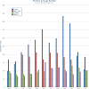
</td>
<td>
<strong>Column</strong>. Multiple measures of a group are depicted as individual columns.
</td>
</tr>
<tr>
<td>
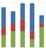
</td>
<td>
<strong>Stacked Column</strong>. Multiple measures of a group are depicted as portions of a single column whose size reflects the aggregate value of the group.
</td>
</tr>
<tr>
<td>
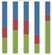
</td>
<td>
<strong>Percent Column</strong>. Multiple measures of a group are depicted as portions of a single column of fixed size representing 100% of the amounts for a category. Used when you have three or more data series and want to compare distributions within categories and at the same time display the differences between categories.
</td>
</tr>
<tr>
<td colspan="2">
Bar charts - Compare values displayed as bars
</td>
</tr>
<tr>
<td>
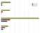
</td>
<td>
<strong>Bar</strong>. Graphically summarize and display categories of data to let users easily compare amounts or values among categories.
</td>
</tr>
<tr>
<td>
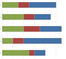
</td>
<td>
<strong>Stacked Bar</strong>. Multiple measures of a group are depicted as portions of a single bar whose size reflects the aggregate value of the group.
</td>
</tr>
<tr>
<td>
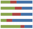
</td>
<td>
<strong>Percent Bar</strong>. Multiple measures of a group are depicted as portions of a single bar of fixed size representing 100% of the amounts for a category. Used when you have three or more data series and want to compare distributions within categories and at the same time display the differences between categories.
</td>
</tr>
<tr>
<td colspan="2">
Line charts - Compare values displayed as points connected by lines
</td>
</tr>
<tr>
<td>
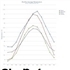
</td>
<td>
<strong>Line</strong>. Displays data points connected with straight lines, typically to show trends.
</td>
</tr>
<tr>
<td>
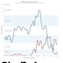
</td>
<td>
<strong>Spline</strong>. Displays data points connected with a fitted curve. Allow you to take a limited set of known data points and approximate intervening values.
</td>
</tr>
<tr>
<td>
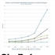
</td>
<td>
<strong>Stacked Line</strong>. Displays a series as a set of points connected by a line. Values are represented on the y-axis and categories are displayed on the x-axis. Lines do not overlap because they are cumulative at each point.
</td>
</tr>
<tr>
<td>
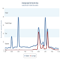
</td>
<td>
<strong>Stacked Spline</strong>. Displays a series as a set of points connected with a fitted curve. Values are represented on the y-axis and categories are displayed on the x-axis. Lines do not overlap because they are cumulative at each point
</td>
</tr>
<tr>
<td>
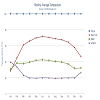
</td>
<td>
<strong>Stacked Percent Line</strong>. A variation of a line chart in which each series adjoins but does not overlap the preceding series.
</td>
</tr>
<tr>
<td>
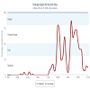
</td>
<td>
<strong>Stacked Percent Spline</strong>. A variation of a spline chart in which each series adjoins but does not overlap the preceding series.
</td>
</tr>
<tr>
<td colspan="2">
Area charts - Compare values displayed as shaded areas. Compared to line charts, area charts emphasize quantities rather than trends.
</td>
</tr>
<tr>
<td>
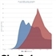
</td>
<td>
<strong>Area</strong>. Displays data points connected with a straight line and a color below the line. Groups are displayed as transparent overlays.
</td>
</tr>
<tr>
<td>
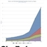
</td>
<td>
<strong>Stacked Area</strong>. Displays data points connected with a straight line and a solid color below the line. Groups are displayed as solid areas arranged vertically, one on top of another.
</td>
</tr>
<tr>
<td>
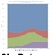
</td>
<td>
<strong>Stacked Percent Area</strong>. Displays data points connected with a straight line and a solid color below the line. Groups are displayed as portions of an area of fixed size, and arranged vertically one on top of each other.
</td>
</tr>
<tr>
<td>
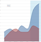
</td>
<td>
<strong>Area Spline</strong>. Displays data points connected with a fitted curve and a color below the line. Groups are displayed as transparent overlays.
</td>
</tr>
<tr>
<td>
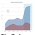
</td>
<td>
<strong>Stacked Area Spline</strong>. Displays a series as a set of points connected by a smooth line with the area below the line filled in. Values are represented on the y-axis and categories are displayed on the x-axis. Areas do not overlap because they are cumulative at each point.
</td>
</tr>
<tr>
<td>
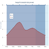
</td>
<td>
<strong>Stacked Percent Area Spline</strong>. A variation of area spline charts that present values as trends for percentages, totaling 100% for each category.
</td>
</tr>
<tr>
<td colspan="2">
Pie charts - Compare values displayed as slices of a circular graph
</td>
</tr>
<tr>
<td>
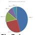
</td>
<td>
<strong>Pie</strong>. Multiple items of a single group are displayed as sectors of a circle.
</td>
</tr>
<tr>
<td>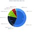</td>
<td>
<strong>Dual-Level Pie</strong>. A variation of pie charts that present the grouped values in two concentric circles. The inner circle represents the coarsest grouping level in the data. In Jaspersoft Studio, note these rules about data configuration for dual-level pie charts:

<ul>
<li>Only one measure is displayed (the first)</li>
<li>The last row level is rendered as the outer pie</li>
<li>The next to the last row level is rendered as the inner pie. If only one row level is defined, the inner pie consists of a single section representing the total</li>
</ul></td>
</tr>
<tr>
<td>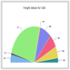</td>
<td><strong>Semi-Pie</strong>. Multiple measures of a group are displayed as sectors of a half-circle.</td>
</tr>
<tr>
<td colspan="2">
Scatter and Bubble Charts - Show the extent of correlation, if any, between the values of observed quantities.
</td>
</tr>
<tr>
<td>
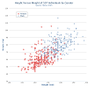
</td>
<td>
<strong>Scatter</strong>. Displays a single point for each point in a data series without connecting the points.
</td>
</tr>
<tr>
<td>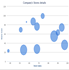</td>
<td>
<strong>Bubble</strong>. Compares the relationships between the three measures displayed on the x-y axis. The location and size of each bubble indicates the relative values of each data point.
</td>
</tr>
<tr>
<td colspan="2">
Multi-Axis Charts - Compare trends in two or more data sets whose numeric range differs greatly.
</td>
</tr>
<tr>
<td>
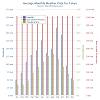
</td>
<td>
<strong>Multi-Axis Column</strong>. A column chart with two series and two axis ranges.
</td>
</tr>
<tr>
<td>
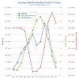
</td>
<td>
<strong>Multi-Axis Line</strong>. A line chart with two series and two axis ranges.
</td>
</tr>
<tr>
<td>
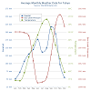
</td>
<td>
<strong>Multi-Axis Spline</strong>. A spline chart with two series and two axis ranges.
</td>
</tr>
<tr>
<td colspan="2">
Combination Charts - Display multiple data series in a single chart, combining the features of an area, bar, column, or line charts.
</td>
</tr>
<tr>
<td>

</td>
<td>
<strong>Column Line</strong>. Combines the features of a column chart with a line chart.
</td>
</tr>
<tr>
<td>
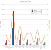
</td>
<td>
<strong>Column Spline</strong>. Combines the features of a column chart with a spline chart.
</td>
</tr>
<tr>
<td>
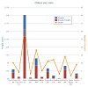
</td>
<td>
<strong>Stacked Column Line</strong>. Combines the features of a stacked column chart with a line chart.
</td>
</tr>
<tr>
<td>
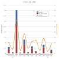
</td>
<td>
<strong>Stacked Column Spline</strong>. Combines the features of a stacked column chart with a line chart.
</td>
</tr>
<tr>
<td colspan="2">
Time Series Charts - Illustrate data points at successive time intervals. Also called Fever Chart.
</td>
</tr>
<tr>
<td>
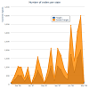
</td>
<td>
<strong>Time Series Area</strong>. Displays data points over time connected with a straight line and a color below the line.
</td>
</tr>
<tr>
<td>
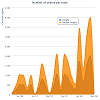
</td>
<td>
<strong>Time Series Area Spline</strong>. Displays data points over time connected with a fitted curve and a color below the line.
</td>
</tr>
<tr>
<td>
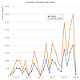
</td>
<td>
<strong>Time Series Line</strong>. Displays data points over time connected with straight lines.
</td>
</tr>
<tr>
<td>
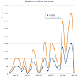
</td>
<td>
<strong>Time Series Spline</strong>. Displays data points over time connected with a fitted curve.
</td>
</tr>
<tr>
<td colspan="2">
Spider Charts - Display data in line or data bars arranged on a circular spider web chart. It is also called a Radar Chart.
</td>
</tr>
<tr>
<td>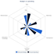</td>
<td>
<strong>Spider Column</strong>. Plots one or more series over multiple common quantitative variables by providing axes for each variable arranged as spokes around a central point. The column variation of spider charts displays values as bars that extend out from the central point towards the edges of the circular web. The bar's length indicates the relative value.
</td>
</tr>
<tr>
<td>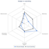</td>
<td>
<strong>Spider Line</strong>. Plots one or more series over multiple common quantitative variables by providing axes for each variable arranged as spokes around a central point. The line variation of spider charts displays values as points arranged around the circular web. The data points are joined by a line. Each point's distance from the central point indicates the relative value.
</td>
</tr>
<tr>
<td>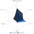</td>
<td>
<strong>Spider Area</strong>. Plots one or more series over multiple common quantitative variables by providing axes for each variable arranged as spokes around a central point. The area variation of spider charts is similar to the line variation, but the shape defined by the line that connects each series' points is filled with color.
</td>
</tr>
<tr>
<td colspan="2">Range Charts</td>
</tr>
<tr>
<td>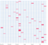</td>
<td><strong>Heat Map</strong>. Represents data in a matrix format, using color coding to show values.</td>
</tr>
<tr>
<td>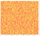</td>
<td><strong>Time Series Heat Map</strong>. Represents data across time in a heat map, using color coding to show values.</td>
</tr>
<tr>
<td>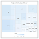</td>
<td><strong>Dual Measure Tree Map</strong>. Displays data as color-coded rectangles. The size of each rectangle is proportional to the first measure and the color represents the second measure.</td>
</tr>
<tr>
<td>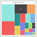</td>
<td><strong>Tree Map.</strong> Displays data as rectangles. The size of each rectangle is proportional to the measure of the data it represents. The tree map displays nested rectangles when you have more than one field. The parent rectangle represents the leftmost measure while the nested rectangles represent the current level of aggregation. Click on a parent rectangle to drill down to the nest rectangles.</td>
</tr>
<tr>
<td>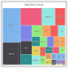</td>
<td><strong>One Parent Tree Map</strong>. Displays data as nested rectangles. The size of each rectangle is proportional to the measure of the data it represents. The nested rectangles represent the current level of aggregation while the larger rectangle represents the parent level in the hierarchy. Click a parent rectangle to drill down to the nest rectangles.</td>
</tr>
<tr>
<td>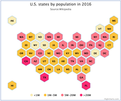</td>
<td><strong>Tile Map.</strong> Displays data in the form of tiles aligned on a grid to create a pattern. The related data measure is displayed on each tile.</td>
</tr>
<tr>
<td colspan="2">Gauge Charts</td>
</tr>
<tr>
<td></td>
<td>
<strong>Gauge</strong>. Displays a single data value as a portion of a circle. The length of the circle is the data's numeric value proportional to the maximum size defined for the measure.

<ul>
<li>One or more Measures required in the Columns location.</li>
<li>One or more Fields required in the Columns location.</li>
<li>Define the minimum and maximum sizes, color stops, and layout on the Appearance tab.</li>
</ul></td>
</tr>
<tr>
<td></td>
<td>
<strong>Multi-level Gauge</strong>. Displays one or more data values as concentric circles. Each circle represents a measure and the length of the circle is the data's numeric value proportional to the maximum size defined for the measures.

<ul>
<li>Two or more Measures required in the Columns location.</li>
<li>One or more Fields required in the Columns location.</li>
<li>Define the minimum and maximum sizes, color stops, and layout on the Appearance tab.</li>
</ul></td>
</tr>
<tr>
<td></td>
<td>
<strong>Arc Gauge</strong>. Displays a single data value as a portion of a semi-circular arc. The length of the arc is the data's value proportional to the maximum size defined for the measure.

<ul>
<li>One or more Measures required in the Columns location.</li>
<li>One or more Fields required in the Rows location.</li>
<li>Define the minimum and maximum sizes, color stops, and layout on the Appearance tab.</li>
</ul></td>
</tr>
</tbody>
</table>
