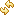
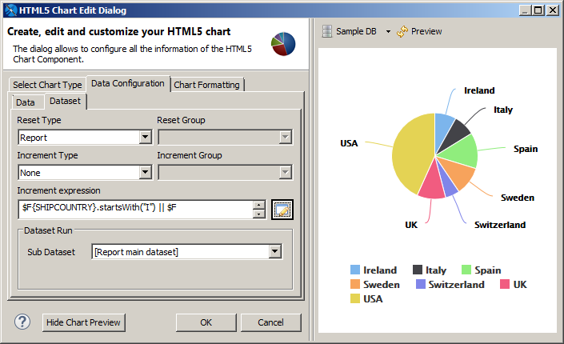
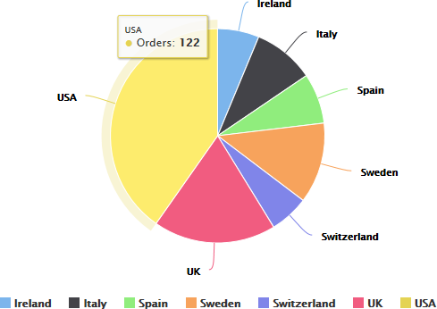

# Example of a Pie Chart

This example shows how to create a pie chart using a simple configuration view.

!!! note

    A panel similar to the one in this section is used for the following chart types: Pie, SemiPie.

To create the report for the chart

1.  Create a new, blank report using the Sample DB data adapter and the query: `select * from orders`.
2.  Click **Next**.
3.  Click  to select all fields, then click **Finish**.
4.  Delete all bands except for **Title** and **Summary**.
5.  Enlarge the **Summary** band to 500 pixels by changing the **Height** entry in the **Band Properties** view.

To create the chart

1.  Click **HTML5 Charts** in the **Components Pro** section of the **Palette**. The cursor changes to  to show that an element is selected. Click and drag in the **Summary** band to size and place the chart.

The **HTML5 Chart Edit Dialog** is displayed.

1.  Create a report using the Sample DB data adapter.
2.  Start with the query:

`select * from orders`

1.  Choose  **HTML5 Charts** from the **Components Pro** section of the **Palette**, and drag it into the **Summary** band of your report.

The **HTML5 Chart Edit Dialog** is displayed.

1.  Select a chart type based on the information that you want to display. You can use the menu at the left to restrict the selection to a particular type of chart. For this example, choose **Pie**.
2.  Click the **Data Configuration** tab. This tab includes options for configuring chart dataset, chart properties, and hyperlinks. The options on this tab reflect the type of chart that you selected. The dialog shown in this example is used for pie and semi-pie charts.

|  |
|----|
|  |
| *Figure 1: HTML5 Charts Properties \> Chart Data \> Configuration* |

1.  Enter the required information on the Data subtab. For this example:

- **Slice Expression**: Enter the expression that you want to use for the slices. You can enter the expression directly, or click  to open the **Expression Editor**. For this example, use `$F{SHIPCOUNTRY}`.

<!-- -->

- **Value Expression**: Enter the expression that you want to use as a base for the measure calculation. For this example, use `$F{ORDERID}`.
- **Aggregation Function**: Select the function to apply to the value expression. For this example, use `DistinctCount`.
- **Tooltip Expression**: Enter an expression to display when a user hovers over a slice of the pie. For this example, enter `"Orders"`.
- **Ordering**: Select an order for the slices. For this example, choose `Ascending`. This displays the slices in alphabetical order.

1.  To preview the chart from inside the dialog, click **Show Chart Preview**.

A preview is displayed to the right of the dialog. This preview can take some time to load the first time it is run.

1.  Click the Dataset subtab. This subtab lets you choose a dataset and dataset properties. For this example, use the default **\[Report main dataset\]**.
2.  You can optionally filter the dataset by entering an expression in the **Increment expression** text box. You can enter text directly or click  to open the Expression Editor. For this example, filter your dataset using the following increment expression:

`$F{SHIPCOUNTRY}.startsWith("I") ||`

`$F{SHIPCOUNTRY}.startsWith ("S") ||`

`$F{SHIPCOUNTRY}.startsWith ("U")`

1.  Click  to refresh the preview.

|  |
|----|
|  |
| *Figure 2: HTML5 Charts Properties \> Chart Data \> Configuration* |

1.  Click **OK** to close the HTML5 Chart Edit dialog.

A placeholder for the chart is inserted in the design view of your report. The design view of a report does not display live data for a chart.

1.  Save, then click the **Preview** tab to see your chart. To see an interactive preview, select HTML from the **Preview** drop-down. Hover over a pie segment to see the number of orders.

|  |
|----|
|  |
| *Figure 3: Pie Chart Example* |
