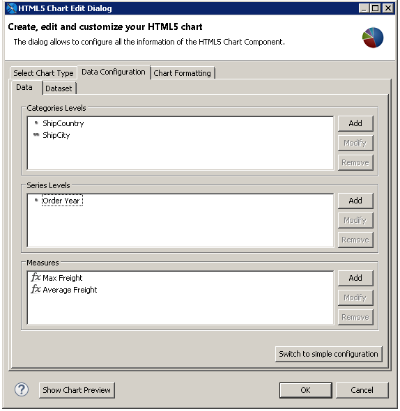
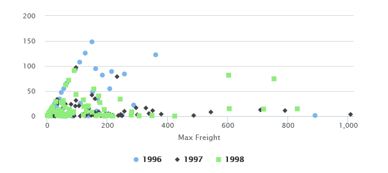

# Example of a Scatter Chart Using Advanced Configuration

Advanced configuration for HTML5 charts exposes the details of the underlying multi-dimensional dataset and gives you greater control over your charts. This example shows how to use the advanced tab to create a scatter chart.

Scatter charts plot two or more data series as points. The charts are intended to show the raw data distribution of the series. The data is represented as follows:

1.  The first data series is represented as the X values.
2.  The second data series is represented as correlated Y values.
3.  Any additional data series are also plotted as Y values correlated to the X values provided by the first series.

As a result, a scatter chart always displays one less plot than the number of data series included.

This example shows how to use advanced configuration to create a scatter chart that shows maximum and average freight in each city for each year. You can also create a scatter chart using a simple configuration view.

To create the report for the chart

1.  Create a new, blank report using the Sample DB data adapter and the query: `select * from orders`.
2.  Click **Next**.
3.  Click  to select all the fields, then click **Finish**.
4.  Delete all bands except for **Title** and **Summary**.
5.  Enlarge the Summary band to 500 pixels by changing the **Height** entry in the **Band Properties** view.

To create the chart

1.  Give your report a title like “Maximum and Average Freight in Years for City”.
2.  Drag the **HTML5 Charts** element into the summary band.
3.  Select **Scatter**. If a verification dialog is displayed, click **Yes**.
4.  Click the **Data Configuration** tab.
5.  Click **Switch to Advanced Configuration**.

|  |
|----|
|  |
| *Figure 1: Scatter Chart Properties* |

1.  Under **Categories Levels**, select Level1 and click **Modify**. Then enter the following:

- **Name**: `ShipCountry`
- **Expression**:` $F{SHIPCOUNTRY}`
- **Value Class Name**: `java.lang.String`
- **Order**: `Ascending`

Click **OK**.

1.  Under Categories Levels, click `Add` and create a second Category with the following information:

- **Name**: `ShipCity`
- **Expression**:` $F{SHIPCITY}`
- **Value Class Name**: `java.lang.String`
- **Order**: `Ascending`

Click **OK**.

1.  Under Series Level, select Series1 and click **Modify**. Then enter the following:

- **Name**: `Order Year`
- **Expression**: `YEAR($F{ORDERDATE}) `
- **Value Class Name**: `java.lang.Integer`
- **Order**: `Ascending`

Click **OK**.

1.  Under Measures, select Measure1 and click **Modify**. Then enter the following for maximum freight:

- **Name**: `Max Freight`
- **Label Expression**: `"Max Freight"`
- **Calculation**: `Highest`
- **Value Expression**: `$F{FREIGHT}`
- **Value Class Name**: `java.math.BigDecimal`

Click **OK**.

1.  Under Measures, select Measure0 and click **Modify**. Then enter the following for average freight:

- **Name**: `Average Freight`
- **Label Expression**: `"Average Freight"`
- **Calculation**: `Average`
- **Value Expression**: `$F{FREIGHT}`
- **Value Class Name**: `java.math.BigDecimal`

Click **OK**.

The chart is now configured. Click **OK** to close the dialog, then preview the chart.

|  |
|----|
|  |
| *Figure 2: Scatter chart* |
