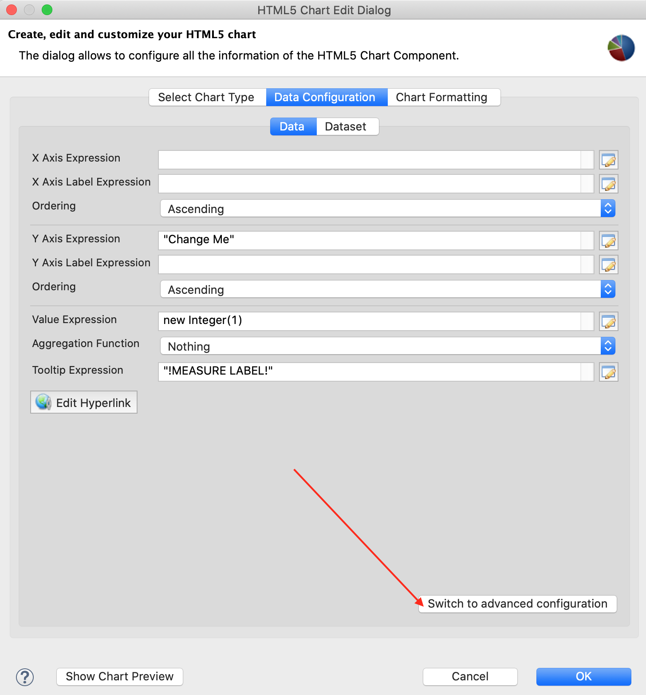
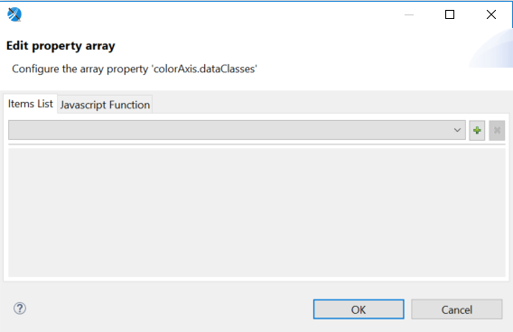
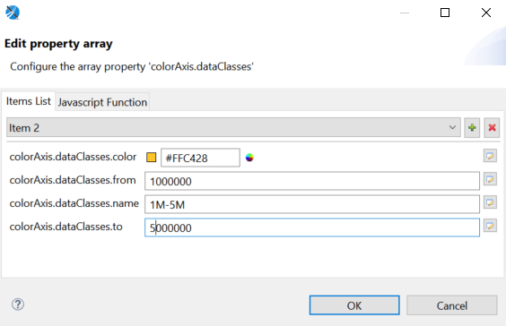
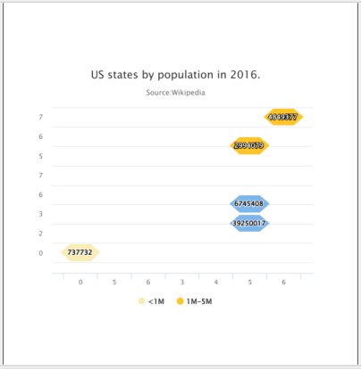

# Example of a Tile Map Chart

This example shows how to create a tile map chart.

To create the report for the chart

1.  Create a new, blank report using the Sample DB data adapter and the query:

    `SELECT "hc_a2", "name", "region", "x", "y", "population" FROM (VALUES('AL', 'Alabama', 'South', 6, 7, 4849377),('AK', 'Alaska', 'West', 0, 0, 737732),('AZ', 'Arizona', 'West', 5, 3, 6745408),('AR', 'Arkansas', 'South', 5, 6, 2994079),('CA', 'California', 'West', 5, 2, 39250017))s("hc_a2", "name","region", "x", "y", "population")`

2.  Click **Next**.

3.  Click  to select all fields, then click **Finish**.

4.  Delete all bands except for **Title** and **Summary**.

5.  Enlarge the Summary band to 500 pixels by changing the **Height** entry in the **Band Properties** view.

To create the chart

1.  Click **HTML5 Charts** in the **Components Pro** section of the **Palette**. The cursor changes to  to show that an element is selected. Click and drag in the **Summary** band to size and place the chart. The **HTML5 Chart Edit Dialog** appears.

2.  Select a chart type based on the information that you want to display. You can use the menu on the left to restrict the selection to a particular type of chart. For this example, choose **TileMap**.

3.  On the **Data Configuration** tab of the **HTML5 Chart Edit Dialog**, click **Switch to advanced configuration**.

    |  |
    |----|
    |  |
    | *Figure 1: HTML5 Charts Properties &gt; Chart Data &gt; Configuration* |

4.  Under **Categories Levels**, select Level1 and click **Modify**. Then enter the following:

-   **Expression**: `$F{y}`

    -   **Value Class Name**: `java.lang.Integer`

        Click **OK**.

        1.  Under **Series Level**, select Series1 and click **Modify**. Then enter the following:

    -   **Expression**: `$F{x}`

    -   **Value Class Name**: `java.lang.Integer`

        Click **OK**.

        1.  Under **Measures**, select Measure1 and click **Modify**. Then enter the following:

    -   **Value Expression**: `$F{population}`

    -   **Value Class Name**: `java.lang.Integer`

        Click **OK**.

        You can optionally add other hidden measures, for example:

    -   for `$F{hc_a2}`: **Value Expression**: `$F{hc_a2}` and **Value Class Name**: `java.lang.String`.

    -   for `$F{name}` - **Value Expression**: `$F{name}` and **Value Class Name**: `java.lang.String`.

        1.  Click the **Chart Formatting** tab, select **Chart &gt; Title** on the left and enter your title in the **Title** text box. For this example, enter `US states by population in 2016`.

        2.  Select **Subtitle** and enter Subtitle in the **Subtitle** text box. For this example, enter `Source: Wikipedia`.

        3.  On the **Chart Formatting** tab, select **Tilemap** on the left. You can set two additional properties of the tilemap chart: **Tile Shape** and **Color By Point**.

        4.  Select the tile shape from the drop-down. For this example, Tile Shape is Hexagon and Color By Point is set to false.

            The default tile shape is Hexagon, but you can also select Circle, Diamond, or Square. If Color By Point is set to true, any tile in the chart is colored with consecutive colors in the 'Colors' chart property. The Color By Point property can be neglected when colors are defined in the colorAxis property.

            |                                                                          |
            |--------------------------------------------------------------------------|
            |  |
            | *Figure 2: Setting Tile Shape and Color By Point*                        |

        5.  Click **Show Advanced Properties**.

        6.  To configure the chart legend, select the **colorAxis &gt; dataClasses**. Edit property array dialog appears.

            |                                                                          |
            |--------------------------------------------------------------------------|
            |  |
            | *Figure 3: Edit property array dialog*                                   |

        7.  On the Item list tab, click  to add an item. A new item is created with the name Item 1. Enter the following information.

    -   **colorAxis.dataClasses.color**: `#F9EDB3`

    -   **colorAxis.dataClasses.name**: &lt;1M

    -   **colorAxis.dataClasses.to**: 1000000

        1.  To add a second item, click  and enter the following information.

    -   **colorAxis.dataClasses.color**: `#FFC428`

    -   **colorAxis.dataClasses.from**: 1000000

    -   **colorAxis.dataClasses.name**: 1M-5M

    -   **colorAxis.dataClasses.to**: 5000000

Click **OK**.

|                                                      |
|------------------------------------------------------|
|  |
| *Figure 4: Adding Required Information for Items*    |

1.  To enable the labels to appear in each tile map, select **plotOptions &gt; tilemap &gt; dataLables** and set enabled to true.
2.  To preview the chart from inside the dialog, click **Show Chart Preview**.

|                                                                |
|----------------------------------------------------------------|
|  |
| *Figure 5: Tile Map Example*                                   |
