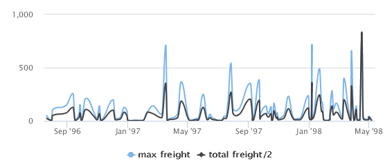

# Example of a Time-Series Spline Chart

Time-series charts illustrate data points at successive time intervals and let you follow events over time. This example shows how to create a time-series spline chart.

!!! note

    The following chart types use a similar interface: TimeSeriesLine, TimeSeriesSpline, TimeSeriesArea, TimeSeriesAreaSpline.

To create the report for the chart

1.  Create a new, blank report using the Sample DB data adapter and the query: `select * from orders`.
2.  Click **Next**.
3.  Click  to select all the fields, then click **Finish**.
4.  Delete all bands except for **Title** and **Summary**.
5.  Enlarge the Summary band to 500 pixels by changing the **Height** entry in the **Band Properties** view.

To create the chart

1.  Click  **HTML5 Charts** on the **Components Pro** section of the **Palette**. The cursor changes  to an element is selected. Drag to fill the **Summary** band of your report.

The **HTML5 Chart Edit Dialog** is displayed.

1.  Select **TimeSeriesSpline** for your chart type.
2.  Click the **Data Configuration** tab.

|  |
|----|
|  |
| *Figure 1: Simple data configuration view for time-series charts* |

1.  Enter an expression for the date in the **Date Expression** field. You can click  to use the expression editor or enter the expression manually. For this example, enter: 
    `$F{ORDERDATE}`.
2.  To use multiple series, select **Define your series manually**.
3.  Define your first series. For this example, use the following data:

- **Series**: Series 1. The name of the series is automatically generated. You cannot change it in a simple configuration.
- **Value Expression**: `$F{FREIGHT}`.
- **Aggregation Function**: Highest
- **Tooltip Expression**: "max freight"

1.  To define an additional series, click . For this example, define a second measure using the following data.

- **Series**: Series 2.
- **Value Expression**: `$F{FREIGHT}.multiply(new BigDecimal(0.5))`
- **Aggregation Function**: Sum
- **Tooltip Expression**: "total freight/2"

1.  Click **OK** to close the **HTML5 Chart Edit Dialog**.
2.  Preview the report.

|  |
|----|
|  |
| *Figure 2: Time series spline chart* |
