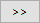
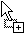
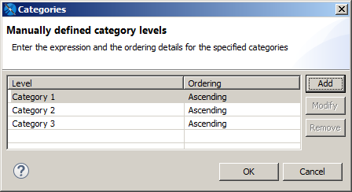
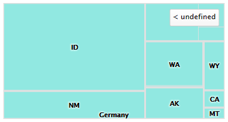
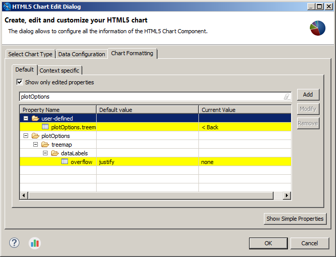
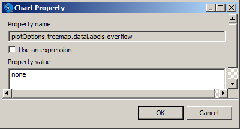
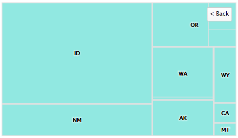

# Example of a Tree Map Using Multiple Levels and Advanced Formatting

A tree map shows hierarchical data as nested rectangles. The size of each rectangle is proportional to the measure of the data that it represents. Users can click a parent rectangle to drill through to the nest rectangles. Tree maps are a compact way of showing tree data and can help you see patterns in your data that are difficult to see in other ways.

This example shows a tree map for three levels of data: country, region, and city. The dialog shown in this example is used for TreeMap and OneParentTreeMap.

## Creating a Tree Map

To create the report for the chart

1.  Create a new, blank report using the Sample DB data adapter and the query: `select * from orders order by shipcountry`.
2.  Click **Next**.
3.  Click  to select all fields, then click **Finish**.
4.  Delete all bands except for **Title** and **Summary**.
5.  Enlarge the **Summary** band to 500 pixels by changing the **Height** entry in the **Band Properties** view.

To create the chart

1.  Click  **HTML5 Charts** in the **Components Pro** section of the **Palette**. The cursor changes  to show that an element is selected. Click and drag in the **Summary** band to size and place the chart.

    The **HTML5 Chart Edit Dialog** is displayed.

2.  Select your chart type. For this example, select **TreeMap**.

3.  Click the **Data Configuration** tab.

    The **HTML5 Chart Edit Dialog** is displayed.

4.  Click  next to **Levels**.

    The **Categories** dialog opens.

    |  |
    |----|
    |  |
    | *Figure 1: Defining Multiple Categories in a Chart* |

5.  Select **Category 1** and click **Modify**.

    The **Expression Editor** is displayed.

6.  Enter your highest level of data for **Category 1** then click **Finish**. For this example, enter:<br>
    `$F{SHIPCOUNTRY}`.

7.  Click **Add** in the **Categories** dialog, enter `$F{SHIPREGION}`, and click **Finish**.

8.  Click **Add** in the **Categories** dialog, enter `$F{SHIPCITY}`, and click **Finish**.

9.  When you have created all your levels, click **OK** to return to the **HTML5 Chart Edit Dialog**.

10. Enter the following to create the measure:

-   **Value Expression**: `$F{FREIGHT}.doubleValue()`

    -   **Aggregation Function**: Sum
    -   **Tooltip Expression**: "Total Freight"

1.  Click **OK**, and save and preview the chart as HTML.

## Using Advanced Formatting Properties

When you preview the chart as HTML, you can click a rectangle to zoom in. However, you can see some problems with the chart view.

|  |
|----|
|  |
| *Figure 2: Tree Map After Drill Through, Showing Formatting Issues* |

-   When a country, such as the USA, is selected, the adjacent country is shown on the chart.

-   The label to return to a higher level reads **undefined**.

You can use advanced formatting to set these properties. For more information about advanced formatting, see [1.1, “Advanced Formatting of HTML5 Charts,” on page 1](html5-charts-advanced-formatting.md)

To set advanced properties for the chart

1.  Return to **Design** view and double-click the chart to open the **HTML5 Chart Edit Dialog**.

2.  Click the **Chart Formatting** tab and click **Show Advanced Properties**.

    |  |
    |----|
    |  |
    | *Figure 3: Advanced Formatting Properties* |

3.  Click **Add**.

4.  The **Chart Property** dialog is displayed.

    |  |
    |----|
    |  |
    | *Figure 4: Setting Advanced Chart Formatting* |

5.  To prevent the names of other countries from showing on the border of the charts, enter the following, then click **OK**:

-   **Property name**: `plotOptions.treemap.dataLabels.overflow`

    -   **Property value**: `none`

        1.  To change the text of the button, click **Add**, enter the following, then click **OK**:

    -   **Property name**: `plotOptions.treemap.drillUpButton.text`

    -   **Property value**: `Back`

1.  Click **OK** to apply your properties and return to **Design** view.

Preview the chart in HTML to drill through and see your changes.

|  |
|----|
|  |
| *Figure 5: Tree map after formatting issues have been corrected* |

!!! note

    Static Highcharts properties are always recognized as `String`. If you have problems setting a static Boolean or numeric property, set it as an expression. For example, to set `plotOptions.series.dataLabels.enabled` to `false`, use the following JRXML:

    ``` xml
    <hc:chartPropertyname="plotOptions.series.dataLabels.enabled">
       <hc:propertyExpression><![CDATA[false]]></hc:propertyExpression>
    </hc:chartProperty>
    ```
