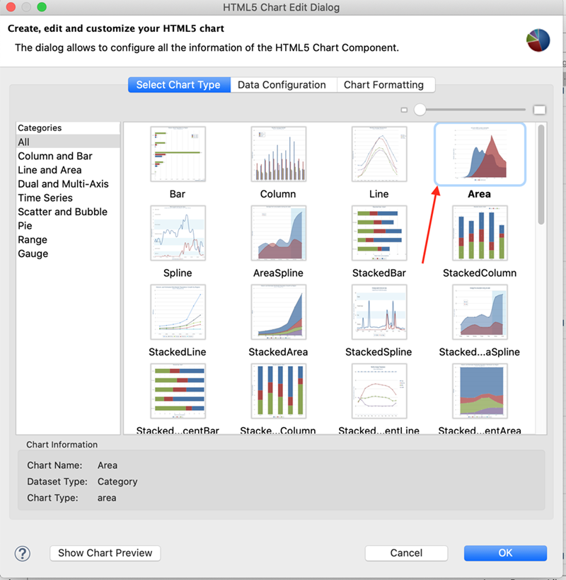
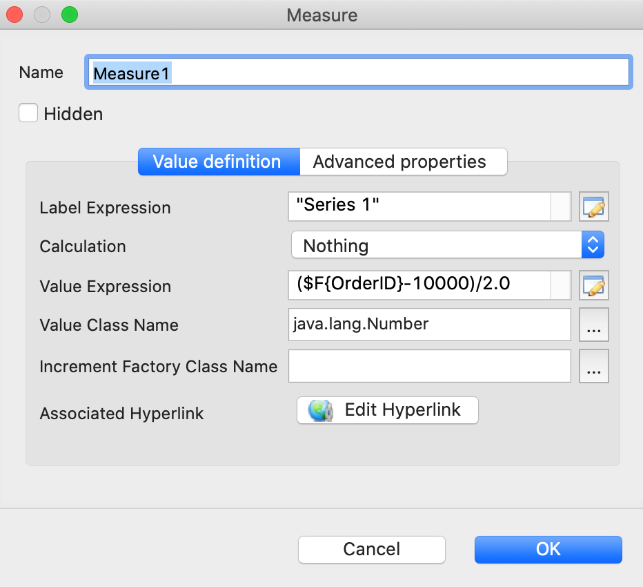
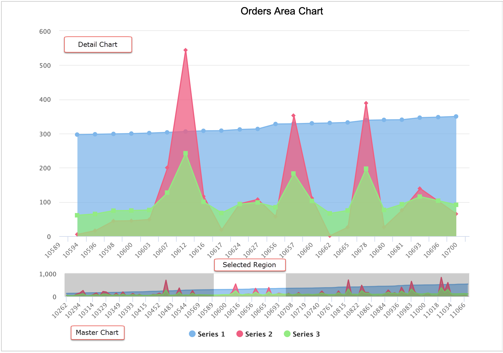

# Master-detail Chart

A Master-detail chart is used to illustrate a large amount of data in the simplest way. It has two interactive charts, a master chart and a detail chart. You can select a horizontal region on the master chart and the detail chart boundaries on the X-axis change to the selected area boundaries. This lets you see a detailed view of the data on the chart by selecting a region on the master chart.

This feature is supported by all HTML5 charts except the following:

- Pie Charts

- Gauge Charts

- Spider Charts

- Horizontal Bar Charts

- Tile Map Charts

This example shows how to create a Master-detail chart.

To create the report for the chart

1.  Create a new, blank report using the Sample DB data adapter and the query: `select * from orders where shipcountry = 'USA' order by orderid`.
2.  Click **Next**.
3.  Click  to select all the fields, then click **Finish**.
4.  Delete all bands except for **Title** and **Summary**.
5.  Enlarge the Summary band to 700 pixels by changing the **Height** entry in the **Band Properties** view.

To create the chart

1.  Click  **HTML5 Charts** on the **Components Pro** section of the **Palette**. The cursor changes to an element that is selected. Drag to fill the **Summary** band of your report. The **HTML5 Chart Edit Dialog** is displayed.

2.  Select an **Area** for your chart type.

    |                                    |
    |------------------------------------|
    |  |
    | *Figure 1: Area Chart Type*        |

3.  Click the **Data Configuration** tab.

4.  Click **Switch to Advanced Configuration**.

5.  Under **Categories Levels**, click **Add** to create a category level. For this example, enter the following data:

    - **Category Expression**: `$F{ORDERID}`

6.  Under **Measures**, click **Add** and define the first measure. For this example, use the following data:

    - **Name**: "Measure1"
    - **Label Expression**: "Series 1"
    - **Value Expression**: `($F{OrderID}-10000)/2.0`
    - **Value Class Name**: `java.lang.Number`

    Click OK.

    |                                          |
    |------------------------------------------|
    |  |
    | *Figure 2: Defining the Measure*         |

7.  To define an additional measure, click **Add**. For this example, define a second measure using the following data.

    - **Name**: "Measure2"
    - **Label Expression**: "Series 2"
    - **Value Expression**: `$F{FREIGHT}`
    - **Value Class Name**: `java.lang.Number`

    Click **OK**.

8.  Add a third measure with the following data:

    - **Name**: "Measure3"
    - **Label Expression**: "Series 3"
    - **Value Expression**: `$F{FREIGHT}/3.0 + ($F{OrderID}-10000)/10.0`
    - **Value Class Name**: `java.lang.Number`

    Click **OK**.

9.  On the **Chart Formatting** tab, select **Colors Palette** and add colors for the three measures. You can set the colors manually or from the existing options.

    |                                                        |
    |--------------------------------------------------------|
    |  |
    | *Figure 3: Selecting Color for Measure*                |

10. Click **OK** to close the HTML5 Chart Edit dialog.

11. In the **Properties** view for the chart element, click the **Advanced** tab.

12. Go to **Highcharts** and set **Detail Chart Enabled** to `true`.

13. Preview the report.

|  |
|----|
|  |
| *Figure 4: Master-detail Chart* |

!!! note

    Unlike HTML output, other output formats like PDF, PPTX, Excel, display the master chart only because there is no interactivity in these formats.
