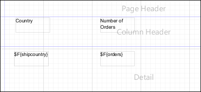
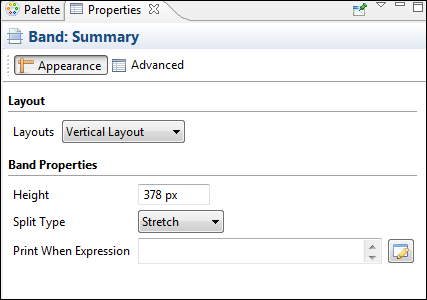
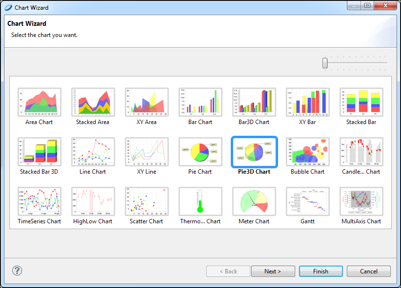
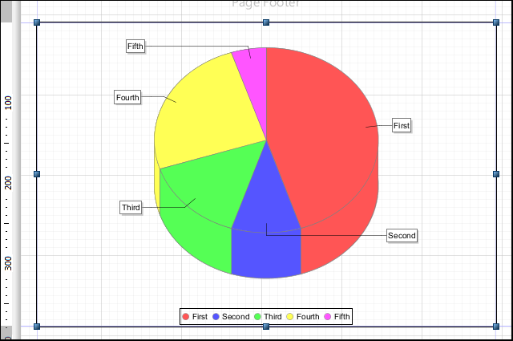
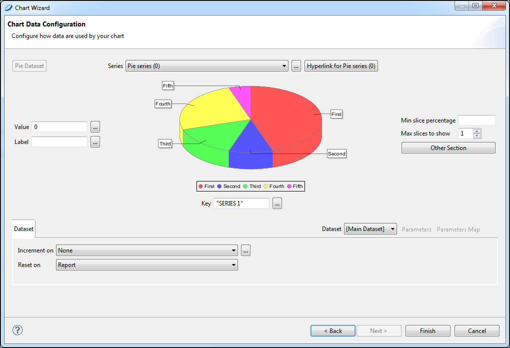
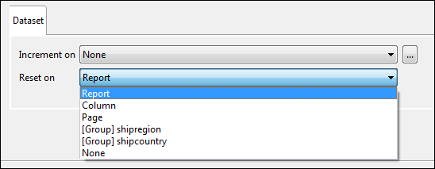
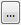
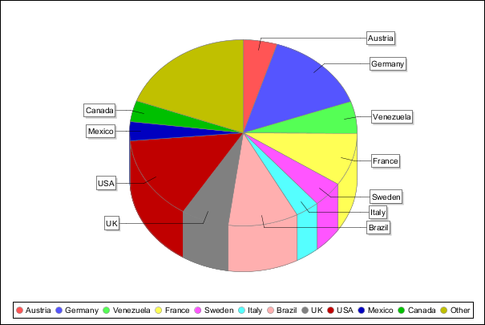

# Creating a Simple Chart

This section shows you how to use the Chart tool to build a report containing a Pie 3D chart and explore chart configuration.

To add a chart to a report

1.  Create a report using the Sugar CRM data source.
2.  Use this query to display the count of orders in different countries:

`select COUNT(*) as orders, shipcountry from orders group by shipcountry`

1.  Drag the fields from the **Outline** to the **Detail** band to create a small table of values to display in the chart.

|  |
|----|
|  |
| *Figure 1: Initial Report Design* |

1.  Expand the **Summary** band to 378 pixels.

|                                                                          |
|--------------------------------------------------------------------------|
|  |
| *Figure 2: Summary Band Properties*                                      |

1.  Drag the Chart tool from the Palette into the Summary band. The **Chart Wizard** opens.

|                                                    |
|----------------------------------------------------|
|  |
| *Figure 3: Chart Wizard*                           |

1.  Select the **Pie 3D Chart** and click **Next**.
2.  Accept the default configuration and click **Finish**.
3.  Expand the chart to fit the Summary band.

|                                                                |
|----------------------------------------------------------------|
|  |
| *Figure 4: Chart in Summary Band*                              |

!!! note

    In the Design tab, the chart is a placeholder and does not display your data.

To configure a chart

1.  Double-click the chart. The **Chart Data Configuration** window opens.

|                                                              |
|--------------------------------------------------------------|
|  |
| *Figure 5: **Chart Wizard - Chart Data Configuration***      |

1.  Select the data to use in your chart.

!!! note

    The **Chart Data** tab shows the fields within the specified dataset. You find detailed descriptions of field types and their functionality in JasperReports Library Ultimate Guide.

1.  Set `10` for **Max slices to show**. For a chart of many slices, this field specifies the number to show. A chart slice labeled Other contains the slices not shown. 
2.  On the **Dataset** tab, you can define the dataset within the context of the report.

You can use the **Reset on** controls to reset the dataset periodically. This is useful, for example, when summarizing data relative to a special grouping. Use the **Increment on** control to specify the events that trigger the addition of new values to the dataset. By default, each record of the chart's dataset corresponds to a value printed in the chart. You can change this behavior and force the engine to collect data at a specific time (for instance, every time the end of a group is reached).

Set **Reset on** to **Report** since you do not want the data to be reset, and leave **Increment Type** set to **None** so that each record is appended to your dataset.

|                                                              |
|--------------------------------------------------------------|
|  |
| *Figure 6: Dataset Tab*                                      |

1.  Also in the **Chart Data Configuration** dialog, enter an expression to associate with each value in the data source. For a Pie 3D chart, three expressions can be entered: `key`, `value`, and `label`.

- **Key expression** identifies a slice of the chart. Each key expression must be a unique. Any repeated key simply overwrites the duplicate key. A key can never be `null`.
- **Value expression** specifies the numeric value of the key.
- **Label expression** specifies the label of a pie chart slice. This is the key expression by default.

Next to each field, click the button. Enter the following:

**Value**: `$F{orders}`

**Label**:` $F{shipcountry}`

**Key**: `$F{shipcountry}`

1.  Click **Finish**.
2.  Save your report, and preview it to see the result.

|                                                    |
|----------------------------------------------------|
|  |
| *Figure 7: Final Chart*                            |

In this chart, each slice represents a country and the shipping total for that country.
