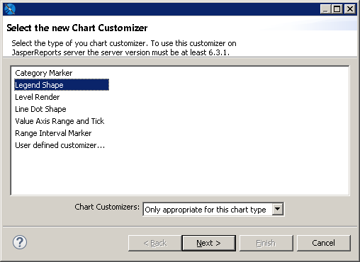
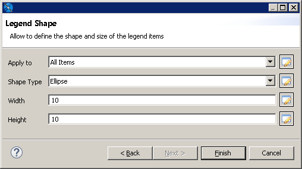
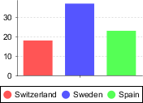

# Chart Customizers

Chart customizers are Java classes that change the appearance of charts. Chart customizers let you implement JFreeChart functionality that has not been directly included in JasperReports. For example, you can use chart customizer classes to change the shape of the legend icons in a chart or change the colors or pattern of the bars in a bar chart.

Jaspersoft Studio provides a simple UI for applying chart customizers. This includes a number of out-of-the-box customizers for common configurations as well as a mechanism to let you add your own customizers to the UI. In addition, if you create a configurable customizer, that is, a customizer that lets the user set values in the report rather than hard-coding them, you can create a user interface for it using a JSON file.

## Using Chart Customizers

### Adding a Chart Customizer to a Chart

To apply an existing customizer to a chart:

1.  Select your chart in **Design** view.

2.  On the **Chart** tab of the **Properties** view, click **Add** next to the **Chart Customizers** section.

    The **Select the newChart Customizer** dialog is displayed. By default, only chart customizers that support your current chart type are shown.

    |  |
    |----|
    |  |
    | *Figure 1: Chart customizer selection dialog* |

3.  Select a chart customizer from the list.

    If the customizer is configurable and has a user interface, the **Next** button is available. Otherwise, the **Finish** button is available.

4.  Click **Next** if it is available.

    The user interface for the customizer is displayed. For example, the interface for **Legend Shape** is shown below.

    |  |
    |----|
    |  |
    | *Figure 2: User interface for a chart customizer* |

5.  Fill in the properties as prompted by the user interface. For example, the following values for **Legend Shape** change the legend to a circle:

    - **Apply to**: All Items
    - **Shape Type**: Ellipse
    - **Width**: 10
    - **Height**: 10

6.  Click **Finish**.

The customizer selection dialog is closed and the customizer is applied to your chart. Click **Preview** to view your chart.

|  |
|----|
|  |
| *Figure 3: Result of chart customizer* |

### Adding a Customizer to a Chart in Earlier Versions of Jaspersoft Studio

You can add a customizer to a chart in an earlier version of Jaspersoft Studio using advanced properties. You cannot add more than one customizer and the customizer cannot be configurable. For more information about creating a customizer jar, see 1.1.3, “Creating a Chart Customizer,” on page 1:

1.  Add the customizer jar to your classpath.

2.  Select the chart in **Design** view.

3.  In the **Advanced** tab of the **Properties** view, click **…** next to **Common Chart Properties \>Customizer Class**.

    The **Open Type** dialog is displayed.

4.  Enter the name of your class in the **Open Type** dialog and click **OK**.

## Creating a Chart Customizer

To create a chart customizer, you must extend or implement `JRAbstractChartCustomizer`, which defines a `customize` method that takes a JFreeChart object and a JasperReports chart object as parameters. The `customize` method lets you access the settings for a chart. You can also create configurable chart customizers.

JasperReports Library provides customizer classes that extend `JRAbstractChartCustomizer`, which you can use for your chart customizers. To see the available customizer classes, see the Javadoc for the JasperReports Library API. You can also download the JasperReports Library source and look at the samples in the `demo/samples/chartcustomizer` directory.

Jaspersoft Studio uses a JSON descriptor format to register certain components and optionally create a UI for the component. This framework is used for JFreeChart customizers as well as being used internally.

### Example of Creating a Customizer Class

The following example shows a customizer, `RangeAxisCustomizerSample`, and a JSON file for the user interface. This example allows the user to set the maximum and minimum values on the X and Y axis and to set the interval for the ticks on the Y axis.

To use this customizer in a report:

1.  Create and compile the customizer and add the jar to your classpath. For information about compiling your files with Jaspersoft Studio and Eclipse, see [Working with Java in Eclipse](../java-perspective-in-eclipse.md).
2.  Create a JSON file that references your customizer and defines its UI.
3.  Add the JSON file to the Jaspersoft Studio user interface.

To create the example customizer class

A customizer class takes two arguments, a JFreeChart and a JasperReports Chart object. The `RangeAxisCustomizerSample` customizer extends the `AbstractAxisCustomizer` class, which is an extension of `JRAbstractChartCustomizer` for working with axis properties. `AbstractAxisCustomizer` exposes three constants for a chart axis: the minimum and maximum values on the Y axis and the spacing of the ticks on the Y-axis display:

<table>
<caption><p>Constants in the AbstractAxisCustomizer class</p></caption>
<colgroup>
<col style="width: 100%" />
</colgroup>
<tbody>
<tr>
<td><div class="sourceCode" id="cb1"><pre class="sourceCode java"><code class="sourceCode java"><span id="cb1-1"><a href="#cb1-1" aria-hidden="true" tabindex="-1"></a><span class="kw">public</span> <span class="dt">static</span> <span class="dt">final</span> <span class="bu">String</span> PROPERTY_MIN_VALUE <span class="op">=</span> <span class="st">&quot;minValue&quot;</span><span class="op">;</span></span>
<span id="cb1-2"><a href="#cb1-2" aria-hidden="true" tabindex="-1"></a><span class="kw">public</span> <span class="dt">static</span> <span class="dt">final</span> <span class="bu">String</span> PROPERTY_MAX_VALUE <span class="op">=</span> <span class="st">&quot;maxValue&quot;</span><span class="op">;</span></span>
<span id="cb1-3"><a href="#cb1-3" aria-hidden="true" tabindex="-1"></a><span class="kw">public</span> <span class="dt">static</span> <span class="dt">final</span> <span class="bu">String</span> PROPERTY_TICK_UNIT <span class="op">=</span> <span class="st">&quot;tickUnit&quot;</span><span class="op">;</span></span></code></pre></div></td>
</tr>
</tbody>
</table>

A chart customizer defines a `customize` method that takes a JFreeChart object and a JRChart object. The customize method can access chart settings and change them. During report execution, JasperReports calls the `customize` method for the chart and applies the settings, along with the settings from the JSON file. `RangeAxisCustomizerSample` is as shown below.

<table>
<caption><p>RangeAxisCustomizerSample</p></caption>
<colgroup>
<col style="width: 100%" />
</colgroup>
<tbody>
<tr>
<td><div class="sourceCode" id="cb1"><pre class="sourceCode java"><code class="sourceCode java"><span id="cb1-1"><a href="#cb1-1" aria-hidden="true" tabindex="-1"></a><span class="kw">package</span><span class="im"> com</span><span class="op">.</span><span class="im">jaspersoft</span><span class="op">.</span><span class="im">studio</span><span class="op">.</span><span class="im">sample</span><span class="op">.</span><span class="im">customizer</span><span class="op">;</span></span>
<span id="cb1-2"><a href="#cb1-2" aria-hidden="true" tabindex="-1"></a></span>
<span id="cb1-3"><a href="#cb1-3" aria-hidden="true" tabindex="-1"></a><span class="kw">import</span> <span class="im">org</span><span class="op">.</span><span class="im">jfree</span><span class="op">.</span><span class="im">chart</span><span class="op">.</span><span class="im">JFreeChart</span><span class="op">;</span></span>
<span id="cb1-4"><a href="#cb1-4" aria-hidden="true" tabindex="-1"></a><span class="kw">import</span> <span class="im">org</span><span class="op">.</span><span class="im">jfree</span><span class="op">.</span><span class="im">chart</span><span class="op">.</span><span class="im">axis</span><span class="op">.</span><span class="im">NumberAxis</span><span class="op">;</span></span>
<span id="cb1-5"><a href="#cb1-5" aria-hidden="true" tabindex="-1"></a><span class="kw">import</span> <span class="im">org</span><span class="op">.</span><span class="im">jfree</span><span class="op">.</span><span class="im">chart</span><span class="op">.</span><span class="im">axis</span><span class="op">.</span><span class="im">ValueAxis</span><span class="op">;</span></span>
<span id="cb1-6"><a href="#cb1-6" aria-hidden="true" tabindex="-1"></a><span class="kw">import</span> <span class="im">org</span><span class="op">.</span><span class="im">jfree</span><span class="op">.</span><span class="im">chart</span><span class="op">.</span><span class="im">plot</span><span class="op">.</span><span class="im">CategoryPlot</span><span class="op">;</span></span>
<span id="cb1-7"><a href="#cb1-7" aria-hidden="true" tabindex="-1"></a><span class="kw">import</span> <span class="im">org</span><span class="op">.</span><span class="im">jfree</span><span class="op">.</span><span class="im">chart</span><span class="op">.</span><span class="im">plot</span><span class="op">.</span><span class="im">XYPlot</span><span class="op">;</span></span>
<span id="cb1-8"><a href="#cb1-8" aria-hidden="true" tabindex="-1"></a></span>
<span id="cb1-9"><a href="#cb1-9" aria-hidden="true" tabindex="-1"></a><span class="kw">import</span> <span class="im">net</span><span class="op">.</span><span class="im">sf</span><span class="op">.</span><span class="im">jasperreports</span><span class="op">.</span><span class="im">customizers</span><span class="op">.</span><span class="im">axis</span><span class="op">.</span><span class="im">AbstractAxisCustomizer</span><span class="op">;</span></span>
<span id="cb1-10"><a href="#cb1-10" aria-hidden="true" tabindex="-1"></a><span class="kw">import</span> <span class="im">net</span><span class="op">.</span><span class="im">sf</span><span class="op">.</span><span class="im">jasperreports</span><span class="op">.</span><span class="im">engine</span><span class="op">.</span><span class="im">JRChart</span><span class="op">;</span></span>
<span id="cb1-11"><a href="#cb1-11" aria-hidden="true" tabindex="-1"></a></span>
<span id="cb1-12"><a href="#cb1-12" aria-hidden="true" tabindex="-1"></a><span class="co">/**</span></span>
<span id="cb1-13"><a href="#cb1-13" aria-hidden="true" tabindex="-1"></a> <span class="co">*</span> Customizer to define the minimum and maximum value of the domain axis<span class="co">,</span> works for </span>
<span id="cb1-14"><a href="#cb1-14" aria-hidden="true" tabindex="-1"></a> <span class="co">*</span> XY plot</span>
<span id="cb1-15"><a href="#cb1-15" aria-hidden="true" tabindex="-1"></a> <span class="co">*/</span></span>
<span id="cb1-16"><a href="#cb1-16" aria-hidden="true" tabindex="-1"></a><span class="kw">public</span> <span class="kw">class</span> RangeAxisCustomizerSample <span class="kw">extends</span> AbstractAxisCustomizer</span>
<span id="cb1-17"><a href="#cb1-17" aria-hidden="true" tabindex="-1"></a><span class="op">{</span></span>
<span id="cb1-18"><a href="#cb1-18" aria-hidden="true" tabindex="-1"></a>    <span class="at">@Override</span></span>
<span id="cb1-19"><a href="#cb1-19" aria-hidden="true" tabindex="-1"></a>    <span class="kw">public</span> <span class="dt">void</span> <span class="fu">customize</span><span class="op">(</span>JFreeChart jfc<span class="op">,</span> JRChart jrc<span class="op">)</span> </span>
<span id="cb1-20"><a href="#cb1-20" aria-hidden="true" tabindex="-1"></a>    <span class="op">{</span></span>
<span id="cb1-21"><a href="#cb1-21" aria-hidden="true" tabindex="-1"></a>        ValueAxis valueAxis <span class="op">=</span> <span class="kw">null</span><span class="op">;</span></span>
<span id="cb1-22"><a href="#cb1-22" aria-hidden="true" tabindex="-1"></a></span>
<span id="cb1-23"><a href="#cb1-23" aria-hidden="true" tabindex="-1"></a>        <span class="cf">if</span> <span class="op">((</span>jfc<span class="op">.</span><span class="fu">getPlot</span><span class="op">()</span> <span class="kw">instanceof</span> XYPlot<span class="op">))</span></span>
<span id="cb1-24"><a href="#cb1-24" aria-hidden="true" tabindex="-1"></a>        <span class="op">{</span></span>
<span id="cb1-25"><a href="#cb1-25" aria-hidden="true" tabindex="-1"></a>            valueAxis <span class="op">=</span> jfc<span class="op">.</span><span class="fu">getXYPlot</span><span class="op">().</span><span class="fu">getRangeAxis</span><span class="op">();</span></span>
<span id="cb1-26"><a href="#cb1-26" aria-hidden="true" tabindex="-1"></a>        <span class="op">}</span></span>
<span id="cb1-27"><a href="#cb1-27" aria-hidden="true" tabindex="-1"></a>        <span class="cf">else</span> <span class="cf">if</span> <span class="op">(</span>jfc<span class="op">.</span><span class="fu">getPlot</span><span class="op">()</span> <span class="kw">instanceof</span> CategoryPlot<span class="op">)</span></span>
<span id="cb1-28"><a href="#cb1-28" aria-hidden="true" tabindex="-1"></a>        <span class="op">{</span></span>
<span id="cb1-29"><a href="#cb1-29" aria-hidden="true" tabindex="-1"></a>            valueAxis <span class="op">=</span> jfc<span class="op">.</span><span class="fu">getCategoryPlot</span><span class="op">().</span><span class="fu">getRangeAxis</span><span class="op">();</span></span>
<span id="cb1-30"><a href="#cb1-30" aria-hidden="true" tabindex="-1"></a>        <span class="op">}</span></span>
<span id="cb1-31"><a href="#cb1-31" aria-hidden="true" tabindex="-1"></a></span>
<span id="cb1-32"><a href="#cb1-32" aria-hidden="true" tabindex="-1"></a>        <span class="cf">if</span> <span class="op">(</span>valueAxis <span class="op">!=</span> <span class="kw">null</span><span class="op">)</span></span>
<span id="cb1-33"><a href="#cb1-33" aria-hidden="true" tabindex="-1"></a>        <span class="op">{</span></span>
<span id="cb1-34"><a href="#cb1-34" aria-hidden="true" tabindex="-1"></a>        <span class="fu">configValueAxis</span><span class="op">(</span>valueAxis<span class="op">,</span> PROPERTY_MIN_VALUE<span class="op">,</span> PROPERTY_MAX_VALUE<span class="op">);</span></span>
<span id="cb1-35"><a href="#cb1-35" aria-hidden="true" tabindex="-1"></a></span>
<span id="cb1-36"><a href="#cb1-36" aria-hidden="true" tabindex="-1"></a>        <span class="cf">if</span> <span class="op">(</span>valueAxis <span class="kw">instanceof</span> NumberAxis<span class="op">)</span></span>
<span id="cb1-37"><a href="#cb1-37" aria-hidden="true" tabindex="-1"></a>        <span class="op">{</span></span>
<span id="cb1-38"><a href="#cb1-38" aria-hidden="true" tabindex="-1"></a>            <span class="fu">configNumberAxis</span><span class="op">((</span>NumberAxis<span class="op">)</span>valueAxis<span class="op">,</span> PROPERTY_TICK_UNIT<span class="op">);</span></span>
<span id="cb1-39"><a href="#cb1-39" aria-hidden="true" tabindex="-1"></a>        <span class="op">}</span></span>
<span id="cb1-40"><a href="#cb1-40" aria-hidden="true" tabindex="-1"></a>        <span class="op">}</span></span>
<span id="cb1-41"><a href="#cb1-41" aria-hidden="true" tabindex="-1"></a>    <span class="op">}</span></span>
<span id="cb1-42"><a href="#cb1-42" aria-hidden="true" tabindex="-1"></a><span class="op">}</span></span></code></pre></div></td>
</tr>
</tbody>
</table>

Example of a JSON file for the user interface

The following JSON file lets the user enter values for the configurable properties in RangeAxisCustomizerSample. The JSON file uses the generic framework for the Jaspersoft Studio user interface.

<table>
<colgroup>
<col style="width: 100%" />
</colgroup>
<tbody>
<tr>
<td><div class="sourceCode" id="cb1"><pre class="sourceCode json"><code class="sourceCode json"><span id="cb1-1"><a href="#cb1-1" aria-hidden="true" tabindex="-1"></a><span class="fu">{</span></span>
<span id="cb1-2"><a href="#cb1-2" aria-hidden="true" tabindex="-1"></a>    <span class="dt">&quot;label&quot;</span><span class="fu">:</span> <span class="st">&quot;Range Axis Range and Tick - Sample&quot;</span><span class="fu">,</span></span>
<span id="cb1-3"><a href="#cb1-3" aria-hidden="true" tabindex="-1"></a>    <span class="dt">&quot;description&quot;</span><span class="fu">:</span> <span class="st">&quot;Customizer to set the range for the axes and the tick spacing for an axis chart.&quot;</span><span class="fu">,</span></span>
<span id="cb1-4"><a href="#cb1-4" aria-hidden="true" tabindex="-1"></a>    <span class="dt">&quot;customizerClass&quot;</span><span class="fu">:</span> <span class="st">&quot;com.jaspersoft.studio.sample.customizer.RangeAxisCustomizerSample&quot;</span><span class="fu">,</span></span>
<span id="cb1-5"><a href="#cb1-5" aria-hidden="true" tabindex="-1"></a>    <span class="dt">&quot;supportedPlot&quot;</span><span class="fu">:</span> <span class="ot">[</span><span class="st">&quot;13&quot;</span><span class="ot">,</span><span class="st">&quot;14&quot;</span><span class="ot">,</span><span class="st">&quot;15&quot;</span><span class="ot">]</span><span class="fu">,</span></span>
<span id="cb1-6"><a href="#cb1-6" aria-hidden="true" tabindex="-1"></a>    <span class="dt">&quot;sections&quot;</span><span class="fu">:</span> <span class="ot">[</span></span>
<span id="cb1-7"><a href="#cb1-7" aria-hidden="true" tabindex="-1"></a>        <span class="fu">{</span></span>
<span id="cb1-8"><a href="#cb1-8" aria-hidden="true" tabindex="-1"></a>            <span class="dt">&quot;name&quot;</span><span class="fu">:</span> <span class="st">&quot;Customizer configuration&quot;</span><span class="fu">,</span></span>
<span id="cb1-9"><a href="#cb1-9" aria-hidden="true" tabindex="-1"></a>            <span class="dt">&quot;expandable&quot;</span><span class="fu">:</span> <span class="kw">false</span><span class="fu">,</span></span>
<span id="cb1-10"><a href="#cb1-10" aria-hidden="true" tabindex="-1"></a>            <span class="dt">&quot;properties&quot;</span><span class="fu">:</span> <span class="ot">[</span></span>
<span id="cb1-11"><a href="#cb1-11" aria-hidden="true" tabindex="-1"></a>                <span class="fu">{</span></span>
<span id="cb1-12"><a href="#cb1-12" aria-hidden="true" tabindex="-1"></a>                    <span class="dt">&quot;name&quot;</span><span class="fu">:</span> <span class="st">&quot;minValue&quot;</span><span class="fu">,</span></span>
<span id="cb1-13"><a href="#cb1-13" aria-hidden="true" tabindex="-1"></a>                    <span class="dt">&quot;label&quot;</span><span class="fu">:</span> <span class="st">&quot;Range Min&quot;</span><span class="fu">,</span></span>
<span id="cb1-14"><a href="#cb1-14" aria-hidden="true" tabindex="-1"></a>                    <span class="dt">&quot;description&quot;</span><span class="fu">:</span> <span class="st">&quot;The minimum value on the axis&quot;</span><span class="fu">,</span></span>
<span id="cb1-15"><a href="#cb1-15" aria-hidden="true" tabindex="-1"></a>                    <span class="dt">&quot;mandatory&quot;</span><span class="fu">:</span> <span class="kw">false</span><span class="fu">,</span></span>
<span id="cb1-16"><a href="#cb1-16" aria-hidden="true" tabindex="-1"></a>                    <span class="dt">&quot;readOnly&quot;</span><span class="fu">:</span> <span class="kw">false</span><span class="fu">,</span></span>
<span id="cb1-17"><a href="#cb1-17" aria-hidden="true" tabindex="-1"></a>                    <span class="dt">&quot;type&quot;</span><span class="fu">:</span> <span class="st">&quot;double&quot;</span></span>
<span id="cb1-18"><a href="#cb1-18" aria-hidden="true" tabindex="-1"></a>                <span class="fu">}</span><span class="ot">,</span></span>
<span id="cb1-19"><a href="#cb1-19" aria-hidden="true" tabindex="-1"></a>                <span class="fu">{</span></span>
<span id="cb1-20"><a href="#cb1-20" aria-hidden="true" tabindex="-1"></a>                    <span class="dt">&quot;name&quot;</span><span class="fu">:</span> <span class="st">&quot;maxValue&quot;</span><span class="fu">,</span></span>
<span id="cb1-21"><a href="#cb1-21" aria-hidden="true" tabindex="-1"></a>                    <span class="dt">&quot;label&quot;</span><span class="fu">:</span> <span class="st">&quot;Range Max&quot;</span><span class="fu">,</span></span>
<span id="cb1-22"><a href="#cb1-22" aria-hidden="true" tabindex="-1"></a>                    <span class="dt">&quot;description&quot;</span><span class="fu">:</span> <span class="st">&quot;The maximum value on the axis&quot;</span><span class="fu">,</span></span>
<span id="cb1-23"><a href="#cb1-23" aria-hidden="true" tabindex="-1"></a>                    <span class="dt">&quot;mandatory&quot;</span><span class="fu">:</span> <span class="kw">false</span><span class="fu">,</span></span>
<span id="cb1-24"><a href="#cb1-24" aria-hidden="true" tabindex="-1"></a>                    <span class="dt">&quot;readOnly&quot;</span><span class="fu">:</span> <span class="kw">false</span><span class="fu">,</span></span>
<span id="cb1-25"><a href="#cb1-25" aria-hidden="true" tabindex="-1"></a>                    <span class="dt">&quot;type&quot;</span><span class="fu">:</span> <span class="st">&quot;double&quot;</span></span>
<span id="cb1-26"><a href="#cb1-26" aria-hidden="true" tabindex="-1"></a>                <span class="fu">}</span><span class="ot">,</span></span>
<span id="cb1-27"><a href="#cb1-27" aria-hidden="true" tabindex="-1"></a>                <span class="fu">{</span></span>
<span id="cb1-28"><a href="#cb1-28" aria-hidden="true" tabindex="-1"></a>                    <span class="dt">&quot;name&quot;</span><span class="fu">:</span> <span class="st">&quot;tickUnit&quot;</span><span class="fu">,</span></span>
<span id="cb1-29"><a href="#cb1-29" aria-hidden="true" tabindex="-1"></a>                    <span class="dt">&quot;label&quot;</span><span class="fu">:</span> <span class="st">&quot;Distance&quot;</span><span class="fu">,</span></span>
<span id="cb1-30"><a href="#cb1-30" aria-hidden="true" tabindex="-1"></a>                    <span class="dt">&quot;description&quot;</span><span class="fu">:</span> <span class="st">&quot;The space between ticks.&quot;</span><span class="fu">,</span></span>
<span id="cb1-31"><a href="#cb1-31" aria-hidden="true" tabindex="-1"></a>                    <span class="dt">&quot;mandatory&quot;</span><span class="fu">:</span> <span class="kw">false</span><span class="fu">,</span></span>
<span id="cb1-32"><a href="#cb1-32" aria-hidden="true" tabindex="-1"></a>                    <span class="dt">&quot;defaultValue&quot;</span><span class="fu">:</span> <span class="st">&quot;1&quot;</span><span class="fu">,</span></span>
<span id="cb1-33"><a href="#cb1-33" aria-hidden="true" tabindex="-1"></a>                    <span class="dt">&quot;readOnly&quot;</span><span class="fu">:</span> <span class="kw">false</span><span class="fu">,</span></span>
<span id="cb1-34"><a href="#cb1-34" aria-hidden="true" tabindex="-1"></a>                    <span class="dt">&quot;type&quot;</span><span class="fu">:</span> <span class="st">&quot;double&quot;</span></span>
<span id="cb1-35"><a href="#cb1-35" aria-hidden="true" tabindex="-1"></a>                <span class="fu">}</span></span>
<span id="cb1-36"><a href="#cb1-36" aria-hidden="true" tabindex="-1"></a>            <span class="ot">]</span></span>
<span id="cb1-37"><a href="#cb1-37" aria-hidden="true" tabindex="-1"></a>        <span class="fu">}</span></span>
<span id="cb1-38"><a href="#cb1-38" aria-hidden="true" tabindex="-1"></a>    <span class="ot">]</span></span>
<span id="cb1-39"><a href="#cb1-39" aria-hidden="true" tabindex="-1"></a><span class="fu">}</span></span></code></pre></div></td>
</tr>
</tbody>
</table>

A JSON file for a chart customizer has the following members:

- `label`: Name for the customizer in the chart customizer selection dialog.
- `description`: Text that appears on hover.
- `customizerClass`: Full class name of your customizer.
- `supportedPlot`: Array of chart types supported by the customizer. Chart types are designated by a numeric code, shown in the following table.

| Chart Type              | Code in JasperReports |
|-------------------------|-----------------------|
| CHART_TYPE_AREA         | 1                     |
| CHART_TYPE_BAR3D        | 2                     |
| CHART_TYPE_BAR          | 3                     |
| CHART_TYPE_BUBBLE       | 4                     |
| CHART_TYPE_CANDLESTICK  | 5                     |
| CHART_TYPE_HIGHLOW      | 6                     |
| CHART_TYPE_LINE         | 7                     |
| CHART_TYPE_PIE3D        | 8                     |
| CHART_TYPE_PIE          | 9                     |
| CHART_TYPE_SCATTER      | 10                    |
| CHART_TYPE_STACKEDBAR3D | 11                    |
| CHART_TYPE_STACKEDBAR   | 12                    |
| CHART_TYPE_XYAREA       | 13                    |
| CHART_TYPE_XYBAR        | 14                    |
| CHART_TYPE_XYLINE       | 15                    |
| CHART_TYPE_TIMESERIES   | 16                    |
| CHART_TYPE_METER        | 17                    |
| CHART_TYPE_THERMOMETER  | 18                    |
| CHART_TYPE_MULTI_AXIS   | 19                    |
| CHART_TYPE_STACKEDAREA  | 20                    |
| CHART_TYPE_GANTT        | 21                    |

Chart Codes for supportedPlot in JSON Files

- `sections`: Property that controls the display of the user interface. Has the following attributes:

  - `name`: Name for the user interface dialog.

  - `expandable`: Boolean; for chart customizers, always set to `false`.

  - `properties`: Attribute that contains sections to define each entry box in the user interface. Each entry box has the following attributes:

    - `name`: Name of the argument to pass to the customizer class.
    - `label`: Name that appears in the user interface.
    - `description`: Tooltip that appears on hover.
    - `mandatory`: Boolean. When true, the property is required. When false, the property is optional.
    - `readOnly`: Sets attribute as read-only. Not used for chart customizers.
    - `type`: Type of the attribute, as expected by the customizer class.
    - `defaultValue` (optional): Default value for an optional property.

!!! note

    To add a non-configurable customizer, use an empty list for the properties. For example:

    ``` text
      "sections": [
            {
                "name": "Customizer configuration",
                "expandable": false,
                "properties": []
            }
        ]
    ```

To add a JSON UI definition file to the Report Designer

1.  Select **Window \> Preferences** (**Eclipse \> Preferences** on Mac).
2.  In the **Preferences** dialog, select **Jaspersoft Studio \> Report Designer \> Chart Customizers**.
3.  Click **Add**.
4.  In the **Select Destination** dialog, browse to the location of your JSON file.
5.  Click **OK**.
6.  Click **OK** again to close the **Preferences** dialog.
