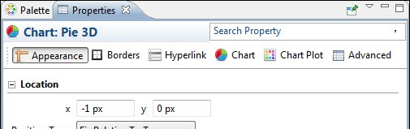

# Setting Chart Properties

When you select a chart component in the **Design** tab, the **Properties** view shows **Hyperlinks, Chart,** and **Chart Plot** tabs, in addition to the standard **Appearance, Borders,** and **Advanced** tabs.

|                                                                      |
|----------------------------------------------------------------------|
|  |
| *Figure 1: Properties View*                                          |

!!! note

    For more information about setting hyperlinks, see [Anchors, Bookmarks, and Hyperlinks](../elements/anchors-bookmarks-hyperlinks.md).

JasperReports Server takes advantage of only a small portion of the capabilities of the `JFreeChart` library. To customize a graph, you must write a class that implements the following interface:

`net.sf.jasperreports.engine.JRChartCustomizer`

The only method available from this interface is the following:

`public void customize(JFreeChart chart, JRChart jasperChart);`

It takes `JFreeChart` and `JRChart` objects as its arguments. The first object is used to produce the image, while the second contains all the features that you specify during the design phase that are relevant to customize the graph.
