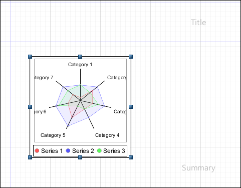
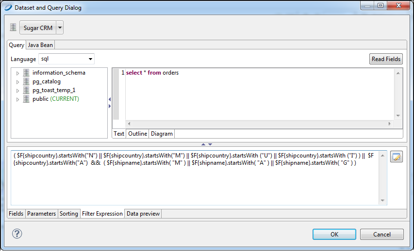
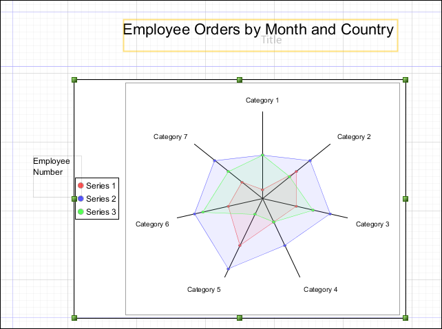
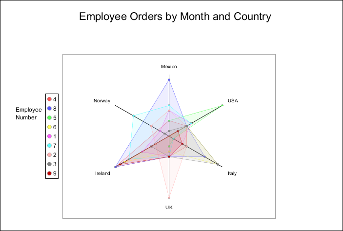

# Spider Charts

Spider charts (or radar charts) are two-dimensional charts designed to plot a series of values over multiple common quantitative variables by providing an axis for each variable, arranged as spokes around a central point. The values for adjacent variables in a single series are connected by lines. Frequently the shape created by these lines is filled in with color.

In Jaspersoft Studio, the spider charts are separate from the rest of the charts available in the Community Project, because they are a separate component in the JasperReports Library. But you use them just as other JFree Charts.

To create the report for the chart

1.  Open a new, blank report using a landscape template and the Sugar CRM database. Use the following query:

    `select * from orders`

    Click **Next**.

2.  Move all the fields into the right box. Click **Next** and **Finish**.

3.  Delete all bands except **Title** and **Summary**.

4.  Drag a **Static Text** element into the title bar, and name your report something like “Employee Orders by Month and Country”.

5.  Enlarge the Summary band to 350 pixels by changing the **Height** entry in the **Band Properties** view.

To create a spider chart

1.  Drag the **Spider Chart** element from the **Palette** into your report.

    |                                                    |
    |----------------------------------------------------|
    |  |
    | *Figure 1 Spider Chart*                            |

2.  Select the report in the **Outline** view, and in the **Properties** view, click the **Edit query, filter, and sort options** button. The **Dataset and Query** dialog opens.

    |  |
    |----|
    |  |
    | *Figure 2 Increment Expression for Spider Chart* |

    !!! note

        To filter your data in a Spider Chart, you must filter it in the **Dataset and Query** dialog.

3.  To filter data for a more readable chart, click the **Increment Expression** tab and enter the expression below with no manual line breaks, then click **OK**.

    `( $F{shipcountry}.startsWith("N") || $F{shipcountry}.startsWith("M") || $F{shipcountry}.startsWith ("U") || $F{shipcountry}.startsWith ("I") ) || $F{shipcountry}.startsWith("A") && ( $F{shipname}.startsWith( "M" ) || $F{shipname}.startsWith( "A" ) || $F{shipname}.startsWith( "G" ) )`

4.  Double-click the chart to display the **Chart Data Configuration** dialog.

5.  Click the **Series** button and create the series `$F{employeeid}`.

6.  Click the **Value** button and create the value `MONTH($F{orderdate})`.

7.  Click the **Category** button and create the category `$F{shipcountry}`.

8.  Click **Finish**.

To customize the look of your chart

1.  Single-click your chart, and click the **Properties** tab.

2.  Click the **Legend** category and select **True** in the **Show Legend** drop-down menu.

3.  Use the **Position** drop-down, to move the legend to the left.

4.  Drag a **Static Text** element just to the left and above the legend. Label the legend **Employee Number**.

5.  Save your report. The Design tab should look like the following figure.

    |                                                                  |
    |------------------------------------------------------------------|
    |  |
    | *Figure 3 Spider Chart Design*                                   |

6.  Preview your report. It should look like the following:

|                                                                    |
|--------------------------------------------------------------------|
|  |
| *Figure 4 Spider Chart Preview*                                    |
