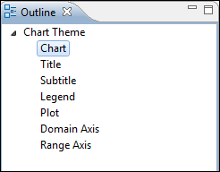
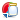
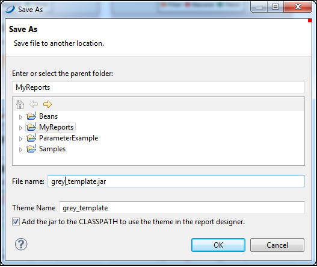

# Chart Themes

Chart themes give you full control over the style of your JFree charts. You can create a chart theme and use it in multiple reports for a uniform look. And you can update that look for all those reports simply by updating the chart theme. Jaspersoft Studio is the supported tool for creating JFree chart themes.

To create a JasperReports chart theme

1.  Select **File \> New \> Other** to open the **Select a Wizard** window.
2.  Select the **Chart Themes** wizard and click **Next** to open the **New Chart Theme Wizard**.
3.  Select a folder and enter a file name for your theme. The file extension must be `.jrctx`.
4.  Click **Finish**. The **Chart Theme Designer** opens.

## Using the Chart Theme Designer

In the **Outline** view, expand the **Chart Theme** list to view the subsections of a theme design.

|                                                                  |
|------------------------------------------------------------------|
|  |
| *Figure 1: Chart Theme Designer Outline View*                    |

- **Chart**: Set properties for borders, color, background, and padding.
- **Title**: Set properties for position, color, alignment, padding, and font.
- **Subtitle**: Set properties for subtitles. These can be set to **INHERITED** on the **Advanced** tab.
- **Legend**: Specify whether to show a legend and, if so, its configuration.
- **Plot**: Set properties for label rotation, foreground, orientation, colors, image alignment, padding, grid lines, chart outline, series stroke and colors, and display and tick label fonts.
- **Domain Axis**: Set properties for elements along the domain axis.
- **Range Axis**: Set properties for elements along the range axis.

Your settings are applied to all chart types. If you want to see one of the chart types close up, click that chart. Click the close up view to all charts.

## Editing Chart Theme XML

You can see and edit the chart theme XML from the **Source** tab. However, the XML appears as one long line. It is better to paste it into a text editor for editing.

## Creating a JasperReports Extension for a Chart Theme

To be used in a report, the `.jrtx` file must be exported to a JasperReports extension JAR file.

To export the theme as a JAR

1.  On the **Preview** tab, click . The **Save As** window opens.

|                                                        |
|--------------------------------------------------------|
|  |
| *Figure 2: Save As JAR*                                |

1.  Enter or select the parent folder, name the file, and name your theme. Click **OK**.

A dialog indicates that the **Chart Theme** was generated.

## Applying a Chart Theme

Add the theme to your class path to make it available in the list of themes.
