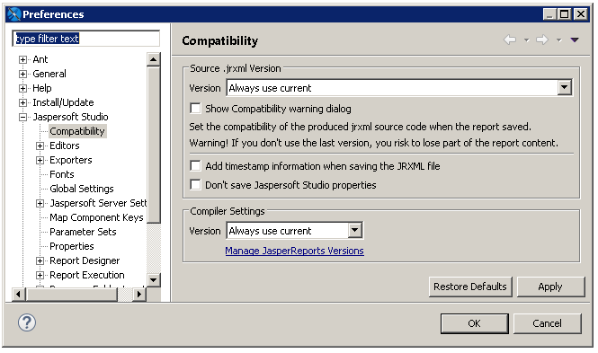

# Setting Compatibility with Earlier Versions of JasperReports Library

If you are using your reports with an application you have built using JasperReports Library, you can set the version to use for compiling your reports. Normally, when you compile a report, Jaspersoft Studio uses the corresponding version of JasperReports Library. For example, if you compile a report from Jaspersoft Studio 10.1, it uses JasperReports Library 10.1. For backwards compatibility with your applications, you can configure Jaspersoft Studio to use an earlier version of JasperReports Library to compile your reports. If you do this, any features in your reports that rely on a later version of JasperReports Library are not available.

!!! note

    If you are exporting your reports to JasperReports Server, you should configure the version in the JasperReports Server connection settings, as described in [1.0.1, “Advanced Connection Settings,” on page 1](jrs-server/jss2jrs-advanced-connection-settings.md). Use the compatibility setting only if you are using your reports on your own application built from JasperReports Library.

To set the version of JasperReports Library to use for compiling reports

1.  Select **Window &gt; Preferences** from the main menu (**Eclipse &gt; Preferences** on Mac).

    The **Preferences** dialog is displayed.

2.  Select **Jaspersoft Studio &gt; Compatibility**.

    The **Compatibility** window is displayed.

    |  |
    |----|
    |  |
    | *Figure 1 Setting JasperReports Library Version* |

3.  To save your reports in an earlier version of JRXML, select the version you want from the **Version** menu in the **Source .jrxml Version** section of the dialog.

4.  To remove Jaspersoft Studio properties from your compiled reports, select **Do not save Jaspersoft Studio properties**. Properties specific to Jaspersoft Studio include some layout information, dimensions in pixels or millimeters, and the data adapter that was most recently used in Jaspersoft Studio.

5.  To use an earlier version of JasperReports Library to compile reports, select the version you from the **Version** menu in the **Compiler Settings** section of the dialog. If the version you want is not available, set it up as described in the next step.

6.  To add a version of JasperReports Library to the **Version** menu in the **Compiler Settings** section of the dialog click **Manage JasperReports Versions** and select the version you want.

To use a version you already have installed, click **Add From Path**, then select the directory where the JasperReports Library is located.

Jaspersoft Studio verifies that the path contains JasperReports Library and adds the version to the **Version** menu in the **Compiler Settings** section of the **Compatibility** dialog.
