# Working with Crosstabs

In contrast to a table or tabular report showing individual records, a crosstab shows aggregate data for two or more variables in a tabular matrix.

You do not specify the individual row and column values for a crosstab at design time. Instead you specify fields in your dataset, called row or column groups. Your crosstab displays a row or column for each unique value of the field. This means the exact number of rows and columns remains undefined at design time and the crosstab automatically updates to reflect your dataset. A crosstab must include at least one row and one column group.

The cells in a crosstab show summary data for the corresponding row and column, based on a measure and a summary function. The simplest crosstab is a frequency matrix, such as the following example, which shows the count of pets (measure) by gender (column) and species (row).

|                                                                 |
|-----------------------------------------------------------------|
| 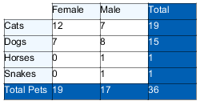 |
| *Figure 1: Example of a simple crosstab*                        |

You can increase the complexity of a crosstab by adding more row or column groups, or by using another summary function, such as sum, average, or percent. For example, the following crosstab shows the sum of the monthly cost of food for each pet (measure) by gender (column) and group and species (rows). Note that when there are multiple row or column groups in a crosstab, they are displayed hierarchically.

|  |
|----|
| 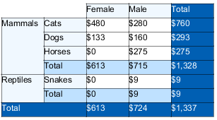 |
| *Figure 2: Example of a crosstab with multiple row groups and a sum* |

Crosstabs in JasperReports support row and column groups, totals and subtotals, and individual cell formatting. Data to fill the crosstab can come from the main report dataset or from a subdataset.

This chapter has the following sections:

-   Example of Creating a Crosstab

-   Working with Crosstab Properties

-   Using the Crosstab Editor

-   Working with Crosstab Parameters

## Example of Creating a Crosstab

When you add a Crosstab element to a report, Jaspersoft Studio displays the Crosstab Wizard automatically.

1.  Create a report:

    1.  Choose a blank template.
    2.  Select the Sample DB data adapter and click **Next**.
    3.  Enter the query `select * from orders`.
    4.  On the **Fields** page, select all fields and click **Finish**.

2.  Because a crosstab summarizes information, you put it in the Summary band. For this example, delete all bands except the **Title** and **Summary** bands. This eliminates blank pages in the final report.

3.  Drag the Crosstab tool 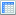 into the **Summary** band. The **Dataset** page of the **Crosstab Wizard** is displayed.

    |  |
    |----|
    | 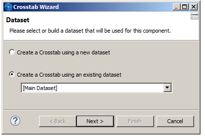 |
    | *Figure 3: Dataset page of the Crosstab wizard* |

4.  For this example, make sure that **Create a Crosstab using an existing dataset** is selected, and select **\[Main Dataset\]** from the drop-down menu.

5.  Click **Next**. The Columns screen is displayed.

6.  Enter one or more fields that you want as column groups. For this example, choose the **ORDERDATE** field.

    |  |
    |----|
    | 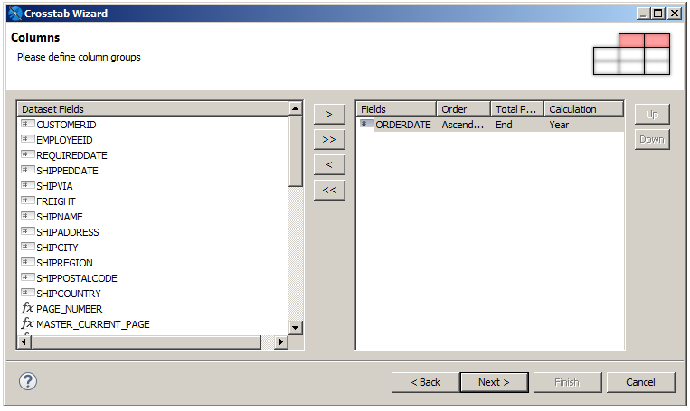 |
    | *Figure 4: Defining column groups* |

7.  Select the `ORDERDATE` field. Then click the Unique value in the **Calculation** column and select **Year** from the drop-down menu. This aggregates the orders by year.

    !!! note

        When you have a time field in your crosstab, you can use the `Unique` aggregation function to group records having the same value, or you can aggregate it any of the following ways:

        -   Using a time-based aggregation function (such as `Year`, `Month`, `Week`, or `Day`) when you define the group

            In this example, this is shown in the previous step.

        -   Using a dataset query when you create the crosstab.

            In this example, in the first step of the wizard, you could create a dataset that uses a query that returns the year, such as `select ORDERDATE, SHIPVIA, SHIPPOSTALCODE, SHIPCOUNTRY, SHIPPEDDATE, YEAR(SHIPPEDDATE) as SHIPPEDYEAR from orders`.

        -   Manually editing the element expression in the crosstab editor after the crosstab has been created, as described in Editing the expression of a group.

        In this example, you could change the column element expression from `$F{SHIPPEDDATE}` to `YEAR($F{SHIPPEDDATE})`.

8.  Click **Next**. The **Rows** screen is displayed.

9.  Enter one or more fields that you want as row groups. For this example, choose **SHIPCOUNTRY** and **SHIPPOSTALCODE**.

    |                                                                         |
    |-------------------------------------------------------------------------|
    | 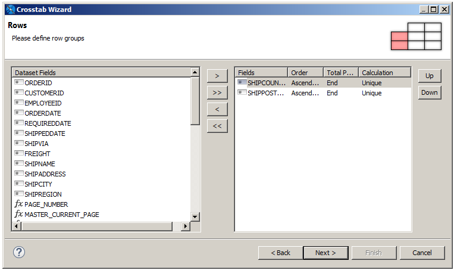 |
    | *Figure 5: Defining row groups*                                         |

10. Make sure that the fields appear in the order you want them in the crosstab. For this example, ensure that **SHIPCOUNTRY** appears first in the list by selecting it and clicking **Up**.

    Grouping by **SHIPCOUNTRY** and then **SHIPPOSTALCODE** results in each row in the crosstab referring to a specific country, with subgroups by postal code within the country. Unlike in the main report, JasperReports sorts the data for you, although you can disable this function to speed up the fill process if your data is already sorted.

11. Click **Next**. The **Measures** screen is displayed.

12. Enter one or more fields that you want as measures. For this example, choose **ORDERID**.

    Measures define the detailed data in the crosstab. Normally, this is the result of an aggregation function like the count of orders by country by year, or the sum of freight for the same combination (country/year). By default, the aggregate function is Count, which is what we want for this example. To change the aggregate function, you would select **ORDERID**, click Count, and select a different value from the drop-down menu.

    |  |
    |----|
    | 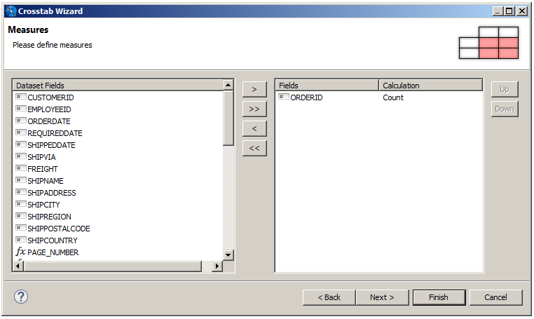 |
    | *Figure 6: Defining measures* |

13. Click **Next**. The **Layout** page is displayed.

14. Set options for the crosstab layout. You can indicate whether you want to see grid lines, use a color set to distinguish totals, headers, and detail cells, or display the total number of rows and columns.

    For this example, select the Burleywood color scheme.

    |  |
    |----|
    | 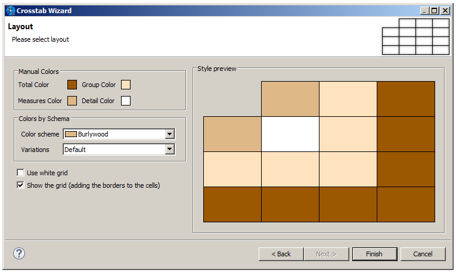 |
    | *Figure 7: Choosing layout options* |

15. Click **Finish**.

    The crosstab is created and added to your report.

    |  |
    |----|
    | 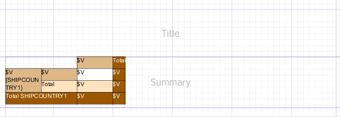 |
    | *Figure 8: Crosstab in Design view* |

16. Select the crosstab to display a border with handles. Drag the right-hand handle of the crosstab to the right margin of the report.

17. Preview your report. You see a crosstab. The row and column headers are the values of the fields that you selected for the rows and columns. For each row and column, the value is the number of orders for that year and postal code.

|                                                                 |
|-----------------------------------------------------------------|
| 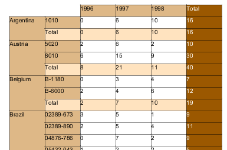 |
| *Figure 9: Preview of the crosstab*                             |

You can set the dynamic page width for the crosstab reports by adding the following property to the JRXML file.

`<property name="net.sf.jasperreports.export.pdf.size.page.to.content" value="true"/>` - When set to true, it enlarges the PDF page when a crosstab report is exported to PDF format.

## Working with Crosstab Properties

To view or edit crosstab properties, select the crosstab node in the **Outline** view. The properties are displayed in the properties view.

Expressions for elements in a crosstab, such as print-when expressions and text field expressions, can only contain measures. In this context, you cannot use fields, variables, or parameters directly. You always have to use a measure.

You can edit the following crosstab-specific properties on the Crosstab tab in the properties view:

-   **Repeat Column Headers**: When selected, the column headers are printed on every page when the crosstab spans additional pages.
-   **Repeat Row Headers**: When selected, the row headers are printed on every page when the crosstab spans additional pages.
-   **Column Break Offset**: Specifies the vertical space between sections of a crosstab when the crosstab exceeds the page width and two sections appear on the same page.

|                                                               |
|---------------------------------------------------------------|
| 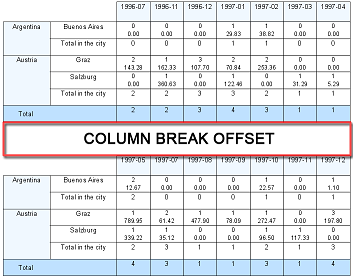 |
| *Figure 10: Column break offset*                              |

You can export a report with crosstab in the Microsoft Excel - Metadata(.xlsx) format from the JasperReports Server. To do so, in Jaspersoft Studio, select the **Ignore Pagination** on the **Report** tab in the **Properties** view. As a result, you can get tabular data on a single page.

## Using the Crosstab Editor

You can edit the fields, expressions, and layout of the crosstab in the crosstab editor. Like the report editor, the crosstab editor has a design view and an outline view. Using the crosstab editor you can:

-   Resize rows and columns and format individual cells.

-   Add and delete row and column groups and edit group properties.

-   Add, delete, and edit measures.

-   Edit crosstab totals.

To open the crosstab editor

1.  Double-click the crosstab node in the **Outline** view for the main report.

    OR

2.  Double-click the crosstab in **Design** view for the main report.

When the crosstab editor is selected, a crosstab element is displayed in the outline view. This crosstab element shows the whole crosstab structure, including the crosstab parameters and the row and column groups, measures, and cells.

### Formatting Columns, Rows, and Cells

Manually resizing a row or column

1.  Open the crosstab editor.

2.  Shift-click in the header of the row or column that you want to change.

    The row and column you selected are outlined.

    |                                                                         |
    |-------------------------------------------------------------------------|
    | 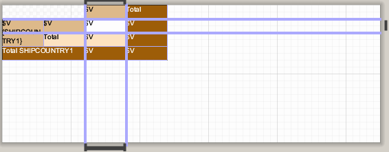 |
    | *Figure 11: Row and column selected in crosstab editor*                 |

3.  Drag an outline to resize the row or column. Make sure that the cells are large enough to contain their content completely when you run the report.

#### Working with Cells

Each intersection between a row and a column defines a cell. Crosstabs have header cells, total cells, detail cells, and (optional) when-no-data cells. Each cell can contain one or more elements that do not use a dataset, such as text fields, static text, rectangles, and images. Cells cannot contain subreports, charts, or another crosstab.

Changing cell borders

1.  Open the crosstab editor and select the cell in the editor or in the **Outline** view.
2.  Edit the cell borders on the **Borders** tab of the **Property** view.

### Editing Row or Column Group Properties

You can edit the following properties for a row or column group:

-   **Name**: Name of the group. Renaming a group using the Properties dialog renames it everywhere the group is used.
-   **Total Position**: Location of the row or column that shows subtotals. Values are None, Start, End (default).
-   **Order**: Order of the values in the group (Ascending or Descending).
-   **Order By Expression**: Optional expression to use for ordering the values.
-   **Comparator Expression**: Optional instance of `java.util.Comparator` to use for ordering the values. If no expression is present, the default ordering for the data type is used (for example, numeric or alphabetic ordering).
-   **Expression**: Bucket expression used to group the rows or columns. The default is to group by field value, for example, `$F{SHIPPOSTALCODE}`.
-   **Value Class Name**: Field type.

Editing the expression of a group

The following example shows how to edit the sample crosstab to group by the first letter or digit of the postal code:

1.  Double-click the crosstab to open the crosstab editor.

2.  In **Outline** view, select the group you want to edit. For this example, select **Crosstab &gt; Row Groups &gt; SHIPPOSTALCODE1**.

    |  |
    |----|
    | 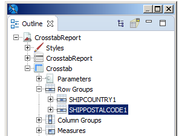 |
    | *Figure 12: Outline tree view – crosstab details in the crosstab editor* |

3.  In the **Properties** view, select the **Cell** tab.

4.  Change the expression in the **Expression** entry bar to `$F{SHIPPOSTALCODE}.substring(0,1)`.

|  |
|----|
| 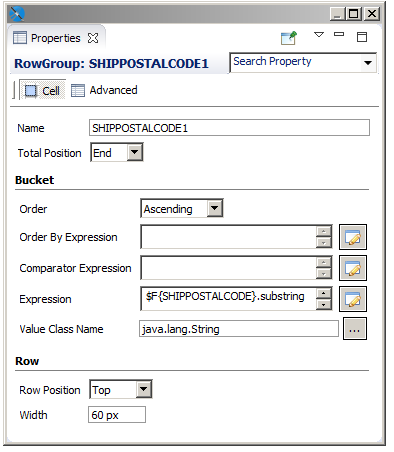 |
| *Figure 13: Properties for SHIPPOSTALCODE1* |

When you preview the crosstab, the second row group is now bucketed by the first character of the postal code.

|  |
|----|
| 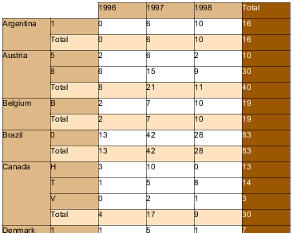 |
| *Figure 14: Crosstab after expression has been edited* |

### Adding and Deleting Row and Column Groups

A crosstab must have at least one row group and one column group. It is easiest to add all the rows and columns you want when you create the crosstab with the Crosstab Wizard. However, if necessary, you can add a row or column group manually.

The following example shows how to add a row group, `SHIPREGION`, to the example crosstab. Adding a column is similar.

Example of adding a row group

1.  Double-click the crosstab to open the crosstab editor.

2.  In the **Outline** view, double-click the Crosstab node to expand it.

3.  Right-click the Row Groups node and select **Create Row Group** from the context menu.

    |  |
    |----|
    | 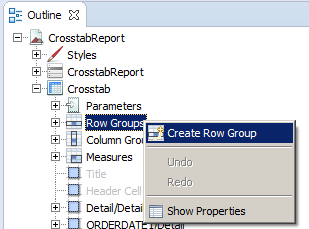 |
    | *Figure 15: Adding a row group* |

    The **Group Band** dialog is displayed.

4.  Enter the information for your group in the **Group Band** dialog. For this example:

    1.  Enter SHIPREGION1 for the **Group Name**.

    2.  Select **Create Group from a report object** and select SHIPREGION.

    3.  Click **Finish**.

        The new group is added to the crosstab as the innermost row group.

        |  |
        |----|
        | 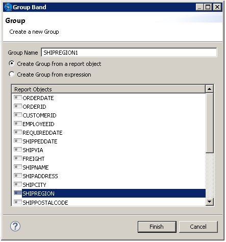 |
        | *Figure 16: Group Band dialog* |

5.  To set the value class of the group, select the top-level node of the new SHIPREGION group in the outline view of the crosstab editor. Then, in the Cell tab of the properties view, enter the following value:

-   **Value Class Name**: `java.lang.String`

|  |
|----|
| 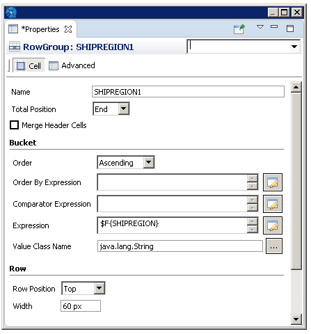 |
| *Figure 17: Setting Value Class Name of a row group* |

1.  Change the order of the groups by selecting the top-level node of `SHIPREGION` in the outline view and dragging it above `SHIPPOSTALCODE`.
2.  Preview the report.

Deleting a row or column group

1.  Double-click the crosstab to open the crosstab editor.
2.  In the outline view, double-click the Crosstab node to expand it.
3.  Double-click the Row or Column Groups node to expand it.
4.  Right-click on the row or column group that you want to delete and select **Delete** from the menu.

### Working with Measures

A measure in a crosstab is an object, similar to a variable that appears in an individual cell. It is the result of a calculation performed on the values for each row and column group that intersect in a cell.

A crosstab can have multiple measures. If you add multiple measures when you first create a crosstab, each measure shows up under the Measure node in the outline view of the crosstab editor. You can also add measures after the crosstab has been created by dragging a text field into a measure cell in your crosstab and setting an expression. In this case, the measure is only visible in the detail node of the outline view. For an example of adding a measure and setting its expression, see 1.3.4.2, “Adding a Measure,” on page 1.

!!! note

    Expressions for elements in a crosstab, such as print-when expressions and text field expressions, can only contain measures. In this context, you cannot use fields, variables, or parameters directly. You always have to use a measure.

#### Measure Properties

The following properties are available for measures that you added when you first created the crosstab:

-   **Name**: Name of the measure.
-   **Calculation**: Calculation to use for the measure. See [1.1.2, “Calculation Function,” on page 1](variables-other-properties.md) for more information.
-   **Percentage of Type**: Set this to **Grand Total** to display your measure as a percentage of the grand total.
-   **Value Expression**: Expression to use for calculating the measure. To edit this expression, click .
-   **Value Class**: Java class to use for the expression.
-   **Incrementer Factory Class Name**: Optional custom `Incrementer` class. Use this to implement your own calculation if the available calculation types are not sufficient. Class must be instantiated via a factory that implements the `net.sf.jasperreports.engine.fil.JRIncrementerFactory` interface.
-   **Percentage Calculation Class Name** – Optional custom calculator class to perform the percentage calculation. Must use the `net.sf.jasperreports.crosstabs.fill.JRPercentageCalculator` interface.

To display measure properties

1.  Double-click the crosstab to open the crosstab editor.
2.  Expand the Crosstab node in the **Outline** view.
3.  Expand the Measures node.
4.  Right-click the measure that you want and select **Show Properties** from the menu.

#### Understanding Crosstab Total Variables

When you have multiple row or column groups, you can use crosstab total variables to combine data at different aggregation levels (for example, to calculate a percentage). The following built-in variables are available:

-   `<Measure>_<Column Group>_ALL`: The total of all the entries in the specified column group and the current row.
-   `<Measure>_<Row Group>_ALL`: The total of all the entries in the specified row group and the current column.
-   `<Measure>_<Row Group>_<Column Group>_ALL`: The combined total of all the entries in the specified row and column groups.

You can also select these variables from the expression editor for the **Expression** field on the **Text Field** tab of the **Properties** view for a measure.

|  |
|----|
| 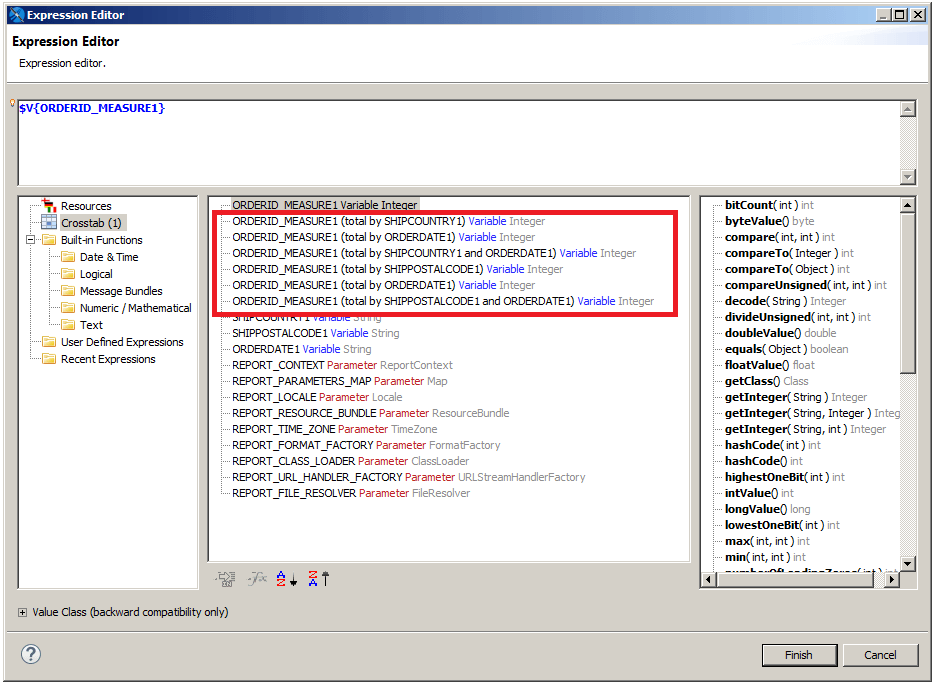 |
| *Figure 18: Total variables in the expression editor* |

#### Adding a Measure as a Text Field

This example shows how to add a measure to an existing crosstab using a text field. This example uses crosstab total variables to calculate a percentage. However, measures added as text fields do not have measure properties such as a calculation or an incrementer calculation class.

Adding a measure

1.  Create a report:

    1.  Choose a blank template.
    2.  Select the Sample DB data adapter and click **Next**.
    3.  Enter the query **select \* from orders** and click **Next**.
    4.  On the **Fields** page, select all fields and click **Finish**.

2.  Delete all bands except the **Summary** band. This eliminates blank pages in the final report.

3.  Add a crosstab  to the **Summary** band with the following settings:

    1.  Dataset: **\[Main Dataset\]**
    2.  Column group: ORDERDATE; select **Year** from the drop-down menu in the **Calculation** column.
    3.  Row group: SHIPCOUNTRY.
    4.  Measure: ORDERID.

4.  In the **Design** view for the report, double-click the crosstab to open the crosstab editor.

5.  Shift-click in the second row and drag to expand the row height.

6.  Drag a text field 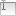 into the intersection of the first row and column.

    The text field is added to the column.

    |  |
    |----|
    | 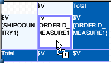 |
    | *Figure 19: Adding a text field to an existing measure* |

    Setting the measure expression

7.  Select the text field that you added.

8.  Select the **Text Field** tab in the **Properties** view.

    |  |
    |----|
    | 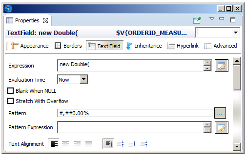 |
    | *Figure 20: Text field properties after setting the expression* |

9.  Click  to the right of the **Expression** field to open the expression editor.

10. Add a formula to calculate the following percentage:

    (Number of orders placed in this country and in this year)  /  (All orders placed in this country)

    For Java, use the following expression:

    ``` text
    new Double(
        $V{ORDERID_MEASURE1}.doubleValue()
        /
        $V{ORDERID_MEASURE1_ORDERDATE1_ALL}.doubleValue()
    )
    ```

    For Groovy, use the following expression:

    ``` text
    (double)$V{ORDERID_MEASURE1} / (double)$V{ORDERID_MEASURE1_ORDERDATE1_ALL}
    ```

    !!! note

        A percentage must be treated as a floating-point number. For this reason, extract the double-scalar values from `ORDERID_MEASURE1` and `ORDERID_MEASURE1_ORDERDATE1_ALL` objects even if they are the objects of the class-type `Integer`.

11. Click **Finish** to close the expression editor.

12. Enter `#,##0.00%` in the **Pattern** field to format the result as a percentage.

13. Click **Preview** to run the report.

|  |
|----|
| 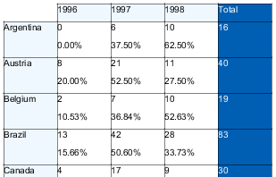 |
| *Figure 21: The final report with percentages included* |

## Working with Crosstab Parameters

Crosstab parameters let you pass dynamic values from the main report to the crosstab as crosstab parameters. They can be used in the expressions of elements displayed in the crosstab. Crosstab parameters are defined and managed using the outline view in the crosstab editor.

!!! note

    Use crosstab parameters in the crosstab elements. They are not the same as the dataset parameters that are used in expressions, in the crosstab context, to filter a query and calculate values.

To add a crosstab parameter

1.  Double-click your crosstab in the design view to open the crosstab editor.
2.  In the outline view, right-click the Parameters node in the Crosstab element and select **Create Parameter**.
3.  To set the value of the crosstab parameter, double-click the parameter to open the expression editor. Create an expression for your parameter and click **OK**.

You can use a map to set the value of the declared crosstab parameters at run time. In this case, you need to provide a valid parameters map expression in the crosstab properties.
