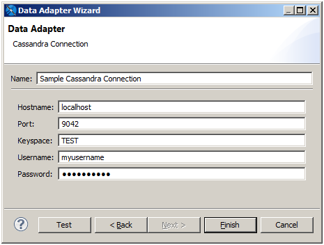
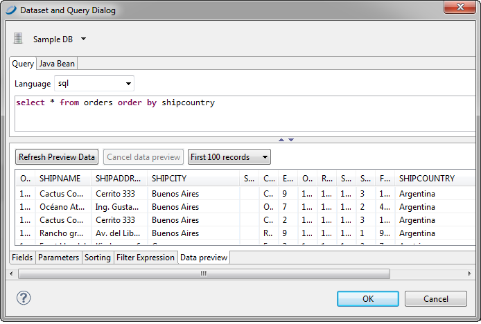

# Working with a Native Cassandra Connection

The Apache Cassandra database provides scalability and high availability for certain applications of big data. For more information about Cassandra, see <http://cassandra.apache.org/>.

The Cassandra data adapter relies on a driver that has certain limitations on how your data can be structured and accessed:

- The current version of Cassandra does not support NULL values in the data. All required fields must have non-NULL default values.
- The current version of the driver does not support aggregate functions (sum, min, max).
- For query parameters, the current version of the driver supports \$X(IN...), but no other \$X functions.

The Cassandra data adapter supports queries in the Cassandra Query Language 3 (CQL3). To improve performance, design your Cassandra data using the following guidelines:

- Specify the `ALLOW FILTERING` suffix to speed up queries.
- All fields referenced in the `WHERE` clauses of a query should be indexed.

## Creating a Native Cassandra Data Adapter

To create a Cassandra adapter

1.  Create the connection globally or locally:

    - To create the connection globally, right-click **Data Adapters** in the Repository Explorer and choose **Create Data Adapter**.
    - To create the connection local to a project, click , enter a name and location for the data adapter in the DataAdapter File dialog, and then click **Next**.

    The Data Adapter wizard appears (see [Data Adapter Wizard](data-adapters-creating.md)).

2.  From the list, select **Cassandra Connection** to open the Data Adapter dialog.

    |  |
    |----|
    |  |
    | Configuring a Cassandra Native Connection |

3.  Fill in the required fields:

    - Name: The name that appears on the list of available data adapters when you create a report.
    - Port: Use port 9042 with the Cassandra data source. Cassandra's default port of 9160 is for the Thrift client that is commonly used with Cassandra. To use the Cassandra Query Language (CQL) with your Cassandra data source, you may need to configure your Cassandra instance as follows:

    `start_native_transport: true`

    `native_transport_port: 9042`

    - Keyspace: The keyspace of your Cassandra instance.

4.  If you have configured your Cassandra source to be password protected, specify a valid username and password. Due to compatibility issues, Cassandra authentication is supported only when you use Cassandra 1.12.18 and above. If the password is empty, it is better if you specify that it be saved. You can choose to save the password in one of two ways:

    - Clear text: This is not secure, but can sometimes be convenient when working in a developer or staging environment.
    - Eclipse secure storage: This is the correct option for security, but can be difficult to work with when testing and saving adapters. In addition, it can make it difficult to share adapters with other developers or deploy data adapters to JasperReports Server.

5.  Click **Test** to check the values you entered. Make sure that the port is set to 9042, because the connection test also works with the wrong port (9160). If everything's okay, you will see a success message.

6.  Click **OK** to exit the message.

7.  Click **Finish** to create the connection.

!!! note

    If you get a `ClassNotFoundError` exception, the most likely cause is that the required driver is not present in the classpath. See [1.1.2.1, “ClassNotFoundError,” on page 1](data-adapters-jdbc-connection.md) for more information.

## Using a Cassandra Connection

When you create a report or subdatasource from a native Cassandra connection, specify a CQL query to extract records from the database.

|                                                    |
|----------------------------------------------------|
|  |
| Data Preview                                       |

If no fields can be selected with the **Add field** button, check to see if the report contains fields. If not, close the query dialog, register the fields, and resume the sorting.
