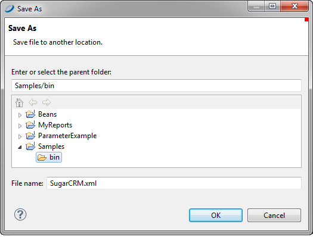

# Creating and Editing Data Adapters

## Creating a Data Adapter

You can create data adapters using the **Data Adapter Wizard**. The exact steps and information you need to provide vary with the type of adapter that you select. However, the initial steps are similar.

Data adapters can be created locally in projects or globally in the Repository Explorer.

-   Data adapters in projects are stored as jrdax files, which simplify deployment of JasperReports Server. A project-level data adapter cannot be seen from other projects, but you can easily copy it from one project to another.

-   Global data adapters are saved as Eclipse settings and are visible to all projects.

### Creating a Data Adapter in a Project

When you create a data adapter in a project, it is saved as an jrdax file in that project. Saving the jrdax file in the same project as your reports makes it easier to deploy the data adapter to JasperReports Server, and is required if you have set the project type to something other than JasperReports Library.

1.  Click  on the main toolbar OR right-click a project in the Project Explorer and select **New &gt; Data Adapter**.

2.  In the **DataAdapter File** window, choose the project where you want to save the data adapter file. This should be the project that contains the reports you want to use with your data adapter.

3.  Enter a name for your adapter and click **Next**.

    The **Data Adapters Wizard** opens.

    |                                                                      |
    |----------------------------------------------------------------------|
    |  |
    | *Figure 1: Data Adapter Wizard*                                      |

4.  Select the data adapter type that you want and click **Next**.

5.  Enter a name for your adapter. This name is used when you select an adapter for a report.

6.  Enter the properties needed by the adapter type that you selected. For example, for a database JDBC connection you need to select a JDBC driver and set the URL and database username and password. For a CSV file, you need to enter a filename, column names, and the column separator.

7.  (Optional) If you want to test the connection, click the **Test** button if available.

8.  Click **Finish** to create the adapter.

The adapter is saved as an jrdax file in the project location that you selected.

### Creating a Global Data Adapter

Global data adapters are saved as Eclipse settings and are visible to reports in all projects of type JasperReports Library. To use a global adapter in a project of type JasperReports Server , you need to export it to an jrdax file in the same project as your report. You also cannot directly export a global driver to a JasperReports Server deployment; export it to an jrdax file in the project instead. See [Folder Types and Report Execution Contexts](../intro-contexts.md) for more information about project types.

1.  Click  in the Repository Explorer OR right-click **Data Adapters** in the Repository Explorer and choose **Create Data Adapter**.

    The **Data Adapters Wizard** opens.

2.  Select the data adapter type that you want and click **Next**.

3.  Enter a name for your adapter and the properties needed by the adapter type that you selected. (Optional) To test the adapter, click the **Test** button.

4.  Click **Finish** to create the adapter.

## Importing and Exporting Data Adapters

Jaspersoft Studio enables you to import and export data adapter definitions to simplify the process of sharing data source configurations.

To export a global data adapter as an jrdax file

1.  In the Repository Explorer, right-click your data adapter and select **Export to File**.

    Jaspersoft Studio prompts you to name the file and select the destination for the exported information.

    |                                                                  |
    |------------------------------------------------------------------|
    |  |
    | *Figure 2: Export to File Dialog*                                |

2.  Select a location in the same project as the report that is using this adapter, enter a name for the file, and click **OK**.

A simple jrdax file is created in the location that you chose. The data adapter must be in the same project as your report. To use the same adapter in more than one project, see Copying a Data Adapter.

To promote a data adapter file to a global data adapter

You can make any file-based data adapter into a global adapter by importing it.

1.  Right-click on the Data Adapter node in the Repository Explorer, and choose **Import from Workspace**.
2.  Select the data adapters you want to import.
3.  You can optionally select **Overwrite Data Adapter if exists**. Otherwise, if a duplicate data source name is found during the import, Jaspersoft Studio appends a number to the imported data source name.
4.  Click **OK**.

The import process adds all the selected data adapters to the current list.

## Copying a Data Adapter

If you have saved your data adapter as an jrdax file, you can easily copy it between projects.

To copy a data adapter from one project to another

1.  In the Project Explorer, right-click your data adapter and select **Copy** OR use Ctrl-C.
2.  Still in the Project Explorer, right-click the project or folder in your Jaspersoft Studio workspace that you want to use and select **Paste** OR *Ctrl-V*.

The data adapter is copied to the new location.
