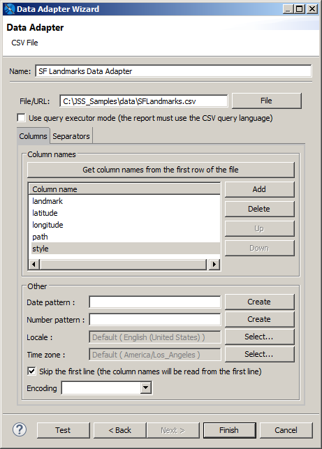
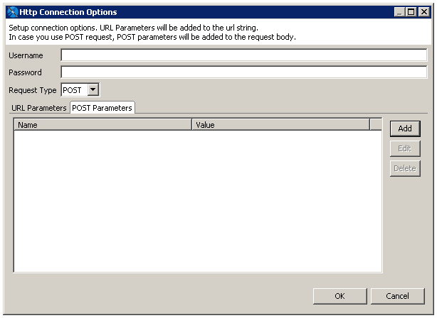
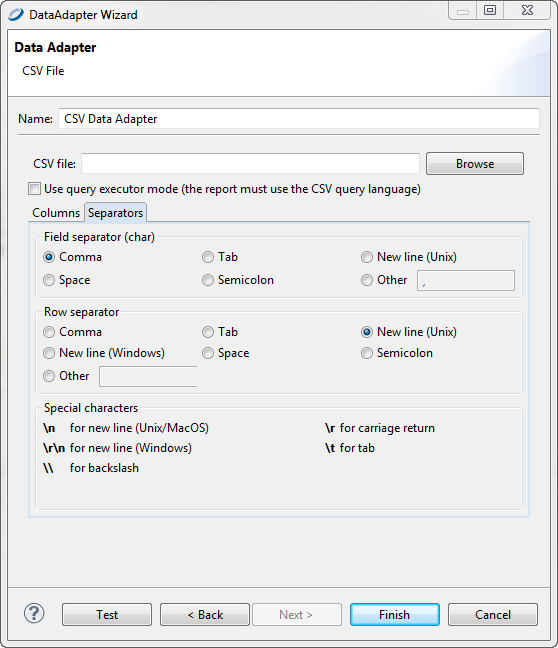

# Working with CSV Data Adapters

You can create a connection based on a CSV file or URL location.

To create a connection based on a CSV file

1.  Click the **New** button in the **Connections/Datasources** dialog and select **CSV File** from the list of data adapter types.

    |  |
    |----|
    |  |
    | *Figure 1 CSV Data Adapter* |

2.  Set a name for the connection.

3.  In the **File\\URL** field, choose a CSV file or enter the URL where your CSV data is located.

4.  (URL only.) If you entered a URL in the **CSV file** field, click the **Options** button to open the **Http Connection Options** dialog.

|  |
|----|
|  |
| *Figure 2 HTTP Connection Options* |

In this dialog you can enter the following options:

-   **Username** and **Password** (optional): The username and password to use if your CSV location requires authentication.

    -   **Request Type**: Select GET (default) or POST.

    -   To add a parameter to the request URL, click **Add** in the **URL Parameters** tab. Enter the name and value of your parameters in the **Parameter** dialog and click **OK**. For multiple parameters, add each parameter separately.

    -   For a POST request, to add parameters to the body of the POST, click **Add** in the POST Parameters tab. Enter the name and value of your parameters in the Parameter dialog and click **OK**. For multiple parameters, add each parameter separately.

        When you have configured your request, click **OK**.

        1.  Declare the fields in the data adapter.

    -   If the first line in your file contains the names of the columns, click **Get column names from the first row of the file** and select the **Skip the first line** checkbox . This forces JasperReports to skip the first line (the one containing your column labels). In any case, the column names read from the file are used instead of the declared ones, so avoid modifying the names found with the **Get column names** button.

    -   If the first line of your CSV file does not contain the column names, set a name for each column using the syntax `COLUMN_0, COLUMN_1`, and so on.

!!! warning

    If you define more columns than the ones available, you get an exception at report filling time.

JasperReports assumes that for each row all the columns have a value (even if they are empty).

1.  If your CSV file uses nonstandard characters to separate fields and rows, you can adjust the default setting for separators using the Separators tab.

    |                                                        |
    |--------------------------------------------------------|
    |  |
    | *Figure 3 Separators Tab*                              |

2.  Click **Finish**.

## Registration of the Fields for a CSV Data Adapter

When you create a CSV data adapter, you must define a set of column names as fields for your report. To add them to the fields list, set your CSV data adapter as the active connection and open the Report query dialog. Open the **Dataset and Query** dialog and click the **Read Fields** button.

By default, Jaspersoft Studio sets the class type of all fields to `java.lang.String`. If you are sure the text of a particular column can be easily converted to a number, a date, or a Boolean value, set the correct field type yourself after the fields are added to your report.

The pattern used to recognize a timestamp (or date) object can be configured at the data adapter level by selecting the **Use custom date format** check box.
