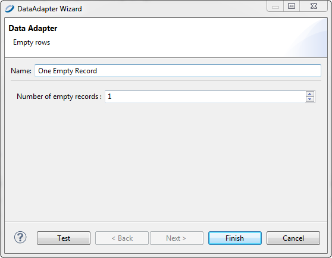

# Using the Empty Record Data Adapter

By default, Jaspersoft Studio provides a pre-configured empty data source that returns a single record. Empty data adapters return records with NULL values.

To create a new empty data source with more records

1.  Double-click **One Empty Record** in the Repository Explorer. The **Data Adapter Wizard** appears with empty rows.

    |  |
    |----|
    |  |
    | *Figure 1: Data Adapter Wizard &gt; Empty Record* |

2.  Set the number of empty records that you need. Remember, whatever field you add to the report, its value is set to `null`. Since this data adapter does not care about field names or types, this is a perfect way to test any report (keeping in mind that the fields are always set to `null`).

3.  Click **Finish**.

## Understanding the Empty Record Implementation

The empty record data adapter in Jaspersoft Studio uses the special JasperReports data source `JREmptyDataSource`. This data source returns true to the `next` method for the record number (by default only one), and always returns `null` to every call of the `getFieldValue` method. It is like having records without fields, that is, an empty data source.

The two constructors of this class are:

`public JREmptyDataSource(int count)`

`public JREmptyDataSource()` 

The first constructor indicates how many records to return, and the second sets the number of records to one.
