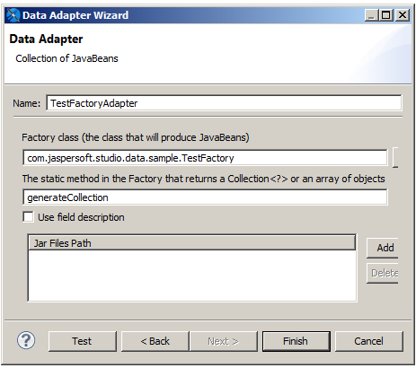
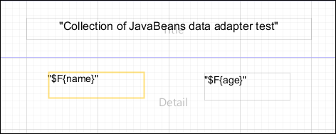

# Working with a Collection of JavaBeans Data Adapter

A collection of JavaBeans data adapters allows you to use JavaBeans as data for a report. In this context, a JavaBean is a Java class that exposes its attributes with a series of `get` methods, with the following syntax:

`public <`returnType`> getXXX()`

where `<``returnType``>` (the return value) is a generic Java class or a primitive type (such as `int`, `double`).

## Implementing the Factory Class for a Collection of JavaBeans

The collection of JavaBeans data adapter uses an external class (named `Factory`) to produce some objects (the JavaBeans) that constitute the data to pass to the report. To use a collection of JavaBeans as a data adapter in Jaspersoft Studio, you must create an instance of the `Factory` class and provide a static method to instantiate different JavaBeans and to return them as a collection (`java.util.Collection`) or an array (`Object[]`). The following example shows how to write an instance of the `Factory` class.

Suppose that you have a collection of JavaBeans, where the data is represented by a set of objects of type `PersonBean`. The following table shows the code for `PersonBean`, which contains two fields: `name` (the person’s name) and `age`:

<table>
<caption>
<code>PersonBean</code> example
</caption>
<colgroup>
<col style="width: 100%" />
</colgroup>
<tbody>
<tr>
<td>
<pre class="sourceCode java"><code class="sourceCode java">public class PersonBean
{
  private String name = &quot;&quot;;
  private int age = 0;
                            
  public PersonBean(String name, int age)
  {
    this.name = name;
    this.age = age;
  }
  public int getAge()
  {
    return age;
  }

  public String getName()
  {
    return name;
  }
}</code></pre>
</td>
</tr>
</tbody>
</table>

To use this collection of beans, you need to create an instance of the `Factory` class. Your class, named `TestFactory`, must contain the actual data that is used by the report. In this case, it is something similar to this:

<table>
<caption>
<code>PersonBean</code> example - Class result
</caption>
<colgroup>
<col style="width: 100%" />
</colgroup>
<tbody>
<tr>
<td>
<pre class="sourceCode java"><code class="sourceCode java">public class TestFactory
{
                            
  public static java.util.Collection generateCollection()
    {
    java.util.Vector collection = new java.util.Vector();
    collection.add(new PersonBean(&quot;Ted&quot;, 20) );
    collection.add(new PersonBean(&quot;Jack&quot;, 34) );
    collection.add(new PersonBean(&quot;Bob&quot;, 56) );
    collection.add(new PersonBean(&quot;Alice&quot;,12) );
    collection.add(new PersonBean(&quot;Robin&quot;,22) );
    collection.add(new PersonBean(&quot;Peter&quot;,28) );
                            
    return collection;
  }
}</code></pre>
</td>
</tr>
</tbody>
</table>

A data adapter based on this class would represent five JavaBeans of `PersonBean` type.

## Creating a Data Adapter from a Factory Class

Once you have created your `Factory` class instance, you can create a data adapter that uses your collection of JavaBeans.

1.  Create the connection globally or locally:

- To create the connection globally, right-click **Data Adapters** in the Repository Explorer and choose **Create Data Adapter**.
- To create the connection local to a project, click , enter a name and location for the data adapter in the **DataAdapter File** dialog, and then click **Next**.

The **Data Adapter Wizard** appears (see [Data Adapter Wizard](data-adapters-creating.md)).

1.  To create a connection to handle JavaBeans, select **Collection of JavaBeans** in the list of data adapter types.

The fields necessary to create a collection of JavaBeans appear.

|  |
|----|
|  |
| *Figure 1: Collection of JavaBeans Data Adapter* |

1.  Create a name for your adapter.
2.  Enter the name of your Java class in the Factory class. For the example above, you would need to specify the class name for **TestFactory**.
3.  Enter the name of the static method in your Factory class. In the example above, this is `generateCollection`.
4.  By default, the field names in your JavaBeans become the field names in your data adapter. If your JavaBeans definition has field descriptions, and you want to use these as names in Jaspersoft Studio, select **Use field description**.
5.  If necessary, you can add the path to your jar files.

## Registering the Fields

One peculiarity of a collection of JavaBeans data adapters is that the fields are exposed through `get` methods. This means that if the JavaBean has a `getXyz()` method, `xyz` becomes the name of a record field (the JavaBean represents the record).

In this example, the `PersonBean` object shows two fields: `name` and `age`. Register them in the fields list as a `String` and an `Integer`, respectively.

Create a new empty report and add the two fields by right-clicking the **Fields** node in the outline view and selecting **Add field**. The field names and the types of the fields are: name (`java.lang.String`) and age (`java.lang.Integer`).

Drag the fields into the **Detail** band and run the report. (Make sure that the active connection is the TestFactoryAdapter.) To refer to an attribute of an attribute, use periods as a separator. For example, to access the `street` attribute of an `Address` class contained in the `PersonBean`, the syntax would be `address.street`. The real call would be `<someBean>.getAddress().getStreet()`.

|                                                            |
|------------------------------------------------------------|
|  |
| *Figure 2: Layout of a Report Based on JavaBeans*          |

If you selected **Use field description** when you specified the properties of your data adapter, the mapping between JavaBean attribute and field value uses the field description instead of the field name.

Jaspersoft Studio provides a visual tool to map JavaBean attributes to report fields. To use it, open the query window, go to the tab **JavaBean Data Source**, insert the full class name of the bean you want to explore, and click **Read attributes**. The tab displays the attributes of the specified bean class.

- If an attribute is also a Java object, you can double-click the object to display its other attributes.

- To map a field, select an attribute name and click the **Add Selected Field(s)** button.
