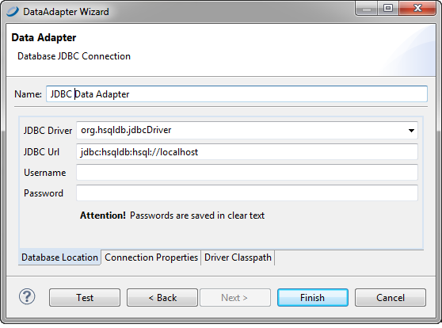
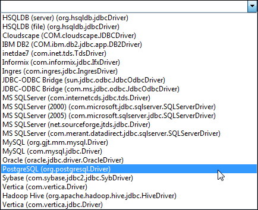
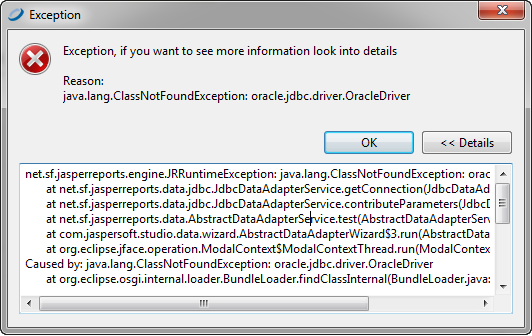
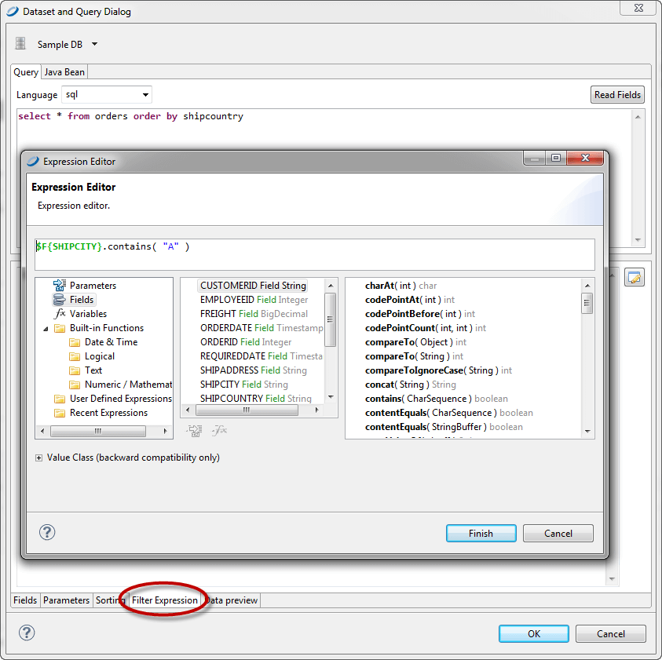

# Working with Database JDBC Connections

A JDBC connection lets you use a database accessed through a JDBC driver (such as a relational DBMS). When you use a JDBC connection in a report, you must specify a query.

## Creating a Database JDBC Connection

To create a JDBC connection

1.  Create the connection globally or locally:

- To create the connection globally, right-click **Data Adapters** in the Repository Explorer and choose **Create Data Adapter**.
- To create the connection local to a project, click , enter a name and location for the data adapter in the **DataAdapter File** dialog, and then click **Next**.

The **Data Adapter Wizard** appears (see [Data Adapter Wizard](data-adapters-creating.md)).

1.  From the list, select **Database JDBC connection** to open the **Data Adapter** dialog.

|                                                          |
|----------------------------------------------------------|
|  |
| *Figure 1: Configuring a JDBC Connection*                |

1.  Name the connection (use a significant name like `Mysql – Test`). This is the name that appears on the list of available connections when you create a report.
2.  In the **JDBC Driver** field, specify the JDBC driver to use for your database connection. The drop-down displays the names of the most common JDBC drivers.

|                                                    |
|----------------------------------------------------|
|  |
| *Figure 2: JDBC Drivers List*                      |

For the list of supported drivers, see the Jaspersoft Platform Support Guide . If a driver is not listed, you might need to download it from the official website and add it to the classpath as described in the following sections. See Using a JDBC Connection.

!!! note

    JasperReports Server includes the JDBC drivers for the following commercial databases: Oracle, MS SQLServer and DB2. In some cases, these drivers provide functionality not provided by the vendors' driver. However, there may be some differences in queries between the two drivers. You can use the drivers, or you can choose to install and use the driver supplied by the database vendor.

    If you upload your reports to JasperReports Server, make sure to use the same driver in both JasperReports Server and Jaspersoft Studio.

1.  Enter the connection URL.
2.  Enter a username and password to access the database. If the password is empty, it is better if you specify that it be saved. You can choose to save the password in one of two ways:

- Clear text: This is not secure, but can sometimes be convenient when working in a developer or staging environment.
- Eclipse secure storage: This is the correct option for security, but can be difficult to work with when testing and saving adapters. In addition, it can make it difficult to share adapters with other developers or deploy data adapters to JasperReports Server.

1.  After you have inserted all the data, click the **Test** button to verify the connection. If everything's okay, you see a message that the test was successful.
2.  Click **OK** to exit the message.
3.  Click **Finish** to create the connection.

## Troubleshooting a Database JDBC Connection

When the tests fail, the most common exceptions are:

- A `ClassNotFoundError` was generated.
- The URL is not correct.
- Parameters are not correct for the connection (database is not found, the username or password is wrong, and so on).

### ClassNotFoundError

The `ClassNotFoundError` exception occurs whenever a data adapter fails to load a class it requires. In the context of JDBC connections, the most likely cause is that the required JDBC driver is not present in the classpath. In general, a data adapter has two classpaths that it uses to find libraries. First, the adapter looks at any paths that were specified inside the data adapter when it was created. If it cannot load the libraries or classes it needs using its internal paths, the data adapter uses the Jaspersoft Studio classpath to look for them.

The Jaspersoft Studio classpath is defined in your Eclipse project. As Jaspersoft Studio uses its own class loader, it is enough to add resources such as jar files and directories containing classes to the Jaspersoft Studio classpath.

For example, suppose you want to create a connection to an Oracle database. Jaspersoft Studio does not ship the vendor's driver for this database. If you choose the `oracle.jdbc.driver.OracleDriver` driver, when you test the connection, you see the `ClassNotFoundException`, as shown in Figure 10‑5. You need to add the JDBC driver for Oracle, `ojdbc14.jar`, to the classpath.

|                                                      |
|------------------------------------------------------|
|  |
| *Figure 3: `ClassNotFoundError` exception*           |

To add a resource to the Jaspersoft Studio classpath

If you add a resource to the Jaspersoft Studio classpath, it is available to all data adapters. In addition to JARs, you can add variables, libraries, class folders, and external class folders. To add a jar to the Jaspersoft Studio classpath:

1.  Click **Project \> Properties \> Java Build Path\>Libraries**, and click **Add JARs** or **Add External JARs**.
2.  Browse to locate the jar you want to add.
3.  Select the file that you want to add to the classpath.
4.  Click **OK**.

To add a JAR file to a data adapter's classpath

If you need to use the driver only for this data adapter, you can instead add the driver on the data adapter's Driver Classpath tab.

1.  If the adapter is not already open, double-click its icon in the Repository Explorer or Project Explorer to open it.
2.  Click the **Driver Classpath** tab.
3.  Click **Add** and browse to locate the jar you want to add. If you want to add a different file type, use the menu at the bottom right.
4.  Click the jar and **Open**.

The location of the file you chose is added to the driver classpath.

### URL Not Correct

If a wrong URL is specified, you get an exception when you click the **Test** button. You can find the exact cause of the error using the stack trace provided in the exception.

### Parameters Not Correct for the Connection

If you try to establish a connection to a database with the wrong parameters (for example, invalid credentials or inaccessible database), the database returns a message that is fairly explicit about the reason behind the failure of the connection.

## Using a Database JDBC Connection

When you create a report with a JDBC connection, you specify a query to extract records from the database. The query language that you use depends on the connection type. The most common query type is an SQL query.

The use of JDBC or SQL connections is the simplest and easiest way to fill a report.

### Fields Registration

To use SQL query fields in a report, you need to register them. You do not need to register all the selected fields—only those actually used in the report. For each field, specify a name and type. Table 10‑1 shows SQL types and the Java objects that they map to.

| SQL Type    | Java Object             | SQL Type      | Java Object          |
|-------------|-------------------------|---------------|----------------------|
| CHAR        | `String`                | REAL          | `Float`              |
| VARCHAR     | `String `               | FLOAT         | `Double`             |
| LONGVARCHAR | `String `               | DOUBLE        | `Double`             |
| NUMERIC     | `java.math.BigDecimal ` | BINARY        | `byte[]`             |
| DECIMAL     | `java.math.BigDecimal`  | VARBINARY     | `byte[]`             |
| BIT         | `Boolean `              | LONGVARBINARY | `byte[]`             |
| TINYINT     | `Integer `              | DATE          | `java.sql.Date`      |
| SMALLINT    | `Integer`               | TIME          | `java.sql.Time`      |
| INTEGER     | `Integer`               | TIMESTAMP     | `java.sql.Timestamp` |
| BIGINT      | `Long`                  |               |                      |

Conversion of SQL and JAVA types

The table does not include special types like BLOB, CLOB, ARRAY, STRUCT, and REF, because these types cannot be managed automatically by JasperReports. However, you can use them by declaring them generically as `Object` and managing them by writing supporting static methods. The BINARY, VARBINARY, and LONGBINARY types should be dealt with in a similar way. With many databases, BLOB and CLOB can be declared as `java.io.InputStream`.

Whether an SQL type is converted to a Java object depends on the JDBC driver used.

For the automatic registration of SQL query fields, Jaspersoft Studio relies on the type proposed for each field by the driver itself.

### Filtering Records

The records in a report can be ordered and filtered. Set sort and filter options in the Report query dialog by clicking the **Dataset and Query** button .

|                                                                      |
|----------------------------------------------------------------------|
|  |
| *Figure 4: Filter Expression Tab and Expression Editor*              |

Clicking the **Data Preview** tab shows a subset of your filtered data. The filter expression must return a Boolean object: true if a particular record can be kept, false otherwise.

|                                                    |
|----------------------------------------------------|
|  |
| *Figure 5: Data Preview*                           |

If no fields can be selected with the **Add field** button, check to see if the report contains fields. If not, close the query dialog, register the fields, and resume the sorting.

### Using JDBC Connections for Subreports

You can also use a JDBC connection for a subreport or a personalized lookup function for decoding specific data. For this reason, JasperReports provides a `java.sql.Connection` parameter called `REPORT_CONNECTION`. You can use this parameter in any expression you like, with this parameters syntax:

`$P{REPORT_CONNECTION}`

This parameter contains the `java.sql.Connection` class passed to JasperReports from the calling program.
