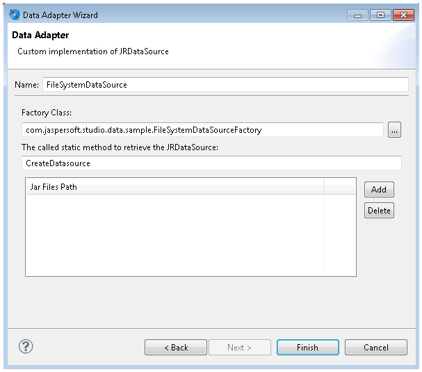

# Working with the JRDataSource Interface

All data adapters implement the `JRDataSource` interface. Some data adapters, such as the JDBC data connections, do this indirectly using a connection and a query. Other data adapters, such as adapters for CSV files, XML documents, and collections of JavaBeans, do this directly. This section is useful if you want to understand more about the direct data adapters, or if you are interested in creating a custom data adapter.

## Understanding the JRDataSource Interface

Data supplied by a `JRDataSource` is ideally organized into records as in a table. Every `JRDataSource` must implement the following two methods:

- `public boolean next()`: Returns true if the cursor is positioned correctly in the subsequent record, false if no more records are available.

- `public Object getFieldValue(JRField jrField)`: Moves a virtual cursor to the next record

Every time JasperReports runs the `public boolean next()` method, all the fields declared in the report are filled and all the expressions (starting from those associated with the variables) are calculated again. Subsequently, JasperReports determines whether to print the header of a new group, to go to a new page, and so on. When the `next` returns false, the report is ended by printing all final bands (Group Footer, Column Footer, Last Page Footer, and Summary). The method can be called as many times as there are records present (or represented) from the data source instance.

The method `public Object getFieldValue(JRField jrField)` is called by JasperReports after a call to `next` results in a true value. In particular, it is run for every field declared in the report. In the call, a `JRField` object is passed as a parameter. It is used to specify the name, the description, and the type of the field from which to obtain the value (all this information, depending on the specific data source implementation, can be combined to extract the field value).

The type of the value returned by the `public Object getFieldValue(JRField jrField)` method has to be adequate for that declared in the `JRField` parameter, except when a `null` is returned. If the type of the field was declared as `java.lang.Object`, the method can return an arbitrary type. In this case, if required, a cast can be used in the expressions. A cast is a way to indicate the type on an object dynamically, the syntax of a cast is:

`(type)object`

in example:

`(com.jaspersoft.ireport.examples.beans.PersonBean)$F{my_person}`

Usually a cast is required when you need to call a method on the object that belongs to a particular class.

## Implementing a New JRDataSource

If the `JRDataSource` supplied with JasperReports does not meet your requirements, you can write a new `JRDataSource`. This is not a complex operation. In fact, all you have to do is create a class that implements the `JRDataSource` interface that exposes two simple methods: `next` and `getFieldValue`.

<table>
<caption>
The JRDataSource interface
</caption>
<colgroup>
<col style="width: 100%" />
</colgroup>
<tbody>
<tr>
<td>
<pre><code>package net.sf.jasperreports.engine;
public interface JRDataSource
{
public boolean next() throws JRException;
public Object getFieldValue(JRField jrField) throws JRException;
}</code></pre>
</td>
</tr>
</tbody>
</table>

The `next` method is used to set the current record into the data source. It has to return `true` if a new record to elaborate exists. Otherwise it returns `false`.

If the `next` method has been called positively, the `getFieldValue` method has to return the value of the requested field or `null`. Specifically, the requested field name is contained in the `JRField` object passed as a parameter. Also, `JRField` is an interface through which you can get information associated with a field—the name, description, and Java type that represents it.

Now try writing your personalized data source. You have to write a data source that explores the directory of a file system and returns the found objects (files or directories). The fields you create to manage your data source are the same as the file name, which should be named `FILENAME`; a flag that indicates whether the object is a file or a directory, which should be named `IS_DIRECTORY`; and the file size, if available, which should be named `SIZE`.

Your data source should have two constructors:

- The first receives the directory to scan as a parameter.

- The second has no parameters and uses the current directory to scan.

Once instantiated, the data source looks for the files and the directories present in the way you indicate and fills the array files.

The `next` method increases the index variable that you use to track the position reached in the array files, and returns true until you reach the end of the array.

<table>
<caption>
Sample personalized data source
</caption>
<colgroup>
<col style="width: 100%" />
</colgroup>
<tbody>
<tr>
<td>
<pre class="sourceCode java"><code class="sourceCode java">import net.sf.jasperreports.engine.*;
import java.io.*;
public class JRFileSystemDataSource implements JRDataSource
{
File[] files = null;
int    index = -1;
public JRFileSystemDataSource(String path)
{
File dir = new File(path);
if (dir.exists() &amp;&amp; dir.isDirectory())
{
files = dir.listFiles();
}
}
public JRFileSystemDataSource()
{
this(&quot;.&quot;);</code></pre>
</td>
</tr>
<tr>
<td>
<pre><code>}
public boolean next() throws JRException
{
index++;
if (files != null &amp;&amp; index &lt; files.length)
{
return true;
}
return false;
}
public Object  getFieldValue(JRField jrField) throws JRException
{
File f = files[index];
if (f == null) return null;
if (jrField.getName().equals(&quot;FILENAME&quot;))
{
return f.getName();
}
else if (jrField.getName().equals(&quot;IS_DIRECTORY&quot;))
{
return new Boolean(f.isDirectory());
}</code></pre>
</td>
</tr>
<tr>
<td>
<pre><code>else if (jrField.getName().equals(&quot;SIZE&quot;))
{
return new Long(f.length());
}
// Field not found...
return null;
}
}</code></pre>
</td>
</tr>
</tbody>
</table>

The `getFieldValue` method returns the requested file information. Your implementation does not use the information regarding the return type expected by the caller of the method. It assumes the name has to be returned as a string. The flag `IS_DIRECTORY` as a Boolean object, and the file size as a `Long` object.

The next section shows how to use your personalized data source in Jaspersoft Studio and test it.

## Using a Custom JasperReports Data Source with Jaspersoft Studio

Jaspersoft Studio provides a special connection for your personalized data sources. It is useful for employing whatever `JRDataSource` you want to use through some kind of factory class that provides an instance of that `JRDataSource` implementation. The factory is just a simple Java class useful for testing your data source and filling a report in Jaspersoft Studio. The idea is the same as what you have seen for the collection of JavaBeans data adapter — you need to write a Java class that creates the data source through a static method and returns it. For example, if you want to test the `JRFileSystemDataSource` in the previous section, you need to create a simple class like that shown in this code sample:

<table>
<caption>
Class for testing a custom data source
</caption>
<colgroup>
<col style="width: 100%" />
</colgroup>
<tbody>
<tr>
<td>
<pre class="sourceCode java"><code class="sourceCode java">import net.sf.jasperreports.engine.*;
public class FileSystemDataSourceFactory {
    public static JRDataSource createDatasource()
{
return new JRFileSystemDataSource(&quot;/&quot;);
}
}</code></pre>
</td>
</tr>
</tbody>
</table>

This class, and in particular the static method that is called, runs all the necessary code for instancing the data source correctly. In this case, you create a `JRFileSystemDataSource` object by specifying a way to scan the directory root (`"/"`).

Now that you have defined the way to obtain the `JRDataSource` you prepared and the data source is ready to be used, you can create the connection through which it can be used.

Create a connection as you normally would (see [Creating and Using Database JDBC Connections](data-adapters-jdbc-connection.md)), then select **Custom implementation of JRDataSource** from the list and specify a data source name like `TestFileSystemDataSource` (or whatever name you want), as shown below.

|                                                                  |
|------------------------------------------------------------------|
|  |
| *Figure 1: Configuring a Custom Data Adapter*                    |

Next, specify the class and method to obtain an instance of your `JRFileSystemDataSource`, that is, `TestFileSystemDataSource` and `test`.

!!! note

    There is no automatic method to find the fields managed by a custom data source.

In this case, you know that the `JRFileSystemDataSource` provides three fields: `FILENAME` (String), `IS_DIRECTORY` (Boolean), and `SIZE` (Long). After you have created these fields, insert them in the report’s Detail band.

Divide the report into two columns and in the Column Header band, insert Filename and Size tags. Then add two images, one representing a document and the other an open folder. In the `Print when` expression setting of the Image element placed in the foreground, insert the expression `$F{IS_DIRECTORY}`, or use as your image expression a condition like the following:

`($F{IS_DIRECTORY}) ? “folder.png” : “file.png”`

In this example, the class that instantiated the `JRFileSystemDataSource` was very simple. But you can use more complex classes, such as one that obtains the data source by calling an Enterprise JavaBean or by calling a web service.
