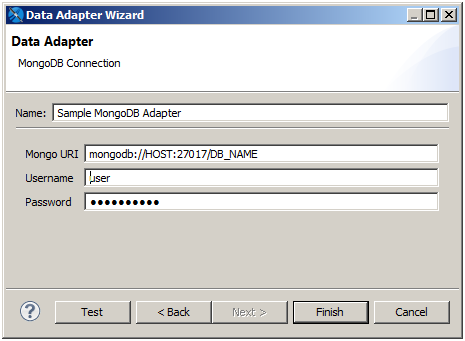
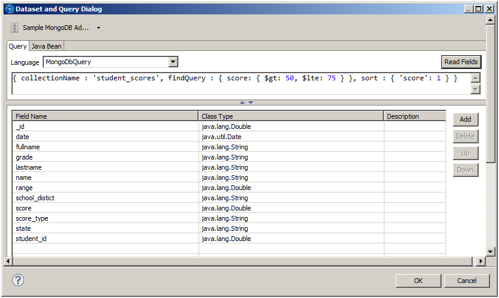

# Working with a MongoDB Data Adapter

MongoDB is a big data architecture based on the NoSQL model that is not relational or SQL-based. Jaspersoft Studio includes data adapters that allow reports to use a native MongoDB data connection or a MongoDB JDBC data adapter. JasperReports Server also supports SSL and x509 authentication for MongoDB.

## Creating a Native MongoDB Connection

To create a MongoDB data adapter with the native driver

Follow these steps to create a MongoDB data source with the native MongoDB driver.

1.  Create the connection globally or locally:

- To create the connection globally, right-click **Data Adapters** in the Repository Explorer and choose **Create Data Adapter**.
- To create the connection local to a project, click , enter a name and location for the data adapter in the **DataAdapter File** dialog, and then click **Next**.

The **Data Adapter Wizard** appears (see [Data Adapter Wizard](data-adapters-creating.md)).

1.  From the list, select **MongoDB Connection** to open the **Data Adapter** dialog.

|  |
|----|
|  |
| *Figure 1: Configuring a MongoDB Connection* |

1.  Fill in the required fields:

- **Name**: The name that appears on the list of available data adapters when you create or run a report.
- **Mongo URI**: The URI of your MongoDB data.

1.  If you have configured your MongoDB source to be password protected, specify a valid username and password.
2.  Click **Test** to check the values you entered. If everything's okay, you see a success message.
3.  Click **OK** to exit the message.
4.  Click **Finish** to create the connection.

!!! note

    If you get a `ClassNotFoundError` exception, the most likely cause is that the required driver is not present in the classpath. See [ClassNotFoundError](data-adapters-jdbc-connection.md) for more information.

### The Jaspersoft MongoDB Query Language

Access MongoDB through API calls in an application or a command shell. As a consequence, it does not have a defined query language. To write queries for MongoDB data sources, we have developed a query language based on the JSON-like objects on which MongoDB operates. JSON is the JavaScript Object Notation, a textual representation of data structures that is both human- and machine-readable.

The Jaspersoft MongoDB Query Language is a declarative language for specifying what data to retrieve from MongoDB. The connector converts this query into the appropriate API calls and uses the MongoDB Java connector to query the MongoDB instance. The following examples give an overview of the Jaspersoft MongoDB Query Language, with SQL-equivalent terms in parentheses:

- Retrieve all documents (rows) in the given collection (table):

```
{ 'collectionName' : 'accounts' }
```

- From all documents in the given collection, select the named fields (columns) and sort the results:

```
{
  'collectionName' : 'accounts',
  'findFields' : {'name':1,'phone_office':1,'billing_address_city':1,
                  'billing_address_street':1,'billing_address_country':1},
  'sort' : {'billing_address_country':-1,'billing_address_city':1}
}
```

- Retrieve only the documents (rows) in the given collection (table) that match the query (where clause). In this case, the date is greater-than-or-equal to the input parameter, and the name matches a string (starts with N):

```
{
  'collectionName' : 'accounts',
  'findQuery' : {
    'status_date' : { '$gte' : $P{StartDate} },
    'name' : { '$regex' : '^N', '$options' : '' }
  }
}
```

The Jaspersoft MongoDB Query Language also supports advanced features of MongoDB such as map-reduce functions and aggregation that are beyond the scope of this document. For more information, see [language reference](http://community.jaspersoft.com/wiki/jaspersoft-mongodb-query-language) on the Community website.

When you create a report or subdatasource from a native MongoDB connection, Jaspersoft Studio automatically selects MongoDbQuery as the query language. You can explicitly view and set the query language using the **Dataset and Query** Dialog.

|  |
|----|
|  |
| *Figure 2: Example Dataset and Query Dialog for a MongoDB Data Adapter* |

!!! info "Important"

    The features in this section may be restricted by your JasperReports Server software license. If you don't see some of the options described, your current license likely prohibits their use. Contact us to learn about your licensed features or to discuss upgrading.

!!! note

    If you get a `ClassNotFoundError` exception, it may be due to one of the following:

    - You are not licensed to use the TIBCO MongoDB JDBC driver. This driver is only available in commercial editions.
    - The required driver is not present in the classpath. See [ClassNotFoundError](data-adapters-jdbc-connection.md) for more information.
