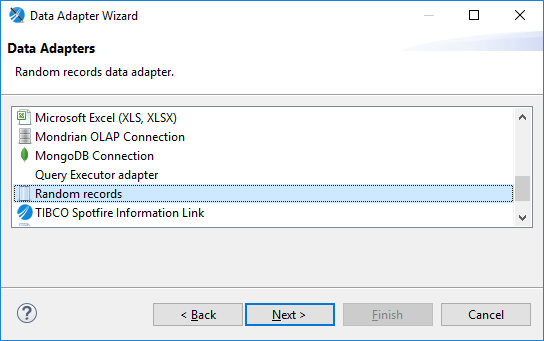
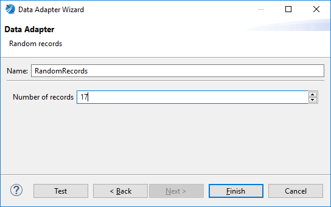
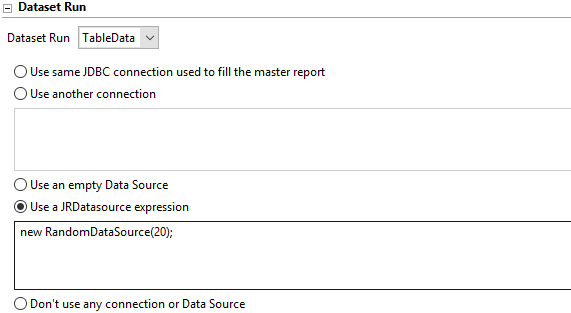

# Using the Random Data Adapter

Jaspersoft Studio supports a random data source that determines the field types and returns random data in each field. You can set how many records are returned. Here are some of the ways that you can use the random data adapter to test a report:

- Use a small number of records to visualize a chart.

- Use a large number of records to simulate a multi-page report.

- Use it as the data source for a subreport, subdataset, or table.

To create a new random data source in the current folder

1.  Select **File \> New \> Data Adapter** from the main menu or select **New \> Data Adapter** from the context menu of a folder. The **Data Adapter Wizard** opens.
2.  Select the folder where you want to place the adapter and click **Next**.
3.  Select **random records** from the data adapter list and click **Next**.

|  |
|----|
|  |
| *Figure 1: Random records data adapter type* |

1.  Name the adapter and set the number of records that you need.

|  |
|----|
|  |
| *Figure 2: Choosing a number of random records* |

1.  Click **Finish**

!!! note

    To create a global random data adapter that you can use in different projects, go to the Project Explorer and select **New \> Data Adapter** from the context menu. Global data adapters cannot be accessed from JasperReports Server project types.

Using the random data source in a new subreport, subdataset, or table

1.  Drag the element that you want from the palette to the canvas.
2.  Select **Create ... using a new dataset** and click **Next**.
3.  Select **Create new dataset from a connection or Data Source** and click **Next**.
4.  Click **New**.
5.  Follow Steps 3 through 5 in *To create a new random data source in the current folder* section.
6.  Click **Finish**.

Editing a dataset run to use a random expression

If you already have your subreport, subdataset, or table set-up, you can edit the dataset run as follows:

1.  Select the element where you want to use a random dataset.
2.  If you do not already have the **Properties** view displayed, right-click and select **Show Properties**.
3.  In the **Properties** view, in the **Dataset Run** section, select **Use a JRDatasource expression** and enter:

`new RandomDataSource(``n``);`

where `n` is the non-negative integer number of records that you want.

|  |
|----|
|  |
| *Figure 3: Setting a data source expression* |
