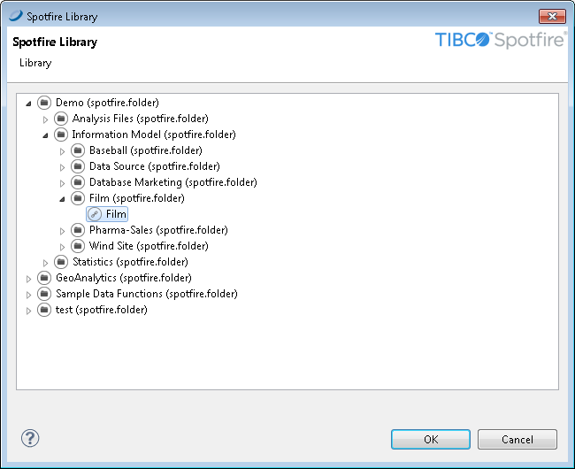
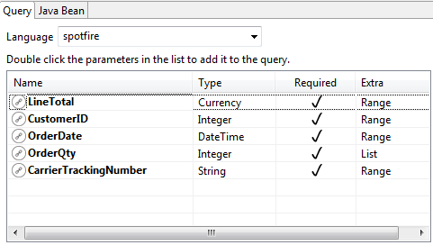
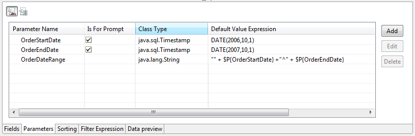
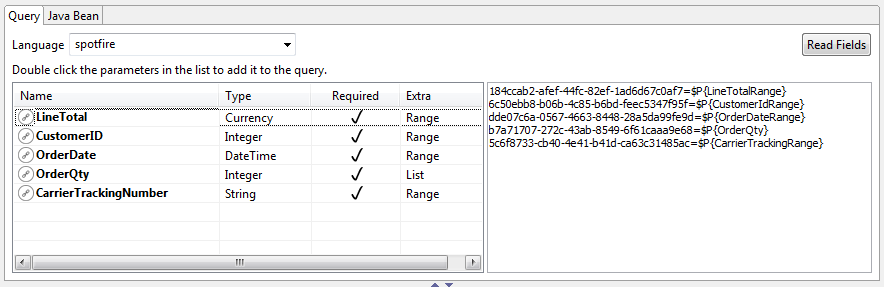

# A Look at Spotfire Information Links

You can populate reports created in Jaspersoft Studio with data from Spotfire. You can navigate your Spotfire library, select Information Links and Spotfire Binary Data Files (SBDFs), and inspect their data. To load Spotfire data, create a data adapter to connect to the data. The data adapter returns data in tabular form. Before you publish the report to JasperReports Server, export your data adapter as an jrdax file so you can add it to the server's repository.

!!! note

    This version of Jaspersoft Studio was verified with Spotfire version 7.7. Other versions may also work but have not been tested extensively.

To create a data adapter for a Spotfire Information Link

1.  In the Repository Explorer, right-click **Data Adapters** and select **Create Data Adapter** to display the **Data Adapter Wizard**.

2.  Enter a name for the data adapter.

3.  Enter the URL to your Spotfire Web Player in this form:

    `http://<web-player-host>/SpotfireWeb`

    where `<web-player-host>` is the IP address or name of the computer hosting the Spotfire Web Player where you access your Information Link.

4.  Enter your Spotfire username and password.

5.  Click **Browse** next to the **Resource ID** field to locate and select your Information Link  in the **Spotfire Library**.

    |  |
    |----|
    |  |
    | *Figure 1 Spotfire Library displayed in Jaspersoft Studio* |

    You can also create reports against SBDFs ; to do so, select one from your **Spotfire Library**.

6.  If you have prompts in your information link and want to set their values using parameters in Jaspersoft Studio, make sure **Use a query (required to use parameters)** is selected.

7.  Click **OK**.

8.  Click **Test** to test your connection.

9.  If the test fails, check your URL, credentials, and resource ID.

10. When the test succeeds, click **Finish**.

!!! note

    It is not uncommon for an Information Link to return millions of rows of data, which may take some time for Jaspersoft Studio to process when data is loaded, such as when previewing the report; the same may hold true in JasperReports Server.

To create your report

1.  Click **File &gt; New &gt; JasperReport.**
2.  Select a template and enter a name for your report.
3.  Click **Next**. The **Data Source** dialog is displayed.
4.  Select the **Spotfire Information Link** data adapter that you created above.
5.  If you have prompts, you need to configure parameters to work with them. See [1.1.1, “Working With Prompts,” on page 1](#working-with-prompts) for more information.
6.  Click **Read Fields**.
7.  Select the fields to include in your data set.
8.  Click **Next**.
9.  Optionally select a field to define a grouping.
10. Click **Finish**. Jaspersoft Studio displays the report in the **Design** tab.
11. Edit the report as needed. For example, add fields and components and configure your query and dataset.
12. Click **Preview** to ensure that the report is correctly configured.
13. When your report is ready, click **File &gt; Save**.

To export your data adapter as an jrdax file

1.  In the Repository Explorer, right-click your **Spotfire Information Link** data adapter and select **Export to File**.
2.  Select the folder in your Jaspersoft Studio workspace that contains your report, enter a name for the data adapter, and click **OK**.

To configure the report to use the exported data adapter

1.  In the **Outline** view, click the root node of your report to display the report properties.
2.  Click **Advanced**.
3.  Expand **Misc** and click the ellipsis to the right of **Properties** to open the **Properties** window.
4.  Click **Add** to create a property that indicates the data adapter to use.
5.  In the **Property Name** field, enter `net.sf.jasperreports.data.adapter`.
6.  In the **Value** field, enter the name of the data adapter you exported (this is an jrdax file).
7.  Click **OK**.

You are ready to publish your report.

To publish your report

1.  Click  at the top of the **Design** tab. You are prompted to select a location for publishing the report.
2.  Select a server connection and navigate its repository to the desired location.
3.  Optionally enter a new label, name (ID), and description of the report unit.
4.  Click **Next**. You are prompted to select a resource used by the report, including the data adapter you exported above.
5.  Click **Next**. You are prompted to select a data source.
6.  Select **Don't use any Data Source**. Since the data adapter has already been defined, the report does not need a separate data source.
7.  Click **Finish**. Jaspersoft Studio adds your report to the repository.

While it is uploaded, Jaspersoft Studio modifies your JRXML so that it runs properly on the server. In particular, it changes how the data adapter is specified. On the server, the data adapter is uploaded to the folder you selected when you published the report.

To test your report, open the server's web UI, locate your report, and click it to run it.

## Working With Prompts

If your Information Link uses prompts, you need to configure parameters for those prompts before you can read the fields. You must configure parameters for all prompts, even if they are not mandatory in Spotfire.

To use prompts, make sure that you selected **Use a query (required to use parameters)** in your data adapter. Create the report as described in the previous steps.

### Configuring Jaspersoft Studio Parameters for Use With Spotfire Prompts

The **Dataset and Query** dialog shows the prompts for your **Spotfire Information Link**. You must configure parameters for your prompt based on the Type and Extra values.

|  |
|----|
|  |
| *Figure 2 Prompts in Dataset and Query dialog* |

### List (corresponds to prompt type Values)

**Class Type**: `java.util.Collection`; the objects in the collection should correspond to the type of the prompt. The data adapter mechanism formats the Collection contents appropriately.

**Sample Default Value Expression**: `Arrays.asList(1,2,3,4,5,6,7)`

### Range

**Class Type**: `java.lang.String`

**Default Value Expression**: The default value expression must be two strings with a caret (\^) between them. Most often, you want to create three parameters in Jaspersoft Studio: two parameters that define the endpoints of the range and the third parameter of type String that is used to pass the range to Spotfire. The endpoint parameters should correspond to the type of the prompt.

For example, for a `Range` prompt of type `DateTime`, you might create two parameters of type `java.sql.Timestamp` that are used to take input for the start and end time:

``` xml
<parameter name="OrderStartDate" class="java.sql.Timestamp">
    <defaultValueExpression><![CDATA[DATE(2006,10,1)]]></defaultValueExpression>
</parameter>
<parameter name="OrderEndDate" class="java.sql.Timestamp">
    <defaultValueExpression><![CDATA[DATE(2007,10,1)]]></defaultValueExpression>
</parameter>
```

Then you would create a dependent parameter that uses these two parameters to construct a string to pass to Spotfire:

``` xml
<parameter name="OrderDateRange" class="java.lang.String" isForPrompting="false">
    <defaultValueExpression><![CDATA["" + $P{OrderStartDate} +"^" + $P{OrderEndDate}]]></defaultValueExpression>
</parameter>
```

The parameters would look like this on the **Parameters** tab.

|                                                                        |
|------------------------------------------------------------------------|
|  |
| *Figure 3 Range parameters in Parameters tab*                          |

### Multiple selection

**Class Type**: `java.util.Collection`; the objects in the collection should correspond to the type of the prompt. The data adapter mechanism formats the Collection contents appropriately.

**Sample Default Value Expression**: `Arrays.asList(1,2,3,4,5,6,7)`

### Single selection

**Class Type**: Corresponds to the type for the prompt. Numbers (and Currency) are passed with a “`9.9999`” format; no `$` or `,` are used.

### Connecting Prompts from Spotfire to Parameters in Jaspersoft Studio

1.  If you have not done so, create the parameters you need as described in [Configuring Jaspersoft Studio Parameters for Use With Spotfire Prompts](#configuring-jaspersoft-studio-parameters-for-use-with-spotfire-prompts).

<!-- -->

1.  If you are not in the **Dataset and Query** dialog, open it by right-clicking on the root node of your report in **Outline** view and selecting **Dataset and Query…** from the context menu.

2.  Select the correct data adapter and select **spotfire** as the language.

    Jaspersoft Studio connects to the Spotfire server and returns the list of prompts for the Spotfire Information Link.

3.  To map a prompt to a parameter:

    1.  Double-click a prompt. The GUID for the prompt is displayed, followed by an equals sign (=).

    2.  Type the name of the parameter that you want to use after the equals sign (=) in the form `$P{ParameterName}`. For example, for the date range prompt above, you would enter `$P{OrderDateRange}`.

        |  |
        |----|
        |  |
        | *Figure 4 Prompts with GUIDs mapped to parameters* |

4.  Repeat these steps for each prompt.

5.  Once you have correctly configured your parameters, click **Read Fields** to read the fields.

6.  Click **OK** to close the **Dataset and Query** dialog.
