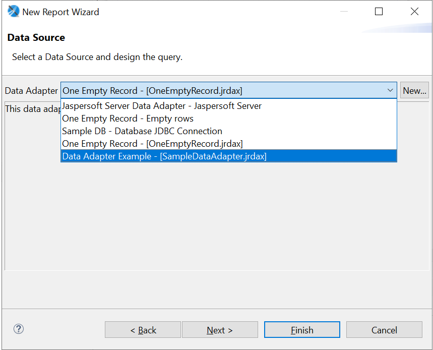
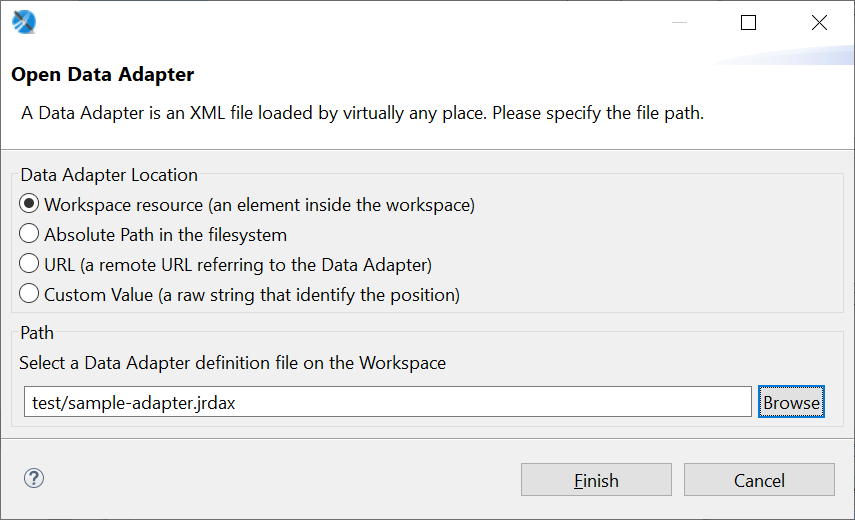
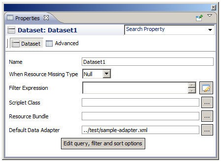
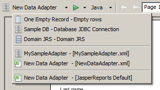

# Using Data Adapters in Reports and Datasets

You can use the Jaspersoft Studio user interface to select the data adapter to use for previewing reports and datasets. However, this selection is specific to Jaspersoft Studio. When you want to deploy your reports to JasperReports Server or to a custom JasperReports deployment, you must specify the data adapter or data source that you want to use.

## Data Adapter For a Report

When you choose a data adapter during report creation, the drop-down lists all available adapters, with global adapters on top and project file-based adapters below. The example below shows the global adapters available with Jaspersoft Studio followed by a sample file-based adapter local to the project, named `SampleDataAdapter.jrdax`.

|  |
|----|
|  |
| *Figure 1: List of Data Adapters During Report Creation* |

Data adapters are hierarchical. That is, if no adapter is directly defined for a subdataset, it looks for the adapter of its parent dataset, then its parent's parent, and so forth.

## Data Adapters and Report Deployment

When you use a drop-down to select a data adapter for a report or dataset, you are just setting the current default data adapter used for preview. As you continue to design your report, you can easily change this data adapter by selecting a different data adapter during preview, or by editing the dataset and changing the adapter. If you do not select a data adapter during preview, Jaspersoft Studio defaults to whichever data adapter was used most recently. If no data adapter is selected when you create a report, Jaspersoft Studio defaults to the pre-configured empty data adapter.

This data adapter is internal to Jaspersoft Studio. It is stored in an internal property (`com.jaspersoft.studio.data.defaultdataadapter`) which cannot be used in JasperReports Server or JasperReports Library. Therefore, when you publish or deploy a report, you need to specify the data source you want to use in the deployed report. You can do this in the following ways:

-   When you publish a report to JasperReports Server, you can select a JasperReports Server data source to use. See [Publishing a Report to JasperReports Server](../jrs-server/jss2jrs-publishing.md) for more information. If you choose this method to select a data source, any subdatasets in the report must use the same data source.

-   You can choose to set the default data adapter explicitly for the report and/or any subdatasets. You can set this property separately for any dataset in the report. If this property is present, you cannot choose a different adapter to preview the report.

## Default Data Adapter

You can explicitly set the data adapter for a report or dataset using the `net.sf.jasperreports.data.adapter` property.

Setting the default data adapter

1.  In **Outline** view, to set the data adapter for the report, click the report's root node. To set the data adapter for a dataset, click the dataset.

2.  In the **Properties** view, to set the data adapter for a report, go to the **Report** tab. To set the data adapter for a dataset, go to the **Dataset** tab.

3.  Click **...** at the right of the **Default Data Adapter** property.

    The **Open Data Adapter** dialog opens.

    |  |
    |----|
    |  |
    | *Figure 2: Open Data Adapter Dialog* |

4.  Choose the format to use for specifying the data adapter location:

-   **Workspace resource**: A file in your workspace, for example, ` value="test/sample-adapter.jrdax"/>`. This should be a file in the same project as your report. If you want to use a global adapter, you need to export it to a file first. See [Importing and Exporting Data Adapters](data-adapters-creating.md) for more information.

    -   **Absolute Path in the file system**: A file path, for example, `value="file:///C:/Adapters/sample-adapter.jrdax"`
    -   **URL**: A remote URL that hosts the data adapter file, for example, `value="http://myserver:8080/sample-adapter.jrdax"`
    -   **Custom value**: A free-form string that identifies the location of the data adapter to use. You could use this if you wanted to enter a string in the `repo:` syntax, for example, `value="repo:/reports/interactive/CustomersDataAdapter"` See [Understanding the repo Syntax](../jrs-server/jss2jrs-repo-syntax.md) for more information.

1.  If you selected **Workspace resource** or **Absolute Path**, click **Browse** to locate the file in the workspace or in your file system. Otherwise, enter the URL or free-form string.
2.  Click **Finish**.

The default data adapter is set for the dataset. It is represented in the JRXML file using the `net.sf.jasperreports.data.adapter` property.

|  |
|----|
|  |
| *Figure 3: Dataset with Default Data Adapter* |

### The JasperReports Data Adapter in the UI

When the JasperReports data adapter is present, it is shown as the bottom adapter on the list of available adapters. In the example below, **New Data Adapter** has been set as the default data adapter:

|  |
|----|
|  |
| *Figure 4: List of Data Adapters Including Default Data Adapter* |
