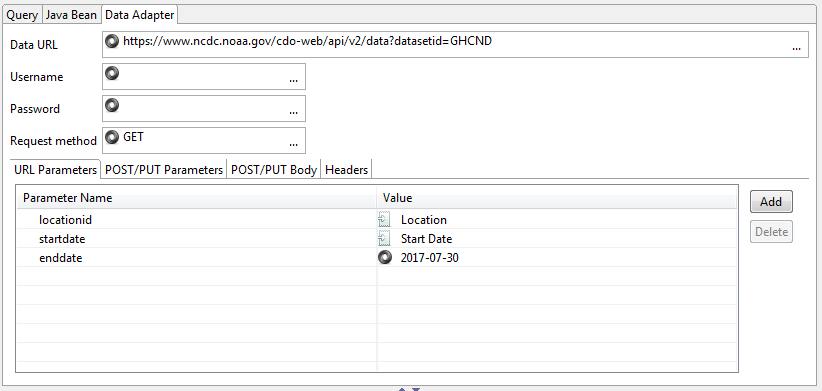
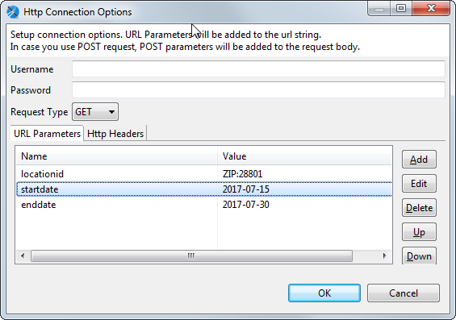
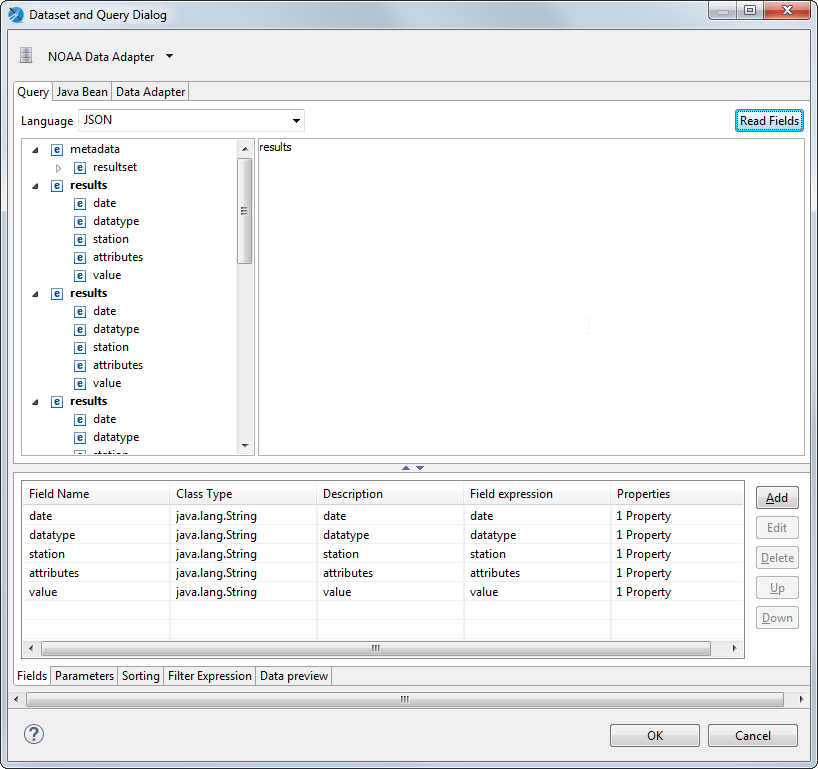
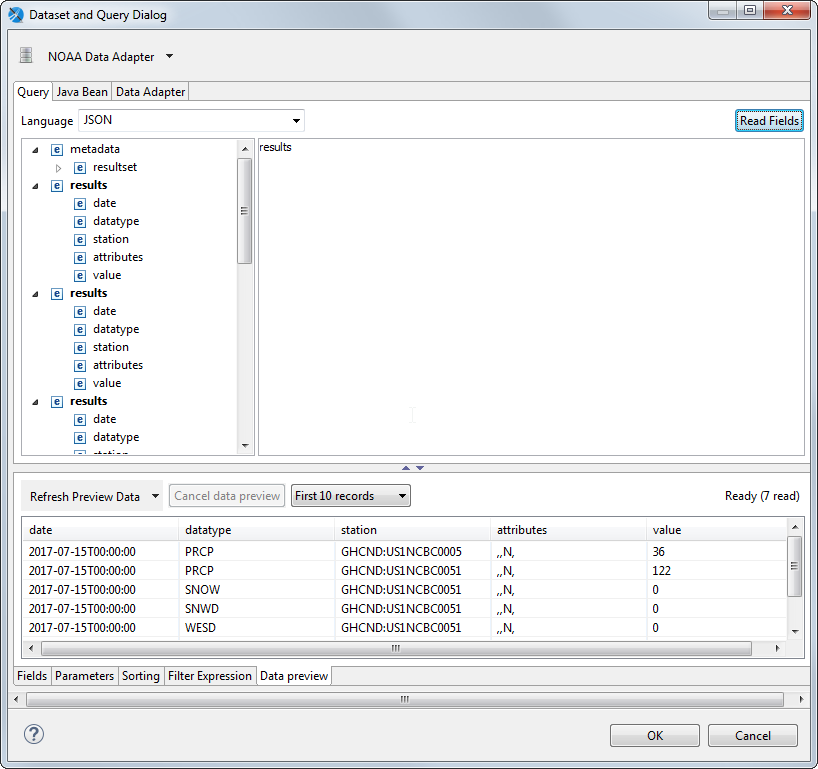
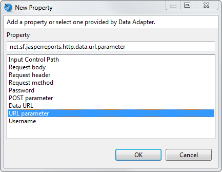

# Connecting to a Web Service Using a JSON Data Adapter

You can configure a data adapter to connect to a REST web service. This mechanism is supported by the JSON and XML data adapters and supports the PUT, POST, and GET verbs.

## Web Services Configuration in the Data Adapter Dialog

In addition to the usual data adapter settings, you can configure the following for a JSON or XML adapter that connects to a web service:

- **Data URL**: Base URI for the request.
- **Username** and **Password**: Credentials for web services that require authentication.
- **Request method**: The method to use for the data adapter. Supported methods are GET, POST, and PUT.
- **URL Parameters** tab: Parameters to append to the URI.
- **POST/PUT Parameters** tab: Parameters to send in the request body.
- **POST/PUT Body** tab: Data to send in the request body.
- **Headers** tab: Parameters to send in the HTTP header.

## The Data Adapter Tab in the Dataset and Query Dialog

When you create a report using a data adapter that connects to a web service, you see the following **Data Adapter** tab in the **Dataset and Query** dialog:

|  |
|----|
|  |
| *Figure 1: Data Adapter tab* |

This tab lets you configure the following information for the data adapter:

- **Data URL**: Base URI for the request.
- **Username** and **Password**: Credentials for web services that require authentication.
- **Request method**: The method to use for the data adapter. Supported methods are GET, POST, and PUT.
- **URL Parameters** tab: Parameters to append to the URI.
- **POST/PUT Parameters** tab: Parameters to send in the request body.
- **POST/PUT Body** tab: Data to send in the request body.
- **Headers** tab: Parameters to send in the HTTP header.

The following additional information is shown:

- : The URL parameter in the data adapter has been associated with an HTTP parameter in the report. The name of the report parameter is shown to the right.
- : The URL parameter in the data adapter has a default value.

## Example of Connecting to a Web Service

The example in this section uses a GET request to retrieve information from the National Oceanic and Atmospheric Administration (NOAA) and display it in a report. The service shows the weather from a location. An example query that you would enter in your browser would be:

`https://www.ncdc.noaa.gov/cde-web/api/v2/data?datasetid=GHCND&locationid=ZIP:28801&startdate=2017-07-01&enddate=2017-07-15&token=[token]`

where `[token]` is the web services token that you request in the first step below.

!!! warning

    This example uses a public API from a third party to generate a report. This API is not controlled by Jaspersoft and is subject to change without notice.

The overall steps are:

- Create a data adapter that constructs the web services request. You can enter the following components of your request: a base URL, a header, and HTTP parameters.
- Create a report that uses the data adapter and discover fields.
- Add HTTP parameters to the report and connect them to the parameters in your adapter.

Request a web services token

Before you can use this example, you must get a web services token from the NOAA at <https://www.ncdc.noaa.gov/cdo-web/token>. Follow the directions on this page to have a token sent to your email. If you do not receive your token, check your spam folder.

Create the data adapter

1.  Click  on the main toolbar OR right-click a project in the Project Explorer and select **New \> Data Adapter**.

2.  In the **DataAdapter File** window, choose the project where you want to save the data adapter file. This should be the project that contains the reports you want to use with your data adapter.

3.  Enter a name for your adapter, for example NOAA adapter, and click **Next**.

    The **Data Adapters Wizard** is displayed.

4.  Select the data adapter type that corresponds to the type of information the web service provides. This example uses JSON.

5.  Click **Next**.

6.  Enter a name for your adapter. This name is used when you select an adapter for a report.

7.  In the **File/URL** field, enter the base web services request for your data. You want this request to be general enough that you can use it for multiple datasets and reports, but you also want it to contain as much reusable information as possible. For example, for NOAA, you might enter this request:

    `https://www.ncdc.noaa.gov/cdo-web/api/v2/data?datasetid=GHCND`

8.  Select **Use the report JSON expression when filling report**.

9.  Click **Options** to open the **HTTP Connection Options** dialog to configure additional request parameters. You can later configure these parameters in your report.

    |  |
    |----|
    |  |
    | *Figure 2: HTTP Connection Options* |

    The following parameters are available:

    - **Username** and **Password** (optional): The username and password to use if your location requires authentication. In this example, leave them blank.
    - **Request Type**: In this example, select GET to retrieve data from the web service.
    - To add a parameter to the request URL, click **Add** in the URL Parameters tab. Enter the name and value of your parameter in the Parameter dialog and click **OK. These** parameters are added to the request URL. Use the parameter names required by your web service. Later, when you create a report using this data adapter, you can connect the web services parameter to a parameter in the report. In this case, the value field is overridden by the parameter configuration in the report. For multiple parameters, add each parameter separately.

    For this example, set the following parameters:

    - - `locationid`: Set **Name** to the NOAA parameter `locationid` and **Value** to a default location in NOAA format, for example ZIP.
      - `startdate`: Set **Name** to `startdate` and **Value** to the current date. (Note: The NOAA parameter `startdate` is optional and defaults to the current date.)
      - `enddate`: Set **Name** to `enddate` and **Value** to the current date. (Note: The NOAA parameter `enddate` is optional and defaults to the current date.)

    - Click the HTTP Headers tab to add headers to the HTTP request. To do this, click **Add**, enter the name and value of your parameter in the Parameter dialog and click **OK**. For this example, add the NOAA token you requested:

      - `token`: Set **Name** to the NOAA parameter `token` and **Value** to the NOAA key you requested previously.

10. Click **OK**.

11. Click **Test Connection** to verify the data can be received.

## Using the Data Adapter in a Report

1.  Create a report using a blank template and the data adapter you just created.

2.  In the **Dataset and Query** dialog, select **JSON** as the **Language**.

    The right-hand side is populated with nested object names for each individual result.

    |  |
    |----|
    |  |
    | *Figure 3: Fields for JSON data* |

3.  Enter the objects that you want to use in your dataset. For this example, enter the `results`. If you only wanted to get the `datatype `values for each record, you could enter `results.datatype`.

4.  Click **Read Fields** to load the list of fields in the dataset.

5.  To preview a subset of the data optionally, select the **Data preview** tab, then click **Refresh Preview Data**.

    |  |
    |----|
    |  |
    | *Figure 4: Data preview for JSON data* |

6.  Click **OK**.

Lay out the report

1.  Select **Design** view.
2.  For this simple report, select all the fields and drag them to the **Detail** band.
3.  You can preview the report to see the data.

# Adding HTTP Parameters to the Report

Normally, you do not want your parameters to be fixed values. You may want to use an expression or to prompt for user input. You can add HTTP input parameters in three ways:

- Using the **Parameters** tab in the **Dataset and Query** dialog.

- Using the **Outline and Properties** views.

- Using the **Data Adapter** tab in the **Dataset and Query** dialog, with additional configuration on the **Parameters** tab.

This section shows how to create parameters that override the parameters from the data adapter and prompt the user for data.

## Configuring a Parameter using the Parameters tab in the Dataset and Query dialog

1.  Right-click the root node of your report and select **Dataset and Query…**.

2.  In the **Dataset and Query** dialog, click the **Parameters** tab.

3.  Click  to hide the system parameters.

4.  Click **Add** to create a parameter.

5.  Select the parameter you just created, click **Edit**, and enter the following, then click **OK**:

    - **Parameter Name**: Location
    - **Is For Prompt**: `true` (default)
    - **Class Type**: `java.lang.String` (default)
    - **Default Value Expression**: `"ZIP:94111"`

6.  Click  to display parameter properties.

7.  Select your parameter and click **Add Property**. A dialog displays a list of properties available for a web services data adapter.

    |  |
    |----|
    |  |
    | *Figure 5: Properties for an HTTP Parameter* |

8.  Select the **URL Parameter** and click **OK**.

9.  Select the property you just created and click **Edit**.

10. Enter **locationid** to map this parameter to the `locationid` URL parameter in your request and click **OK**.

11. If you click the **Data Adapters** tab, you see that the value for `locationid` has been set to **Location**.

12. Click **OK** to exit the **Dataset and Query** dialog.

13. Preview the report.

14. You are now prompted to enter a value for the location, for example, **ZIP:99501**. For more information about location formats, see the NOAA API documentation.

15. Click  to run the report.

## Configuring a Parameter Using the Data Adapter Tab in the Dataset and Query Dialog

The names and default values you set for the URL parameters in your data adapter are shown on the **Data Adapter** tab in the **Dataset and Query** dialog. You can use this tab to associate your HTTP parameter directly to a parameter in the report.

1.  Display your report in **Design** view.

<!-- -->

1.  Right-click the root node of your report and select **Dataset and Query…**.

2.  In the **Dataset and Query** dialog, click the **Parameters** tab.

3.  Click **Add** to create a parameter. A new parameter is created with a name such as Parameter1.

4.  Click the **Data Adapter** tab.

    For this example, you see three data adapter parameters, one of which has been mapped to the location parameter in your report, shown with an icon .

5.  Double-click the value field after enddate and click the  icon that appears.

6.  Select **Parameter1** from the drop-down. This associates Parameter1 in the report with the enddate URL parameter in the data adapter.

7.  On the **Parameters** tab, select Parameter1 and click **Edit**. You see that the evaluation time and properties have been set automatically. Enter the following and click **OK**:

    - **Parameter Name**: End Date
    - **Default Value Expression**: 2017-07-30

8.  Click **OK** to exit the **Dataset and Query** dialog.

9.  If you wish, you can preview the report. You are now prompted to enter a value for the end date as well as the location. Make sure the end date you enter is after the default start date you entered when you created the data adapter.

10. Click  to run the report.

## Configuring a Parameter Using the Outline and Properties Views

1.  Display your report in the **Design** view.

2.  In the outline, right-click **Parameters** and select **Create Parameter**.

    A parameter is created with a generic name, such as Parameter1.

3.  Right-click the parameter you just created and select **Properties**, or simply locate the **Properties** view.

4.  Enter the following on the **Object** tab:

    - **Name**: Start Date
    - **Class**: java.lang.String (default)
    - **Default Value Expression**: 2017-07-15
    - **Is For Prompting**: Selected
    - **Evaluation Time**: Early

5.  Click the **Advanced** tab in the **Properties** view, click **Properties**, then click .

6.  The **Properties** dialog is displayed, showing options specific to a web services data source.

7.  In the **URL parameter** field, enter the name of the URL parameter you wish to use for input, in this case, `startdate`.

8.  Click **Finish**.

9.  If you wish, you can preview the report. You are now prompted to enter a value for the start date as well as location and end date. Make sure the start date that you enter is before the end date.

10. Click  to run the report.
