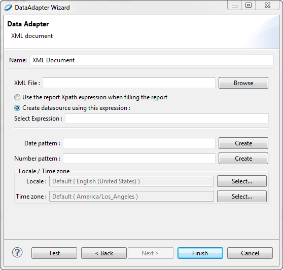

# Working with XML Data Adapters

JasperReports supports data adapters for XML documents.

## Creating a Node Set for an XML Document

An XML document is typically organized as a tree, and does not match the table-like form required by JasperReports. For this reason, you have to use an XPath expression to define a node set. The specifications of the XPath language are available at http://www.w3.org/TR/xpath. Some examples can help you understand how to define the nodes.

The XML file below is an address book in which people are grouped in categories, followed by a second list of favorite objects. In this case, you can define different node set types. First you need to decide how you want to organize the data in your report.

<table>
<caption><p>Example XML file</p></caption>
<colgroup>
<col style="width: 100%" />
</colgroup>
<tbody>
<tr>
<td><div class="sourceCode" id="cb1"><pre class="sourceCode xml"><code class="sourceCode xml"><span id="cb1-1"><a href="#cb1-1" aria-hidden="true" tabindex="-1"></a>&lt;<span class="kw">addressbook</span>&gt;</span>
<span id="cb1-2"><a href="#cb1-2" aria-hidden="true" tabindex="-1"></a>    &lt;<span class="kw">category</span> <span class="ot">name=</span><span class="st">&quot;home&quot;</span>&gt;</span>
<span id="cb1-3"><a href="#cb1-3" aria-hidden="true" tabindex="-1"></a>        &lt;<span class="kw">person</span> <span class="ot">id=</span><span class="st">&quot;1&quot;</span>&gt;</span>
<span id="cb1-4"><a href="#cb1-4" aria-hidden="true" tabindex="-1"></a>            &lt;<span class="kw">lastname</span>&gt;Davolio&lt;/<span class="kw">lastname</span>&gt;</span>
<span id="cb1-5"><a href="#cb1-5" aria-hidden="true" tabindex="-1"></a>            &lt;<span class="kw">firstname</span>&gt;Nancy&lt;/<span class="kw">firstname</span>&gt;</span>
<span id="cb1-6"><a href="#cb1-6" aria-hidden="true" tabindex="-1"></a>        &lt;/<span class="kw">person</span>&gt;</span></code></pre></div></td>
</tr>
<tr>
<td><div class="sourceCode" id="cb2"><pre class="sourceCode xml"><code class="sourceCode xml"><span id="cb2-1"><a href="#cb2-1" aria-hidden="true" tabindex="-1"></a>        &lt;<span class="kw">person</span> <span class="ot">id=</span><span class="st">&quot;2&quot;</span>&gt;</span>
<span id="cb2-2"><a href="#cb2-2" aria-hidden="true" tabindex="-1"></a>            &lt;<span class="kw">lastname</span>&gt;Fuller&lt;/<span class="kw">lastname</span>&gt;</span>
<span id="cb2-3"><a href="#cb2-3" aria-hidden="true" tabindex="-1"></a>            &lt;<span class="kw">firstname</span>&gt;Andrew&lt;/<span class="kw">firstname</span>&gt;</span>
<span id="cb2-4"><a href="#cb2-4" aria-hidden="true" tabindex="-1"></a>        &lt;/<span class="kw">person</span>&gt;</span>
<span id="cb2-5"><a href="#cb2-5" aria-hidden="true" tabindex="-1"></a>        &lt;<span class="kw">person</span> <span class="ot">id=</span><span class="st">&quot;3&quot;</span>&gt;</span>
<span id="cb2-6"><a href="#cb2-6" aria-hidden="true" tabindex="-1"></a>            &lt;<span class="kw">lastname</span>&gt;Leverling&lt;/<span class="kw">lastname</span>&gt;</span>
<span id="cb2-7"><a href="#cb2-7" aria-hidden="true" tabindex="-1"></a>        &lt;/<span class="kw">person</span>&gt;</span>
<span id="cb2-8"><a href="#cb2-8" aria-hidden="true" tabindex="-1"></a>       &lt;/<span class="kw">category</span>&gt;</span></code></pre></div></td>
</tr>
<tr>
<td><div class="sourceCode" id="cb3"><pre class="sourceCode xml"><code class="sourceCode xml"><span id="cb3-1"><a href="#cb3-1" aria-hidden="true" tabindex="-1"></a>    &lt;<span class="kw">category</span> <span class="ot">name=</span><span class="st">&quot;work&quot;</span>&gt;</span>
<span id="cb3-2"><a href="#cb3-2" aria-hidden="true" tabindex="-1"></a>        &lt;<span class="kw">person</span> <span class="ot">id=</span><span class="st">&quot;4&quot;</span>&gt;</span>
<span id="cb3-3"><a href="#cb3-3" aria-hidden="true" tabindex="-1"></a>            &lt;<span class="kw">lastname</span>&gt;Peacock&lt;/<span class="kw">lastname</span>&gt;</span>
<span id="cb3-4"><a href="#cb3-4" aria-hidden="true" tabindex="-1"></a>            &lt;<span class="kw">firstname</span>&gt;Margaret&lt;/<span class="kw">firstname</span>&gt;</span>
<span id="cb3-5"><a href="#cb3-5" aria-hidden="true" tabindex="-1"></a>        &lt;/<span class="kw">person</span>&gt;</span>
<span id="cb3-6"><a href="#cb3-6" aria-hidden="true" tabindex="-1"></a>    &lt;/<span class="kw">category</span>&gt;</span>
<span id="cb3-7"><a href="#cb3-7" aria-hidden="true" tabindex="-1"></a>    &lt;<span class="kw">favorites</span>&gt;    </span>
<span id="cb3-8"><a href="#cb3-8" aria-hidden="true" tabindex="-1"></a>        &lt;<span class="kw">person</span> <span class="ot">id=</span><span class="st">&quot;1&quot;</span>/&gt;</span>
<span id="cb3-9"><a href="#cb3-9" aria-hidden="true" tabindex="-1"></a>        &lt;<span class="kw">person</span> <span class="ot">id=</span><span class="st">&quot;3&quot;</span>/&gt;</span>
<span id="cb3-10"><a href="#cb3-10" aria-hidden="true" tabindex="-1"></a>    &lt;/<span class="kw">favorites</span>&gt;</span>
<span id="cb3-11"><a href="#cb3-11" aria-hidden="true" tabindex="-1"></a>&lt;/<span class="kw">addressbook</span>&gt;</span></code></pre></div></td>
</tr>
</tbody>
</table>

To select only the people contained in the categories (that is, all the people in the address book), use the following expression:

`/addressbook/category/person`

Four nodes are returned as shown in the following table.

<table>
<caption><p>Node set with expression <code>/addressbook/category/person</code></p></caption>
<colgroup>
<col style="width: 100%" />
</colgroup>
<tbody>
<tr>
<td><div class="sourceCode" id="cb1"><pre class="sourceCode xml"><code class="sourceCode xml"><span id="cb1-1"><a href="#cb1-1" aria-hidden="true" tabindex="-1"></a>&lt;<span class="kw">person</span> <span class="ot">id=</span><span class="st">&quot;1&quot;</span>&gt;</span>
<span id="cb1-2"><a href="#cb1-2" aria-hidden="true" tabindex="-1"></a>    &lt;<span class="kw">lastname</span>&gt;Davolio&lt;/<span class="kw">lastname</span>&gt;</span>
<span id="cb1-3"><a href="#cb1-3" aria-hidden="true" tabindex="-1"></a>    &lt;<span class="kw">firstname</span>&gt;Nancy&lt;/<span class="kw">firstname</span>&gt;</span>
<span id="cb1-4"><a href="#cb1-4" aria-hidden="true" tabindex="-1"></a>&lt;/<span class="kw">person</span>&gt;</span>
<span id="cb1-5"><a href="#cb1-5" aria-hidden="true" tabindex="-1"></a>&lt;<span class="kw">person</span> <span class="ot">id=</span><span class="st">&quot;2&quot;</span>&gt;</span>
<span id="cb1-6"><a href="#cb1-6" aria-hidden="true" tabindex="-1"></a>    &lt;<span class="kw">lastname</span>&gt;Fuller&lt;/<span class="kw">lastname</span>&gt;</span>
<span id="cb1-7"><a href="#cb1-7" aria-hidden="true" tabindex="-1"></a>    &lt;<span class="kw">firstname</span>&gt;Andrew&lt;/<span class="kw">firstname</span>&gt;</span>
<span id="cb1-8"><a href="#cb1-8" aria-hidden="true" tabindex="-1"></a>&lt;/<span class="kw">person</span>&gt;</span>
<span id="cb1-9"><a href="#cb1-9" aria-hidden="true" tabindex="-1"></a>&lt;<span class="kw">person</span> <span class="ot">id=</span><span class="st">&quot;3&quot;</span>&gt;</span>
<span id="cb1-10"><a href="#cb1-10" aria-hidden="true" tabindex="-1"></a>    &lt;<span class="kw">lastname</span>&gt;Leverling&lt;/<span class="kw">lastname</span>&gt;</span>
<span id="cb1-11"><a href="#cb1-11" aria-hidden="true" tabindex="-1"></a>&lt;/<span class="kw">person</span>&gt;</span>
<span id="cb1-12"><a href="#cb1-12" aria-hidden="true" tabindex="-1"></a>&lt;<span class="kw">person</span> <span class="ot">id=</span><span class="st">&quot;4&quot;</span>&gt;</span>
<span id="cb1-13"><a href="#cb1-13" aria-hidden="true" tabindex="-1"></a>    &lt;<span class="kw">lastname</span>&gt;Peacock&lt;/<span class="kw">lastname</span>&gt;</span>
<span id="cb1-14"><a href="#cb1-14" aria-hidden="true" tabindex="-1"></a>    &lt;<span class="kw">firstname</span>&gt;Margaret&lt;/<span class="kw">firstname</span>&gt;</span>
<span id="cb1-15"><a href="#cb1-15" aria-hidden="true" tabindex="-1"></a>&lt;/<span class="kw">person</span>&gt;</span></code></pre></div></td>
</tr>
</tbody>
</table>

If you want to select the people appearing in the `favorites` node, use the following expression:

`/addressbook/favorites/person`

Two nodes are returned.

<table>
<colgroup>
<col style="width: 100%" />
</colgroup>
<tbody>
<tr>
<td><div class="sourceCode" id="cb1"><pre class="sourceCode xml"><code class="sourceCode xml"><span id="cb1-1"><a href="#cb1-1" aria-hidden="true" tabindex="-1"></a>&lt;<span class="kw">person</span> <span class="ot">id=</span><span class="st">&quot;1&quot;</span>/&gt;</span>
<span id="cb1-2"><a href="#cb1-2" aria-hidden="true" tabindex="-1"></a>&lt;<span class="kw">person</span> <span class="ot">id=</span><span class="st">&quot;3&quot;</span>/&gt;</span></code></pre></div></td>
</tr>
</tbody>
</table>

Here is another expression. It is a bit more complex, but it shows all the power of the XPath language. The idea is to select the person nodes belonging to the work category. The expression to use is the following:

`/addressbook/category[@name = "work"]/person`

The expression returns only one node, the one with an ID equal to 4, as shown here:

<table>
<colgroup>
<col style="width: 100%" />
</colgroup>
<tbody>
<tr>
<td><div class="sourceCode" id="cb1"><pre class="sourceCode xml"><code class="sourceCode xml"><span id="cb1-1"><a href="#cb1-1" aria-hidden="true" tabindex="-1"></a>&lt;<span class="kw">person</span> <span class="ot">id=</span><span class="st">&quot;4&quot;</span>&gt;</span>
<span id="cb1-2"><a href="#cb1-2" aria-hidden="true" tabindex="-1"></a>    &lt;<span class="kw">lastname</span>&gt;Peacock&lt;/<span class="kw">lastname</span>&gt;</span>
<span id="cb1-3"><a href="#cb1-3" aria-hidden="true" tabindex="-1"></a>    &lt;<span class="kw">firstname</span>&gt;Margaret&lt;/<span class="kw">firstname</span>&gt;</span>
<span id="cb1-4"><a href="#cb1-4" aria-hidden="true" tabindex="-1"></a>&lt;/<span class="kw">person</span>&gt;</span></code></pre></div></td>
</tr>
</tbody>
</table>

## Creating an XML Data Adapter

After you have created an expression to select a node set, you can create an XML data adapter.

1.  Create the connection globally or locally:

- To create the connection globally, right-click **Data Adapters** in the Repository Explorer and choose **Create Data Adapter**.
- To create the connection local to a project, click , enter a name and location for the data adapter in the **DataAdapter File** dialog, and then click **Next**.

The **Data Adapter Wizard** appears (see [Data Adapter Wizard](data-adapters-creating.md)).

1.  From the list, select an **XML document** to open the **Data Adapter** dialog.

|                                                            |
|------------------------------------------------------------|
|  |
| *Figure 1: Configuring an XML Data Adapter*                |

1.  Enter a name for your adapter.
2.  **XML file** is the only required field. Choose an XML file or enter the URL where your XML data is located.
3.  (URL only.) If you entered a URL in the **XML file** field, click the **Options** button to open the **Http Connection Options** dialog.

|  |
|----|
|  |
| *Figure 2: HTTP Connection Options* |

In this dialog you can enter the following options:

- **Username** and **Password** (optional): The username and password to use if your XML location requires authentication.
- **Request Type**: Select GET (default), POST, or PUT.
- To add a parameter to the request URL, click **Add** in the **URL Parameters** tab. Enter the name and value of your parameters in the **Parameter** dialog and click **OK**. For multiple parameters, add each parameter separately.
- For a POST request, to add parameters to the body of the POST, click **Add** in the POST Parameters tab. Enter the name and value of your parameters in the Parameter dialog and click **OK**. For multiple parameters, add each parameter separately.

When you have configured your request, click **OK**.

!!! note

    You can configure an XML data adapter to connect to a REST web service. For an example of connecting to a web service using the JSON adapter, see [Connecting to a Web Service Using a JSON Data Adapter](data-adapters-web-services.md).

1.  Choose whether to provide a set of nodes using a pre-defined static XPath expression, or set the XPath expression directly in the report.

We recommend using a report-defined XPath expression. This enables you to use parameters inside the XPath expression, which acts like a real query on the supplied XML data.

Optionally, you can specify Java patterns to convert dates and numbers from plain strings to more appropriate Java objects (like **Date** and **Double**). For the same purpose, you can define a specific locale and time zone to use when parsing the XML stream.

## Registration of Fields for an XML Data Adapter

In addition to the type and name, the definition of a field in a report using an XML data adapter requires an expression inserted as a field description. As the data adapter aims always to be one node of the selected node set, the expressions are relative to the current node.

To select the value of an attribute of the current node, use the following syntax:

`@<name attribute>`

For example, to define a field that must point to the `id` attribute of a person (attribute id of the node person), it is sufficient to create a field, name it, and set the description to:

`@id`

It is also possible to get to the child nodes of the current node. For example, if you want to refer to the `lastname` node, child of a `person`, use the following syntax:

`lastname`

To move to the parent value of the current node (for example, to determine the category to which a person belongs), use a slightly different syntax:

`ancestor::category/@name`

The ancestor keyword indicates that you are referring to a parent node of the current node. Specifically, the first parent of the category type, of which you want to know the value of the name attribute.

Now, let us see everything in action. Prepare a simple report with the registered fields shown here:

| Field name         | Description              | Type      |
|--------------------|--------------------------|-----------|
| `id `              | @id                      | `Integer` |
| `lastname`         | lastname                 | `String`  |
| `firstname`        | firstname                | `String`  |
| `name of category` | ancestor::category/@name | `String`  |

Jaspersoft Studio provides a visual tool to map XML nodes to report fields; to use it, open the query window and select **XPath** as the query language. If the active connection is a valid XML data adapter, the associated XML document is shown in a tree view. To register the fields, set the record node by right-clicking a Person node and selecting the menu item **Set record node**. The record nodes are displayed in bold.

Then one by one, select the nodes or attributes and select the pop-up menu item **Add node as field** to map them to report fields. Jaspersoft Studio determines the correct XPath expression to use and creates the fields for you. You can modify the generated field name and set a more suitable field type after the registration of the field in the report (which happens when you close the query dialog).

Insert the different fields in the **Detail** band. The XML file used to fill the report is that shown:

The XPath expression for the node set selection specified in the query dialog is:

`/addressbook/category/person`

## XML Data Adapters and Subreports

A node set allows you to identify a series of nodes that represent records from a `JRDataSource` point of view. However, due to the tree-like nature of an XML document, it may be necessary to see other node sets that are subordinate to the main nodes.

Consider the XML in Complex XML example. This is a slightly modified version of Example XML file. For each person node, a hobbies node is added which contains a series of hobby nodes and one or more e-mail addresses.

<table>
<caption><p>Complex XML example</p></caption>
<colgroup>
<col style="width: 100%" />
</colgroup>
<tbody>
<tr>
<td><div class="sourceCode" id="cb1"><pre class="sourceCode xml"><code class="sourceCode xml"><span id="cb1-1"><a href="#cb1-1" aria-hidden="true" tabindex="-1"></a>&lt;<span class="kw">addressbook</span>&gt;</span>
<span id="cb1-2"><a href="#cb1-2" aria-hidden="true" tabindex="-1"></a>    &lt;<span class="kw">category</span> <span class="ot">name=</span><span class="st">&quot;home&quot;</span>&gt;</span>
<span id="cb1-3"><a href="#cb1-3" aria-hidden="true" tabindex="-1"></a>        &lt;<span class="kw">person</span> <span class="ot">id=</span><span class="st">&quot;1&quot;</span>&gt;</span>
<span id="cb1-4"><a href="#cb1-4" aria-hidden="true" tabindex="-1"></a>            &lt;<span class="kw">lastname</span>&gt;Davolio&lt;/<span class="kw">lastname</span>&gt;</span>
<span id="cb1-5"><a href="#cb1-5" aria-hidden="true" tabindex="-1"></a>            &lt;<span class="kw">firstname</span>&gt;Nancy&lt;/<span class="kw">firstname</span>&gt;</span>
<span id="cb1-6"><a href="#cb1-6" aria-hidden="true" tabindex="-1"></a>            &lt;<span class="kw">email</span>&gt;davolio1@sf.net&lt;/<span class="kw">email</span>&gt;</span>
<span id="cb1-7"><a href="#cb1-7" aria-hidden="true" tabindex="-1"></a>            &lt;<span class="kw">email</span>&gt;davolio2@sf.net&lt;/<span class="kw">email</span>&gt;</span>
<span id="cb1-8"><a href="#cb1-8" aria-hidden="true" tabindex="-1"></a>            &lt;<span class="kw">hobbies</span>&gt; </span>
<span id="cb1-9"><a href="#cb1-9" aria-hidden="true" tabindex="-1"></a>                            &lt;<span class="kw">hobby</span>&gt;Music&lt;/<span class="kw">hobby</span>&gt;</span>
<span id="cb1-10"><a href="#cb1-10" aria-hidden="true" tabindex="-1"></a>                            &lt;<span class="kw">hobby</span>&gt;Sport&lt;/<span class="kw">hobby</span>&gt;</span>
<span id="cb1-11"><a href="#cb1-11" aria-hidden="true" tabindex="-1"></a>            &lt;/<span class="kw">hobbies</span>&gt;</span>
<span id="cb1-12"><a href="#cb1-12" aria-hidden="true" tabindex="-1"></a>        &lt;/<span class="kw">person</span>&gt;</span>
<span id="cb1-13"><a href="#cb1-13" aria-hidden="true" tabindex="-1"></a>        &lt;<span class="kw">person</span> <span class="ot">id=</span><span class="st">&quot;2&quot;</span>&gt;</span>
<span id="cb1-14"><a href="#cb1-14" aria-hidden="true" tabindex="-1"></a>            &lt;<span class="kw">lastname</span>&gt;Fuller&lt;/<span class="kw">lastname</span>&gt;</span>
<span id="cb1-15"><a href="#cb1-15" aria-hidden="true" tabindex="-1"></a>            &lt;<span class="kw">firstname</span>&gt;Andrew&lt;/<span class="kw">firstname</span>&gt;</span>
<span id="cb1-16"><a href="#cb1-16" aria-hidden="true" tabindex="-1"></a>            &lt;<span class="kw">email</span>&gt;af@test.net&lt;/<span class="kw">email</span>&gt;</span>
<span id="cb1-17"><a href="#cb1-17" aria-hidden="true" tabindex="-1"></a>            &lt;<span class="kw">email</span>&gt;afullera@fuller.org&lt;/<span class="kw">email</span>&gt;</span>
<span id="cb1-18"><a href="#cb1-18" aria-hidden="true" tabindex="-1"></a>            &lt;<span class="kw">hobbies</span>&gt; </span>
<span id="cb1-19"><a href="#cb1-19" aria-hidden="true" tabindex="-1"></a>                            &lt;<span class="kw">hobby</span>&gt;Cinema&lt;/<span class="kw">hobby</span>&gt;</span>
<span id="cb1-20"><a href="#cb1-20" aria-hidden="true" tabindex="-1"></a>                            &lt;<span class="kw">hobby</span>&gt;Sport&lt;/<span class="kw">hobby</span>&gt;</span>
<span id="cb1-21"><a href="#cb1-21" aria-hidden="true" tabindex="-1"></a>            &lt;/<span class="kw">hobbies</span>&gt;  </span>
<span id="cb1-22"><a href="#cb1-22" aria-hidden="true" tabindex="-1"></a>        &lt;/<span class="kw">person</span>&gt;</span>
<span id="cb1-23"><a href="#cb1-23" aria-hidden="true" tabindex="-1"></a>    &lt;/<span class="kw">category</span>&gt;</span></code></pre></div></td>
</tr>
<tr>
<td><div class="sourceCode" id="cb2"><pre class="sourceCode xml"><code class="sourceCode xml"><span id="cb2-1"><a href="#cb2-1" aria-hidden="true" tabindex="-1"></a>    &lt;<span class="kw">category</span> <span class="ot">name=</span><span class="st">&quot;work&quot;</span>&gt;</span>
<span id="cb2-2"><a href="#cb2-2" aria-hidden="true" tabindex="-1"></a>        &lt;<span class="kw">person</span> <span class="ot">id=</span><span class="st">&quot;3&quot;</span>&gt;</span>
<span id="cb2-3"><a href="#cb2-3" aria-hidden="true" tabindex="-1"></a>            &lt;<span class="kw">lastname</span>&gt;Leverling&lt;/<span class="kw">lastname</span>&gt;</span>
<span id="cb2-4"><a href="#cb2-4" aria-hidden="true" tabindex="-1"></a>            &lt;<span class="kw">email</span>&gt;leverling@xyz.it&lt;/<span class="kw">email</span>&gt;</span>
<span id="cb2-5"><a href="#cb2-5" aria-hidden="true" tabindex="-1"></a>        &lt;/<span class="kw">person</span>&gt;</span>
<span id="cb2-6"><a href="#cb2-6" aria-hidden="true" tabindex="-1"></a>        &lt;<span class="kw">person</span> <span class="ot">id=</span><span class="st">&quot;4&quot;</span>&gt;</span>
<span id="cb2-7"><a href="#cb2-7" aria-hidden="true" tabindex="-1"></a>            &lt;<span class="kw">lastname</span>&gt;Peacock&lt;/<span class="kw">lastname</span>&gt;</span>
<span id="cb2-8"><a href="#cb2-8" aria-hidden="true" tabindex="-1"></a>            &lt;<span class="kw">firstname</span>&gt;Margaret&lt;/<span class="kw">firstname</span>&gt;</span>
<span id="cb2-9"><a href="#cb2-9" aria-hidden="true" tabindex="-1"></a>            &lt;<span class="kw">email</span>&gt;margaret@foo.org&lt;/<span class="kw">email</span>&gt;</span>
<span id="cb2-10"><a href="#cb2-10" aria-hidden="true" tabindex="-1"></a>            &lt;<span class="kw">hobbies</span>&gt; </span>
<span id="cb2-11"><a href="#cb2-11" aria-hidden="true" tabindex="-1"></a>                            &lt;<span class="kw">hobby</span>&gt;Food&lt;/<span class="kw">hobby</span>&gt;</span>
<span id="cb2-12"><a href="#cb2-12" aria-hidden="true" tabindex="-1"></a>                            &lt;<span class="kw">hobby</span>&gt;Books&lt;/<span class="kw">hobby</span>&gt;</span>
<span id="cb2-13"><a href="#cb2-13" aria-hidden="true" tabindex="-1"></a>            &lt;/<span class="kw">hobbies</span>&gt; </span>
<span id="cb2-14"><a href="#cb2-14" aria-hidden="true" tabindex="-1"></a>        &lt;/<span class="kw">person</span>&gt;</span>
<span id="cb2-15"><a href="#cb2-15" aria-hidden="true" tabindex="-1"></a>    &lt;/<span class="kw">category</span>&gt;</span>
<span id="cb2-16"><a href="#cb2-16" aria-hidden="true" tabindex="-1"></a>    &lt;<span class="kw">favorites</span>&gt;</span>
<span id="cb2-17"><a href="#cb2-17" aria-hidden="true" tabindex="-1"></a>        &lt;<span class="kw">person</span> <span class="ot">id=</span><span class="st">&quot;1&quot;</span>/&gt;</span>
<span id="cb2-18"><a href="#cb2-18" aria-hidden="true" tabindex="-1"></a>        &lt;<span class="kw">person</span> <span class="ot">id=</span><span class="st">&quot;3&quot;</span>/&gt;</span>
<span id="cb2-19"><a href="#cb2-19" aria-hidden="true" tabindex="-1"></a>    &lt;/<span class="kw">favorites</span>&gt;</span>
<span id="cb2-20"><a href="#cb2-20" aria-hidden="true" tabindex="-1"></a>&lt;/<span class="kw">addressbook</span>&gt;</span></code></pre></div></td>
</tr>
</tbody>
</table>

What we want to produce is a document that is more elaborate than those you have seen so far. For each person, we want to present their e-mail addresses, hobbies, and favorite people.

You can create this document using subreports. You need a subreport for the e-mail address list, one for hobbies, and one for favorite people (that is a set of nodes out of the scope of the XPath query we used). To generate these subreports, you need to understand how to produce new data sources to feed them. In this case, you use the `JRXmlDataSource`, which exposes two extremely useful methods:

`public JRXmlDataSource dataSource(String selectExpression)`

`public JRXmlDataSource subDataSource(String selectExpression)`

The first method processes the expression by applying it to the whole document, starting from the actual root. The second assumes that the current node is the root.

Both methods can be used in the data source expression of a subreport element to produce the data source to pass to the element dynamically. The most important thing to note is that this mechanism allows you to make both the data source production and the expression of node selection dynamic.

The expression to create the data source that feeds the subreport of the e-mail addresses is:

```
  ((net.sf.jasperreports.engine.data.JRXmlDataSource)
        $P{REPORT_DATA_SOURCE}).subDataSource("/person/email")
```

This code returns all the e-mail nodes that descend directly from the present node (person).

The expression for the hobbies subreport is similar, except for the node selection:

`((net.sf.jasperreports.engine.data.JRXmlDataSource)`

`$P{REPORT_DATA_SOURCE}).subDataSource("/person/hobbies/hobby")`

Next, declare the master report’s fields. In the subreport, you have to refer to the current node value, so the field expression is simply a dot (.),

Proceed with building your three reports: `xml_addressbook.jasper`, `xml_addresses.jasper`, and `xml_hobbies.jasper`.

In the master report, `xml_addressbook.jrxml`, insert a group named “Name of category,” in which you associate the expression for the category field (`$F{name of category}`). In the header band for Name of category, insert a field to display the category name. By doing this, the names of the people are grouped by category (as in the XML file).

In the Detail band, position the `id`, `lastname`, and `firstname` fields. Below these fields, add the two Subreport elements, the first for the e-mail addresses, the second for the hobbies.

The e-mail and hobby subreports are identical except for the name of the field in each one. The two reports should be as large as the Subreport elements in the master report, so remove the margins and set the report width accordingly.

Preview both the subreports just to compile them and generate the relative `.jasper` files. Jaspersoft Studio returns an error during the fill process, but that is expected. We have not set an XPath query, so JasperReports cannot get any data. You can resolve the problem by setting a simple XPath query (it is not used in the final report), or you can preview the subreport using the empty data adapter (select it from the drop-down in the tool bar).

When the subreports are done, run the master report. If everything is okay, the report groups people by home and work categories and the subreports associated with each person.

As this example demonstrates, the real power of the XML data adapter is the versatility of XPath, which allows navigation of the node selection in a refined manner.
