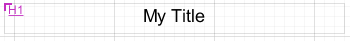
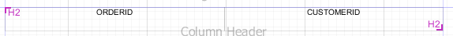
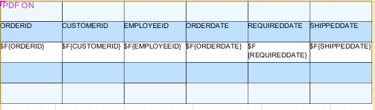
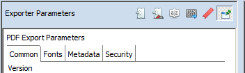
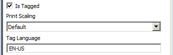
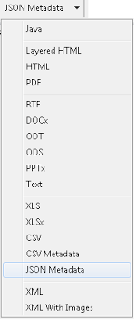

# Data Centric Exporters

Jaspersoft Studio supports two data-oriented exports formats designed to be used programmatically when another application embeds Jaspersoft products:

- CSV: exports the report's data to a list of comma-separated values (CSV).

- JSON: exports the report's data to a JavaScript Object Notation (JSON) object.

In both cases, the metadata defines the structure of the exported data.

Jaspersoft Studio also supports other types of field-level metadata:

- PDF 508 Tags are used to create report output in Adobe Acrobat format that provides functionality in accordance with the Americans with Disabilities 508 specification.

- XLS Tags are used to define how data is exported to the Microsoft Excel format. In addition to numerous layout settings, you can define XLSX metadata that define the structure of the data when exported.

This section describes how to work with metadata for PDF 508 Tags and for the JSON exporter.

## Configuring a Report's Metadata for PDF 508 Tags

To add 508 functionality to a report, you must add tags to the report elements. Jaspersoft Studio has menu items that let you explicitly insert tags for headings, tables, and table-like elements. For more information about tags for 508 functionality in JasperReports Library, see the JasperReports Library Ultimate Guide.

### Tagging Headings

You can tag text fields or static text elements as headings. You can include a range of static text elements and/or text fields in the same heading.

To tag a single element as a heading

1.  Right-click the text field or static text and select **PDF 508 Tags \> Heading \> Heading n \> Full** from the context menu.

The setting is displayed in the upper left-hand corner of the element in design view. It is underlined to show the element is the full heading.

|                                                                   |
|-------------------------------------------------------------------|
|  |
| *Figure 1: A static text element tagged as Full*                  |

To tag multiple elements as a heading

1.  Right-click the first text field or static text element in your heading section and select **PDF 508 Tags \> Heading \> Heading n \> Start** from the context menu.
2.  Right-click the last text field or static text element in your heading section and select **PDF 508 Tags \> Heading \> Heading n \> End** from the context menu.

In **Design** view, the start of a multi-element heading is shown in the upper left-hand corner of the Start element, and the end is shown in the lower right-hand corner of the End element.

|  |
|----|
|  |
| *Figure 2: Text fields tagged as start and end* |

To remove a heading tag from an element

1.  Right-click the text field or static text element in your heading section and select **PDF 508 Tags \> Heading \> Heading n \> None** from the context menu.

### Using Automatic Table Tagging

To have Jaspersoft Studio automatically generate tags for the tables in your report, enable the `net.sf.jasperreports.components.table.generate.pdf.tags` property. This property can be set at the global, report, or table level.

To set this property globally

1.  Select **Window \> Preferences** to open the Preferences dialog (**Eclipse \> Preferences** on Mac).
2.  Navigate to **Jaspersoft Studio \> Properties**.
3.  Click **Add** to open the Properties dialog.
4.  Enter the following values:

- **Property Name** – `net.sf.jasperreports.components.table.generate.pdf.tags`
- **Value** – Enter `true` to enable table tagging or `false` to disable table tagging.

!!! note

    Setting the property globally inserts tags when you export a report to PDF directly from Jaspersoft Studio. If you are publishing your reports to another environment, such as JasperReports Server, you must enable this property in the jasperreports.properties file in your environment. See the JasperReports Server Administrator Guide for more information about enabling this property for JasperReports Server.

To set this property for a report or table

1.  For a table, right-click in the table. For a report, right-click on the root node in the **Outline** view.
2.  Select **PDF 508 Tags \> Autotag Table** from the context menu.
3.  Select one of the following options:

- **Default** – Inherits the property settings from a higher level. If the property has been set explicitly at a higher level, the current setting is shown on the menu, for example **Default (Enabled)**.
- **Enabled** – Enables the property for this table or report. This setting overrides any value set at a higher level.
- **Disabled** – Disables the property for this table or report. This setting overrides any value set at a higher level.

When the `net.sf.jasperreports.components.table.generate.pdf.tags` is set at the table level, the setting is displayed in the upper left-hand corner of the table in design view.

|                                                         |
|---------------------------------------------------------|
|  |
| *Figure 3: Table with tagging enabled*                  |

### Manually Tagging Tables and Lists

Automatic table tagging only works with table elements. If you have a table-like element in your report, such as a list or a tabular arrangement of fields, it cannot be tagged automatically. However, you can manually insert list or table tags using the context menu. Like tables, manual tagging only works with text fields and static text. You manually tag lists and tables using a CSS-type structure. The general steps necessary to tag tables are shown.

To manually tag a tabular arrangement of elements as a table

1.  Tag the first element in your table: **PDF 508 Tags \> Table \> Start**.
2.  Tag the start and end of each row:

<!-- -->

1.  Tag the first element in your row: **PDF 508 Tags \> Table Row \> Start**.
2.  Tag the last element in your row: **PDF 508 Tags \> Table Row \> End**.
3.  To make a row a header row, add header tags to the start and end:

<!-- -->

1.  Tag the first element in each header row: **PDF 508 Tags \> Table Header \> Start**.
2.  Tag the last element in each header row: **PDF 508 Tags \> Table Header \> End**.
3.  Tag each detail element in each row: **PDF 508 Tags \> Table Details \> Full**.
4.  Tag the final element in your table: **PDF 508 Tags \> Table \> End**.

To manually tag elements as a list

1.  Tag the first element in your list: **PDF 508 Tags \> List \> Start**.
2.  Tag each list item: **PDF 508 Tags \> List Item \> Full**.
3.  Tag the final element in your list: **PDF 508 Tags \> List \> End**.

### Setting Export Parameters

Once you have inserted your 508C tags correctly, you must set the PDF export parameters in your report.

1.  Click the report preview.
2.  The first time the report runs, it does not have tags. To speed up the initial run, select One Empty Record.
3.  Select PDF from the format menu and wait for the report to run.
4.  If necessary, click  to open the panel on the left of the preview window.
5.  Click  to view the exporter parameters.

|  |
|----|
|  |
| *Figure 4: PDF Export Parameters tab in report preview* |

1.  Select **Is Tagged**.
2.  Enter a language code in the **Tag Language** field.

|  |
|----|
|  |
| *Figure 5: 508C tags in the PDF Export Parameters tab* |

1.  Select the correct data adapter and run your report.

## Configuring a Report's Metadata for Use With the JSON Data Exporter

JasperReports Server's REST API includes a JSON (JavaScript Object Notation) data exporter that enables you to feed pure data into applications you integrate with the server. During report generation, this exporter skips all layout-related steps and returns a dataset. The structure of this data is determined by metadata that you define in your report. You can also define expressions to determine how data from a specific filed is exported.

Note: The ability to define metadata and export data in JSON format is sometimes referred to as the JasperReports Data API.

You can define a structure by separating the names of the levels you want to create with periods (.). For example, consider a report with three fields configured with these JSON properties:

|                    |                     |
|--------------------|---------------------|
| Field Expression   | JSON Path           |
| ` $F{salesamount}` | `store.sale.amount` |
| ` $F{salesyear}`   | `store.sale.year`   |
| `$F{cust.name}`    | `store.cust.name`   |

When exported to JSON, the data is structured with three distinct paths:

```
store
  sale
    amount
    year
cust
  name
```

Example exported data would be similar to:

```
[
  {store:
    [
      {
        sale:[{amount:"19000", year:2014}],
        cust:[{name:"Acme"}],
      }
    ]
  }
]
```

Note that when you preview your report as JSON, the data is not formatted to be human readable, as above. You may want to use one of the many JSON formatting tools to review the output of your JSON tagged report, you can copy the JSON output from the **Preview** tab.

It is important to define paths that create a structure that the application receiving the data can interpret.

To define JSON export object metadata in your report

1.  Open a report that includes the fields you want to export to your application.
2.  Right-click a field in the **Design** tab, and select **JSON tags \> JSON Metadata Path**.

If the field you selected appears in a frame, you are warned that you JasperReports Library may ignore the property. This warning relates only to older versions of the library. It remains in the product for backwards-compatibility. For current versions of JasperReports Server, JasperReports Server, and Jaspersoft Studio, properties defined in frames are not ignored.

1.  If you receive this warning, click **OK**. The **JSON Exporter Property Configuration** window is displayed.
2.  In the **Path** field, enter a string that specifies the way the data from this field should be exported. For example, if you are working with a field that returns a sales amount value, you might enter `store.sale.amount`.
3.  If the data being returned necessitates it, check the **Repeat value if missing** check the box.

This option is helpful if your source data does not include values for every row of data returned. Selecting this option instructs Jaspersoft Studio to use the last value passed when a value is missing, which may prevent problems in the application receiving the JSON object.

1.  If you want to manipulate the data being exported, check the **Use custom expression for exported value** checkbox, click , and define an expression.
2.  Click **OK**.
3.  Select each field that you want to export to JSON and define its metadata.
4.  Click **File \> Save**.
5.  Click **Preview**.
6.  If the JSON Metadata preview is not selected, click the arrow next to the current preview format, and select **JSON Metadata**.

|  |
|----|
|  |
| *Figure 6: Selecting the JSON Metadata Preview* |

1.  Review the structure of the data to ensure your application can interpret it.
2.  If the data is not structured correctly, click **Design** and edit each field's JSON export properties.
3.  When you are satisfied with the data returned by Jaspersoft Studio, you can publish your report to JasperReports Server and begin testing your own application's ability to use the data passed by the server.
