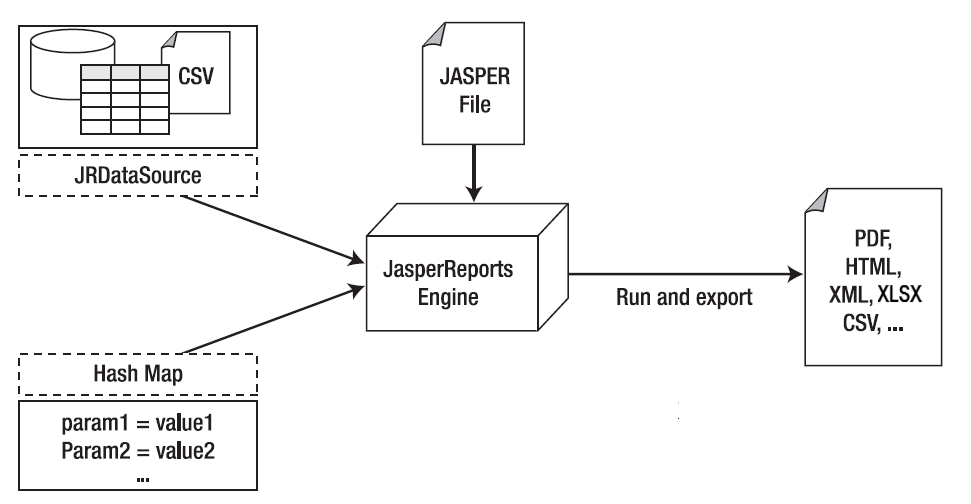

# Data Sources and Print Formats

Without a means of supplying content from a dynamic data source, even the most sophisticated and appealing report would be useless. JasperReports gives you two ways to specify fill data for the output report: parameters and data sources. Both kinds of data are presented by means of a generic interface named `JRDataSource`.

|                                                                 |
|-----------------------------------------------------------------|
|      |
| *Figure 1: Data Source and Parameter Flows for Report Creation* |

`JRDataSource` allows a set of records organized in tables (rows and columns) to be read. It enables JasperReports to fill a report with data from an explicit data source, using a JDBC connection (already instanced and opened) to whichever relational database you want to run an SQL query on (which is specified in the report).

If the data do not meet your requirements, you may need to specify values to condition the report’s execution; you can create name/value pairs to pass to the print engine. These pairs are named parameters, and they have to be preventatively declared in the report. Through `fillManager`, you can join a `jasper` file and a data source in a JasperPrint object. This object is a meta-print that can create a real print after you export it in the format of your choice through appropriate classes that implement the `JRExporter` interface.

JasperReports give you pre-defined exporters, such as those for creating files formatted as PDF, XLSX, CVS, XML, RTF, ODF, text, HTML, and SWF. Through the `JRViewer` class, you can view the print directly on the screen and print a hard copy.
