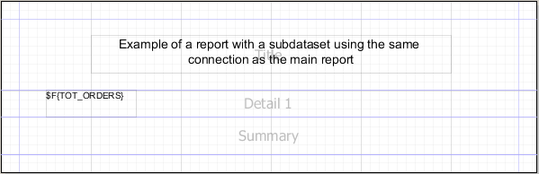
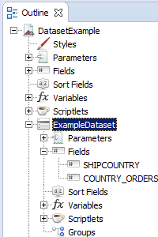
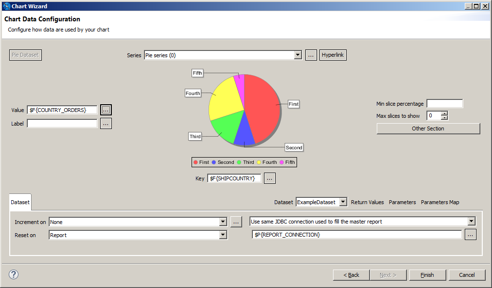
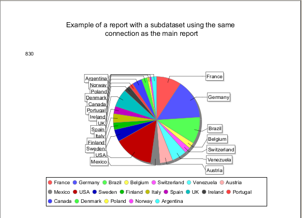

# Creating an Example Subdataset

The following step-by-step example shows how to use a subdataset to fill a chart using the same connection as the main report, but with a different query.

Create a report

1.  Create a basic report using a blank template, for example, Blank A4, and click **Next**.
2.  Give your report a name, for example, **DataSetReport**, and click **Next**.
3.  Choose **Sample DB - Database JDBC Connection** and click **Next**.

!!! note

    You can create a data adapter separately or click **New...** to create a data adapter directly from this dialog. Adapters can be created globally (embedded in the workspace) or local to a specific project. Using a local adapter makes it easier to deploy the report to JasperReports Server. See [Working with Data Adapters](../data-adapters/data-adapters-creating.md) for more information.

1.  Enter the SQL query `select count(*) as tot_orders from orders` and click **Next**.
2.  Add `TOT_ORDERS` as a field and click **Finish**. The report is displayed.
3.  Drag the `TOT_ORDERS` field to the **Detail** band. If you want, you can remove all bands except the **Title, Detail** and **Summary** bands, and add a static text field to the title band to identify the report.
4.  Preview the report.

The resulting main report has a single record containing the total number of orders.

|  |
|----|
|  |
| *Figure 1: Initial report layout* |

Create a subdataset

1.  Right-click your report's root node in the outline view.
2.  Select **Create Dataset** from the context menu.

The **Dataset** wizard is displayed.

|                                                          |
|----------------------------------------------------------|
|  |
| *Figure 2: Creating a new subdataset*                    |

1.  Enter a name for your dataset. For this tutorial, name it ExampleDataset.
2.  For this tutorial, select **Create new dataset from a connection or Data Source**. This includes a data adapter as part of your dataset definition.

!!! note

    If you select **Create an empty dataset**, your dataset does not include any data adapter or field information. You need to configure this information separately for each dataset run.

1.  Click **Next**.
2.  Select the data source that you want for your dataset and click **Next**. For this example, select Sample DB.

|  |
|----|
|  |
| *Figure 3: Data Source page of the Dataset wizard* |

1.  Create a subdataset query and set it to:

`select SHIPCOUNTRY, COUNT(*) country_orders from ORDERS group by SHIPCOUNTRY`

Then click **Next**.

1.  On the next screen, select all the fields and add them to the dataset, then click **Finish**.

The fields are registered in the subdataset and appear in the **Outline** view.

|  |
|----|
|  |
| *Figure 4: The subdataset to fill the chart* |

Create a chart and its dataset run

1.  Now drag the Chart element to the summary band.
2.  Select the Pie Chart when prompted and click **Next**.

|  |
|----|
|  |
| *Figure 5: Chart Wizard* |

1.  In the dataset run section of the Chart Wizard, select the dataset you created, ExampleDataset.
2.  Select **Use same JDBC connection used to fill the master report** from the drop-down menu. This causes the expression to be set automatically to the connection used by the main report (**\$P{REPORT_CONNECTION}**).
3.  To force the expression context to update the fields, parameters, and values after the dataset run configuration, close the dialog, then reopen it by double-clicking the chart. If you do not force an update, you do not see the correct fields in the expression editor.
4.  Set the chart dataset expressions (the expressions used to fill the chart):

- Click **…** next to **Series** to open the Series dialog. Then select SERIES1 and click **…** to open the expression editor and enter the following expression:

`$F{SHIPCOUNTRY}`

Click **Finish**, then click **OK** to return to the Chart Wizard. Note that the **Key** field below the chart updates to show the same value as the series.

- Click **…** next to **Value** to open the expression editor. Enter the following expression:

`$$F{COUNTRY_ORDERS}}`

Click **Finish** to return to the Chart Wizard.

!!! note

    You cannot use objects from the master report dataset in an element that uses a subdataset. Only subdataset objects can be used. To use an object from the master report dataset, you must pass it as a variable or a parameter.

1.  Click **Finish** to apply the expressions and return to the report.
2.  When you are done, run the report.

|  |
|----|
|  |
| *Figure 6: Chart filled using a subdataset* |
