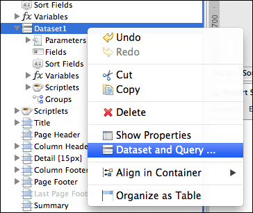
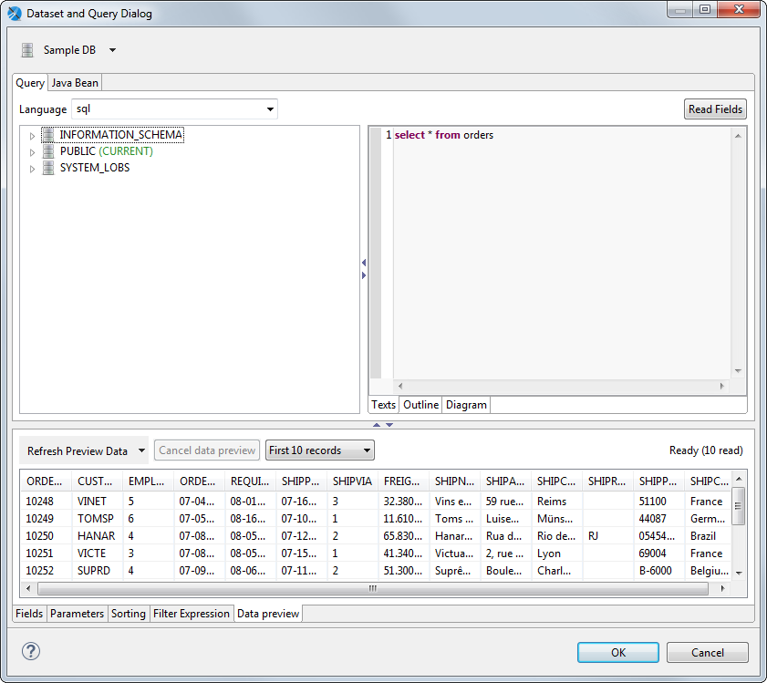

# Using the Dataset and Query Dialog

Click the **Dataset and Query** icon .

When working with a subdataset, open the dialog by right-clicking the dataset name inside the **Outline** view, and selecting **Dataset and Query...**.

|  |
|----|
|  |
| *Figure 1: Right-click menu* |

Use the **Dataset and Query** dialog to configure your dataset as follows:

- Select a data adapter from the menu next to the  icon. Usually a data adapter is selected, but you can change it.

- Select a query language for the current dataset from the **Language** menu. (This can be the main dataset or a subdataset that populates a chart or a table.)

- Enter a query. A query editor is available for several languages including SQL, XPath, JSON, and the Ad Hoc Query API query language.

- Click **Read Fields** to enable Jaspersoft Studio discover fields for you. These can be provided directly by the data adapter or by running the query and reading the response metadata.

For certain types of data adapters, below the data adapter menu let you view additional information about the data adapter.

- For Java Bean data sources, view the configuration on the **Java Bean** tab.

- For data adapters that get their information via a web service, use the **Data Adapter** tab.

The tabs at the top provide the user interface for working with your data adapter:

- **Query** tab: Displays a language and query editor that helps you construct the query for your dataset.
- **Java Bean** tab: Displays a tool that helps you introspect a Java class and build dataset fields from the fields in the class. This is useful for Java data sources.
- **Data Adapter** tab: Displays any additional user interface specific to the chosen data adapter type.

Use the tabs at the bottom to perform the following additional tasks:

- Add, edit, or remove fields on the **Fields** tab.

- Add, edit, or remove parameters on the **Parameters** tab. For more information, see [Managing parameters using the Parameters tab in the Dataset and Query dialog](../parameters/parameters_managing.md).

- Edit sort options for dataset records on the **Sorting** tab.

- Provide an expression to filter dataset records on the **Filter Expression** tab.

- Preview your data on the **Preview** tab, if supported by the selected data adapter.

|  |
|----|
|  |
| *Figure 2: Data Preview tab* |

## Configuring the Data Adapter and Query Language dropdowns

By default, the **Dataset and Query** dialog shows all available data adapters and all available query languages. However, you can change this using the  icon next to the data adapter menu as follows:

- To show all available data adapters and query languages, click  and choose **Show All Data Adapters** (default).

- To choose a data adapter and restrict the query languages to ones compatible with the chosen data adapter, click  and choose **Show Languages For Data Adapter**.

- To choose a query language and restrict the view to compatible data adapters, click  and choose **Show Data Adapters For Language**.

- To configure this setting globally, click  and choose **Global Preferences**, then make your selection in the **Preferences** dialog.

## The Data Adapter Tab

The **Data Adapter** tab is visible when the selected data adapter supports additional UI, for example, in the case of a data adapter that connects to a web service.

|  |
|----|
|  |
| *Figure 3: Data Adapter tab* |

This tab lets you configure the following information for the data adapter:

- **Data URL**: Base URI for the request.
- **Username** and **Password**: Credentials for web services that require authentication.
- **Request method**: The method to use for the data adapter. Supported methods are GET, POST, and PUT.
- **URL Parameters** tab: Parameters to append to the URI.
- **POST/PUT Parameters** tab: Parameters to send in the request body.
- **POST/PUT Body** tab: Data to send in the request body.
- **Headers** tab: Parameters to send in the HTTP header.
- The following additional information is shown:
  - : The URL parameter in the data adapter has been associated with an HTTP parameter in the report. The name of the report parameter is shown to the right.
  - : The URL parameter in the data adapter has a default value.

## Discovering Fields

Defining all the fields of a report by hand can be tedious. JasperReports requires all report fields to be named and configured with a proper class type. The **Dataset and Query** dialog simplifies the process by automatically discovering the available fields provided by a data adapter, without using a query. To run a query, you need to use the proper data adapter. For example, to run an SQL query you must use a JDBC data adapter. The **Read Fields** button starts the discovery process: the fields found are listed in the **Fields** tab and added to the report. Click **OK** to close this window.

Some query languages, like XPath, do not produce a result that resembles a table, but more complex structures that require extra steps to correctly map result data to report fields. An example of this is the multidimensional result coming from MDX results (MDX is the query language used with OLAP and XML/A connections). In this case, each field is mapped using one or more properties depending on the requirements of the data. For some languages, such as instance XPath and JSON query, the **Query** dialog displays a tool that simplifies the creation of both the query and the mapping.
